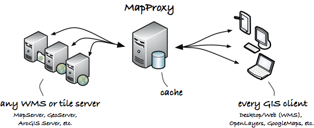
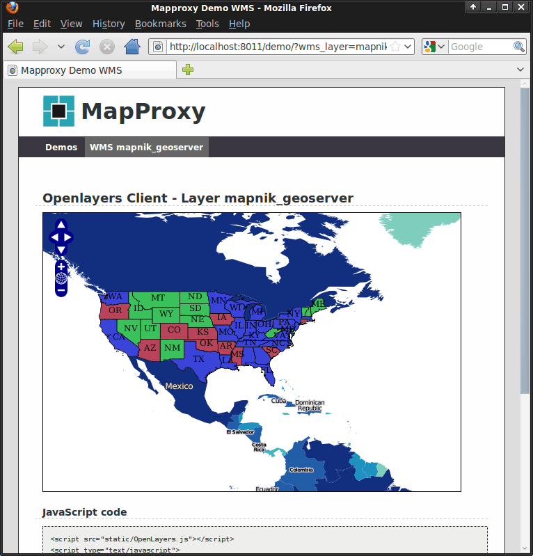

:Author: Oliver Tonnhofer
:Reviewer: Cameron Shorter, LISAsoft
:Version: osgeo-live5.5
:License: Creative Commons Attribution 3.0 Unported (CC BY 3.0)

MapProxy
================================================================================

Proxy WMS & tile services
~~~~~~~~~~~~~~~~~~~~~~~~~~~~~~~~~~~~~~~~~~~~~~~~~~~~~~~~~~~~~~~~~~~~~~~~~~~~~~~~

MapProxy speeds up mapping applications by pre-rendering and integrating maps from multiple sources and storing in a local cache.
Layers can be made transparent, projections can be changed, multiple map layers can be transformed into one, watermarks can be added, and more...

MapProxy is flexible and scales from simple to complex use-cases: from a single tile cache for an OpenLayers web client to a central SDI node that combines, unifies and accelerates dozens of distributed WMS services.

MapProxy is used for the German broadband atlas to deliver maps for thousands of users and the German Federal Agency for Cartography an Geodesy uses MapProxy to aggregate WMS services from all 16 states on the fly.

Core Features
--------------------------------------------------------------------------------

Input sources:
  * WMS 1.0.0–1.3.0 (MapServer, GeoServer, etc.)
  * TMS, WMTS (TileCache, GeoWebcache, etc.)
  * Mapserver and Mapnik (directly, without WMS)
  * any TileCache, Google Maps or Bing compatible source

Services:
  * WMS (1.0.0-1.3.0)
  * TMS
  * WMTS
  * KML SuperOverlays

Tile cache:
  * stores identical images just once (e.g. ocean tiles)
  * stores tiles in filesystem, MBTile files or CouchDB
  * add watermark to tiles

Source options:
  * limit sources to geometries (from Shapefile for example)
  * add transparency to opaque layers
  * merge multiple sources
  * reproject to other SRS

WMS Features:
  * build layer trees from different sources
  * create ``GetMap`` responses from cache with support for free-zooming and any projection (for any Desktop GIS)
  * accelerates existing WMS 10 to 100 times
  * respond to ``GetLegendGraphic`` requests
  * cascade ``GetFeatureInfo`` requests with optional XSL transformations
  * on-the-fly reprojection
  * convert WMS versions and image formats

Security:
  * flexible and powerful authorization API
  * fine-grained control over services and layers
  * restrict access to polygon areas
  * integrate with existing user databases and authentication methods

Other features:
  * simple but powerful configuration format (YAML/JSON)
  * OpenLayers based demo client
  * run multiple WMS services in one MapProxy instance
  * add attribution lines to the images
  * support for non-image raster data like DEMs
  * many more

Implemented Standards
--------------------------------------------------------------------------------

MapProxy implements the following open specifications:

* OGC WMS 1.0.0, 1.1.0, 1.1.1, 1.3.0
* OGC WMTS 1.0.0 (KVP and RESTful)
* OSGeo TMS 1.0.0
* OGC KML 2.2 SuperOverlays

Details
--------------------------------------------------------------------------------

**Website:** http://mapproxy.org/

**Licence:** `Apache Software License 2.0 <http://www.apache.org/licenses/LICENSE-2.0.html>`_

**Software Version:** 1.4.0

**Supported Platforms:** Linux, Mac, Windows

**Support:** http://mapproxy.org/support.html

**Documentation:** <../../mapproxy/index.html>`_

Quickstart
--------------------------------------------------------------------------------

* :doc:`Quickstart documentation <../quickstart/mapproxy_quickstart>`
