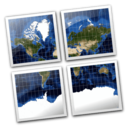

:Author: Klokan Petr Pridal
:Reviewer: Cameron Shorter, LISAsoft
:Version: osgeo-live5.5
:License: Creative Commons Attribution 3.0 Unported (CC BY 3.0)

MapTiler
================================================================================

Map Publishing
--------------------------------------------------------------------------------

MapTiler is a desktop application for the creation of map tiles for rapid raster map publishing. Geodata is transformed to tiles compatible with Google Maps and Earth - ready for publishing via direct upload to any webserver or a cloud storage (such as Amazon S3).

No extensive configuration on the server side is necessary, any simple file hosting is fine. Dynamic interaction such as panning and zooming, overlay of markers and vector data is provided by powerful browser functionality.

The application directly generates a ready to use simple viewer based on OpenLayers and Google Maps API and can be easily customized.

MapTiler is a multi-platform desktop application. Installers are available for Windows, Mac OS X and packages for linux (Debian/Ubuntu).

Core Features
--------------------------------------------------------------------------------

* Well known Javascript APIs supported: OpenLayers, Google Maps API
* No extra server software installation necessary
* Hosting almost everywhere: cloud storage such as Amazon S3 or any cheap "unlimited" webhosting with FTP access
* Easy mashup with commercial layers (Google, Bing, Yahoo) or OpenStreetMap
* Tiles follow OSGEO TMS (Tile Map Service Specification)
* Ability to process raster data in various formats: TIFF/GeoTIFF, MrSID, ECW, JPEG2000, Erdas HFA, NOAA BSB, JPEG and more...
* Available commercial support and parallelized rendering on multi-core CPUs or on Amazon EC2 cluster

Details
--------------------------------------------------------------------------------

**Website:** http://www.maptiler.org/

**Licence:** New BSD License

**Software Version:** 1.0beta2

**Supported Platforms:** Windows, Linux, Mac

**Community:** http://groups.google.com/group/maptiler 

**Commercial support and applications:** http://www.maptiler.com/

Quickstart
--------------------------------------------------------------------------------
    
* :doc:`Quickstart documentation <../quickstart/maptiler_quickstart>`
