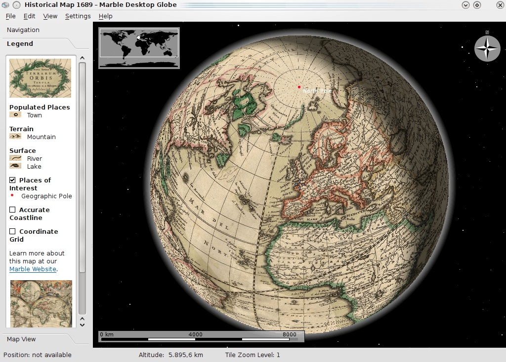

:Author: Hamish Bowman
:Reviewer: Cameron Shorter, LISAsoft
:Version: osgeo-live7.0draft
:License: Creative Commons Attribution 3.0 Unported (CC BY 3.0)

.. image:: ../../images/project_logos/logo-marble.png
  :scale: 75 %
  :alt: project logo
  :align: right
  :target: http://marble.kde.org/

.. image:: ../../images/logos/OSGeo_incubation.png
  :scale: 100 %
  :alt: OSGeo Project in Incubation
  :align: right
  :target: http://www.osgeo.org/incubator/process/principles.html

Marble
================================================================================

Virtual globe and world atlas
~~~~~~~~~~~~~~~~~~~~~~~~~~~~~~~~~~~~~~~~~~~~~~~~~~~~~~~~~~~~~~~~~~~~~~~~~~~~~~~~

Marble is an open source KDE Education Project program similar
to `NASA World Wind <http://worldwind.arc.nasa.gov/java/>`_ or
Google Earth. Besides choosing any number of maps to view on your
globe (including `OpenStreetMaps <http://www.osm.org>`_), you are
encouraged to include a KDE Marble widget in your application.

Explore the neighborhood with Marble's rich set of city and street 
level maps. Search for addresses and places of interest. Marble takes 
care of querying various search backends and presents their results in 
a unified view. Calculate pedestrian, bike and motorcar routes with 
ease - online and offline, with an arbitrary number of via points.

Start exploring the world. View clouds and sun shadow, follow satellites 
and space stations and display their orbits, all updated in real-time. 
Travel back in time and learn about historic views of our planet using 
maps from past centuries. Earth is not enough? Marble also offers maps 
of the moon and other planets.

Core Features
--------------------------------------------------------------------------------

* Virtual globe and world atlas
* Navigate globe in 3D
* Map Presentation (Globe View, Atlas View, Street Maps, Satellite Maps, Topographic Maps, Educational Maps, Other Planets)
* Information Layers (Weather, Real-time clouds, Day/Night View, Real-time satellites, Wikipedia Articles, Photos, Postal Codes, Earthquakes)
* Search (Online address search, Online POI search)
* Positioning & Tracking (GPS localization, Track export in KML)
* Routing & Navigation (Voice navigation, Online motorcar routing, Online bike routing, Online pedestrian routing, Offline routing optional download, Turn-by-turn navigation)
* Tools (Distance measurement, Bookmarks, Time Simulation, Offline Mode)
* `OpenStreetMap <http://www.osm.org>`_ integration

Details
--------------------------------------------------------------------------------

**Website:** http://marble.kde.org

**Licence:** GNU Lesser General Public License (LGPL) version 2.1

**Software Version:** 1.6.0

**Supported Platforms:** GNU/Linux, Mac OSX, MS Windows

**API Interfaces:** Qt designer, C++, Python, D-BUS, Shell script

**Support:** http://techbase.kde.org/Projects/Marble

Quickstart
--------------------------------------------------------------------------------

* :doc:`Quickstart documentation <../quickstart/marble_quickstart>`

