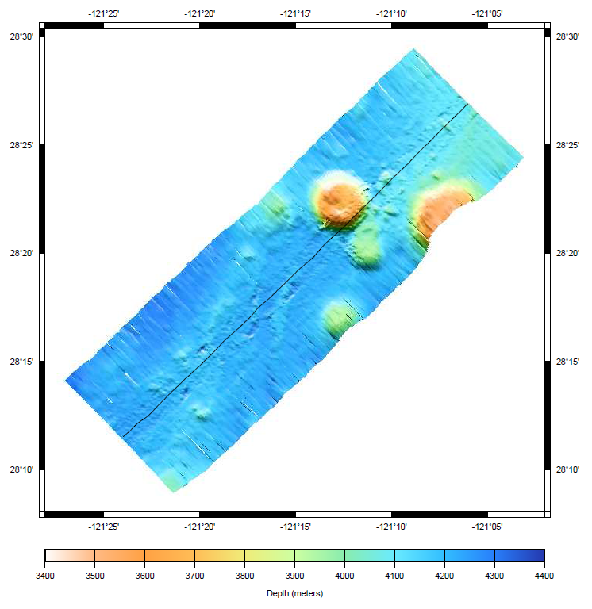

:Author: Hamish Bowman
:Reviewer: Cameron Shorter, LISAsoft
:Version: osgeo-live5.5
:License: Creative Commons

.. image:: ../../images/project_logos/logo-mb-system.gif
  :scale: 30 %
  :alt: project logo
  :align: right
  :target: http://www.ldeo.columbia.edu/res/pi/MB-System/

MB-System
================================================================================

Sea floor mapping
~~~~~~~~~~~~~~~~~~~~~~~~~~~~~~~~~~~~~~~~~~~~~~~~~~~~~~~~~~~~~~~~~~~~~~~~~~~~~~~~

MB-System is an open source software package for the processing and 
display of bathymetry and backscatter imagery data derived from
multibeam, interferometry, and sidescan sonars. It makes extensive
use of the :doc:`GMT <gmt_overview>` software.

MB-System has been under development since 1993, with active support
from a number of research and science organisations.

.. comment .. note:: Due to space constraints on the DVD, MB-System is currently
.. comment  not installed. To install it open up a terminal and
.. comment  run ``cd gisvm/bin; sudo ./install_mb-system.sh``

Core Features
--------------------------------------------------------------------------------

* Read, list, and translate many swath data formats
* Batch processing of large datasets
* Calculate and compensate for sound velocity profile
* Navigation and inertial systems data analysis and editor
* Patch test analysis
* Automatic or interactive bathymetry data cleaning
* Interactive 3D visualization data cleaning tools
* Gridding, statistical analysis, and extraction of cleaned bathymetric product
* Map reprojection
* Sidescan and amplitude data processing and mosaicking
* Grid visualization
* Survey planning
* PostScript graphics
* Exporting data products to GIS and visualization packages
* Subbottom profiler data processing
* Tide modeling and correction

Details
--------------------------------------------------------------------------------

**Website:** http://www.ldeo.columbia.edu/res/pi/MB-System/

**Licence:** GNU General Public License (GPL) version 3

**Software Version:** 5.3.1982

**Supported Platforms:** GNU/Linux, Mac OSX, MS Windows (with Cygwin)

**API Interfaces:** Command line

Quickstart
--------------------------------------------------------------------------------

* :doc:`Quickstart documentation <../quickstart/mb-system_quickstart>`

