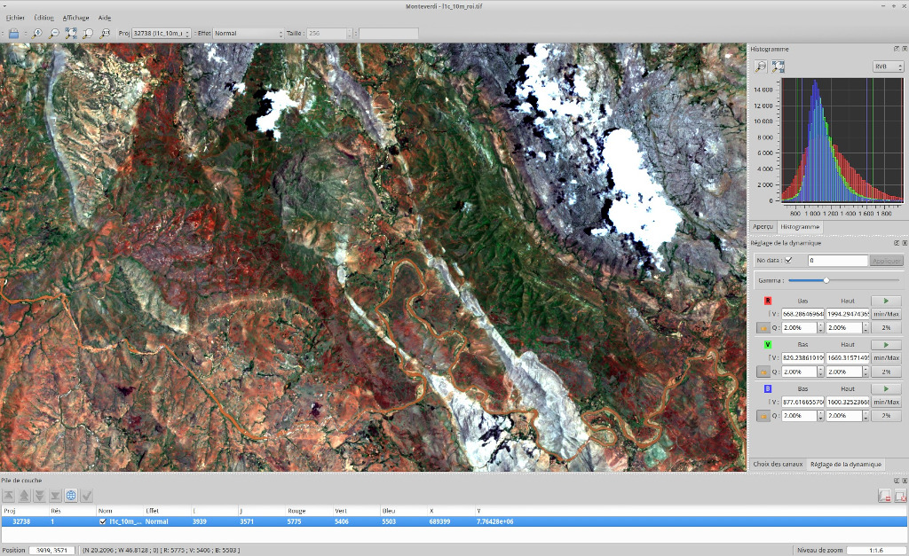

:Author: OSGeo-Live
:Reviewer: Cameron Shorter, LISAsoft
:Version: osgeo-live8.5
:License: Creative Commons Attribution 3.0 Unported (CC BY 3.0)

.. image:: ../../images/project_logos/logo-otb.png
  :alt: project logo
  :align: right
  :target: http://www.orfeo-toolbox.org/

OTB
================================================================================

Image Processing
~~~~~~~~~~~~~~~~~~~~~~~~~~~~~~~~~~~~~~~~~~~~~~~~~~~~~~~~~~~~~~~~~~~~~~~~~~~~~~~~

ORFEO Toolbox Library (OTB) is a high performance image processing library. It
is primarily used for processing large remote sensing images such as those
gathered by radars, satellites and aerial photography. OTB provides tools for
optic and radar images (tridimensional aspects, segmentation, classification,
changes detection, texture analysis, pattern matching, and optic/radar
complementarities), many of which can be run on limited-resourced laptops.

OTB is also shipped with a set of extensible ready-to-use tools for classical
remote sensing tasks and a fully integrated application called Monteverdi, which
is a fast viewer that allows users to vizualise multiple layers, and call OTB
processing tools from a menu entry.

OTB has been funded the French Space Agency (CNES) in the frame of the
Methodological Part of the ORFEO/Pleiades Accompaniement Program and has been
actively developed since 2006. It is based on the ITK image processing library
and is distributed as open source.

Core Features
--------------------------------------------------------------------------------

* image access: optimized read/write access for most remote sensing raster
  formats (also JPEG2000 formats), meta-data access and visualization;
* orthorectification using DEM, map reprojection and sensor model refinement
* optical and SAR calibration
* image fusion
* filtering: blurring, denoising, enhancement...
* feature extraction: interest points, alignments, lines...
* object detection
* large scale image segmentation: region growing, mean-shift, watershed, level sets...
* classification: K-means, Markov random fields, access to machine learning algorithms from OpenCV
* regression using machine learning methods from OpenCV (SVM, Random Forest, ...)
* object-based image analysis
* geospatial analysis
* stereoscopic reconstruction from optical images
* SAR data analysis : calibration, polarimetry analysis
* change detection.

Details
--------------------------------------------------------------------------------

**Website:** http://www.orfeo-toolbox.org/

**Licence:** CeCILL (CeCILL is compatible with GPL and enhanced to
  address French law)

**Software Version:** 5.2.0

**Supported Platforms:** Linux, Mac, Windows

**API Interfaces:** C++

**Commercial Support:** http://www.osgeo.org/search_profile

Quickstart
--------------------------------------------------------------------------------

* :doc:`Quickstart documentation <../quickstart/otb_quickstart>`

