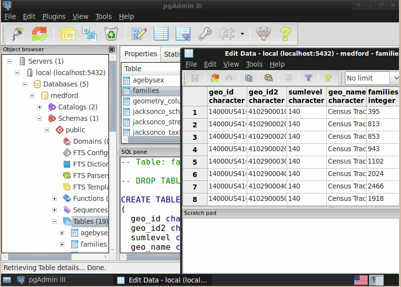

.. Writing Tip:
  Writing tips describe what content should be in the following section.
  The postgis_overview.rst document is used as a reference example
  for other overviews.
  All other overviews should remove the writing tips in order to make the
  overview documents easier to translate.

.. Writing Tip:
  Metadata about this document

:Author: OSGeo-Live
:Author: Barry Rowlingson
:Reviewer: Cameron Shorter, LISAsoft
:Version: osgeo-live5.5
:License: Creative Commons Attribution 3.0 Unported (CC BY 3.0)

.. Writing Tip:
  The following becomes a HTML anchor for hyperlinking to this page

.. Writing Tip:
  Project logos are stored here:
    https://svn.osgeo.org/osgeo/livedvd/gisvm/trunk/doc/images/project_logos/
  and accessed here:
    ../../images/project_logos/<filename>

.. image:: ../../images/logos/OSGeo_project.png
  :scale: 100 %
  :alt: OSGeo Project
  :align: right
  :target: http://www.osgeo.org/incubator/process/principles.html

PostGIS
================================================================================

.. Writing Tip:
  Application Category Description:

Spatial Database
~~~~~~~~~~~~~~~~~~~~~~~~~~~~~~~~~~~~~~~~~~~~~~~~~~~~~~~~~~~~~~~~~~~~~~~~~~~~~~~~

.. Writing Tip:
  Address user questions of "What does the application do?",
  "When would I use it?", "Why would I use it over other applications?",
  "How mature is the application and how widely deployed is it?".
  Don't mention licence or open source in this section.
  Target audience is a GIS practitioner or student who is new to Open Source.
  * First sentence should explain the application.
  * Usually the application domain will not be familiar to readers. So the
    next line or two should explain the domain. Eg: For GeoKettle, the next
    line or two should explain what GoeSpatial Business Intelligence is.
  * Remaining paragraph or 2 in this overview section should provide a
    wider description and advantages from a user perspective.

PostGIS spatially enables the popular PostgreSQL object-relational database, allowing it to be used as a back-end database for geographic information systems (GIS) and web-mapping applications in the same manner as Oracle Spatial enables the Oracle database.

PostGIS is stable, fast, standards compliant, with hundreds of spatial functions and is currently the most widely used Open Source spatial database. PostGIS is used by diverse organisations from around the world, including risk-averse government agencies and organisations storing terabytes of data serving millions of web requests per day.

Database administration is available for desktop and the web via pgAdmin, phpPgAdmin, and others.
Data import/export can be done by command line tools (shp2pgsql, pgsql2shp, ogr2ogr, dxf2postgis) or
from desktop and web GIS clients. These clients can also map and manipulate PostGIS spatial data tables.

.. Writing Tip:
  Provide a image of the application which will typically be a screen shot
  or a collage of screen shots.
  Store image in image/<application>_<name>.gif . Eg: udig_main_page.gif
  Screenshots should be captured from a 1024x768 display.
  Don't include the desktop background as this changes with each release
  and will become dated.

Core Features
--------------------------------------------------------------------------------

* Hundreds of spatial functions
  
  * Buffers, unions, overlays, distance and more

* ACID transactional integrity
* R-Tree spatial index
* Multi-user support
* Row-level locking
* Replication
* Partitioning
* Role-based security
* Table-spaces, schemas

Implemented Standards
--------------------------------------------------------------------------------

.. Writing Tip: List OGC or related standards supported.

* OGC standards compliant (SFSQL)

Details
--------------------------------------------------------------------------------

**Website:** http://postgis.refractions.net/

**Licence:** GNU General Public License (GPL) version 2

**Software Version:** 1.5

**Supported Platforms:** Windows, Linux, Mac

**API Interfaces:** SQL

.. Writing Tip:
  Link to webpage which lists the primary support details for the application,
  preferably this would list both community and commercial contacts.

**Support:** http://www.osgeo.org/search_profile

Quickstart
--------------------------------------------------------------------------------
    
* :doc:`Quickstart documentation <../quickstart/postgis_quickstart>`
