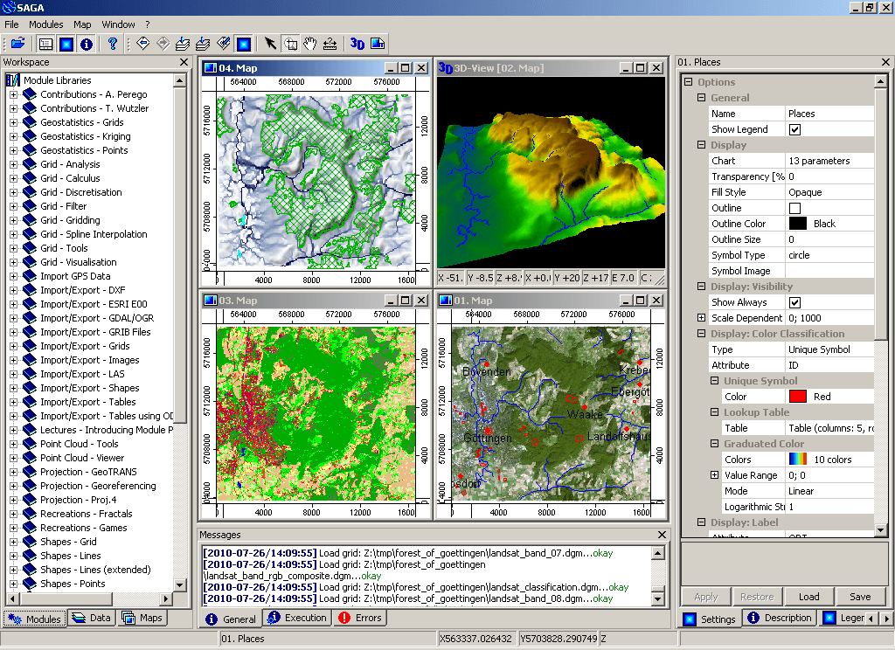

:Author: OSGeo-Live
:Reviewer: Cameron Shorter, LISAsoft
:Version: osgeo-live5.5
:License: Creative Commons Attribution 3.0 Unported (CC BY 3.0)

.. image:: ../../images/project_logos/logo-saga.png
  :scale: 100 %
  :alt: project logo
  :align: right
  :target: http://www.saga-gis.org

SAGA
================================================================================

Desktop GIS
~~~~~~~~~~~~~~~~~~~~~~~~~~~~~~~~~~~~~~~~~~~~~~~~~~~~~~~~~~~~~~~~~~~~~~~~~~~~~~~~

SAGA (System for Automated Geoscientific Analyses) is an
open source geographic information system (GIS) used for editing and analysing
spatial data. It includes a large number of modules for the analysis of
vector (point, line and polygon), table, grid and image data. Among
others the package includes modules for geostatistics, image
classification, projections, simulation of dynamic processes (hydrology,
landscape development) and terrain analysis. The functionality can be
accessed through a GUI, the command line or by using the C++ API.

SAGA has been in development since 2001, and the centre of SAGA development is
located in the Institute of Geography at the University of Hamburg, with
contributions from the growing world wide community.

Core Features
--------------------------------------------------------------------------------

* Access to a large number of scientific modules via the Graphical User Interface or the command line

 * Import/Export to different file formats
 * Reprojection/Resampling of data
 * Manipulation of vector data (merging/intersection/attributes)
 * Manipulation of point clouds from lidar data
 * Raster data: interpolation, cost analysis, ...
 * Image analysis: filters, edge detection, cluster analysis, segmentation
 * Digital Terrain Analysis: generate geomorphometric indexes, channel networks, profiles, contour lines, ...
 * Geostatistics: modules for variogram fitting and kriging

* Fast user interface for managing and visualising data

 * 3D visualisation

* Straightforward C++ API for creating new modules
* Scripting through command line, bindings for python
* SAGA can be accessed from the R statistical language through the RSAGA module

Details
--------------------------------------------------------------------------------

**Website:** http://www.saga-gis.org

**Licence:** LGPL v2.1 (api); GPLv2 (GUI and modules)

**Software Version:** 2.0.8

**Supported Platforms:** Windows, Linux, FreeBSD

**API Interfaces:** C++

**Support:** http://www.saga-gis.org

Quickstart
--------------------------------------------------------------------------------

* :doc:`Quickstart documentation <../quickstart/saga_quickstart>`

