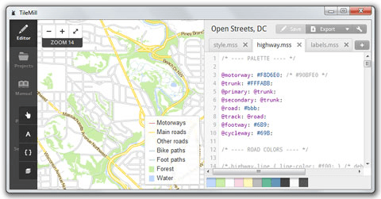

:Author: OSGeo-Live
:Author: Javier Sanchez, GeoNaTec
:Reviewer: Cameron Shorter, LISAsoft
:Version: osgeo-live6.5
:License: Creative Commons Attribution 3.0 Unported (CC BY 3.0)

.. Review Comment
 For the Project Logo, it should just contain the icon. Currently it also
 includes text and lots of white space above and below the text.
 Can the logo please be edited to only include the icon.
  
.. image:: ../../images/project_logos/logo-tilemill.png
  :scale: 75 %
  :alt: TileMill
  :align: right
  :target: http://www.tilemill.com

TileMill
================================================================================

Design studio for Web Maps
~~~~~~~~~~~~~~~~~~~~~~~~~~~~~~~~~~~~~~~~~~~~~~~~~~~~~~~~~~~~~~~~~~~~~~~~~~~~~~~~

.. Review Comment. For consistency with other Project Overviews, there should
  only be one image. As such, please remove the image below (or replace other
  image with this one). js: OK!, but finally I've selected the app interface one, better that the map examples, as I consider it to be more representative of the application.

TileMill is a design studio for creating beautiful, web based, interactive maps from a wide range of existing spatial data sources.

.. Review Comment
  Is the following sentence accurate?
  What are MBTiles? I expect we should include a few words explaining what it is. js: OK! (added explanation about it.)

Generated webmaps can use hover tooltips, clickable pop ups, interactive graphs and images, SVG markers, rich textures, and multiple layers.  Customized maps can be exported to different formats like: .png, .pdf, .svg and MBTiles. MBTiles is an open specification which provides a way of storing millions of tiles in a single SQLite database, making it possible to store and transfer web maps in a single file. And because SQLite is available on so many platforms, MBTiles is an ideal format for reading tiles directly for serving on the web or displaying on mobile devices.

.. Review Comment
  Can Tilemill publish to WMS, WFS? If so, mention it here. js: It doesn't indeed, It is explained bellow that it does not support OGC standards...

Data can be sourced from vector data (CSV, shapefile, KML, GeoJSON), raster (GeoTiff), as well as large data sources like OpenStreetMap, Postgres and SQLite.

.. Review Comment
  Can Tilemill connect to OGC services such as WMS, WFS? If so, mention it here. js: It can't, as far as I Know.

Tilemill makes use of the :doc:`Mapnik <mapnik_overview>` map rendering library (as used by OpenStreeMap) and uses the CartoCSS as a stylesheet language.

TileMill is typically used in conjunction with a desktop GIS (like QuantumGIS) for preparing data, and a graphics editor (like GIMP) for creating icons, patterns and textures.

Core Features
--------------------------------------------------------------------------------

.. Review Comment
  Can you connect to other map formats, such as Google, Bing, WMS, WFS, ???
  If so mention it. js: It can't, as far as I Know.
* Load data from a wide range of sources
  
  * ESRI Shapefile
  * KML
  * GeoJSON
  * GeoTiff
  * CSV spreadsheet
  * OpenStreetMap

* Connecting to Geospatial databases

  * PostgreSQL + PostGIS
  * SQLite

* Manage custom layers

* Data Styling

  * Style using presets or custom colors
  * Conditional styles

* Add tooltips and legends

* Publish

  * Image Files: .png, .pdf, .svg, MBTiles.
  * Publish as webpage 
  * Embed map in a webpage or Content Management System (WordPress, Drupal)

* JavaScript API

Implemented Standards
--------------------------------------------------------------------------------

* TileMill does not support OGC standards, like WMS or WFS. Rather it adheres to the widespread practices of z/x/y tile schemes used by Google and OSM and is based on the MBTiles and UTFGrid specifications.

Details
--------------------------------------------------------------------------------

**Website:** http://tilemill.com

**Licence:** BSD

**Software Version:** 0.10.1

**Supported Platforms:** Windows, Linux, Mac

**API Interfaces:** JavaScript

**Support:** http://www.tilemill.com

Quickstart
--------------------------------------------------------------------------------
    
* :doc:`Quickstart documentation <../quickstart/tilemill_quickstart>`
