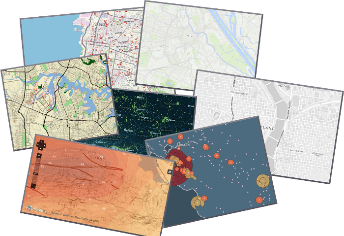

:Author: OSGeo-Live
:Author: Javier Sanchez
:Reviewer: 
:Version: osgeo-live6.5
:License: Creative Commons Attribution 3.0 Unported (CC BY 3.0)

.. image:: ../../images/project_logos/logo-tilemill.png
  :scale: 75 %
  :alt: TileMill
  :align: right
  :target: http://www.tilemill.com

Design studio for Web Maps
================================================================================

TileMill
~~~~~~~~~~~~~~~~~~~~~~~~~~~~~~~~~~~~~~~~~~~~~~~~~~~~~~~~~~~~~~~~~~~~~~~~~~~~~~~~

.. image:: ../../images/screenshots/1024x768/tilemill_interface.png
  :scale: 55 %
  :alt: TilleMill user interface
  :align: right

TileMill is a tool to quickly and easily design maps for the web using custom data. It is built on the powerful open-source map rendering library Mapnik ( the same software OpenStreetMap and MapQuest use to make some of their maps ) and uses CartoCSS as a stylesheet language.

TileMill supports either vector data ( csv, shapefile, kml. GeoJson) or raster (GeoTiff), and can also connects to large datasets like PostgreSQL with PostGIS and OpenStreetMap. Customized maps can be exported to different formats like: .png, .pdf, .svg or MBTiles

Although TileMill is a powerful design studio, in order tu use it effectively you will probably need to use with other desktop GIS applications (like QuantumGIS) to manipulate geospatial data in advance or graphics editor (like GIMP) to create and edit icons, patterns and textures.

Core Features
--------------------------------------------------------------------------------

* Load data from a wide range of sources
  
  * ESRI Shapefile
  * KML
  * GeoJSON
  * GeoTiff
  * CSV spreadsheet

* Connecting to Geospatial datasets

  * PostgreSQL + PostGIS
  * SQLite

* Manage custom layers

* Data Styling

  * Style using presets or cutom colors
  * Conditional styles

* Adding tooltips and legends

* Exporting a map

  * Image Files
  * Embedding a map on a webpage or CMS (WordPress, Drupal)

* JavaScript API

Implemented Standards
--------------------------------------------------------------------------------

.. Writing Tip: List OGC or related standards supported.

* TileMill does not support OGC standards, like WMS or WFS. Rather it adheres to the widespread practices of z/x/y tile schemes used by Google and OSM and is based on the MBTiles and UTFGrid specifications.

Details
--------------------------------------------------------------------------------

**Website:** http://tilemill.com

**Licence:** BSD

**Software Version:** 0.10.1

**Supported Platforms:** Windows, Linux, Mac

**API Interfaces:** JavaScript

**Support:** http://www.tilemill.com

Quickstart
--------------------------------------------------------------------------------
    
* :doc:`Quickstart documentation <../quickstart/tilemill_quickstart>`

