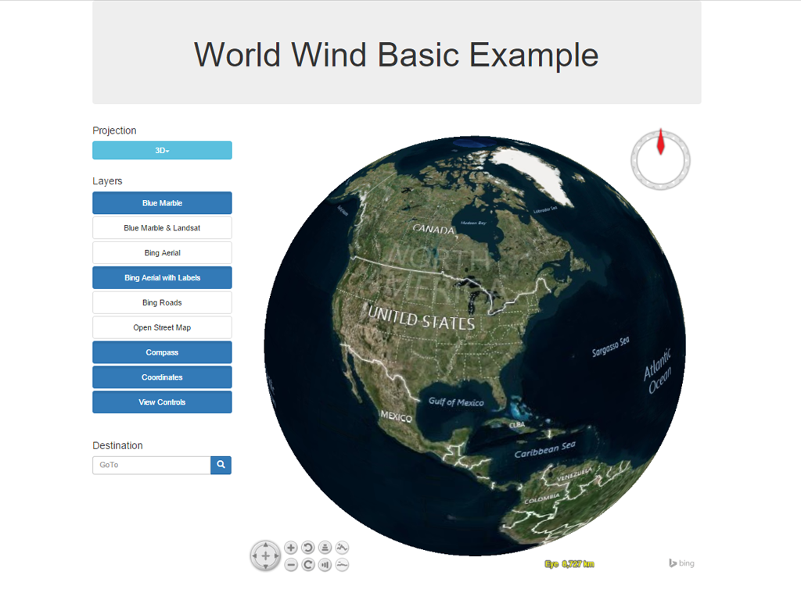

:Author: Gabriele Prestifilippo
:Reviewer: Cameron Shorter, LISAsoft
:Version: osgeo-live9.5
:License: Creative Commons Attribution 3.0 Unported (CC BY 3.0)

Web World Wind
================================================================================

Virtual Globe in a browser
~~~~~~~~~~~~~~~~~~~~~~~~~~~~~~~~~~~~~~~~~~~~~~~~~~~~~~~~~~~~~~~~~~~~~~~~~~~~~~~~

Web World Wind is a browser based, 3 dimensional virtual globe. It allows users to zoom from satellite altitude to any place on earth, experiencing the earth in 3 dimensions, as if really there. 
It is easy to use, only requiring a two button mouse.  It is used to monitor weather patterns, visualize cities and terrain, track the movement of planes, vehicles and ships, analyze geospatial data, and educate people about the Earth.

Web World Wind provides an extensible, javascript platform which enables web developers to quickly create custom globes and 2 dimensional maps which can express, manipulate and analyze spatial data.  You can show terrain and high-resolution imagery, include a compass, map coordinates, and view controls.

Core Features
--------------------------------------------------------------------------------

* High-performance, 3 dimensional virtual globe for web pages and web applications
* 2 dimensional map mode with selectable and extensible map projections
* JavaScript Application Programming Interface (API) for automating all aspects of interaction and visualization
* Access to a large collection of high-resolution imagery and terrain
* Display high-resolution imagery, terrain and geographic data from any public or private source
* Supports REST, WMS and Bing map layers
* Large collection of geometric and geographic shapes for representing information
* Navigation and Viewing, Picking
* Display multiple globes and maps on the same page
* Simple to use, extend and modify

Graphics Capabilities:

* Placemark, Path and Curtain, Polygon and Extruded Polygon, Text
* Terrain conforming shapes: Path, Polygon, Ellipse, Circle, Quadrilateral, Square
* Imagery: JPEG, PNG
* Graticules
* Shapefiles

Implemented Standards
--------------------------------------------------------------------------------

* WMS 1.1, 1.3
* WMTS 1.0
* OWS 1.0

Details
--------------------------------------------------------------------------------

**Website:** http://webworldwind.org/

**Licence:** NASA Open Source Agreement Version 1.3

**Software Version:** World Wind Pre-release

**Supported Platforms:** Windows, Linux, Mac

**Forum:** http://forum.worldwindcentral.com/forumdisplay.php?60-Web-World-Wind

Quickstart
--------------------------------------------------------------------------------

:doc: `Quickstart documentation <../quickstart/webworldwind_quickstart>`_
