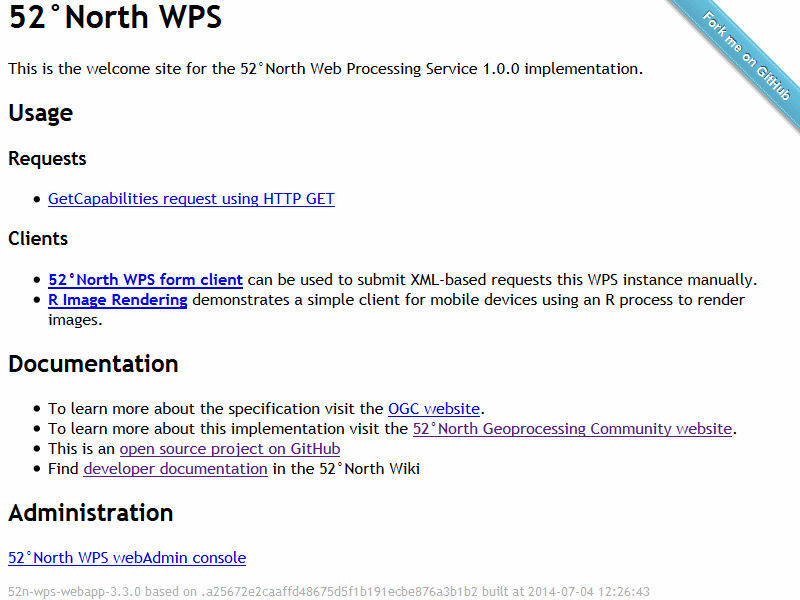
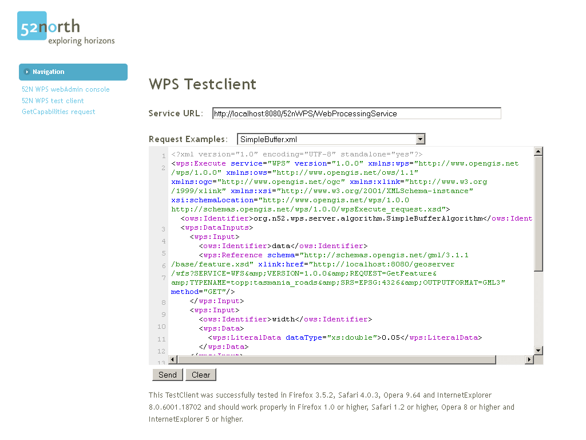
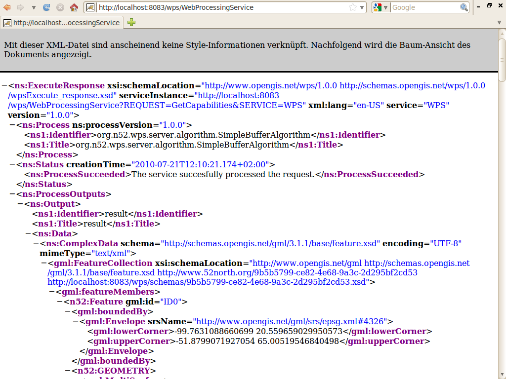

:Author: Kristof Lange
:Version: osgeo-live6.0
:License: Creative Commons Attribution-ShareAlike 3.0 Unported  (CC BY-SA 3.0)

.. image:: ../../images/project_logos/logo_52North_160.png
  :scale: 100 %
  :alt: project logo
  :align: right

********************************************************************************
52°North WPS Quickstart 
********************************************************************************

Running
================================================================================

* To run 52°North WPS on the Live DVD, go to :menuselection:`Geospatial --> Web Services --> 52North --> Start 52North WPS`	to start the 52°North WPS or use this `direct link <http://localhost:8080/52nWPS/>`_. (If the service is not reachable, try to start the Tomcat servlet engine following the steps at the bottom of the :doc:`SOS quickstart page <../quickstart/52nSOS_quickstart>`.)

* The 52n WPS welcome page will appear. 

* Click on the link to open the 52nWPS-TestClient. 
* Make sure that you have started :doc:`GeoServer <../overview/geoserver_overview>` since the demonstrations require data from the local GeoServer installation.

  
  
* Push the Send-Button and the request will be transmitted to the 52°North WPS which will
  generate a xml-representation for a buffer around the major roads of tasmania with a width of 0.05 degrees.

  

* Check out the capabilities of the 52°North WPS with this request:

  http://localhost:8080/52nWPS/WebProcessingService?Request=GetCapabilities&Service=WPS

	
* For further questions you can contact the 52°North WPS mailing list:

  geoprocessingservices@52north.org

