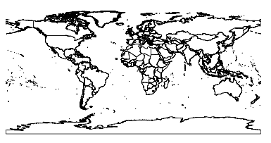
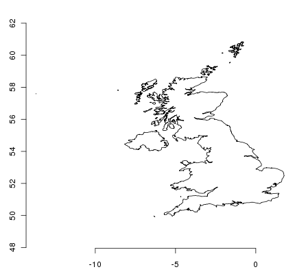
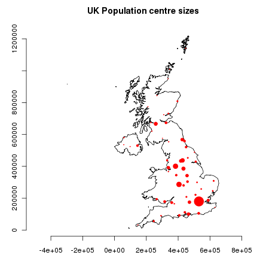

:Author: Barry Rowlingson
:Version: osgeo-live5.0
:License: Creative Commons Attribution-ShareAlike 3.0 Unported  (CC BY-SA 3.0)

.. image:: ../../images/project_logos/logo-R.jpg
  :scale: 60 %
  :alt: project logo
  :align: right

********************************************************************************
R Quickstart
********************************************************************************

R is a free software environment for statistical computing and graphics.

This Quick Start describes how to:

  * use R for simple arithmetic
  * load some data from a shapefile and map it
  * do a coordinate transformation
  * plot some data points on a map

Start R
================================================================================

Either:

  * Choose ``R Statistics`` from the Spatial Tools section of the  menu - a terminal window appears running R.
  * Enter ``R`` at a command-line shell prompt. R will start in that terminal.

Don't fear the command line - it is a source of great power. Using the up and down arrows
to recall commands so you can edit mistakes will help greatly. Hit CTRL-C if get
stuck and you should get the prompt back.

Quit R
================================================================================

Almost everything in R is a function, including the function for quitting. Type 
``q()`` and hit return. If you just type ``q`` you'll see the source code for the ``q`` function.

R will ask you if you want to save your workspace as an R data image file. When you
start R again from a directory with a ``.RData`` file it will restore all its
data from there.

Beginning R
================================================================================

R is essentially a command-line program, although graphical user
interfaces are available. You type a line of code at the prompt,
press return, and the R interpreter evaluates it and prints the 
result.

You can start with simple arithmetic

::

   > 3*2
   [1] 6

   > 1 + 2 * 3 / 4
   [1] 2.5

   > sqrt(2)
   [1] 1.414214

   > pi * exp(-1)
   [1] 1.155727

And so on. A full range of arithmetic, trigonometric, and statistical
functions are built in, and thousands more are available from
packages in the `CRAN <http://cran.r-project.org/>`_ archive.

The main prompt in R is ``>``, but there is also the continuation prompt, ``+``, which 
appears if R expects more input to make a valid expression. You'll see this if you
forget a closing bracket or parenthesis.

::

   > sqrt(
   + 2
   + )
   [1] 1.414214

Building Data
================================================================================

You might be wondering what the mysterious 'one' in square brackets is 
doing in the output. This is telling you that the result is one number. R
can store things in one-dimensional vectors, two-dimensional matrices,
and multi-dimensional arrays. There are many functions that can 
generate these things. Here's a simple sequence:

::

    > seq(1,5,len=10)
    [1] 1.000000 1.444444 1.888889 2.333333 2.777778 3.222222 3.666667 4.111111
    [9] 4.555556 5.000000

Now you can see that the ``[9]`` is telling us that 4.555 is the ninth
value in the vector. 

If you construct a matrix you get row and column labels:

::

	> m=matrix(1:12,3,4)
	> m
	     [,1] [,2] [,3] [,4]
	[1,]    1    4    7   10
	[2,]    2    5    8   11
	[3,]    3    6    9   12

Elements of matrices can be extracted using square brackets, with row and column 
indices separated by commas. Leave an index blank to get a whole row as a vector. Use a vector
index to get multiple rows or columns as a smaller matrix:

::

	> m[2,4]
	[1] 11

	> m[2,]
	[1]  2  5  8 11

	> m[,3:4]
	     [,1] [,2]
	[1,]    7   10
	[2,]    8   11
	[3,]    9   12

Data frames are data structures that mirror the kind of structure
found in an RDBMS such as Postgres or MySQL. Each row can be thought
of as a record, with columns being like fields in a database. As in a
database, each field must be of the same type for each record. 

In many ways they work like matrices, but you can also get and set the columns by name
using $-notation:

::

	> d = data.frame(x=1:10,y=1:10,z=runif(10)) # z is 10 random numbers
	> d
	        x  y          z 
	    1   1  1 0.44128080 
	    2   2  2 0.09394331 
	    3   3  3 0.51097462 
	    4   4  4 0.82683828 
	    5   5  5 0.21826740 
	    6   6  6 0.65600533 
	    7   7  7 0.59798278 
	    8   8  8 0.19003625 
	    9   9  9 0.24004866 
	    10 10 10 0.35972749 

	> d$z
	 [1] 0.44128080 0.09394331 0.51097462 0.82683828 0.21826740 0.65600533
	 [7] 0.59798278 0.19003625 0.24004866 0.35972749

	> d$big = d$z > 0.6  # d$big is now a boolean true/false value
	> d[1:5,]
	  x y          z   big
	1 1 1 0.44128080 FALSE
	2 2 2 0.09394331 FALSE
	3 3 3 0.51097462 FALSE
	4 4 4 0.82683828  TRUE
	5 5 5 0.21826740 FALSE

	> d$name = letters[1:10] # create a new field of characters
	> d[1:5,]
	  x y          z   big name
	  1 1 1 0.44128080 FALSE    a
	  2 2 2 0.09394331 FALSE    b
	  3 3 3 0.51097462 FALSE    c
	  4 4 4 0.82683828  TRUE    d
	  5 5 5 0.21826740 FALSE    e

Loading Map Data
================================================================================

There are many packages for spatial data manipulation and statistics. Some
are included here, and some can be downloaded from CRAN.

Here we will load two shapefiles - the country boundaries and populated places
from the Natural Earth data. We use two add-on packages to get the spatial 
functionality:

::

	> library(sp)
	> library(maptools)

	> countries = readShapeSpatial("/usr/local/share/data/natural_earth/10m_admin_0_countries.shp")
	> places = readShapeSpatial("/usr/local/share/data/natural_earth/10m_populated_places_simple.shp")
	> plot(countries)

This gives us a simple map of the world:

When an OGR dataset is read into R in this way we get back an object that
behaves in many ways like a data frame. We can use the ``ADMIN``
field to subset the world data and just get the UK:

::

	> uk = countries[countries$ADMIN=="United Kingdom",]
	> plot(uk); axis(1); axis(2)

This looks a bit squashed to anyone who lives here, since we are more familiar with
a coordinate system centred at our latitude. Currently the object doesn't have a 
coordinate system assigned to it - we can check this with some more functions:

::

	> proj4string(uk)
	[1] NA

``NA`` is a missing data marker. We need to assign a CRS to the object before we can
transform it with the spTransform function from the rgdal package. We transform
to EPSG:27700 which is the Ordnance Survey of Great Britain grid system:

::

	> proj4string(uk)=CRS("+init=epsg:4326")
	> library(rgdal)
	> ukos = spTransform(uk,CRS("+init=epsg:27700"))
	> proj4string(ukos)
	[1] " +init=epsg:27700 +proj=tmerc +lat_0=49 +lon_0=-2 +k=0.9996012717 +x_0=400000 +y_0=-100000 +ellps=airy +datum=OSGB36 +units=m +no_defs
	+towgs84=446.448,-125.157,542.060,0.1502,0.2470,0.8421,-20.4894"

	> plot(ukos);axis(1);axis(2)

This plots the base map of the transformed data. Now we want to add some points from the 
populated place data set. Again we subset the points we want and transform them to
Ordnance Survey Grid Reference coordinates:

::

	> ukpop = places[places$ADM0NAME=="United Kingdom",]
	> proj4string(ukpop)=CRS("+init=epsg:4326")
	> ukpop = spTransform(ukpop,CRS("+init=epsg:27700"))

We add these points to the base map, scaling their size by scaled square root of the 
population (because that makes a symbol with area proportional to population), set the
colour to red and the plotting character to a solid blob:
::

	> points(ukpop,cex=sqrt(ukpop$POP_MAX/1000000),col="red",pch=19)
	> title("UK Population centre sizes")

and our final image appears:

Vignettes
================================================================================

In the past the documentation for R packages tended to be tersely-written help pages
for each function. Now package authors are encouraged to write a 'vignette' as a friendly
introduction to the package. If you just run the ``vignette()`` function with no arguments
you will get the list of those vignettes on your system. Try ``vignette("sp")`` for a
slightly technical introduction to the R spatial data structures, or ``vignette("spdep")`` for 
a statistical analysis of spatial autocorrelation. The ``vignette("gstat")`` gives a tutorial
in the use of that package for spatial interpolation including Kriging.

Further Reading
================================================================================

For general information about R, try the official `Introduction to R <http://cran.r-project.org/doc/manuals/R-intro.html>`_ or any of the documentation from the main `R Project <http://www.r-project.org/>`_ page.

For more information on spatial aspects of R, the best place to start is probably the `R Spatial Task View <http://cran.r-project.org/web/views/Spatial.html>`_

You might also want to check out the `R-Spatial <http://r-spatial.sourceforge.net/>`_ 
page on sourceforge for some more links including information about the R-sig-Geo mailing list.

