.. Writing Tip:
  This Quick Start should describe how to run a simple example, which
    covers one of the application's primary functions.
  The Quick Start should be able to be executed in around 5 minutes.
  The Quick Start may optionally include a few more sections
    which describes how to run extra functions.
  This document should describe every detailed step to get the application
    to work, including every screen shot involved in the sequence.
  Finish off with "Things to Try" and "What Next?" sections.
  Assume the user has very little domain expertise, so spell everything out.

:Author: Friedjoff Trautwein (http://www.geops.de)
:Author: Augustus Kling (http://www.geops.de)
:Author: Patric Hafner (http://www.geops.de)
:Version: osgeo-live7.0draft
:License: Creative Commons Attribution-ShareAlike 3.0 Unported  (CC BY-SA 3.0)

.. image:: ../../images/project_logos/logo-cartaro.png
  :scale: 100 %
  :alt: project logo
  :align: right
  :target: http://cartaro.org

********************************************************************************
Cartaro Quickstart 
********************************************************************************

Cartaro is a geo-enabled Content Management System (CMS) to manage and publish geospatial and non-geospatial content. 


This Quickstart will guide you through the following tasks:

#. Create a new geospatial content type
#. Configure Cartaro to display the new content type
#. Add new geospatial content 

All tasks will be performed using the example of a touristic web portal with the goal to map lakes.

.. contents:: Contents
  
Starting Cartaro
================================================================================

.. Writing Tip:
  Describe steps to start the application
  This should include a graphic of the pull-down list, with a green circle
  around the application menu option.
  #. A hash numbers instructions. There should be only one instruction per
     hash.

#. Start the OSGeoLive DVD
#. Choose :menuselection:`Geospatial --> Browser Clients --> Start Cartaro` to start Cartaro
#. The Cartaro web page http://localhost/cartaro will automatically open

.. Writing Tip:
  For images, use a scale of 50% from a 1024x768 display (preferred) or
  70% from a 800x600 display.
  Images should be stored here:
    https://github.com/OSGeo/OSGeoLive-doc/tree/master/images/screenshots/1024x768/


Front Page
================================================================================

When the Cartaro page is opened, you will see the screen below. The front page contains a global map with capital cities as an example.

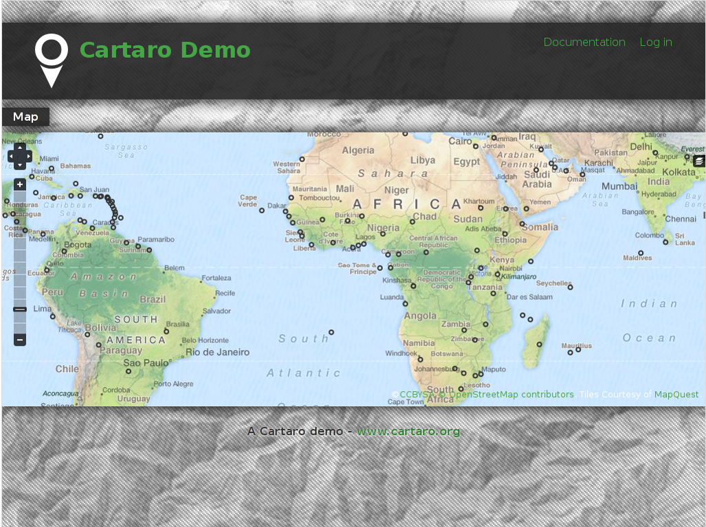


* Please **Log in** on the upper right corner to access the administrative interface with *admin* as username and *geoserver* as password. You will now see the administration menu bar on top.

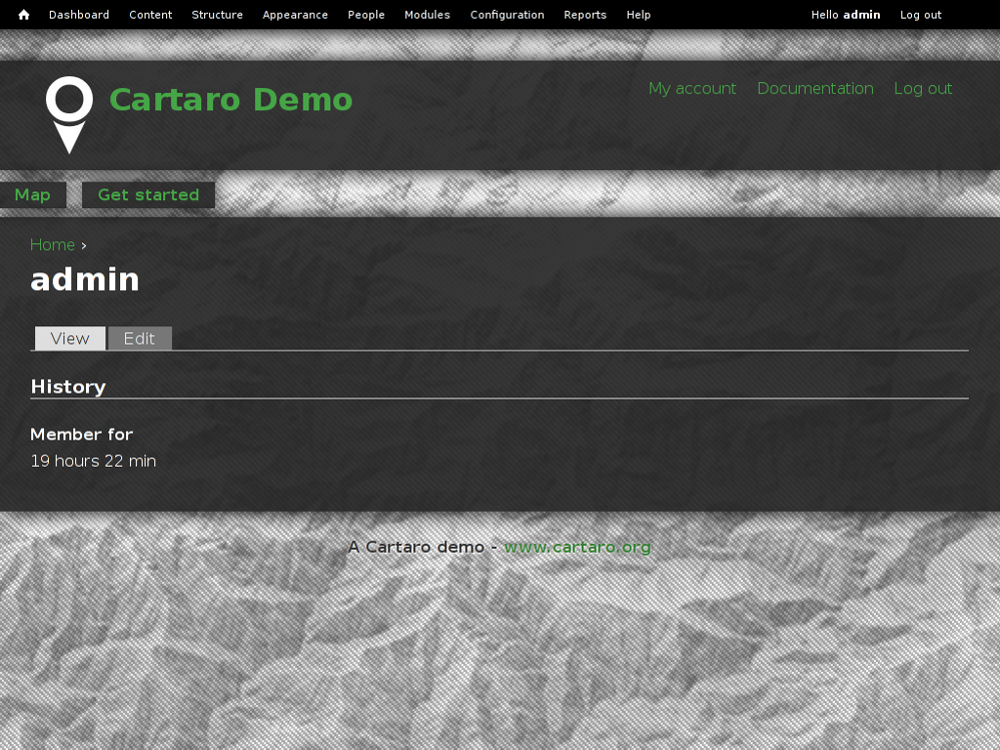
  
.. tip::  You can return to the front page anytime by click on the home icon in the upper left corner.


Creating a new Content type
================================================================================

Content types and fields define the structure  of a specific content (e.g. the content type *Capital* contains the fields "name" and "location" to generate content elements for the respective capitals displayed on the map).
To create a new content type, follow the steps below.

* Choose :menuselection:`Structure --> Content types` on the menu bar and click on **Add content type** 


.. image:: ../../images/screenshots/1024x768/cartaro_addcontenttype.png
    :scale: 80 %
    :align: center

* Type a name for the new content type and describe it if you want.

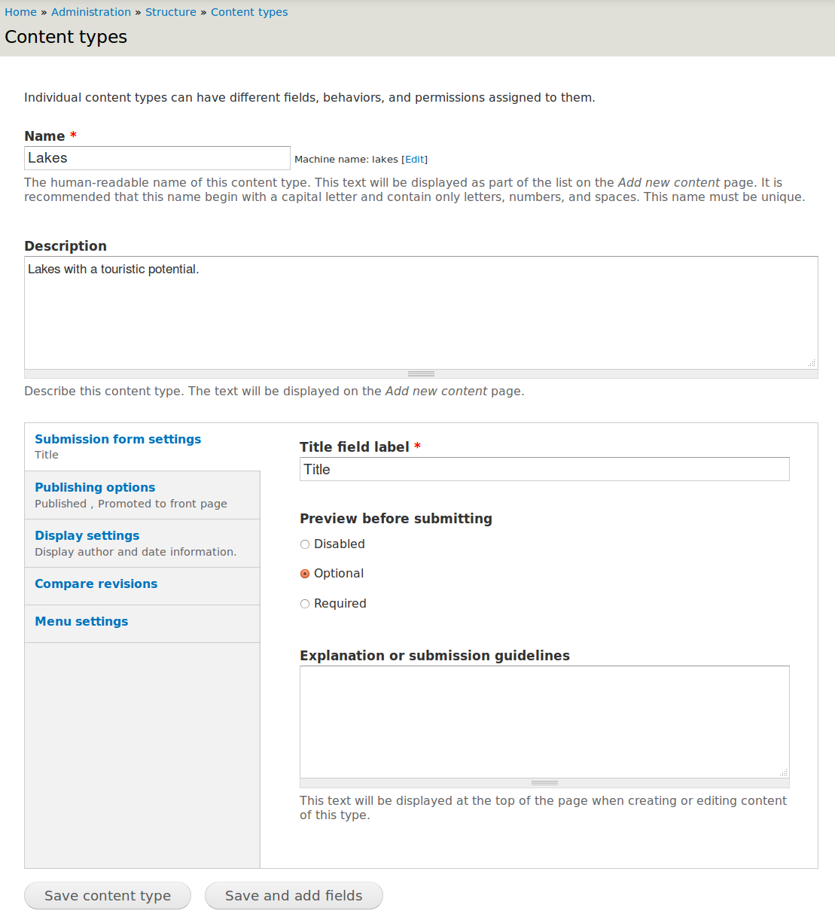

* Finish by click on **Save and add fields**


* Add a new field for your content type by entering a descriptive name. We want to create a geospatial field with the name  *Geometry*. Select  *Geospatial data*  as field type and  *OpenLayers Map*  as widget.

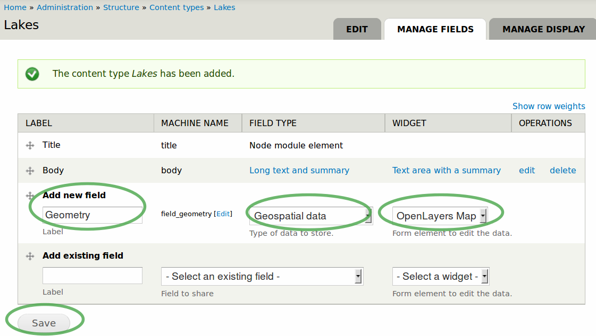

* Finish by click on **Save**

* Choose your field settings in the new window: Select the geometry type that describes the kind of geospatial information you want to store. Choose *Polygon* to follow our example.

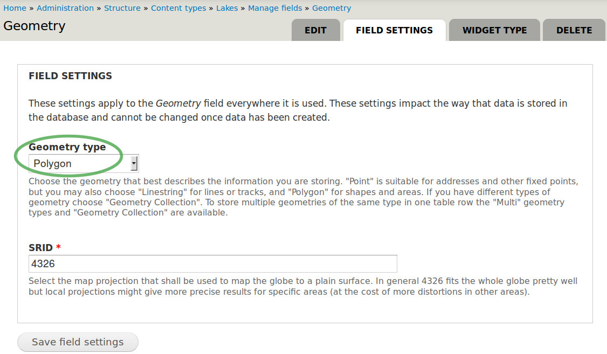

.. tip::  Read the text below the *Geometry type* drop-down box to find the geometry type that fits your needs.

* Finish by click on **Save field settings**

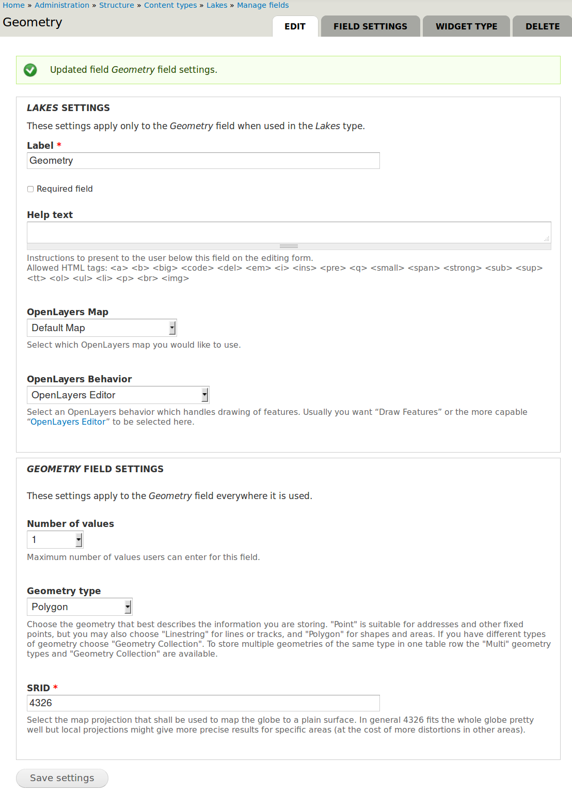

* Press *Save settings* to finish the field creation

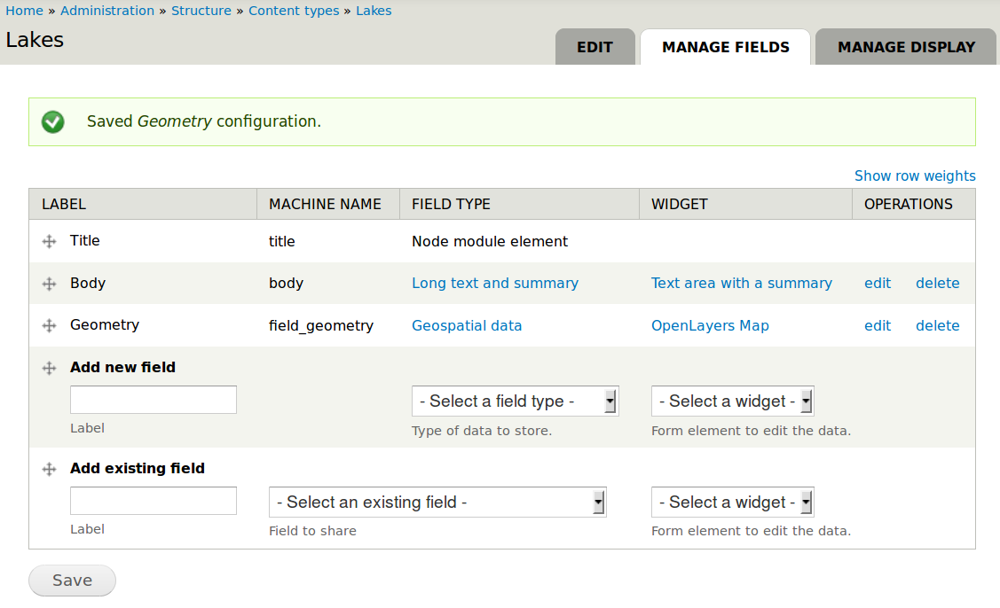

* Under the tab *Manage fields* you could create further non-geospatial fields. We don't need to create a new one for our example. 


Configuring GeoServer
================================================================================

:doc:`GeoServer <../overview/geoserver_overview>` is used to provide layers via :doc:`Web Feature Service (WFS) <../standards/wfs_overview>` and :doc:`Web Map Service (WMS) <../standards/wms_overview>` with the geospatial field from your newly created content type.

* Choose :menuselection:`Structure --> GeoServer` from the menu bar to visit the GeoServer configuration page

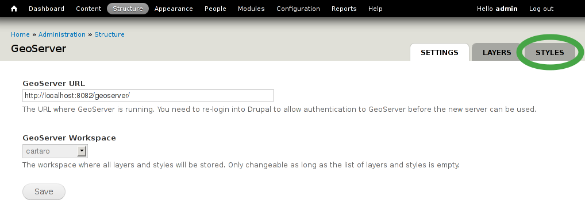

Creating a new layer in GeoServer
``````````````````````````````````
* Use GeoServer layers to publish your geospatial data. 
* Choose :menuselection:`Structure --> GeoServer` from the menu bar to visit the GeoServer configuration page again
* Select :menuselection:`Layers` and click **Add** to add a new layer

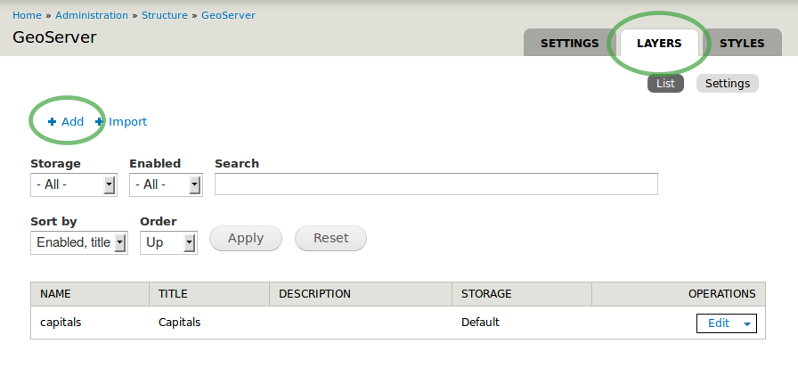

#. Type a suitable layer title (e.g. lakes). 
#. Select the layer type. We choose *PostGIS Field* for advanced geospatial operations and geodata storage. 
#. As source select your created content type which will be associated with your new layer. 
#. Make the checkmark  *Provide an OpenLayers WFS layer*  within the OpenLayers section.
#. Finish configuration by click on **Save**

.. image:: ../../images/screenshots/1024x768/cartaro7.png
    :scale: 55 %
    :align: center


* Congratulation! Your new GeoServer layer was added to GeoServer.

.. tip:: You can now also access the geospatial fields of your content type via WFS or WMS with other applications (e.g. with :doc:`QGis <../overview/qgis_overview>`) 


Configuring OpenLayers to activate your GeoServer layer in a map
================================================================================

:doc:`OpenLayers <../overview/openlayers_overview>` is used to display your new layer on a map. You will now associate your GeoServer layer with your OpenLayers map. 

* Go to :menuselection:`Structure --> OpenLayers --> Maps`  to visit the OpenLayers maps configuration page

* Look for *frontmap* - a pre-generated, default map and select **Edit** on the right side.

.. image:: ../../images/screenshots/1024x768/cartaro_openl_maps_frontmapedit.png
    :scale: 70 %
    :align: center

* frontmap's configuration page appears as shown on the screenshot below. 

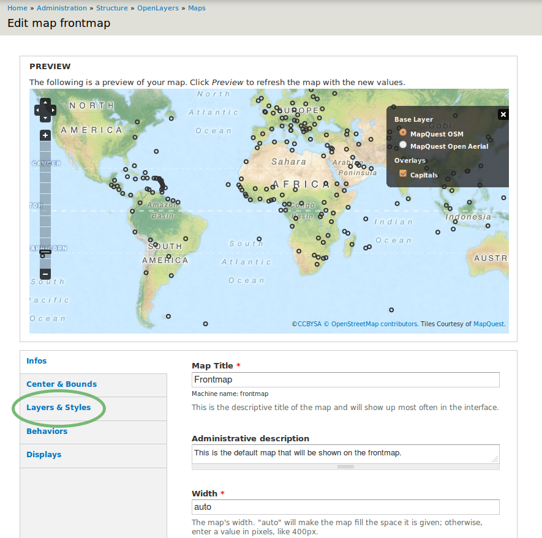

* Select :menuselection:`Layers & Styles` in the left sidebar to add our newly created layer to the frontmap. 

* Look for your created GeoServer layer ('lakes' in our example)
* Make checkmarks for *Enabled*, *Activated* and *In Switcher* to activate your new layer *lakes* in your map

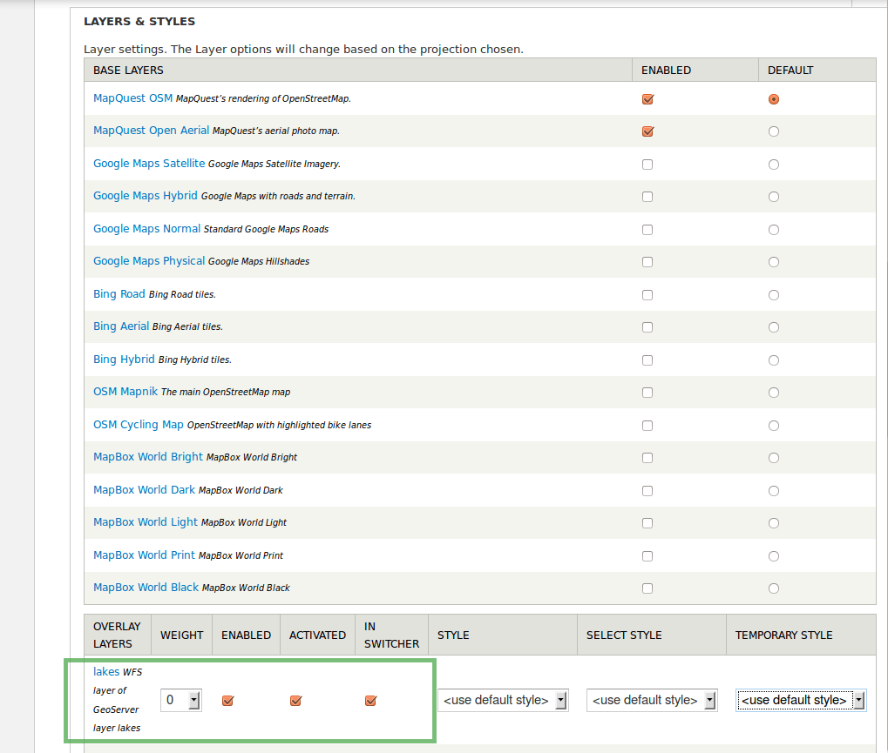

* Finish configuration by clicking on **Save** at the bottom

Adding geospatial content
================================================================================

After creating your content type and configuring GeoServer and OpenLayers you can now add as many content elements of this type as you want.

* Choose :menuselection:`Content` from the menu bar to see all existing content elements within your Cartaro installation

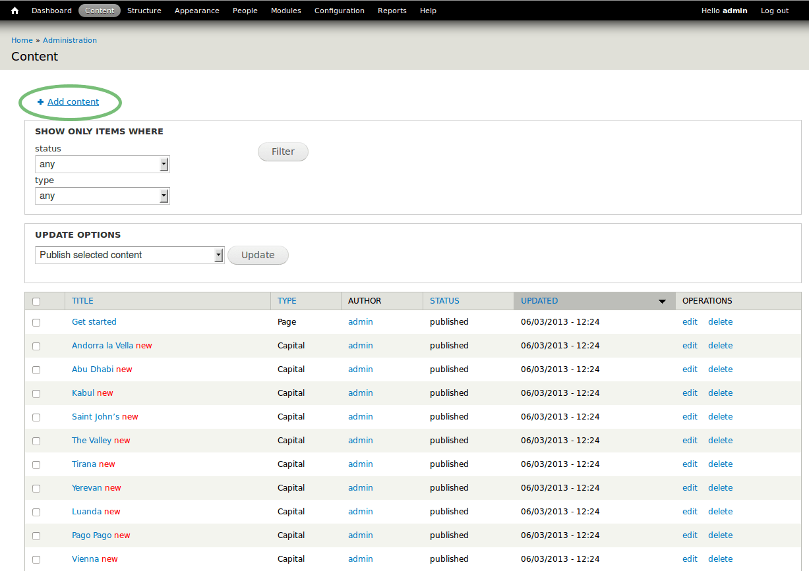

* Select **Add content** to add more content and choose your new content type in the appearing window (not shown). In the configuration page of your new content element (called node in Drupal language) make the following settings: 

#. Type a name
#. You can draw the geometry for your content element. Choose the draw symbol on the upper right corner of the map. Note that tool tips are shown when you hover the toolbar icons. Click on the map to create a new geometry. Finish the drawing with double click.
#. **Save** your geometry.

.. note:: Only one geometry per content element can be drawn in our example configuration. Create additional content elements to add more polygons.  

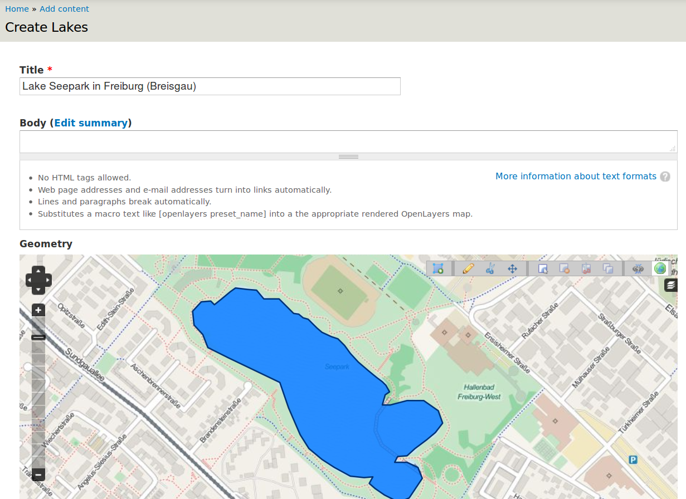

* You should now see your new content element

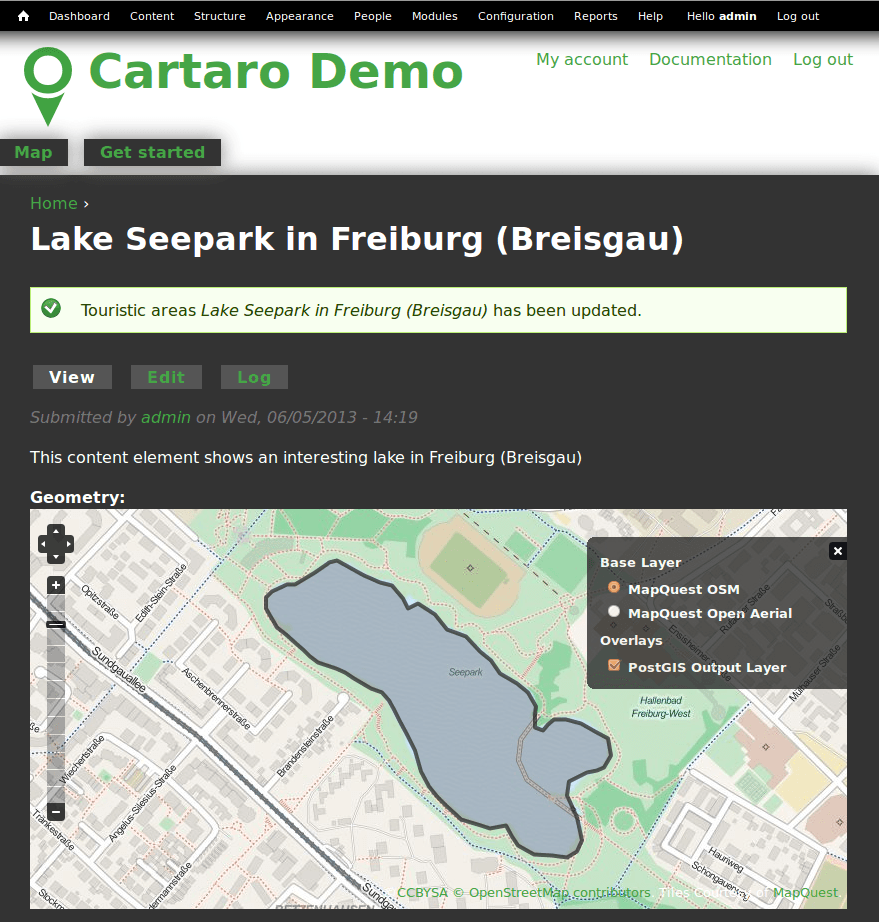

* To view your new content element on the front map, click on the house icon in the upper left corner

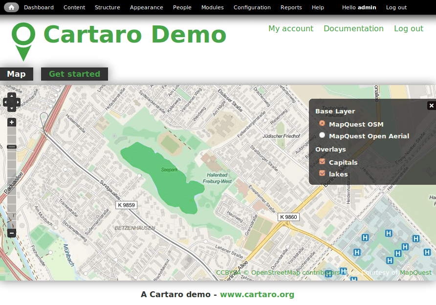

Congratulations, you have just finished the quickstart tutorial. Your first content element is now ready. To add more content elements simply peform the steps of this section again. 


Things to Try
================================================================================

* Use the **Layer Assistant** to include external layers :menuselection:`Structure --> Open Layers --> Layers --> Add using assistant`  
* Change the default map behaviors and build your own map 
* Try different geometry types and build more complex content types 


What Next ?
================================================================================

.. Writing tip
  The final heading should provide pointers to further tutorials,
  documentation or further things to try.
  Present a list of ideas for people to try out. Start off very specific
  with something most people can do based on the materials as presented.
  Continue on with a challenge that involves a small bit of research (it
  is recommended that research be limited to something that can be
  found in documentation packaged on OSGeo-Live, as users might not be
  connected to the Internet.


.. Writing tip
  Provide links to further tutorials and other documentation.

The quickstart has given a first impression about the possibilities of Cartaro to you. But there is a lot more to discover. 


Your next step may be to install Cartaro on your own servers. Just visit http://cartaro.org/documentation/getting-started to learn how.

In context to this quickstart, check our documentation about `Layer Assistant <http://cartaro.org/blog/21-layer-creation-assistant/>`_ or about `Styling <http://cartaro.org/blog/14-how-use-qgis-great-looking-symbols-cartaro/>`_


Our documentation web page can be found here http://cartaro.org/documentation


    Available on http://cartaro.org

                                                                      
