.. Writing Tip:
  This Quick Start should describe how to run a simple example, which
    covers one of the application's primary functions.
  The Quick Start should be able to be executed in around 5 minutes.
  The Quick Start may optionally include a few more sections
    which describes how to run extra functions.
  This document should describe every detailed step to get the application
    to work, including every screen shot involved in the sequence.
  Finish off with "Things to Try" and "What Next?" sections.
  Assume the user has very little domain expertise, so spell everything out.

:Author: Friedjoff Trautwein (http://www.geops.de)
:Author: Augustus Kling (http://www.geops.de)
:Author: Patric Hafner (http://www.geops.de)
:Version: osgeo-live6.5draft
:License: Creative Commons Attribution-ShareAlike 3.0 Unported  (CC BY-SA 3.0)

.. image:: ../../images/project_logos/logo-cartaro.png
  :scale: 100 %
  :alt: project logo
  :align: right
  :target: http://cartaro.org

********************************************************************************
Cartaro Quickstart 
********************************************************************************

Cartaro is a geo-enabled Content Management System (CMS) to manage and publish geospatial and non-geospatial content. 


This Quick Start will guide you through the following tasks:

  * Create a new geo-enabled content type
  * Configure Cartaro to display the new content type 
  * Add new content

.. contents:: Contents
  
Start Cartaro
================================================================================

.. Writing Tip:
  Describe steps to start the application
  This should include a graphic of the pull-down list, with a red circle
  around the application menu option.
  #. A hash numbers instructions. There should be only one instruction per
     hash.

#. Choose :menuselection:`Geospatial --> Browser Clients --> Start Cartaro`.
#. The application will take a few moments to start up
#. Go to the Cartaro web page at http://localhost/cartaro (this should happen automatically)

.. Writing Tip:
  For images, use a scale of 50% from a 1024x768 display (preferred) or
  70% from a 800x600 display.
  Images should be stored here:
    https://svn.osgeo.org/osgeo/livedvd/gisvm/trunk/doc/images/screenshots/1024x768/


Front Page
================================================================================

When you open the Cartaro page, you will see the screen above. The front page contains an example map with capital cities.

.. image:: ../../images/screenshots/1024x768/cartaro_frontpage.png
    :scale: 60 %
    :align: center


* Click on **Log in** on the upper right corner to access the administrative interface. Please use *admin* as username and *geoserver* as password. You will now see the admin tool bar on top.

.. image:: ../../images/screenshots/1024x768/cartaro_userpage.png
    :scale: 60 %
    :align: center
  
.. tip::  You can return to the Front Page anytime by clicking on the home icon in the upper left corner.


Create new content type
================================================================================

Content types are describing the fields and the structure of a specific kind of content (e.g. the content type *Capital* contains the fields name and location).
To create a new content type, just follow the steps below.

* Choose :menuselection:`Structure --> Content types` from the menu bar and click on **Add content type** 


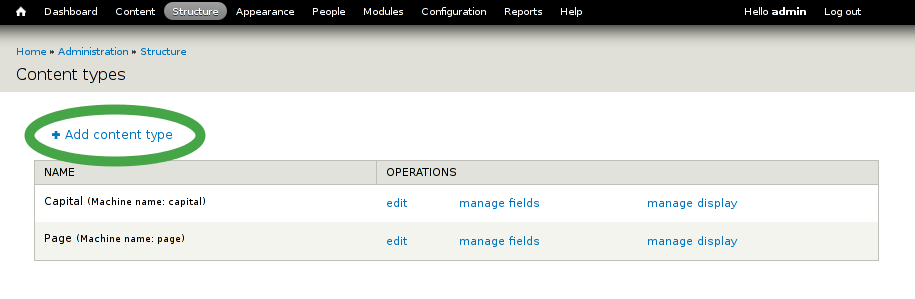

* Type a name for the new content type and describe it if you want
* Finish by clicking on **Save and add fields**


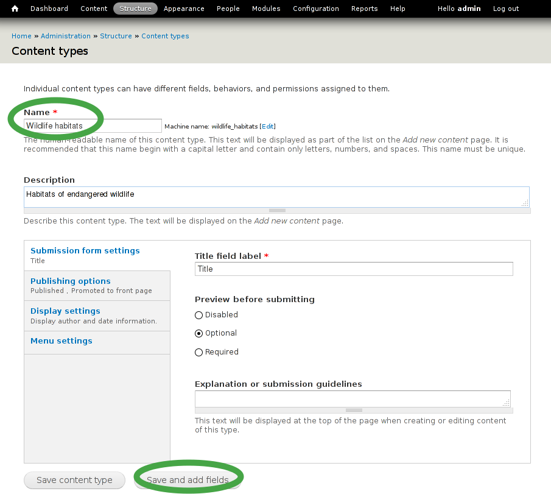

* Add new field by choosing a descriptive name, select  *Geospatial data*  as field type and  *OpenLayers Map*  as widget
* Finish by clicking on **Save**


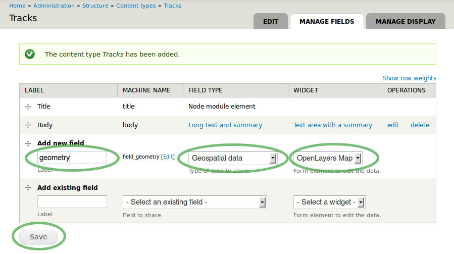

* Select the geometry type that describes the kind of geospatial information you want to store. Choose *Polygon* to follow our example.
* Finish by clicking on **Save field settings**

.. tip::  Other types of geometry are also available. Choose the type that fits best for your needs. Read the information below the *Geometry type* drop-box for additional help.


.. image:: ../../images/screenshots/1024x768/cartaro_field_settings.png
    :scale: 70 % 
    :align: center

* Press *Save settings* to finally finish the field creation

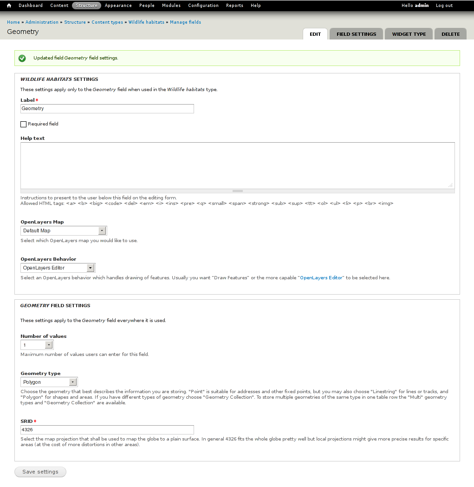

Configure GeoServer
================================================================================

:doc:`GeoServer <../overview/geoserver_overview>` is used to provide the geospatial fields of your new content type as layer via :doc:`Web Feature Service (WFS) <../standards/wfs_overview>` and :doc:`Web Map Service (WMS) <../standards/wms_overview>`.

* Choose :menuselection:`Structure --> GeoServer` from the menu bar to visit the GeoServer configuration page

.. image:: ../../images/screenshots/1024x768/cartaro_geoserver_entry.png
    :scale: 70 %
    :align: center

Styling
``````````````````````````````````
.. note:: This subsection is optional. Just go the next subsection if you want to speed up.  

To change the symbolization of your geospatial fields within a map layer you can define your own style. This is done with the :doc:`Styled Layer Descriptors (SLD) <../standards/sld_overview>` as XML files. 
There are several ways on how create them which is not covered here. The :doc:`GeoServer <../quickstart/geoserver_quickstart>` documentation describes one way on how the create them.  
For the sake convenience we created an example styling that can be used here.

* Choose :menuselection:`Styles` on the right side 

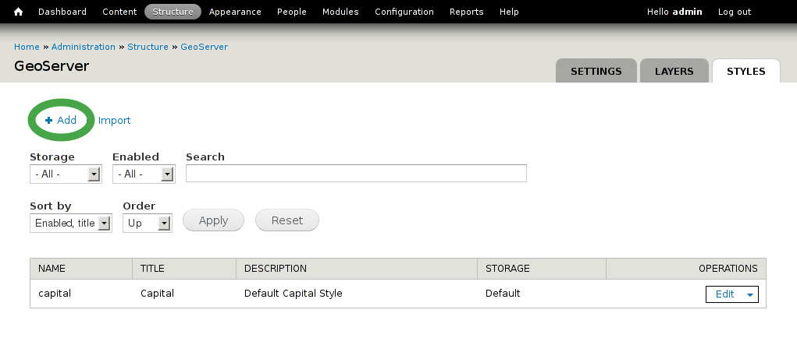

* Choose a name for your new style
* Copy the following example SLD into the *SLD* text box and click *Save*
* Mind to adjust the content of the *Name* and *Title* tags in the SLD to match *Style Title* and *Style Description* respectively

::

  <?xml version="1.0" encoding="ISO-8859-1"?><StyledLayerDescriptor version="1.0.0" xsi:schemaLocation="http://www.opengis.net/sld StyledLayerDescriptor.xsd" xmlns="http://www.opengis.net/sld" xmlns:ogc="http://www.opengis.net/ogc" xmlns:xlink="http://www.w3.org/1999/xlink" xmlns:xsi="http://www.w3.org/2001/XMLSchema-instance">
  <NamedLayer>
    <Name>wildlife</Name>
     <UserStyle>
        <Title>Wildlife</Title>
            <FeatureTypeStyle>
                <Rule>
                    <PolygonSymbolizer>
                        <Fill>
                            <CssParameter name="fill">#00aa00</CssParameter>
                            <CssParameter name="fill-opacity">0.5</CssParameter>
                        </Fill>
                    </PolygonSymbolizer>
                </Rule>
            </FeatureTypeStyle>
        </UserStyle>
    </NamedLayer>
  </StyledLayerDescriptor>

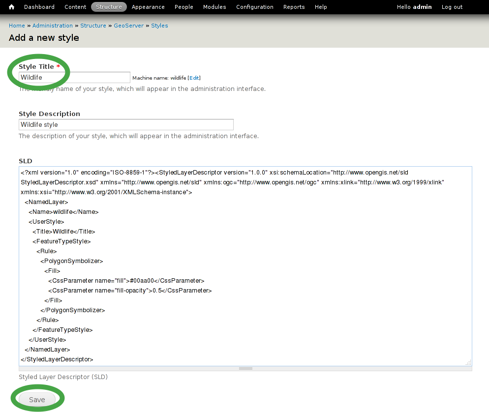

Layers
``````````````````````````````````
* Choose :menuselection:`Structure --> GeoServer` from the menu bar to visit the GeoServer configuration page
* Select :menuselection:`Layers` and click **Add** to add your new layer

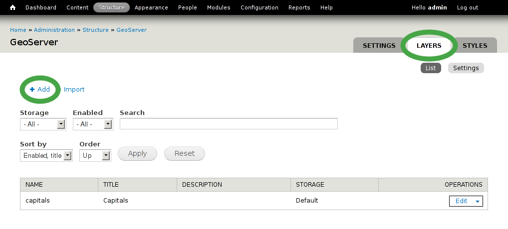

#. Type a suitable layer title
#. Select *PostGIS Field* as Layer type
#. If you have created your own style one step before, select it as *Style*
#. Select your fresh created content type as Source
#. Check  *Provide an OpenLayers WFS layer*  within the OpenLayers section
#. Finish configuration by clicking on **Save**


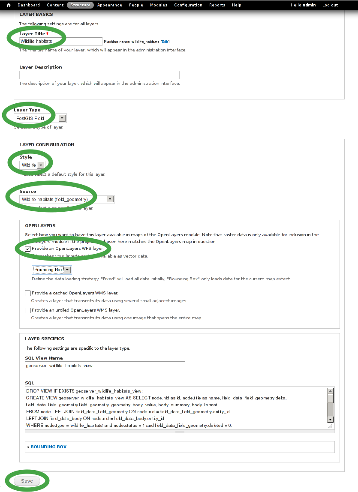

.. tip:: You can now also access the geospatial fields of your content type via WFS or WMS with other applications (e.g. with :doc:`QGis <../overview/qgis_overview>`)  


Configure OpenLayers
================================================================================

:doc:`OpenLayers <../overview/openlayers_overview>` is used to display your new layer.

* Choose :menuselection:`Structure --> OpenLayers` from the menu bar to visit the OpenLayers configuration page
* Choose :menuselection:`Maps` and look for *frontmap* which is used as default map

.. note:: An OpenLayers version warning appears only the first time you visit the OpenLayers configuration page and can be ignored.  

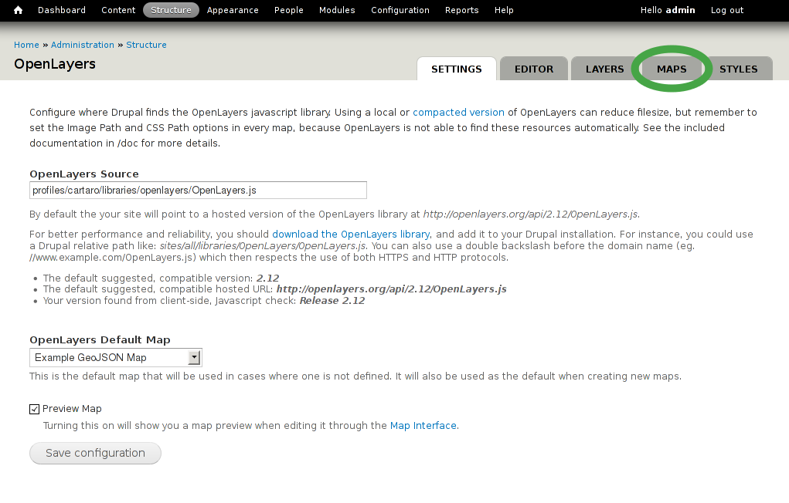


* Look for *frontmap* which is used as default map and select **Edit** on the right side

.. image:: ../../images/screenshots/1024x768/cartaro_openlayers_maps.png
    :scale: 70 %
    :align: center

* Frontmap's configuration page will be appear as shown on the screenshot below. 
* Select :menuselection:`Layers & Styles` on the left side to add our newly created layer to the map.

.. image:: ../../images/screenshots/1024x768/cartaro_edit_map.png
    :scale: 70 %
    :align: center

* Look for your new created layer (Wildlife habitats in our example)
* Check the boxes *Enabled*, *Activated* and *In Switcher* to show your new layer by default
* Finish configuration by clicking on **Save** at the bottom of the page

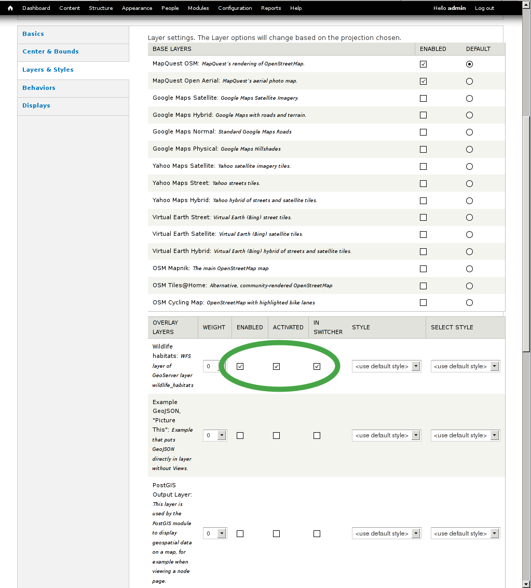

Add content
================================================================================

After creating your content type you can now add as many elements of this type as you want.

* Choose :menuselection:`Content` from the menu bar to see all exisiting content elements within your Cartaro installation
* Select **Add content** to add more content
* Choose your new content type 

.. image:: ../../images/screenshots/1024x768/cartaro_content_overview.png
    :scale: 70 %
    :align: center

#. Type a name for your new content element 
#. You can now draw the geometry for your element. Choose the draw symbol on the upper right corner of the map. Note that tool tips are shown when you hover the toolbar icons.
#. Simply click on the map to create a new geometry. Every click will produce a new edge. Finish the drawing with double click.
#. When you are ready, click on **Save** at the bottom.

.. note:: Only one geometry per content element can be drawn in our example configuration. Create additional content elements to add more polygons.  

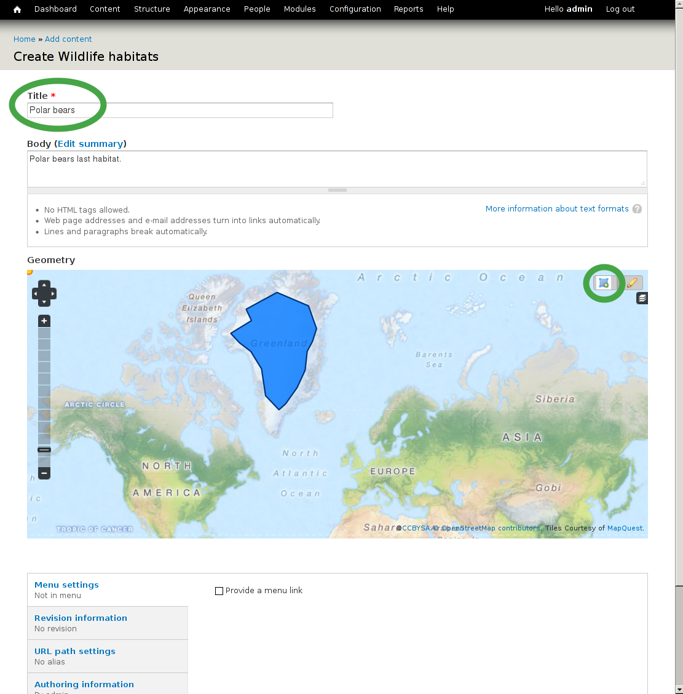

* You should now see your new content element
* To view your new content element on the front map, click on the house icon in the upper left corner

.. tip:: If you are not satisfied with your result, you can easily edit your new content element and change the geometry   

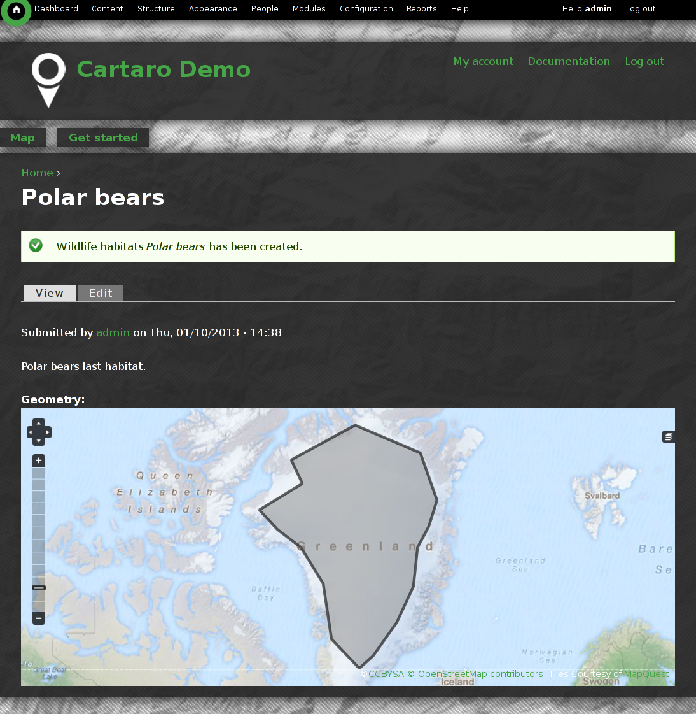

Congratulations, you have just finished the quickstart tutorial. Your first content element is now ready. To add more content elements simply peform the steps of this section again.

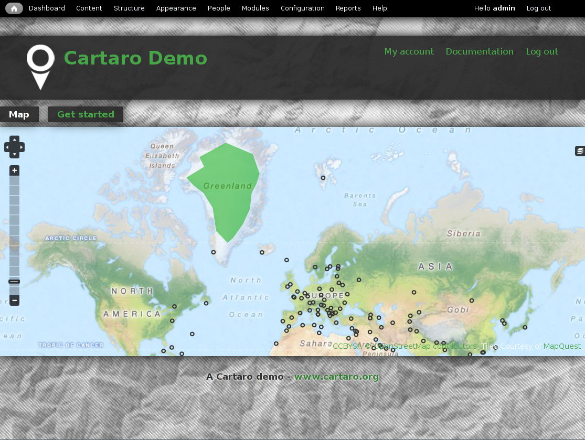


Things to Try
================================================================================

* Use the **Layer Assistant** to include external layers :menuselection:`Structure --> Open Layers --> Layers --> Add using assistant`  
* Change the default map behaviors and build your own map 
* Try different geometry types and build more complex content types 


What Next ?
================================================================================

.. Writing tip
  The final heading should provide pointers to further tutorials,
  documentation or further things to try.
  Present a list of ideas for people to try out. Start off very specific
  with something most people can do based on the materials as presented.
  Continue on with a challenge that involves a small bit of research (it
  is recommended that research be limited to something that can be
  found in documentation packaged on OSGeo-Live, as users might not be
  connected to the Internet.


.. Writing tip
  Provide links to further tutorials and other documentation.

The quickstart has given a first impression about the possibilities of Cartaro to you. But there is a lot more to discover. 


Your next step may be to install Cartaro on your own servers. Just visit http://cartaro.org/documentation/getting-started to learn how.

In context to this quickstart, our documentation about `Layer Assistant <http://cartaro.org/blog/21-layer-creation-assistant/>`_ or about `Styling <http://cartaro.org/blog/14-how-use-qgis-great-looking-symbols-cartaro/>`_


Our documentation web page can be found here http://cartaro.org/documentation


    Available on http://cartaro.org

                                                                      
