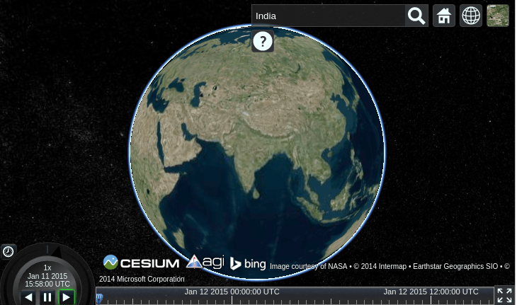
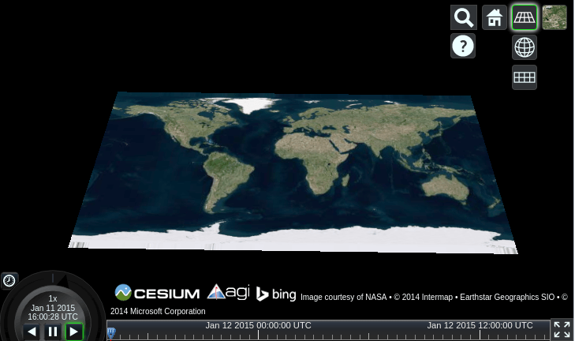
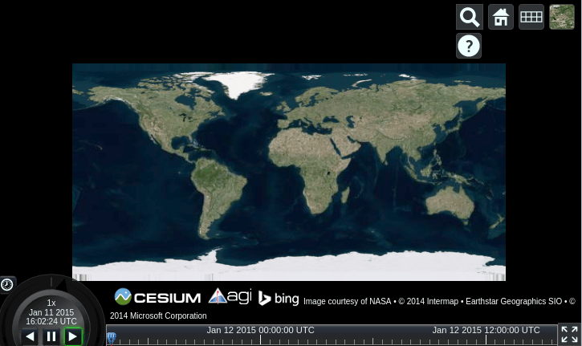

:Author: Balasubramaniam Natarajan
:Version: osgeo-live8.5
:License: Creative Commons Attribution-ShareAlike 3.0 Unported  (CC BY-SA 3.0)

.. image:: ../../images/screenshots/1024x768/cesiumjs_3in1.png
  :scale: 75 %
  :alt: project logo
  :align: right
  :target: http://cesiumjs.org/

********************************************************************************
Cesium Quickstart 
********************************************************************************
This document shows how to get around cesium webinterface and how easy is it to get application written for 3D (Globe), 2.5D (Columbus View) and 2D (map) .

Starting Cesium
===============
* **Step1:** Open a terminal and become root with “sudo su”.
* **Step2:** Run the cesium installation script by running “/trunk/bin/install_cesium.sh”
* **Step3:** Open the browser and point it to http://localhost/cesium/Apps/HelloWorld.html

Searching for locations
=======================
You can click on the magnifying glass and type in the location you are looking for.  In this case I have looked up for India.

Switching between 3D, 2.5D and 2D
=================================
You can click on the wire framed globe like icon and select on what you want.  I have currently clicked on 2.5D Columbus view.

Now I have selected a 2D map.

Selecting the Image layer
=========================
We can click on the last icon and select the type of image service we want.  In our case I have selected Natural Earth II, you can see how the maps image layer has changed.

.. image:: ../../images/screenshots/1024x768/cesium_4_Layer.png
  :scale: 100 %
  :alt: Cesium 2D map
  :align: right

Video Tutorial
==============
For more indepth video on using cesium I would recommend you to take a look at these set of videos `here <https://www.youtube.com/playlist?list=PLBk_Dtk-_Tlm4STvXKFEdfUWylPemo-9V>`_

Web based Tutorial
==================
You can get more static tutorial at this `website <http://cesiumjs.org/tutorials.html>`_

Developing quick applications
=============================
You can develop some quick applications using the Sandcastle website by following this `link <http://cesiumjs.org/Cesium/Apps/Sandcastle/index.html?src=Custom%20DataSource.html&label=Tutorials>`_

Documentation
=============
For in-depth documentation follow this link on `localhost <http://localhost/cesium/>`_ on your browser after installing cesium.

More Help
=========
For more help with respect to coding please post your queries to the mailing list cesium-dev@googlegroups.com where the community is always alive and ready to help you.

