:Author: OSGeo-Live
:Author: Stephan Meissl, Stephan Krause
:Reviewer: 
:Version: osgeo-live6.0
:License: Creative Commons Attribution-ShareAlike 3.0 Unported (CC BY-SA 3.0)

================================================================================
 EOxServer Quickstart
================================================================================

Overview
--------

EOxServer is a server for Earth Observation (EO) data. More precisely it is 
a Python application and framework for presenting EO data and metadata.

This Quick Start describes how to:

* Install EOxServer in OSGeo-Live
* Access and use the demonstration instance

See the :doc:`EOxServer Overview <../overview/eoxserver_overview>`, the 
`EOxServer 0.2.1 Documentation 
<../../eoxserver-docs/EOxServer_documentation.pdf>`_, or the `online 
documentation <http://eoxserver.org/doc/>`_ for more information.

.. contents:: Contents

Installation
------------

Run the following commands to install EOxServer::

    cd /usr/local/share/gisvm/bin/
    sudo ./install_eoxserver.sh

Note the password for the user `user` is `user`.

The script not only installs EOxServer but also creates and deploys a 
`demonstration instance <http://localhost/eoxserver/>`_, downloads the 
documentation, adds launchers to the desktop, etc.

Demonstration Instance
----------------------

The new icon on the desktop labelled `EOxServer` launches a browser showing 
the demonstration instance available at http://localhost/eoxserver/.

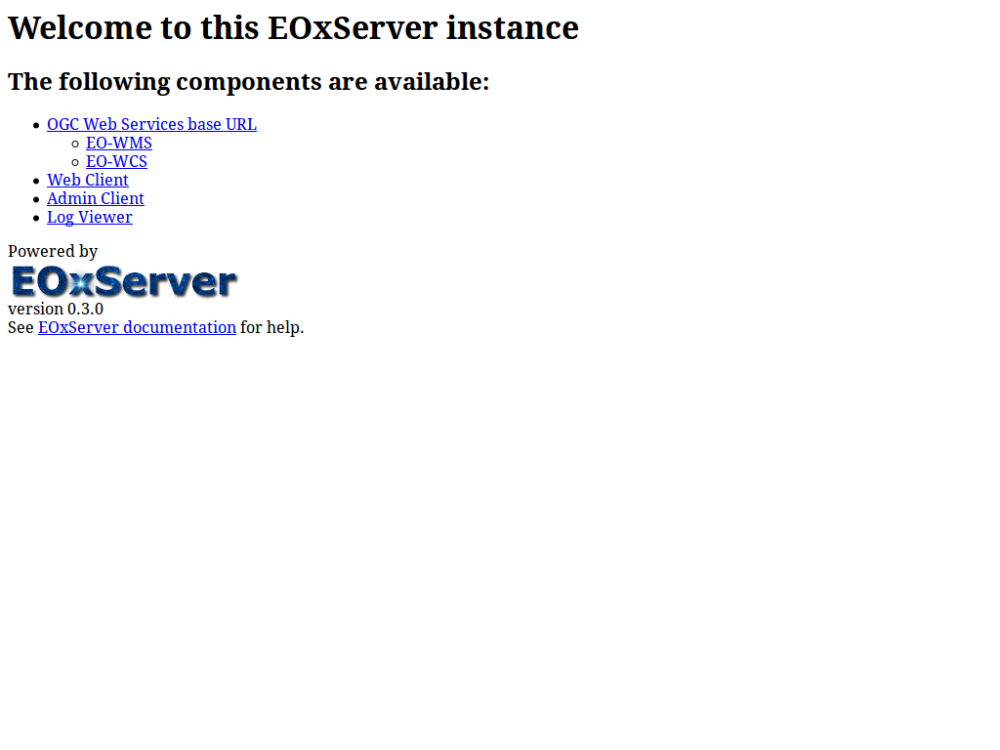

The other new icon on the desktop labelled `EOxServer Documentation` 
launches a pdf viewer showing the available documentation.

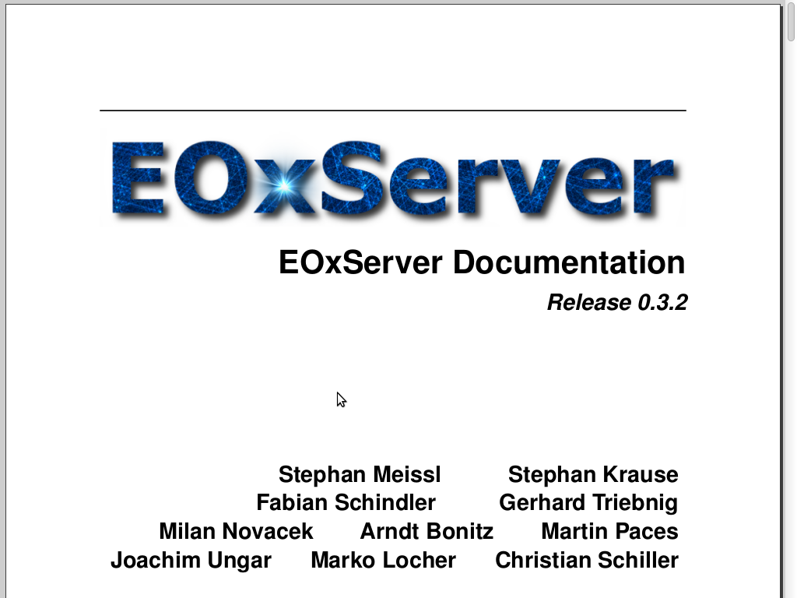

Web Client
~~~~~~~~~~

The **Web Client** link allows you to see a list of available `Dataset 
Series` and `Stitched Mosaics`. The demonstration has one `Dataset Series` 
configured named "MER FRS 1P RGB reduced" holding three ENVISAT MERIS 
scenes. Please refer to the `online demonstration documentation 
<http://eoxserver.org/doc/en/users/demonstration.html>`_ for more 
information on the available data.

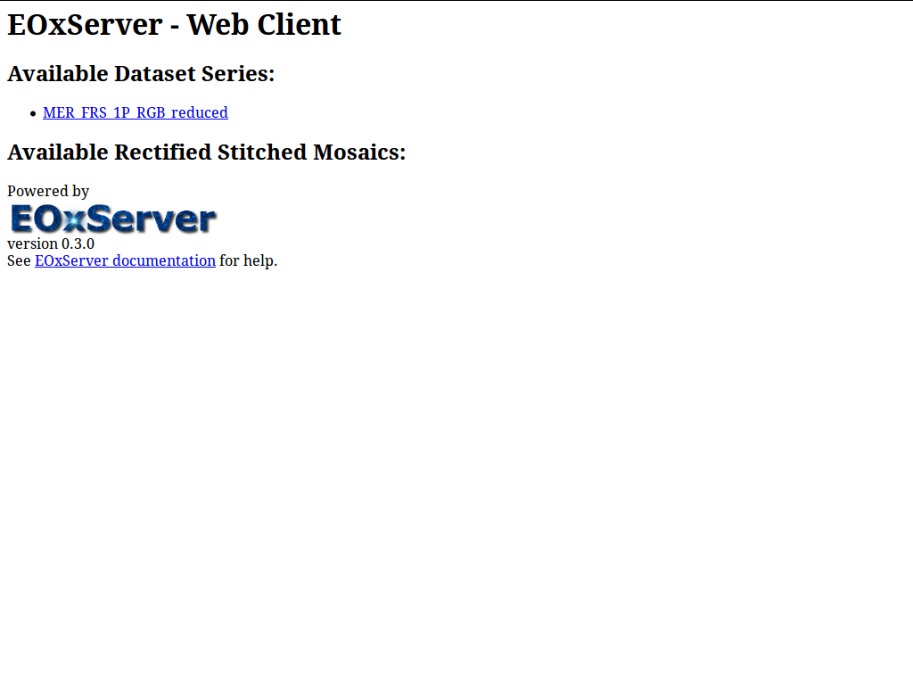

Selecting a list entry provides you with a map view showing the outlines of 
the available `Datasets`.

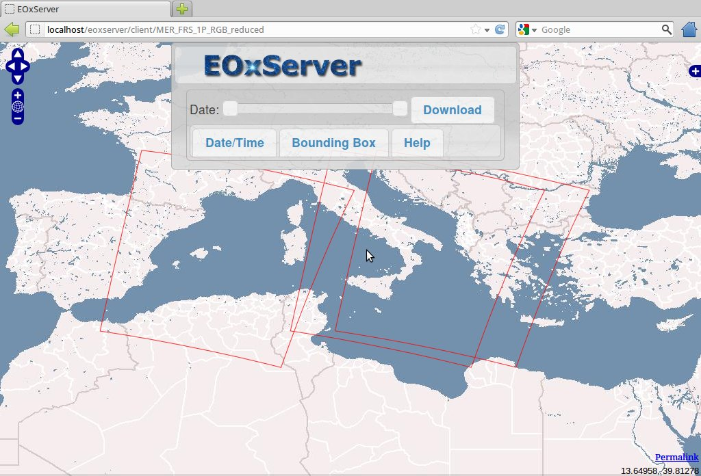

Using the standard OpenLayers controls you can enable also previews of the 
available data.

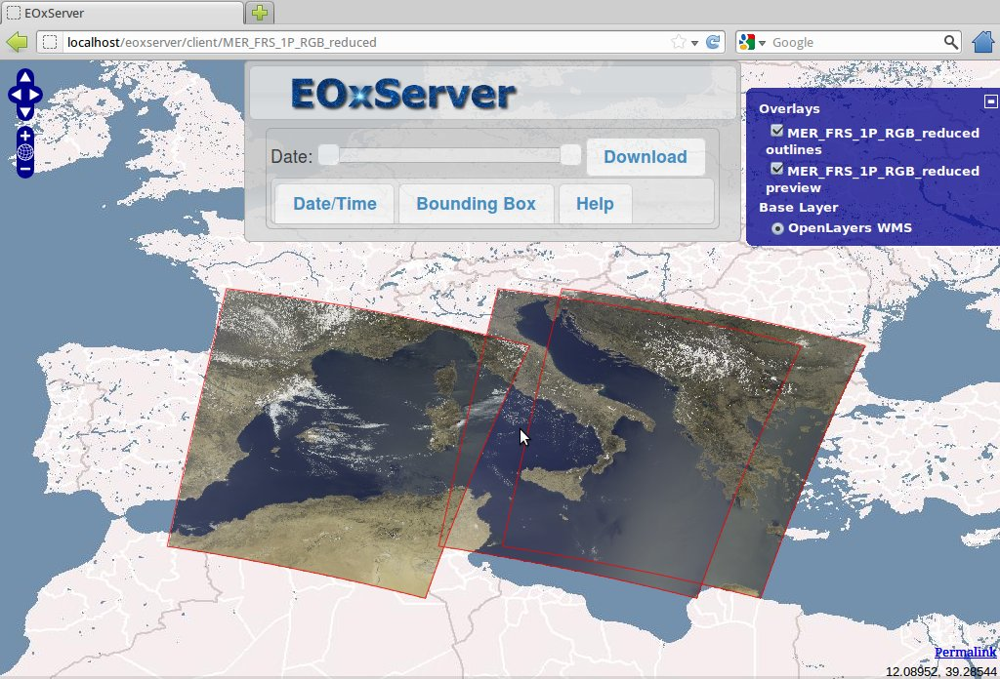

With the **Date slider** the `Datasets` shown can be limited to the time 
interval of interest.

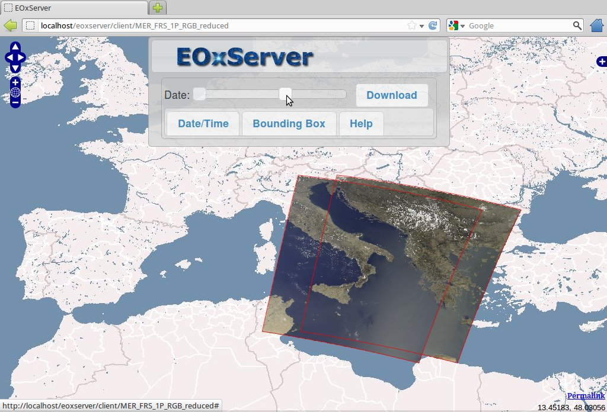

The **Download** button provides you a list of downloadable `Datasets`. 
Downloadable means within the set Bounding Box or currently viewn map extent 
if not set and the set time interval. You can select which `Datasets` to 
download in which size, projection, format, and band subset.

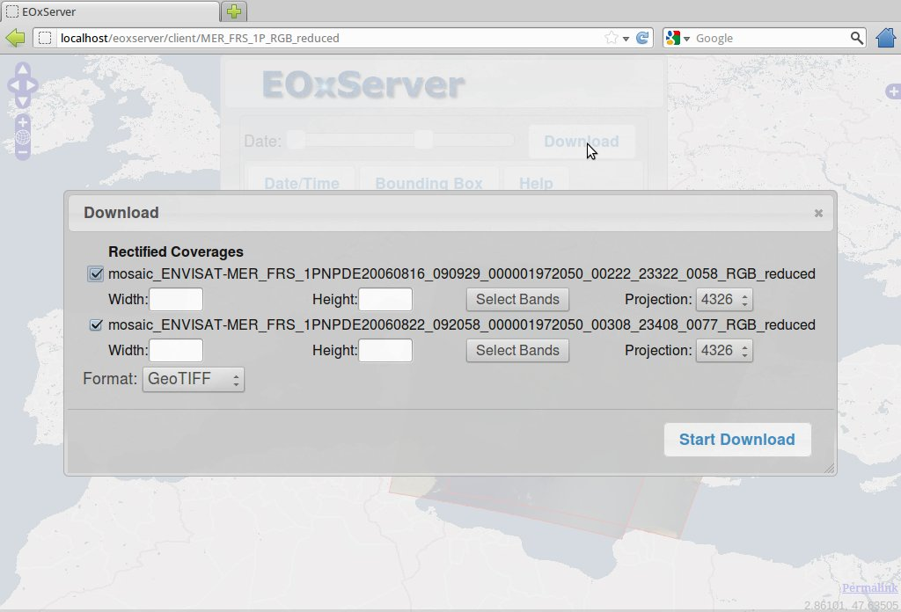

**Start Download** initiates the actual download which might result in 
multiple files if multiple `Datasets` have been selected.

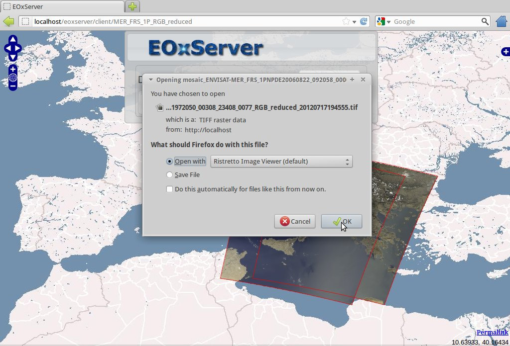

Admin Client
~~~~~~~~~~~~

The **Admin Client** link brings you to the login page for the `Admin 
Client`. The password for the user `admin` is `admin`.

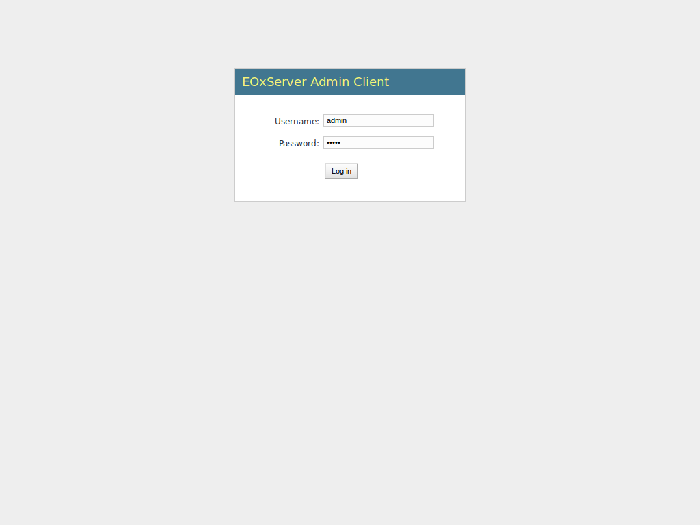

The `Admin Client` is Djangos standard admin and allows you to configure the 
available data. Please feel free to explore the client. More information can 
be found `online <http://eoxserver.org/doc/en/users/operators.html>`_.

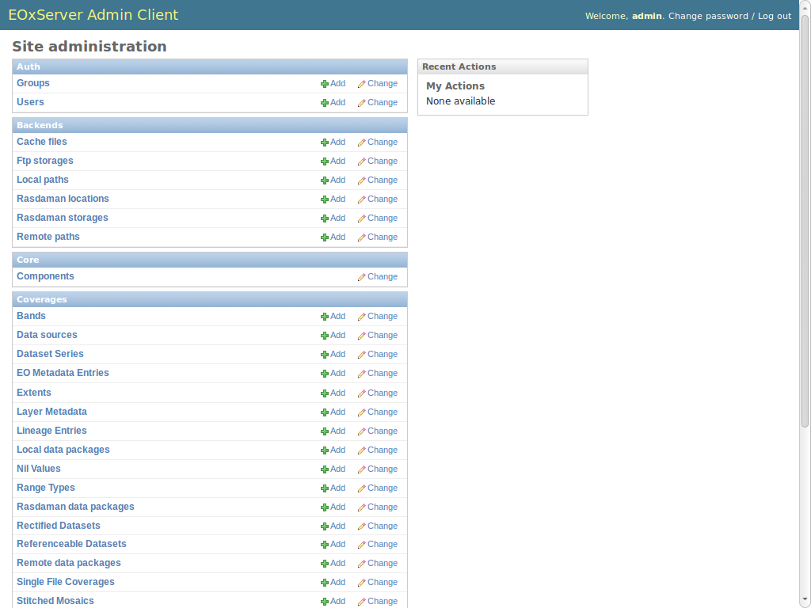

It is for example possible to view and alter the `EO Metadata` of the 
configured `Dataset Series`.

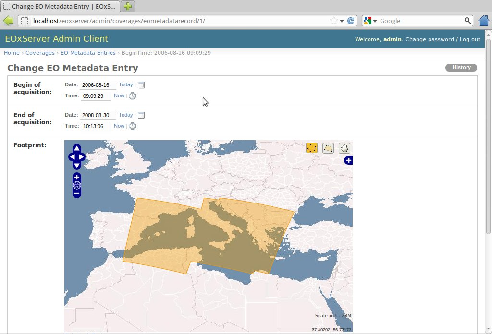

Log Viewer
~~~~~~~~~~

The **Log Viewer** link provides an easy way to view the latest log entries.

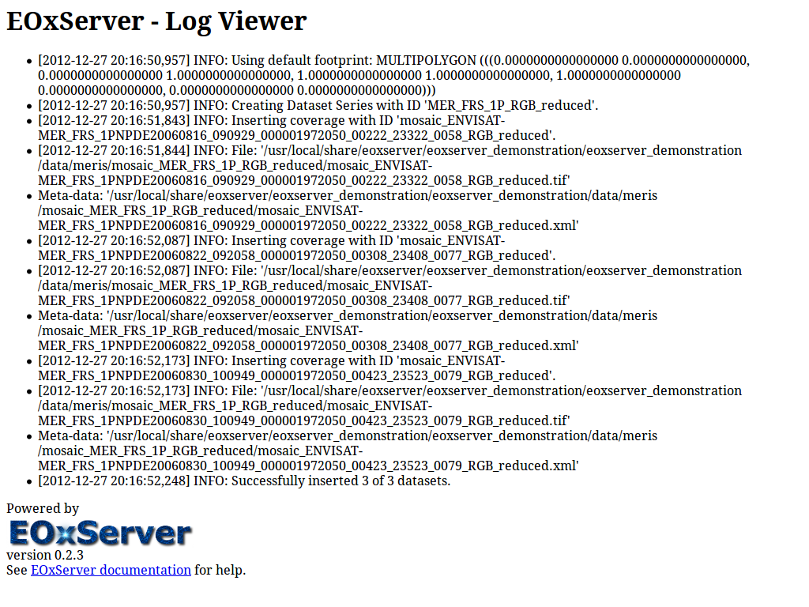

What Next?
----------

This is a simple demonstration, but you can do much more with EOxServer. The 
project website contains a lot of resources to help you get started. Here’s 
a few resources to check out next:

* Read the `EOxServer Operators' Guide 
  <http://eoxserver.org/doc/en/users/operators.html>`_.
* Read the complete `EOxServer Users' documentation 
  <http://eoxserver.org/doc/en/users/index.html>`_ starting from the `EOxServer 
  Basics <http://eoxserver.org/doc/en/users/basics.html>`_.
* Ready to use EOxServer? Then join the community on the `mailing lists 
  <http://eoxserver.org/doc/en/users/mailing_lists.html>`_ to exchange ideas, 
  discuss potential software improvements, and ask questions.
