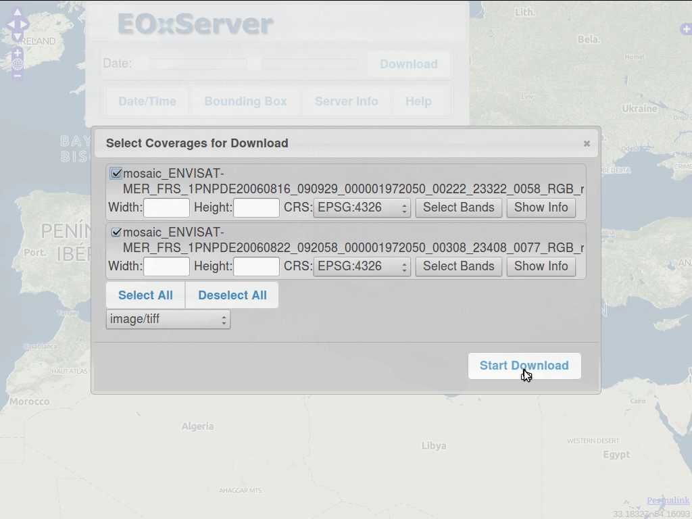

:Author: OSGeo-Live 
:Author: Stephan Meissl, Stephan Krause
:Reviewer: Angelos Tzotsos
:Version: osgeo-live7.0
:License: Creative Commons Attribution-ShareAlike 3.0 Unported (CC BY-SA 3.0)

.. image:: ../../images/project_logos/logo-eoxserver-2.png
  :scale: 65 %
  :alt: project logo
  :align: right
  :target: http://eoxserver.org/

================================================================================
 EOxServer Quickstart
================================================================================

Overview
--------

EOxServer is a server for presenting big Earth Observation (EO) data 
archives and metadata via Open Standards. It builds upon an Open Source 
stack of software which includes Python, :doc:`MapServer 
<../overview/mapserver_overview>`, Django/GeoDjango, :doc:`GDAL 
<../overview/gdal_overview>`, PROJ.4 and a :doc:`SpatiaLite 
<../overview/spatialite_overview>` or :doc:`PostGIS 
<../overview/postgis_overview>` database.

This Quick Start describes how to:

* View, filter, subset, and download EO data via EOxServer's Web Client
* Register EO data archives via EOxServer's Admin Client

.. contents:: Contents

See the :doc:`EOxServer Overview <../overview/eoxserver_overview>`, the 
`local EOxServer documentation 
<../../eoxserver-docs/EOxServer_documentation.pdf>`_, or the `online 
EOxServer documentation <http://eoxserver.org/doc/>`_ for more information.

Demonstration Instance
----------------------

.. Commented since Tomcat isn't started automatically anymore (#1032).
    In case you use OSGeoLive with 1GB RAM or less it is recommended to stop default Tomcat service before launching EOxServer
    :: 

      sudo service tomcat6 stop

The icon labeled `EOxServer` filed under `Web Services` launches a browser 
showing the demonstration instance available at http://localhost/eoxserver/ 
which provides the same data as the `one available online 
<https://eoxserver.org/demo_stable/>`_.

.. image:: ../../images/screenshots/1024x768/eoxserver_start.png
  :scale: 50 %
  :alt: EOxServer demonstration start

Web Client
~~~~~~~~~~

The **Web Client** link allows you to see a list of available `Dataset 
Series` and `Stitched Mosaics`. The demonstration has one `Dataset Series` 
configured named "MER FRS 1P RGB reduced" holding three ENVISAT MERIS 
scenes. Please refer to the `online demonstration documentation 
<http://eoxserver.org/doc/en/users/demonstration.html>`_ for more 
information on the available data.

.. image:: ../../images/screenshots/1024x768/eoxserver_webclient1.png
  :scale: 50 %
  :alt: EOxServer demonstration embedded client dataset series selection

Selecting a list entry provides you with a map view showing the outlines of 
the available `Datasets`.

.. image:: ../../images/screenshots/1024x768/eoxserver_webclient2.png
  :scale: 50 %
  :alt: EOxServer demonstration embedded client outlines

Using the standard OpenLayers controls you can enable also previews of the 
available data.

.. image:: ../../images/screenshots/1024x768/eoxserver_screenshot.png
  :scale: 50 %
  :alt: EOxServer demonstration embedded client outlines and previews

With the **Date slider** the `Datasets` shown can be limited to the time 
interval of interest.

.. image:: ../../images/screenshots/1024x768/eoxserver_webclient3.png
  :scale: 50 %
  :alt: EOxServer demonstration embedded client date change

The **Download** button provides you a list of downloadable `Datasets`. 
Downloadable means within the set Bounding Box or currently viewn map extent 
if not set and the set time interval. You can select which `Datasets` to 
download in which size, projection, format, and band subset.

**Start Download** initiates the actual download which might result in 
multiple files if multiple `Datasets` have been selected.

.. image:: ../../images/screenshots/1024x768/eoxserver_webclient5.png
  :scale: 50 %
  :alt: EOxServer demonstration embedded client download

Admin Client
~~~~~~~~~~~~

The **Admin Client** link brings you to the login page for the `Admin 
Client`. The password for the user `admin` is `admin`.

.. image:: ../../images/screenshots/1024x768/eoxserver_adminclient1.png
  :scale: 50 %
  :alt: EOxServer demonstration admin client login

The `Admin Client` is Djangos standard admin and allows you to configure the 
available data. Please feel free to explore the client. More information can 
be found in the `operators' guide 
<http://eoxserver.org/doc/en/users/operators.html>`_.

.. image:: ../../images/screenshots/1024x768/eoxserver_adminclient2.png
  :scale: 50 %
  :alt: EOxServer demonstration admin client start

It is for example possible to view and alter the `EO Metadata Entries` of the 
configured `Dataset Series`.

.. image:: ../../images/screenshots/1024x768/eoxserver_adminclient3.png
  :scale: 50 %
  :alt: EOxServer demonstration admin client EO Metadata

Log Viewer
~~~~~~~~~~

The **Log Viewer** link provides an easy way to view the latest log entries.

.. image:: ../../images/screenshots/1024x768/eoxserver_logviewer.png
  :scale: 50 %
  :alt: EOxServer demonstration log viewer

What Next?
----------

This is a simple demonstration, but you can do much more with EOxServer. The 
project website contains a lot of resources to help you get started. Here’s 
a few resources to check out next:

* Read the `EOxServer Operators' Guide 
  <http://eoxserver.org/doc/en/users/operators.html>`_.
* Read the complete `EOxServer Users' documentation 
  <http://eoxserver.org/doc/en/users/index.html>`_ starting from the `EOxServer 
  Basics <http://eoxserver.org/doc/en/users/basics.html>`_.
* Ready to use EOxServer? Then join the community on the `mailing lists 
  <http://eoxserver.org/doc/en/users/mailing_lists.html>`_ to exchange ideas, 
  discuss potential software improvements, and ask questions.
