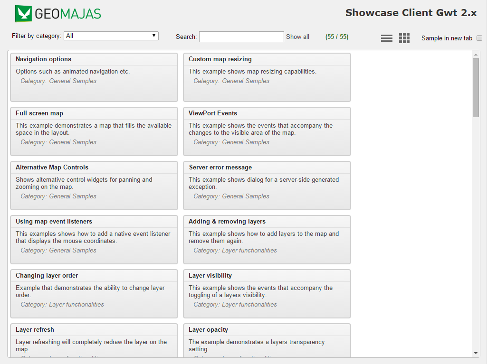

:Author: Pieter De Graef
:Version: osgeo-live4.0
:License: Creative Commons Attribution-ShareAlike 3.0 Unported  (CC BY-SA 3.0)

********************************************************************************
Geomajas Quickstart 
********************************************************************************

Getting Started
================================================================================

Geomajas is a development framework for creating GIS web applications. Therefore, what you see on this Live DVD is an example application built using the Geomajas technology.

* Go to the "Browser Clients" folder on the desktop.

* Click on the desktop icon "Start Geomajas". This will launch the FireFox browser which will navigate to the correct location automatically.

* On the left side you will see a list of short examples of what functionalities Geomajas supports out-of-the-box. Clicking on these will open the associated examples.

* For each example, you will find a short description/explanation on the right side. It is recommended to read these as they will clarify each example.

Creating new Geomajas applications
================================================================================

In order to create a new Geomajas application, you will need `Maven <http://maven.apache.org/>`_ installed::

    $ sudo apt-get install maven2

Maven is a tool for building and managing any Java based project. Geomajas has defined a Maven archetype, that sets up a default application in a single command::

    $ mvn archetype:generate -DarchetypeCatalog=http://files.geomajas.org/archetype-catalog.xml

Congratulations, you have now successfully created a new Geomajas application. You now have the choice to run it immediately, or open it in a development environment to start working on it.
To run the application immediately, go into the application folder (where the pom.xml is), and execute the following Maven command::

    $ mvn jetty:run

This will compile the application, and run it in a jetty container. You can than reach the application at the following url: http://localhost:8080/

See the `Geomajas getting started <http://files.geomajas.org/maven/trunk/geomajas/docbook-gettingstarted/html/master.html#prereq>`_ documentation guide for more details on creating Geomajas applications, or setting up a development environment.

For general information see the `Geomajas homepage <http://www.geomajas.org/>`_.

