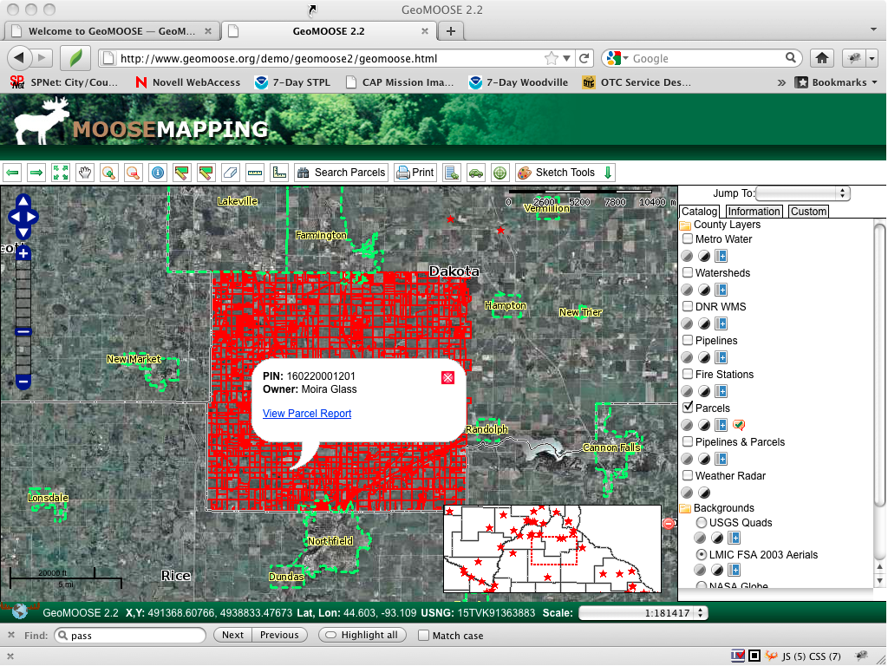

:Author: Bob Basques
:Version: GeoMoose 2.4
:License: MIT

.. _geomoose-quickstart:
 
.. image:: ../../images/project_logos/logo-geomoose.png
  :width: 50px
  :height: 50px
  :alt: project logo
  :align: right
  :target: http://www.geomoose.org

*******************
GeoMoose Quickstart
*******************

Getting Started
===============

GeoMoose is a GIS data portal management framework. The installed version of GeoMoose on the Live DVD is an example configurationa that displays an exmaaple set of layers.

* Go to the "Browser Clients" folder on the desktop.

* Click on the desktop icon "Start GeoMoose". This will launch the Default browser which will navigate to the correct location automatically.

* You will be presented with a web page displaying a demo interface of a GeoMoose instance.

  .. image:: ../../images/screenshots/1024x768/geomoose-2.4-screenshot002.png
     :scale: 100

The Interfacas presented above shows:

  1. A banner bar
  #. A tool bar
  #. A map window with

    - A navigation an zoom control
    - An Inset map

  4. A side menu with:

    - A "Jump to" location pulldown list
    - A set of control tabs for
  
  5. A Footer bar with:

    - Multiple coordinate readouts, one each for X,Y (local dataset coordinates), LAT/LON (Decimal) and United States National Grid (USNG)
    - A editable pulldown list for a view scales to choose from or define.

IDing a location in GeoMoose
============================

You can ID a location in the interface by clicking on the "identify", ("i" in a blue circle icon) button in the top toolbar, and then clicking a point on the map to identify.

  .. image:: ../../images/screenshots/1024x768/geomoose-2.4-screenshot003.png
     :scale: 100

The menu along the right side of the Map view will display a report related to the point that you clicked in the map.   This is a service in the Geomoose package that has been configured to respond to GeoMoose for the "Parcel" layer when a point is clicked.

Measuring in GeoMoose
=====================

GeoMoose has some measuring tools installed and activated by default. Clicking the ruler icon in the top toolbar, will start the linear measuring tool.  You can click as many points as you like in the map window and a trailing polyline will be drawn.  When you get to your last point, just double click to stop.  The total distance of all lines drawn will be used to generate the "Total Length" in the your units of choice in the side menu.

  .. image:: ../../images/screenshots/1024x768/geomoose-2.4-screenshot006.png
     :scale: 100

These are considered services by the GeoMoose interface and can be added to via GeoMoose's MAPBOOK control file.

Creating new GeoMoose Interfaces
================================

In order to create a new GeoMoose application, you need to create a new MapBook to describe the layout of the application.

  .. image:: ../../images/screenshots/1024x768/geomoose-2.4-screenshot007.png
     :scale: 100

  .. image:: ../../images/screenshots/1024x768/geomoose-2.4-screenshot008.png
     :scale: 100

  .. image:: ../../images/screenshots/1024x768/geomoose-2.4-screenshot009.png
     :scale: 100

  .. image:: ../../images/screenshots/1024x768/geomoose-2.4-screenshot010.png
     :scale: 100

  .. image:: ../../images/screenshots/1024x768/geomoose-2.4-screenshot011.png
     :scale: 100

  .. image:: ../../images/screenshots/1024x768/geomoose-2.4-screenshot012.png
     :scale: 100

  .. image:: ../../images/screenshots/1024x768/geomoose-2.4-screenshot013.png
     :scale: 100

  .. image:: ../../images/screenshots/1024x768/geomoose-2.4-screenshot014.png
     :scale: 100

Additional information
======================
Can be found at the `GeoMoose <http://www.GeoMoose.org/>`_ homepage.

