:Author: GeoNetwork Community
:Version: osgeo-live5.0final
:License: Creative Commons Attribution-ShareAlike 3.0 Unported  (CC BY-SA 3.0)
:Thanks: GeoNetwork Community 

.. |GN| replace:: GeoNetwork

.. _geonetwork-quickstart:
 
.. figure:: ../../images/project_logos/logo-GeoNetwork.png
  :alt: project logo
  :align: right

*********************
GeoNetwork Quickstart 
*********************

|GN| opensource is a standards based, distributed spatial information
management system. It is designed to enable access to spatial data from a variety of data providers through descriptive metadata.

Apart from how to start |GN|, this Quick Start describes:

- some of the different ways you can search for spatial data
- how to download and display data from the search results
- the system of privileges, roles and user groups that |GN| uses.

Detailed documentation can be found in http://localhost:8880/geonetwork/docs/eng/users/index.html or by clicking on the 'Help' link on the |GN| home page.

Start |GN|
----------

- Select the "Start GeoNetwork" icon.
- The application will take a few moments to start up
- Go to the |GN| home page at http://localhost:8880/geonetwork. Your first view of |GN| should look like the screenshot below.

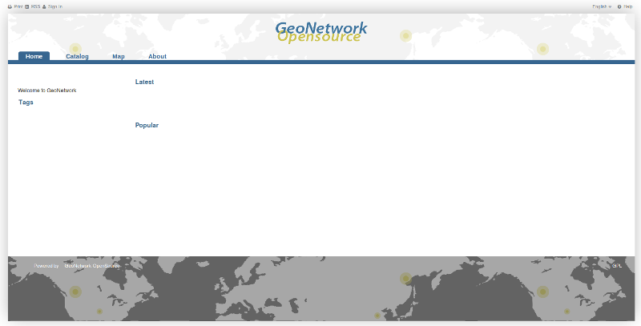

- To get to know |GN| we are going to load the sample metadata. Log in to |GN| using the username *admin* and password *admin* in the dedicated fields on the top right corner, then click the login button.

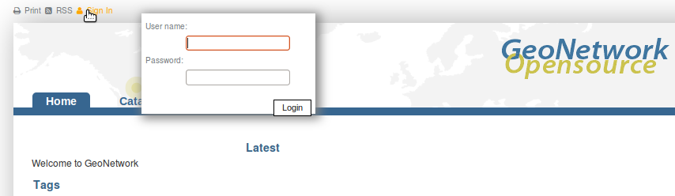

- You should now see an *Administration* link in the banner. Click on it.

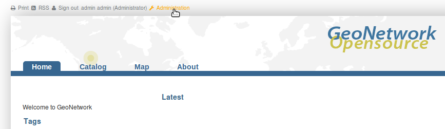

- When the *Administration* page appears, scroll to the bottom of the page and load the sample data by clicking on the 'Add sample metadata' button.

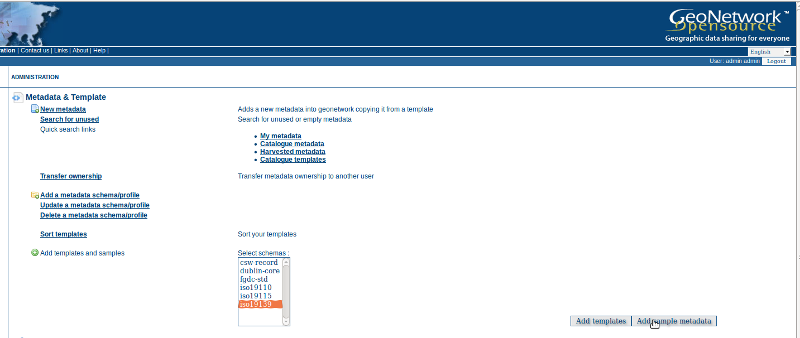

- Return to the 'Home' page after the sample metadata has been loaded to continue the rest of the quick start guide. When you return to the homepage your screen should look something like the one shown below.

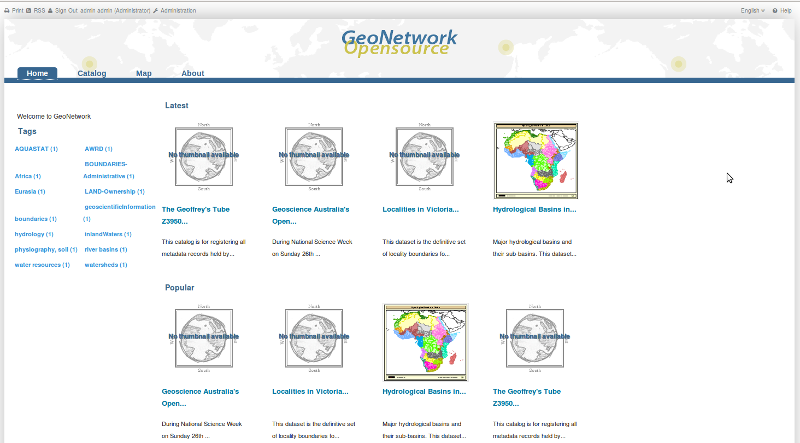

Searching
---------

There are many different ways to search the catalogue for maps and other geographic data. This guide will introduce you to the most popular search methods: default, advanced and by category. Whichever search you choose, remember that you will see results based on your privileges and assigned work group (more on this later).

.. note:: 
	The term *data* refers to datasets, maps, tables, documents, etc, in fact anything that can be linked to the metadata record that describes it.

Default Search
--------------

The default search allows you to search text within the entire record, such as
keywords of the metadata and/or geographic location.

**Free text search.** *Type* a search term in the *What?* field. You can type anything here
(free text). You can use quotes around text to find exact combinations of words.

Text and operators (and, or, not) are not case sensitive. 

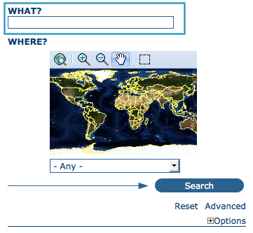

  *The free text field.*
	
**Geographic search.** For the geographic search, two options are available for selecting a particular
region to limit the search:

You can select a **region** from a predefined list;

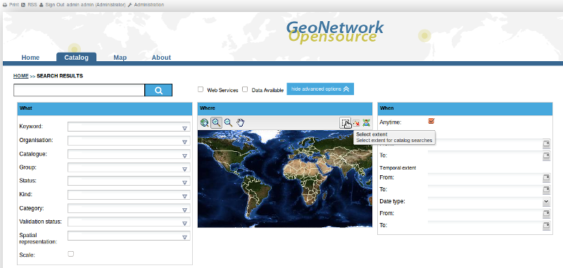
  
  *The region field*

You can select your own *area of interest* in a more interactive way. A small global map is shown on the screen from which you can drag and drop the frame of your location area. Just click on the button on the upper right of the map screen.

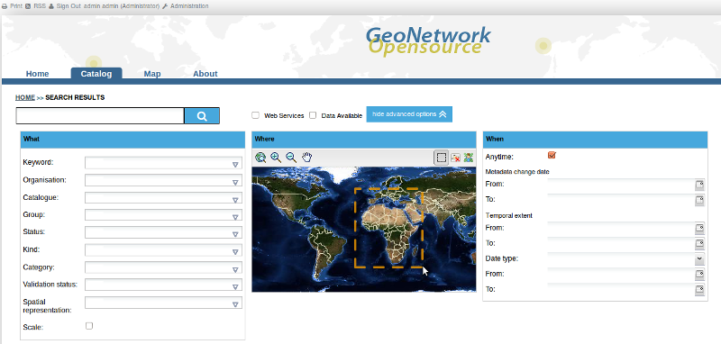
  
  *Interactive Area Of Interest map*

**Perform search.** Both types of search, free text search and geographic search can be combined to
restrict the query further.

Click the *Search* button to proceed and show the results.

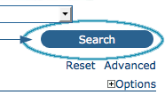

  *The Search button*

Searching by Categories
-----------------------

An additional way to search data within the |GN| database, from the home page, is searching by **Category**. A list of categories is provided to the user to identify data at a more generic level: **Applications**, **Audio/Video**, **Case study and best practises**, **Conference proceedings**, **Datasets**, **Directories**, **Interactive resources**, **Maps and graphics**, **Other information resources**, **Photo**.

To search only for maps, click on **Maps and Graphics**. A list of maps will be displayed from which you
may view details of every single map; just clicking on the **Metadata** button of the map you wish to review.

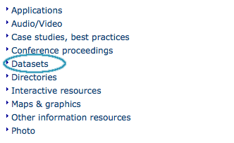

  *Search by Category*
  
Advanced Search
---------------

The advanced search option works similarly to the default search. However, you can be more specific in your search criteria as it offers different elements to look for data, each of them focusing one of the following aspects: *What?, Where?, When?*

.. figure:: ../../images/screenshots/800x600/geonetwork-advanced_search1.png

  *Advanced search options*

To perform an **advanced search**, from the home page **click Advanced** just below the search bottom.

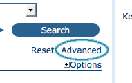

  *Show advanced search options*

In the **WHAT?** section the elements are all related to the data content. Through them, in addition to searching only free keywords in the entire metadata content, you can also search directly in the title or abstract fields and add more keywords to customise your search further. You can also specify the level of accuracy you wish to reach in performing your search.

- To search by **Title, Abstract, Free Text, or Keyword(s)** type any text into the respective field. You can enter information in one or multiple field(s). If you do not want to search by a given field, simply leave it blank;

- You can choose the **accuracy of your search**, in terms of spelling words, from **Precise** = 1 to **Imprecise** = 0.2, through 3 more consecutive steps which are equal to 0.8, 0.6, 0.4.

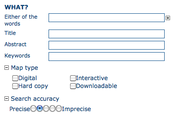

  *"What" section in the Advanced search*

The **WHERE?** parameters, which are related to the spatial extent, allow you, as in the default search, either to select your own area of interest or to select a predefined region from the drop-down list. In this section you can also type the geographic coordinates of a specific location that is not available from the above list.

- To select **your own area of interest**, drag and drop the frame of your area on the global map using the appropriate tool on the bottom left of the map screen;

- To use **free coordinates**, type the lat-long geographic references in the appropriate fields around the map screen, without any limitation of decimal figures;

- To use the coordinates of a **predefined region**, select the region from the drop-down list.

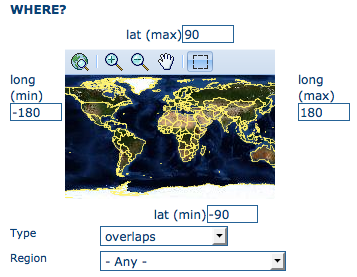

  *"Where" section in the Advanced search*

Whatever type of geographic search you decide to perform, in the **Spatial search type** field, you can choose from different options: **is**, **overlaps**, **encloses**, **is fully outside of**. If you use this field, be cautious as this limits your output data as follows:

- If you choose **Spatial search type** *is* “Country”, only maps for the selected country will be displayed. In other words, a city map within that country will not show in the output results.

- If you choose **Spatial search type** *overlaps* “Country”, all maps with the bounding box overlapping that country will be displayed in the results, i.e. the neighbouring countries, the continent of which that country is part of and the global maps.

- If you choose **Spatial search type** *encloses* “Country” you will get, in the output results, maps of that country first and then all maps within its bounding box.

- Similarly, if you choose **Spatial search type** *is fully outside of* a selected region, only maps that follow that exact criteria will show in the output results.

The **WHEN?** section gives you the possibility to restrict your search in terms of temporal extent, indicating a specific range of time referred to the data creation or publication date.

- To specify a range of time, click on the date selector button next to **From – To** fields. Make use of the symbols **>** and **>>** on top of the calendar to select the month and the year first and then click on the exact day; a complete date will be filled in using the following standard order: YY-MM-DD.

- To clean the time fields, simply click on the white cross on their right; the box **Any** will be automatically selected and the search will be performed without any restriction on the time period.

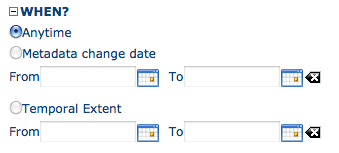

  *"When" section in the Advanced search*

Finally, the advanced search allows you to apply further restrictions on the basis
of additional parameters as data source, data categories and data format.

- To limit your queries to only one **Catalogue** out of those made available by the installation through the harvesting process, highlight the catalogue of preference or just keep **Any** selected to search all sites.

- To search for data organised by **Category**, such as Applications, Datasets, etc., simply highlight the category you wish to search in from the related drop-down list, otherwise we suggest to leave this field in **Any** Category.

- You can search for **Digital** or **Hard Copy** maps. To search in one or the other, simply check the box next to the one you wish to search. If no box is checked, all content will be searched.

At last, you can customise the number of output results per page in the *Hits Per Page* field. Simply highlight the number of records to be displayed or leave the field set on the default number (10).

- Click the **Search** button.

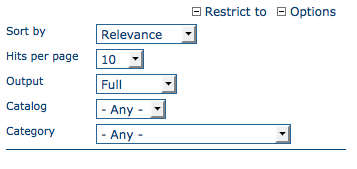

  *Other options in the Advanced search*

Search Results
--------------

The output of a search provides you a list of the metadata records that should fit
your request. For each record, the result page shows the title, an abstract and the
keywords. According to the privileges that have been set for each metadata, a
maximum of four sections can be consulted, as shown below.

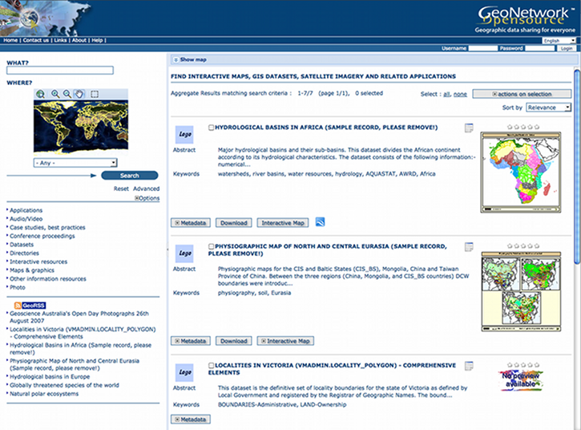

    *Search results*

#. **Metadata**: The metadata section describes the dataset (e.g.: citation, data owner, temporal/spatial/methodological information) and could contain links to other web sites that could provide further information about the dataset.

#. **Download**: Depending on the privileges that have been set for each record, when this button is present, the dataset is available and downloadable. The process for retrieving data is simple and quick by  just clicking the download button or by using the proper link in the specific metadata section for distribution info in the full metadata view.

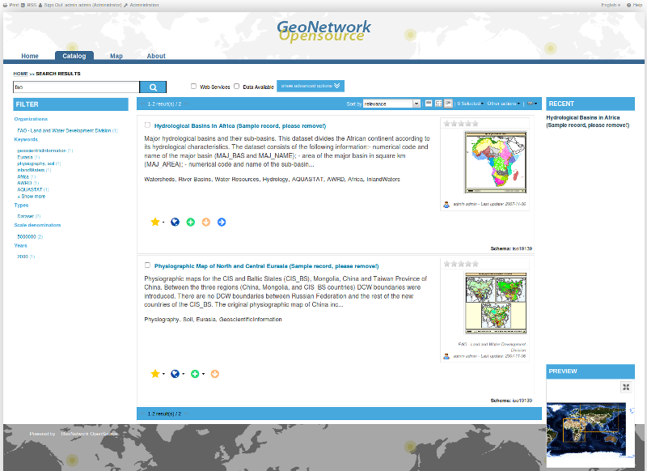
    
        *A single search result*
    
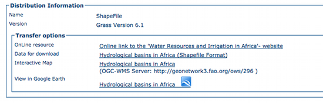
    
        *Available services related to the resource*

#. **Interactive Map**: The map service is also optional. When this button is shown, an interactive map for this layer is available and, by default, it will be displayed on the map screen of the simple search. To better visualise the map through the map viewer, **click** on **Show Map** on the top of search results panel.

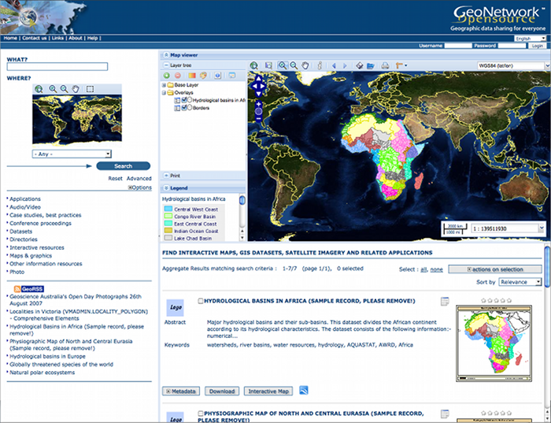
    
        *The interactive map viewer*

#. **Graphic Overviews**: There are small and large overviews of the map used to properly evaluate usefulness of the data, especially if the interactive map is not available. Simply click on the small figure to enlarge it.

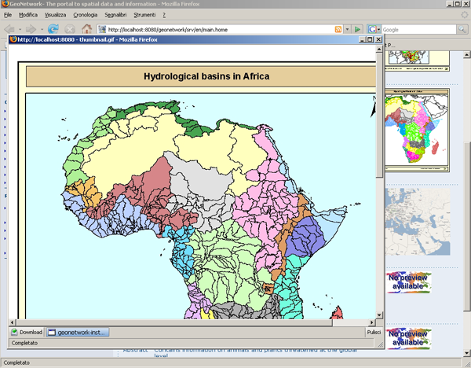
    
        *Large figure (graphic overview)*

Privileges, roles and user groups
---------------------------------

|GN| uses a system of *Privileges*, *Roles* and *User groups*.

There are no restrictions for users to search and access **public information** in a |GN| opensource based catalogue. To get access to **restricted information** or advanced functionality, an account to log in is required. This should be provided by the |GN| administrator.

To log in, simply go to the home page and enter your username and password in the dedicated fields on the top right corner, then click the login button.

    *Login*

**Privileges.** Depending on the privileges set on a metadata record and on your role as an authenticated user, you will be able to read about a resource and download or interactively browse data related to that resource.

**Roles.** Users with an *Editor* role can create, import and edit metadata records. They can also upload data and configure links to interactive map services.

**User groups.** Every authenticated user is assigned to a particular work group and is able to view data within that work group.

More information
----------------

Click on the 'Help' link in the banner of the GeoNetwork home page or go there directly by clicking on this link: http://localhost:8880/geonetwork/docs/eng/users/index.html

