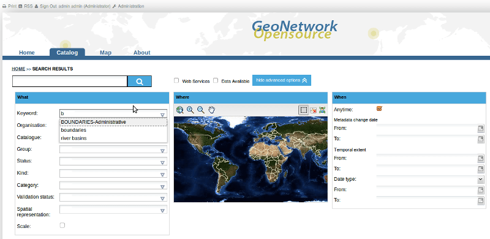
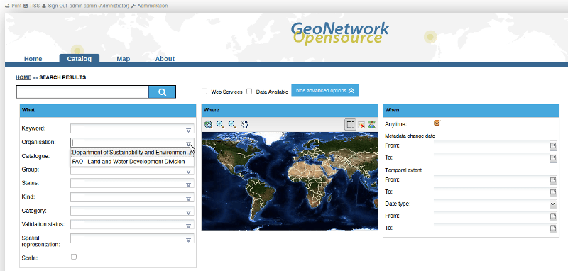
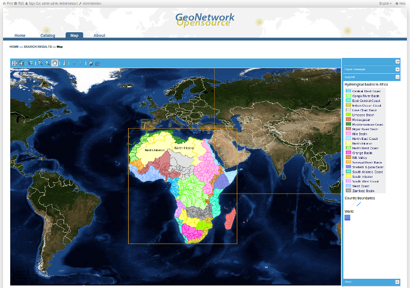

:Author: GeoNetwork Community
:Version: osgeo-live8.5
:Reviewer: Cameron Shorter, LISAsoft
:License: Creative Commons Attribution-ShareAlike 3.0 Unported  (CC BY-SA 3.0)
:Thanks: GeoNetwork Community 

.. |GN| replace:: GeoNetwork

.. figure:: ../../images/project_logos/logo-GeoNetwork.png
  :alt: project logo
  :align: right

********************************************************************************
GeoNetwork Quickstart 
********************************************************************************

|GN| opensource is a standards based, distributed spatial information
management system. It is designed to enable access to spatial data from a variety of data providers through descriptive metadata.

Apart from how to start |GN|, this Quick Start describes:

- some of the different ways you can search for spatial data
- how to download and display data from the search results
- the system of privileges, roles and user groups that |GN| uses.

Detailed documentation can be found in http://localhost:8880/geonetwork/docs/eng/users/index.html (once |GN| has been started), or by clicking on the 'Help' link on the |GN| home page.

Start |GN|
--------------------------------------------------------------------------------

- OSGeoLive is memory constrained. As such, it is recommended to stop default Tomcat service before launching |GN|. On OSGeoLive, |GN| will typically use up to 1GB of RAM.

:: 

  sudo service tomcat6 stop

- Select the "GeoSpatial -> Web Services -> GeoNetwork -> Start GeoNetwork".
- The application will take a few moments to start up
- Go to the |GN| home page at http://localhost:8880/geonetwork. Your first view (an empty *Home* tab) of |GN| should look like the screenshot below.

.. figure:: ../../images/screenshots/800x600/geonetwork-firstviews.png

- To get to know |GN| (and provide a much more interesting *Home* page!) we are going to load the sample metadata. Log in to |GN| using the username *admin* and password *admin* by clicking on *Sign in* at the end of the left hand menu at the top of the page.

.. figure:: ../../images/screenshots/800x600/geonetwork-login.png

- You should now see an *Administration* link appear next to the logged in user details in the left hand menu at the top of the *Home* page. Click on it. 

.. figure:: ../../images/screenshots/800x600/geonetwork-administration-banner.png

- When the *Administration* page appears in a new browser tab, select the iso19139 schema from the list and load the sample data by clicking on the 'Add sample metadata' button.

.. figure:: ../../images/screenshots/800x600/geonetwork-addsampledatabutton.png

- After the sample metadata has been loaded, return to the *Home* page by either closing the Administration tab in the browser or clicking on the tab to the left of the Administration tab. Refresh the page using the browser refresh icon and your screen should look something like the one shown below.

Searching
--------------------------------------------------------------------------------

There are many different ways to search the catalogue for maps and other geographic data. This guide will introduce you to the most popular search methods: free text and advanced. Whichever search you choose, remember that you will see results based on your privileges and assigned work group (more on this later).

.. note:: 
	The term *data* refers to datasets, maps, tables, documents, etc, in fact anything that can be linked to the metadata record that describes it.

To access Search functions, click on the *Catalogue* tab.

.. figure:: ../../images/screenshots/800x600/geonetwork-catalogtab.png

Free Text Search
--------------------------------------------------------------------------------

Free text search allows you to search text extracted from all fields in the metadata record and indexed in the GeoNetwork lucene index.

*Type* a search term in the search box next to the magnifying glass/search icon. You can type anything here (free text). You can use quotes around text to find exact combinations of words. When you type 3 or more characters GeoNetwork will search the index and offer you alternatives from the metadata record text to complete your search.

.. figure:: ../../images/screenshots/800x600/geonetwork-freetext1.png

  *The Search Box and some alternatives from the index*

Pressing the search button (magnifying glass/search icon) will do the search and find those records that contain the entered text. 

.. figure:: ../../images/screenshots/800x600/geonetwork-freetext2.png

  *Search results*

There are also two filters that you can apply to the results of any search:

*Web Services*: Ticking this checkbox will filter the results and return only those results that have a link to an OGC Web Map Service (WMS)

*Data Available*: Ticking this checkbox will filter the results and return only those results that have a file attached to the metadata record for download from GeoNetwork.
  
Advanced Search
--------------------------------------------------------------------------------

Advanced search allows you to search on text from specific fields in the metadata record (eg. title, keywords, temporal and spatial extent) or administrative data about the metadata records such as categories, groups or owners. Advanced search is activated by clicking on the *show advanced options* button just next to the magnifying glass/search icon:

  *show advanced options button*

The advanced search options are divided into three (four with the inspire option, see User Manual for more) sections: *What, Where, When*

  *Advanced search options*

In the **What** section the elements are all related to the contents of the metadata record. The fields are populated from the index so that you can restrict your search to content that is actually in the index.  

- To search on any of the **What** fields start typing text into the field or choose the drop down arrow at the right and choose one of the choices in the list populated from the index. If you do not want to search by a given field, simply leave it blank;

  *Typing b into the Keyword field, limits choices to metadata keywords beginning with b*

  *Choosing the drop down arrow to show organisation choices from metadata records*

  *Choosing the drop down arrow to show categories of metadata records*

The **Where** fields, allow you to draw a box and search for metadata records whose extents overlap this box. 

- To draw a box, use the tool at the top right of the map;

.. figure:: ../../images/screenshots/800x600/geonetwork-where1.png

  *To draw a search box*

.. figure:: ../../images/screenshots/800x600/geonetwork-where2.png

  *Drawing a search box to apply in an advanced search*

The **When** fields, allow you to select metadata records based on:

- the date when they were last modified (*Change date*)
- their temporal extent
- creation, modification, publication date

To activate any of these search fields, simply select a *From:* and *To:* date using the date widgets provided at the right hand side of the fields:

  *Searching on Change date in an advanced search*

The examples above have shown how to specify individual advanced search fields. Obviously these fields can be combined with each other and with the free text search fields to limit the search results as required. To search on any combination of free text and/or advanced search fields click the magnifying glass/search icon next to the free text search field.

.. figure:: ../../images/screenshots/800x600/geonetwork-advancedandfreesearch.png

  *Searching on advanced and free text search fields*

Search Results
--------------------------------------------------------------------------------

The output of a search provides you a list of the metadata records that should fit your request. For each record, a summary is presented showing the title, abstract, keywords, thumbnail (if any), owner (according to privileges) and date of modification. The bounding box of the metadata record is shown in the *Preview* window at the lower right of the screen.

.. figure:: ../../images/screenshots/800x600/geonetwork-search_output1.png

    *Search results: a summary of each record is presented*

The list of icons beneath the summary for each record indicates the links that the record has available to online resources, permanent etc. The icons that appear here will depend upon the privileges that the current user has been assigned. Hovering over the icon will present a tooltip that describes what clicking on the icon will do.

.. figure:: ../../images/screenshots/800x600/geonetwork-summarylinks.png

*Yellow star:* This is a link to the metadata record that can be copied into the brower bookmarks.

*Globe:* If the record has a link to an OGC Web Map Service (WMS), then clicking on this icon will generate a kml file that can be opened in google earth.

*Green plus sign:*  If the record has a link to an OGC Web Map Service (WMS), then clicking on this icon will add the WMS link as a layer to the GeoNetwork web map viewer and open the *Map* tab with the layer displayed.

    
        *Clicking on a link to a WMS*

*Orange down arrow:* This is a link to a file for download that has been attached to a metadata record as an online resource. Clicking on this link will start a download dialogue.

    
        *Clicking on a link to a file for download*

*Blue right arrow:* This is a link to a web resource that has been attached to the metadata record. The resource could be a downloadable file or another html page or any type of html link. The web resource will open in a new browser tab.

    
        *Hovering over a link to a web resource*

Refining your search results using the Filter section (Faceted Searching)
--------------------------------------------------------------------------------

As discussed above, the output of a search provides you with a list of the metadata records that should fit your request. In GeoNetwork 2.10.x, additional information from the search results is also returned and summarized in the *Filter* sidebar. These pieces of information (known as facets) can be used indivdiually or in sequence to refine the search results and produce a smaller, more useful set of results. 

    
        *The Filter sidebar for the search results*

This feature is obviously useful when the catalog has more than a few metadata records in it, however an idea of how it works is useful as the ability to refine your search by analyzing facets of information from the search results is a powerful tool. To refine your search simply select one of the facets from the categories shown in the filter sidebar:

.. figure:: ../../images/screenshots/800x600/geonetwork-refinesearchwithfacets.png
    
        *Refining your search to datasets using facets in the Filter sidebar*

To get a better idea of how useful this facility can be, try searching the Dutch National GeoRegister at http://www.nationaalgeoregister.nl/geonetwork

Privileges, roles and user groups
--------------------------------------------------------------------------------

|GN| uses a system of *Privileges*, *Roles* and *User groups*.

There are no restrictions for users to search and access **public information** in a |GN| catalogue. To get access to **restricted information** or advanced functionality, an account to log in is required. This should be provided by the |GN| administrator.

Log in to |GN| using the username *admin* and password *admin* by clicking on *Sign in* at the end of the left hand menu at the top of the page.

.. figure:: ../../images/screenshots/800x600/geonetwork-login.png

    *Login*

**Privileges.** Depending on the privileges set on a metadata record and on your role as an authenticated user, you will be able to read about a resource and download or interactively browse data related to that resource.

**Roles.** Users with an *Editor* role can create, import and edit metadata records. They can also upload data and configure links to interactive map services.

**User groups.** Every authenticated user is assigned to a particular work group and is able to view data within that work group.

More information
--------------------------------------------------------------------------------

Click on the 'Help' link in the banner of the GeoNetwork home page or go there directly by clicking on this link: http://localhost:8880/geonetwork/docs/eng/users/index.html

