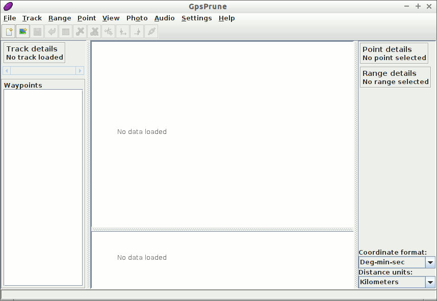
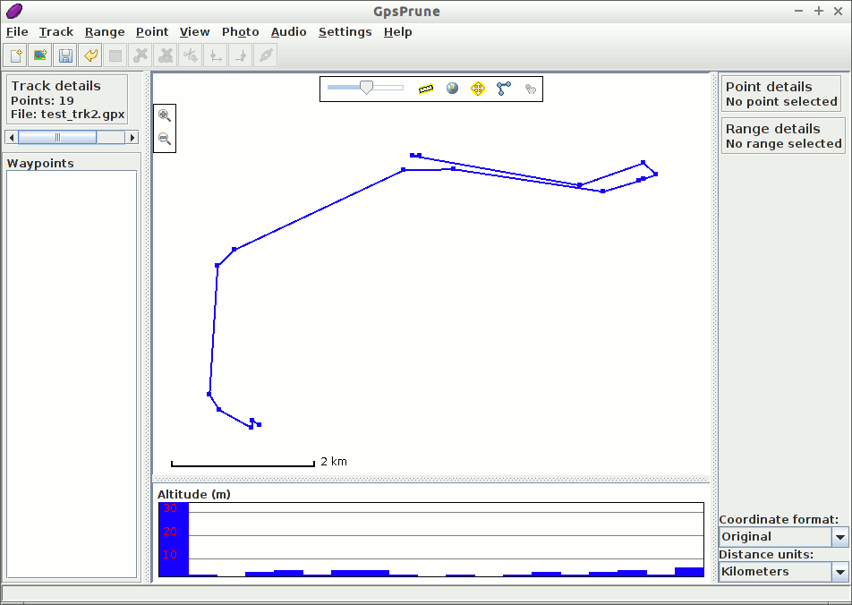
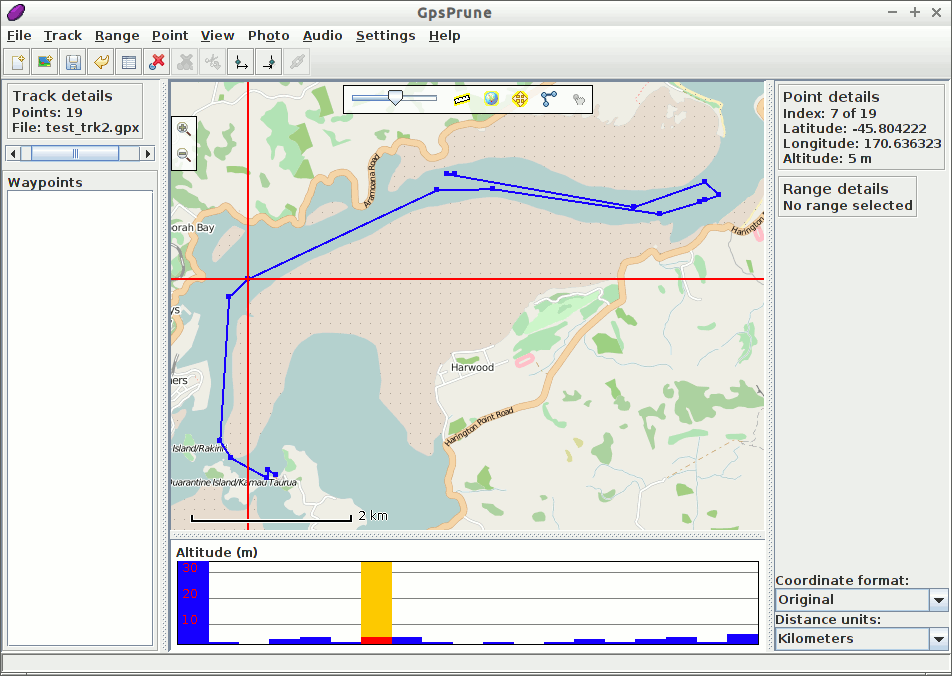
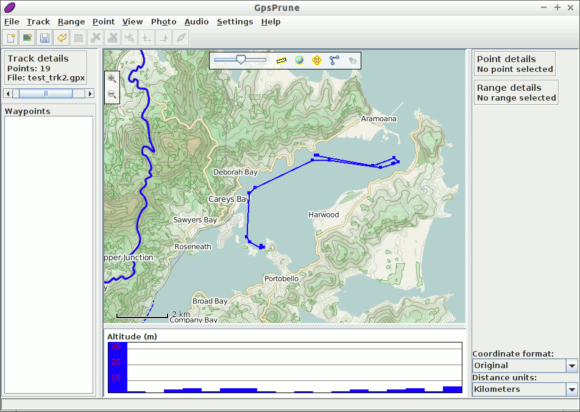
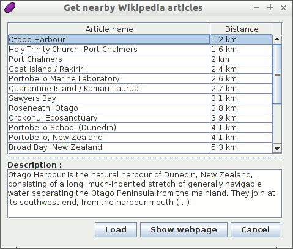
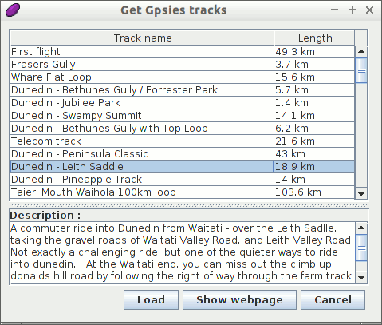
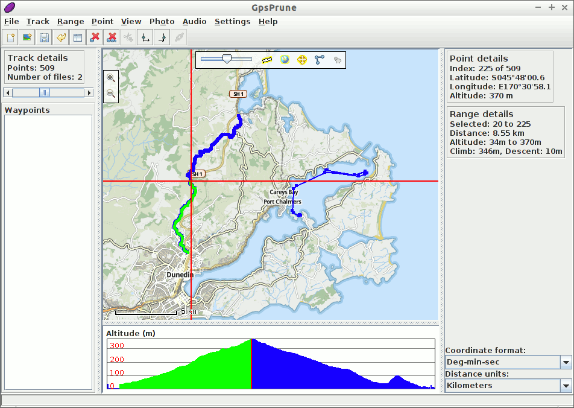

:Author: activityworkshop
:Version: osgeo-live11.0
:License: Creative Commons Attribution-ShareAlike 3.0 Unported  (CC BY-SA 3.0)

.. image:: ../../images/project_logos/logo-gpsprune.png
  :alt: project logo
  :align: right
  :target: http://gpsprune.activityworkshop.net/

********************************************************************************
GpsPrune Quickstart 
********************************************************************************

GpsPrune is a java application for viewing and editing coordinate data.  It can be used for preparing data for GPS devices and for analyzing the data recorded by them.

In this Quick Start, we will load and view a data file included on this live DVD, and access some online information to supplement it.  It will be useful therefore if you have some kind of internet connection for this demonstration.

Getting Started
================================================================================

To run GpsPrune on the live DVD, select the icon "GpsPrune" in the Navigation and Maps menu.  This will then give you the empty window shown below.

We will now load a file by using the menu command :menuselection:`File --> Open file` and selecting the file to load.  This can be a GPX file, a KML or KMZ file, or even a comma-separated or tab-separated file if you have one.  A suitable GPX file containing a couple of tracks can be found on the disc at :file:`~/data/vector/gpx/test_trk2.gpx` so we will load this one.

.. image:: ../../images/screenshots/1024x768/gpsprune_trackselect.png

Because this file contains two tracks, we are offered the choice of which one(s) to load.  We choose just the first one and press OK.

Now you should see the track marked in blue against a white background.  If this track had any waypoints (which it doesn't), then they would be shown too, marked with their names.  Below the main map display is an altitude chart, which shows the profile of the track
if it contains altitudes.

Now, assuming you have a network connection, you can activate the map by clicking the globe
icon at the top of the main map display, or with the menu option :menuselection:`View --> Show Map`.

You can drag the map around with the mouse, and zoom in and out with the mousewheel or by double-clicking.  Dragging with the right mouse button defines a rectangle to zoom to, and the right-click menu offers further options.  Clicking on a point will show the details including altitude and timestamp if available.  You can also click on the altitude profile to select the corresponding point.

Customizing the display
~~~~~~~~~~~~~~~~~~~~~~~~~~~~~~~~~~~~~~~~~~~~~~~~~~~~~~~~~~~~~~~~~~~~~~~~~~~~~~~~
You can change the map with the menu option :menuselection:`Settings --> Set map background`.
Let's have a look at an alternative map source by selecting the second one, "Cyclemap".  This uses the maps from OpenCycleMap to show additional information useful for hiking and cycling such as contour lines and cycle routes.

Wikipedia
~~~~~~~~~~~~~~~~~~~~~~~~~~~~~~~~~~~~~~~~~~~~~~~~~~~~~~~~~~~~~~~~~~~~~~~~~~~~~~~~
Now let's find out some more information about where this track is.  We can do this by selecting a point, and then choosing the menu option :menuselection:`Online --> Get nearby Wikipedia articles`.  This shows a list of articles whose coordinates are nearest to the selected point.  Clicking one of these entries in the list will show more information in the box below.

You can then use the button `Load` to load that point into GpsPrune, or `Show webpage` to load the Wikipedia page in a browser.

Gpsies
~~~~~~~~~~~~~~~~~~~~~~~~~~~~~~~~~~~~~~~~~~~~~~~~~~~~~~~~~~~~~~~~~~~~~~~~~~~~~~~~
Finally, let's download another track from the same area.  We can use the menu command :menuselection:`Online --> Get Gpsies tracks` to search for tracks on the website gpsies.com.  Again, we get a list of matching entries, and we can select one to view the description.

Click the `Load` button to load the track, and select to append this track to the data we've already got.  Now we can see both tracks in the same view.

Measuring distances
~~~~~~~~~~~~~~~~~~~~~~~~~~~~~~~~~~~~~~~~~~~~~~~~~~~~~~~~~~~~~~~~~~~~~~~~~~~~~~~~
To find out how long the climb is, we'll click on the point at the start of the climb, just north of Dunedin, and select :menuselection:`Range --> Set range start`.  Then select the top of the climb by clicking on the highest point of the altitude profile, and select :menuselection:`Range --> Set range end`.  We can now see in the "Range details" section that this part of the track is 8.55 km long, climbs 346 m and descends just 10 m.

Using GpsPrune on other systems
~~~~~~~~~~~~~~~~~~~~~~~~~~~~~~~~~~~~~~~~~~~~~~~~~~~~~~~~~~~~~~~~~~~~~~~~~~~~~~~~
After trying out GpsPrune on this live DVD, you may want to use it on another system, whether it's another Linux system or Mac OSX or Windows.  Some linux distributions include GpsPrune in their normal software libraries (just search for "Prune" or "GpsPrune"), or you can just download the latest copy from the home page.

It doesn't need to be installed, but it does need a java runtime to be installed, version 1.5 or higher.  You can extend GpsPrune's functionalities by installing other free software, such as *Gpsbabel*, *Gnuplot*, *Exiftool* and *Java3d*.

Once you've installed GpsPrune on your permanent system, you can save your settings with the menu option :menuselection:`Settings --> Save settings`.  Then they will be remembered for the next time you run GpsPrune.  However, note that when using this live system, all files that you save in the regular file system are lost when you shut down the computer.

You can also save the downloaded map tiles to disk by selecting the menu option :menuselection:`Settings --> Save maps to disk` and selecting a directory in which to save the images.  This helps to speed up the display as it doesn't have to download the images again.

Further reading
================================================================================

* GpsPrune home page: http://gpsprune.activityworkshop.net/
* Screenshots: http://gpsprune.activityworkshop.net/screenshots.html
* How-tos and instructions: http://gpsprune.activityworkshop.net/how-tos.html

