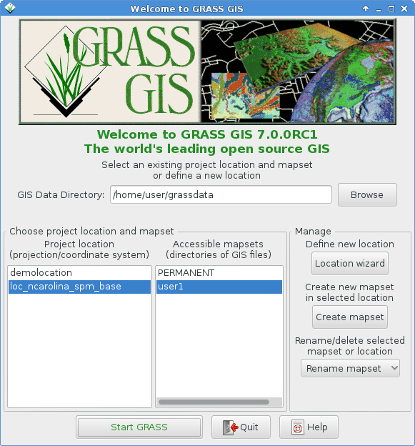
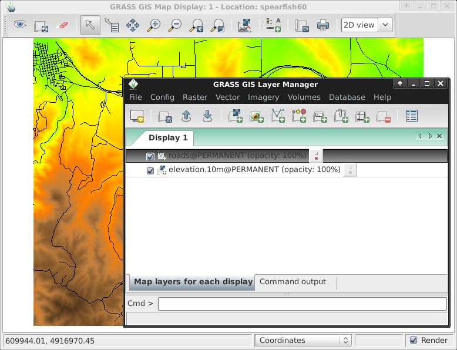
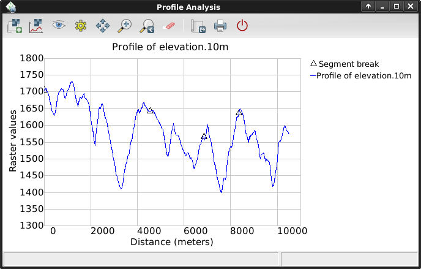
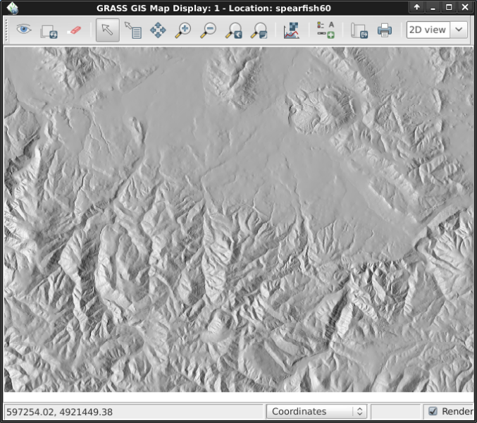
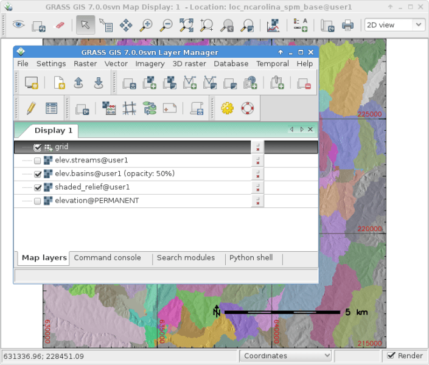
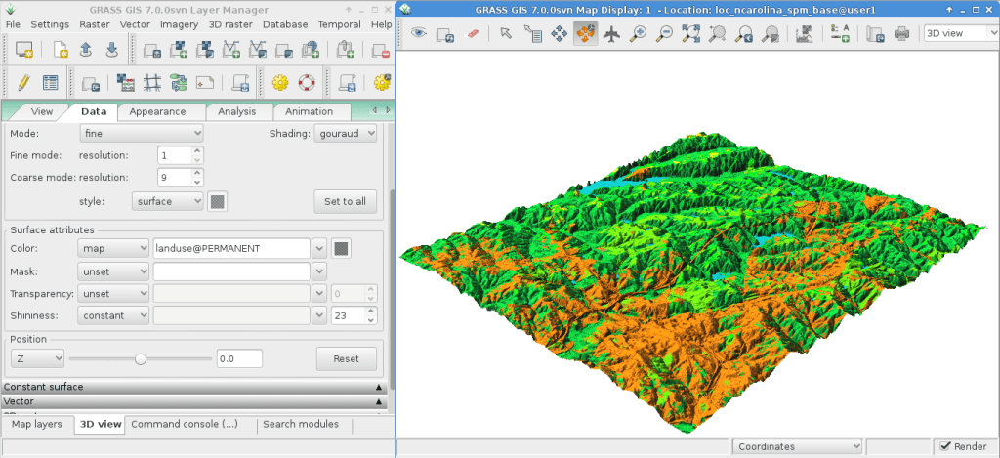

:Author: Hamish Bowman
:Version: osgeo-live6.0
:License: Creative Commons Attribution-ShareAlike 3.0 Unported  (CC BY-SA 3.0)
:Copyright: 2011 by The OSGeo Foundation

.. image:: ../../images/project_logos/logo-GRASS.png
  :scale: 100 %
  :alt: project logo
  :align: right
  :target: http://grass.osgeo.org

********************************************************************************
GRASS GIS Quickstart 
********************************************************************************

Running
================================================================================

To run GRASS on the Live DVD, click on the GRASS link on the desktop.
From the "Welcome to GRASS" window select either the Spearfish or simplified North
Carolina (nc_basic_spm) dataset for the location, and "user1" for the mapset,
then click on [Start Grass]. The values given in this tutorial were written
for the Spearfish dataset, some slight adjustments may be needed for the NC
dataset.

This will launch GRASS with our `brand new GUI written in wxPython <../../grass/wxGUI.html>`_.

.. tip::  If you are on a netbook with a very small display (800x600 resolution)
 the startup screen might get a little scrunched and the [Start GRASS]
 button hidden behind the location and mapset lists. If this happens to
 you the solution is to drag the corner of the window to make it a little
 bigger. You might have to move the window up past the top of the screen
 a bit to get the room (hold down the Alt key and left-click drag the
 window to move it).

Displaying maps
~~~~~~~~~~~~~~~~~~~~~~~~~~~~~~~~~~~~~~~~~~~~~~~~~~~~~~~~~~~~~~~~~~~~~~~~~~~~~~~~

Once inside add a raster map layer such as "`elevation.10m`" or "`elevation`"
from the PERMANENT mapset, depending on which dataset `Location` you chose.
To do this go into the GIS Layer Manager window and click on the checkerboard
toolbar button with a "+" on it. Then select the map name you want from
the "*map to be displayed*" pull-down list, and click [Ok].

In a similar fashion add the "`roads`" (or "`roadsmajor`") vector layer
from the PERMANENT mapset by clicking on the toolbar button with a "+" and
a bent poly-line which looks a bit like a "V".

If you need to, right click on the raster map layer and choose "Zoom to
selected map(s)".

You should now see the maps displayed.

Plot an elevation profile
~~~~~~~~~~~~~~~~~~~~~~~~~~~~~~~~~~~~~~~~~~~~~~~~~~~~~~~~~~~~~~~~~~~~~~~~~~~~~~~~

Back in the GIS Layer Manager window click on your `elevation` raster
map name to select it. Then in the Map Display window, to the right of the
zooming buttons on the Map Display toolbar is an icon with a line graph
and checkerboard on it. Click on that and select **Profile surface map**.
If it isn't automatically listed again pick an elevation map as the raster
layer and press [Ok]. The second button in from the left allows you to
set out the profile line, click it then mark out a few points on the Map
Display canvas. When done go back to the Profile window and click on the
eyeball button to create the plot. Click on the I/O button of the far
right to close the profile window.

Create a random surface
~~~~~~~~~~~~~~~~~~~~~~~~~~~~~~~~~~~~~~~~~~~~~~~~~~~~~~~~~~~~~~~~~~~~~~~~~~~~~~~~

Now let's create a new map. First set the computational region to the default
bounds with :menuselection:`Settings --> Region --> Set region`, ticking
"Set from default region", and clicking [Run]. Next select :menuselection:`Raster --> Generate 
surfaces --> Fractal surface` from the menu (it's near the bottom);
give your new map a name; and adjust any options you like in the "Optional"
tab (the defaults are fine); and click [Run]. You can then [Close] the
*r.surf.fractal* module's dialog window.

.. image:: ../../images/screenshots/800x600/grass-fractal.png
  :scale: 50 %
  :alt: screenshot
  :align: right

Adjust colors
~~~~~~~~~~~~~~~~~~~~~~~~~~~~~~~~~~~~~~~~~~~~~~~~~~~~~~~~~~~~~~~~~~~~~~~~~~~~~~~~

Now you'll see your new raster added to the layer list along with
the elevation raster map, except this time it will be in your "user1"
working mapset. You might un-tick the elevation layer check-box
now so that the two don't draw over the top of each other. Click on the
eyeball to view your new map if it doesn't render automatically.
The colors might not be as you'd like so let's change them. With the
fractal DEM selected in the layer list, in the
`Raster` menu select :menuselection:`Manage colors --> Color tables`.
In the "Colors" tab click on the pull-down list for the "Type of color
table" option, and pick one from the list. "srtm" is a nice choice. Once
done click the [Run] button and close the *r.colors* dialog window.

The colors should then update automatically. If they don't, because you
have altered the map's metadata this time to re-render it by force
you will have to fully flush the display cache. So click on the little
refresh button next to the eyeball button to re-render all layers and you
should see your map with its new colors.
  
Create a shaded relief map
~~~~~~~~~~~~~~~~~~~~~~~~~~~~~~~~~~~~~~~~~~~~~~~~~~~~~~~~~~~~~~~~~~~~~~~~~~~~~~~~

Next we'll create a shaded relief map of the elevation layer we saw
earlier. Start by verifying that the computational region is set match
the raster map of interest, "`elevation`" in the PERMANENT mapset. To
do this, make sure it is loaded into the layer list of the main Layer
Manager window, right click on its name and select "Set computation region
from selected map(s)". In the `Raster` menu select :menuselection:`Terrain
analysis --> Shaded relief` (Terrain analysis is about half way
down), and the module control dialog will appear. With the elevation
map name selected as the input map click [Run]. Now add the new
elevation.shade @user1 map into your layer list as you did for the elevation
map earlier, and un-tick the other raster layers.

Watersheds and streams
~~~~~~~~~~~~~~~~~~~~~~~~~~~~~~~~~~~~~~~~~~~~~~~~~~~~~~~~~~~~~~~~~~~~~~~~~~~~~~~~

Once again select the `elevation` @PERMANENT map and in the `Raster` menu
choose :menuselection:`Hydrologic modeling --> Watershed analysis`. This
will open the ``r.watershed`` module. Set the `elevation` layer as your
input map, in the 'Input options' tab set the minimum size of the exterior
watershed basin *threshold* to
10000 cells, then in the 'Output options' tab enter "elev.basins" for the
watershed basin option and "elev.streams" for the stream segments option
just below it. Then click [Run].

Back in the `Layer Manager` window check that those two new raster maps are 
in the layer list and make sure that they are the only two which are ticked
for display in the box to the left of the layer name. Right click on
the "elev.basins" raster map layer name and select "Change opacity level".
Set it to about 50% which will re-render the Map Display. Drag a map layer (such
as the earlier shaded relief map) to lower down in the layer list if you
wish for it to be drawn behind the other map layers, and tick it's box to
view it as a backdrop.

In the `GIS Layer Manager` window click on the second button in from the right
on the top row and `Add a grid layer`. For size of grid put 0:03 for 0 degrees and
3 minutes (format is D:M:S), then in the "Optional" tab tick Draw geographic
grid and press [Ok] and re-render.

To add a scalebar go to the Map Display window and press the "Add
map elements" button to the right of where you selected the Profile tool
earlier and select "Add scalebar and north arrow". Tick the ``show`` button,
read the placement instructions then click [Ok]. A scalebar will appear in
the top left of the map canvas. Drag it down to the bottom left. From the
same toolbar menu select "Add legend" and
in the instructions window click the Set Options button to set the
raster map name to create the legend for. After picking one click [Ok]
and [Ok] again. Drag your new legend over to the right side of the map
canvas.

Now you may be thinking to yourself that these fonts are a bit bare.
That's easily fixed in the GIS Layer Manager menus open :menuselection:`Settings --> 
Preferences` and in the Map Display tab click the [Set font] button, choose
one (for example DroidSans), and then [Apply] in the Preferences window. You will
have to do a full re-render to see the change so click on the re-render button
next to the eyeball in the `Map Display` window. The fonts will now be much prettier.

Vector modules
~~~~~~~~~~~~~~~~~~~~~~~~~~~~~~~~~~~~~~~~~~~~~~~~~~~~~~~~~~~~~~~~~~~~~~~~~~~~~~~~
 
The above tasks have only covered a few raster modules. Don't let this
give you the idea that GRASS is just for raster maps -- the vector engine
and modules are every bit as full-featured as the raster ones. GRASS
maintains a fully topological vector system which allows all sorts of
very powerful analyses.

.. image:: ../../images/screenshots/1024x768/grass-vectattrib.png
  :scale: 30 %
  :alt: screenshot
  :align: right

Continuing with the watershed basins created above, next we'll convert
them into vector polygons. In the Raster menu select :menuselection:`Map type conversions --> Raster to vector`.
In the `r.to.vect` dialog that opens make sure that ``basins @user1`` is
selected for the input map, give a name for the output map like ``basins_areas``
(vector map names must be SQL compliant), and change feature type to `area`.
In the Attributes tab tick the box to use raster values as category numbers,
since these will match the values in our stream segment raster map created
earlier. Then click on [Run]. Once the new vector map is displayed, you
might right click on it in the Layer Manager list and change its opacity
level. Also if you right click on the ``basins_areas`` vector map in the
`Layer List` you can turn off rendering of area centroids by going into
`Properties` and un-ticking it in the `Selection` tab.

Next we'll add some attributes to those new areas, containing the average
elevation in each basin. In the Vector menu select :menuselection:`Update attributes --> Update area attributes from raster`
to launch the ``v.rast.stats`` module. Use ``basin_areas`` as the vector
polygon map, the `elevation` raster to calculate the statistics from,
make the column prefix ``ele``, and click [Run] then close the dialog when
it is finished. You can query the values in the `Map Display` window using
the fifth icon from the left and after verifying that the vector-areas map
is selected in the `Layer List`, clicking on a vector area in the map canvas.

You can colorize the areas based on the average elevation values using the
``v.colors`` module. In the Vector menu select :menuselection:`Manage colors --> Color tables`.
Select ``basin_areas`` for the input vector map, the ``ele_mean`` attribute
column for the column containing the numeric range, and in the `Colors` tab
have it copy the colors from the `elevation` raster map. After running that
right-click on the ``basin_areas`` map in the Layer List and select `Properties`.
In the `Colors` tab tick the box for getting colors from the map table column.
Once you click [Apply] you should see the colors change in the `Map Display`
window.

Now let's look at the attribute table and SQL builder in more detail. In the
`Layer Manager` click the table icon, it's second from the left on the bottom
row. This will open a view of the attached database table. For now we'll just
do a simple database query to find watershed basins without a lot of variation
in them. Where it says ``SELECT * FROM basin_areas WHERE`` pick ``ele_stddev``
from the pull down list for the standard deviation statistic, then in the
text box to its right enter ``< 50`` and click [Apply]. You'll notice the
number of loaded records in the information bar along the bottom of the window
has shrunk, and that all of the rows with large values for std. dev. are now
gone from the displayed table. Right-click on the table data and choose
``Select all``. Again right-click on the table data and this time choose
``Highlight selected features``. You should see e.g. alluvial flood basins
and mesas show up in the ``Map Display``.

3D visualization
~~~~~~~~~~~~~~~~~~~~~~~~~~~~~~~~~~~~~~~~~~~~~~~~~~~~~~~~~~~~~~~~~~~~~~~~~~~~~~~~

Start the 3D visualization suite from the :menuselection:`File --> NVIZ`
menu item. Select an `elevation` map as the raster elevation.
Once the 3D display interface loads, maximize the window.
Next select :menuselection:`Visualize --> Raster Surfaces` from the top menu,
and set the fine resolution to "1", then move the positioning puck and height
slider around to get different views.

To drape satellite or aerial imagery over the top of the DEM, in the
**Raster Surfaces** controls click on the **Surface Attributes**
drop down menu and select "color". Select "New Map" to pick the overlay
image. In the Spearfish dataset "`spot.image`" in PERMANENT is a
good choice; in the North Carolina dataset "`lsat7_2002_50`"
in PERMANENT is a good choice. Finally, click "Accept" and then once
back at the main window click on the "Draw" button in the top-left, just 
under the File menu.

Other things to try
~~~~~~~~~~~~~~~~~~~~~~~~~~~~~~~~~~~~~~~~~~~~~~~~~~~~~~~~~~~~~~~~~~~~~~~~~~~~~~~~

While not covered here, you may like to experiment with the new
Cartographic Composer and object-oriented Graphical Modeling Tool;
you'll find icons to launch them on the lower row of icons in the
`Layer Manager` window. Further details can be found in
the `wxGUI <../../grass/wxGUI.html>`_ help pages.

The new GUI is written in Python, and if you're a fan of Python programming
there are a number of great tools available to you. In the bottom of the
`Layer Manager` window click on the `Python shell` tab and
type ``help(grass.core)`` to see a listing of the functions available in
the core GIS python library. Besides the core GIS functions there is
also `array` (NumPy), `db` (database), `raster`, and `vector` libraries
available. For advanced use `Pythons CTypes` is supported allowing the
Python programmer access to GRASS's extensive C libraries.

Shutdown and the command line
~~~~~~~~~~~~~~~~~~~~~~~~~~~~~~~~~~~~~~~~~~~~~~~~~~~~~~~~~~~~~~~~~~~~~~~~~~~~~~~~

When finished, exit the GRASS GUI with :menuselection:`File --> Exit GUI`.
Before you close the GRASS terminal session as well, try a GRASS
module by typing "``g.manual --help``" which will give you a list
of module options. The GRASS command line is where the true power of
the GIS comes into its own. GRASS is designed to allow all commands
to be tied together in scripts for large bulk processing jobs. Popular
scripting languages are Bourne Shell and Python, and many neat tricks
to making scripting easier are included for both. With these tools
you can make a new GRASS module with only about 5 minutes of coding,
complete with powerful parser, GUI, and help page template.

"``g.manual -i``" will launch a web browser
with the module help pages. When done close the browser and type "exit"
at the GRASS terminal prompt to leave the GIS environment.

Further reading
================================================================================
* Visit the GRASS website at `http://grass.osgeo.org <http://grass.osgeo.org>`_
* Visit the GRASS Wiki help site at `http://grass.osgeo.org/wiki <http://grass.osgeo.org/wiki>`_
* More tutorials and overviews can be found `here <http://grass.osgeo.org/wiki/GRASS_Help#Getting_Started>`_.
* A `synopsis of the GRASS modules <http://grass.osgeo.org/gdp/grassmanuals/grass64_module_list.pdf>`_, including
  GUI menu position. (`HTML version <http://grass.osgeo.org/gdp/grassmanuals/grass64_module_list.html>`_)
* If the 400 GIS modules which come with GRASS aren't enough for you have a look at the many contributed
  add-ons at `http://grass.osgeo.org/wiki/AddOns <http://grass.osgeo.org/wiki/AddOns>`_
