:Author: Simon Cropper
:Version: osgeo-live5.0
:License: Creative Commons Attribution-ShareAlike 3.0 Unported  (CC BY-SA 3.0)

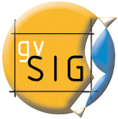

********************************************************************************
gvSIG Quickstart 
********************************************************************************

Project description
================================================================================

"gvSIG is a Geographic Information System (GIS), that is, a desktop application 
designed for capturing, storing, handling, analyzing and deploying any kind of 
referenced geographic information in order to solve complex management and 
planning problems. gvSIG is known for having a user-friendly interface, being 
able to access the most common formats, both vector and raster ones. It 
features a wide range of tools for working with geographic-like information 
(query tools, layout creation, geoprocessing, networks, etc.), which turns 
gvSIG into the ideal tool for users working in the land realm." 
`gvSIG <http://www.gvsig.org/web/projects/gvsig-desktop/description2/view?set_language=en>`__ 2011

This quickstart describes how to...
=================================== 

* Start gvSIG and create a view;
* Define the projection of a view;
* Add raster and vector data to a view;
* Navigate around a view;
* Change how layers are presented in a view;
* Select the towns that occur within a particular region and export 
  these to a new file;
* To create a map with a graticule; and
* Save the current project or exit gvSIG. 

Start gvSIG and create a view
================================================================================

Select gvSIG from the application menu. The application usually takes about
a minute to startup.

#. By default gvSIG opens with an empty project file with the 'View' document 
   type selected. 
#. Click on the [New] button to create a view.

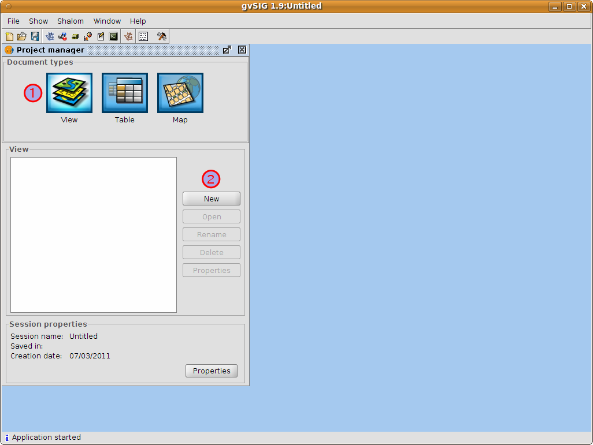

Define the projection of your view
================================================================================

Open the view properties dialog
--------------------------------------------------------------------------------

#. Select the newly created view. By default it is titled ``Untitled - 0`` but
   may be ``Untitled - 1`` if you created then deleted a view already. 
#. Click on the [Properties] button to open the **View properties** dialog.
#. Click on the [...] button following the 'Current projection'. 
   This will open the **New CRS** dialog.

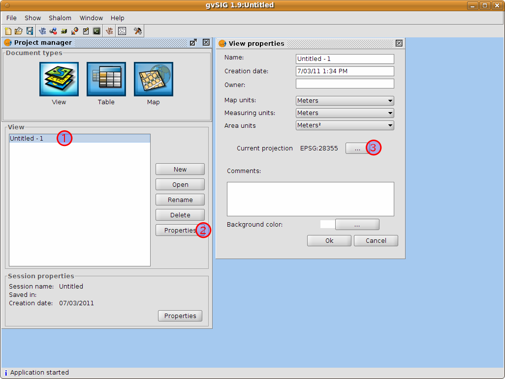

Defining your Coordinate Reference System
--------------------------------------------------------------------------------

#. Using the dropdown list for 'Type', select EPSG.
#. Enter the EPSG code for the Coordinate Reference System. For this example 
   we are using EPSG=4326, which is the WGS84 2D Geographic Projection. Then
   click on the [Search] button. This will list the selected CRS in the table 
   below the search input field.
#. Select [OK] to return to the **View Properties** dialog.

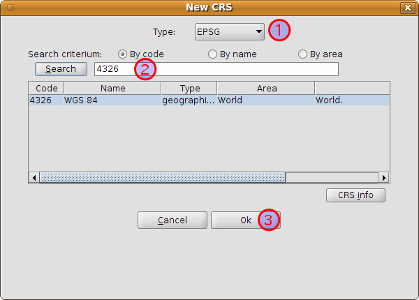

Saving the view properties
--------------------------------------------------------------------------------

#. Note that the EPSG code is now 4326 and that the map units have changed to 
   degrees.
#. Select [OK] to return to the **Project Manager**.

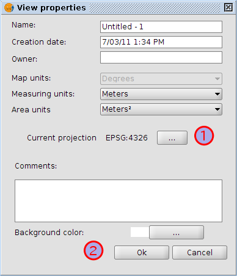

Open the view
--------------------------------------------------------------------------------
   
#. Select the newly created view.
#. Click on the [Open] button to open the *View*.
#. The view window consists of three zones.
#. The top-left cell contains a list of vector or raster layers being used in 
   the view (i.e. Table-of-Contents).
#. The bottom-left cell displays the extent of the main view over a selected 
   vector file.
#. The right cell is the main display area where raster and vector data is 
   rendered.
#. Select the 'Maximise window' icon to have the view occupy the entire screen.

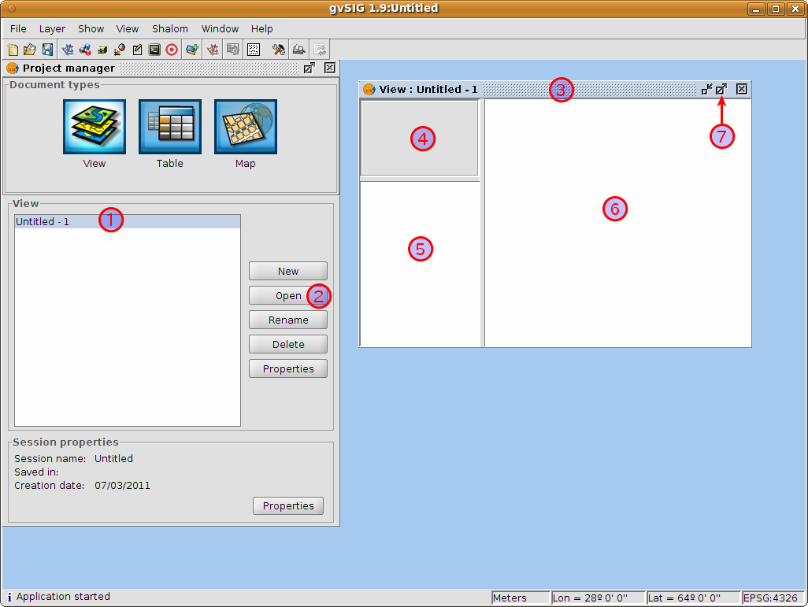

The View - adding raster and vector data
================================================================================

Open the add layer dialog
--------------------------------------------------------------------------------
   
#. Click on the 'Add layer' icon in the main toolbar to open the **Add layer** dialog.
#. Select [Add] in the **Add layer** dialog. By default the first tab is *File* 
   so the **Open** file dialog will appear.
#. Drill down to the ``/usr/local/share/data/natural_earth/HYP_50M_SR_W`` directory.

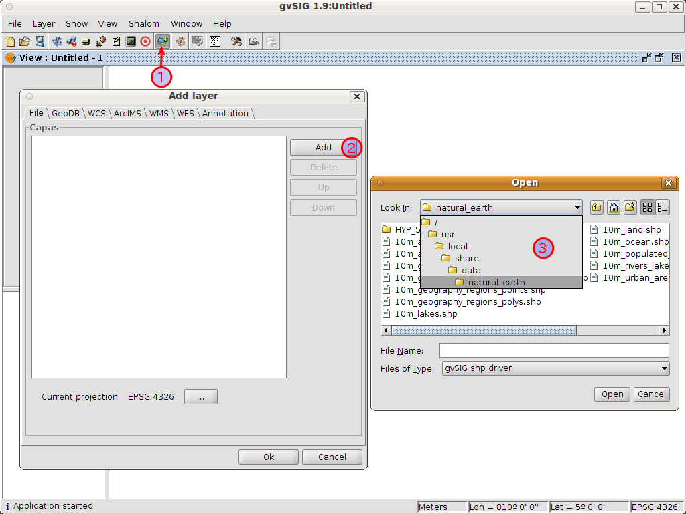

Selecting a raster file
--------------------------------------------------------------------------------
   
#. Select *gvSIG Raster Driver* from the file type dropdown list. By default 
   the shapefile driver is used so the directory may appear empty. 
#. Select ``HYP_50M_SR_W.tif``.
#. Click on the [OK] button to return to the **Add layer** dialog.

.. image:: ../../images/screenshots/1024x768/gvsig_qs_007.png
   :scale: 55 

Selecting vector files
--------------------------------------------------------------------------------
  
#. The **Add layer** dialog now has the raster file listed.
#. Select the [Add] button to add some vector files. The **Open** files dialog 
   will appear.
#. Select the [Up one level] button in the menu to change the directory to the 
   ``/usr/local/share/data/natural_earth`` directory.
#. Select *gvSIG shp driver* from the file type dropdown list.
#. Select the ``10m_admin_1_states_provinces.shp``, ``10m_populated_places_simple.shp`` and 
   ``10m_rivers_lake_centerlines.shp`` shapefiles from the list. Hold down the control 
   key to select multiple files.
#. Click on the [OK] button to return to the **Add layer** dialog.
#. Click on the [OK] button on the **Add layer** dialog to return to the view.

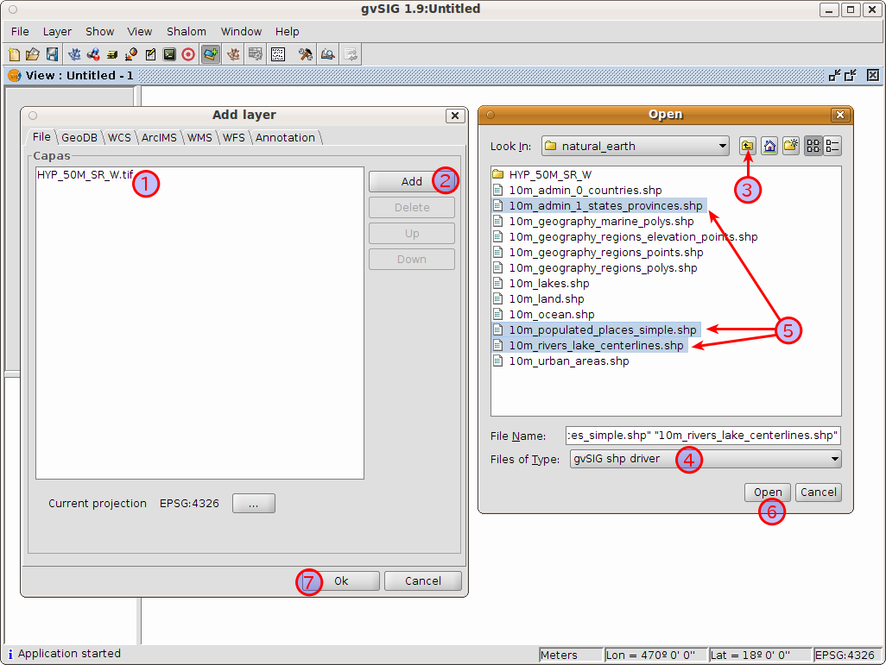

The View - basic navigation
================================================================================

Zoom into a region
--------------------------------------------------------------------------------

Once back at the main view you'll see the vector files super-imposed over 
the raster file. The colours shown in this screen shot may differ from yours 
depending on the user preferences.
       
#. By default the *Zoom in* tool is selected on the main toolbar. 
#. Use the mouse pointer to draw a bounding box around South-east Australia. 
   Do this by selecting the top-left corner of the bounding box, holding 
   down the left-mouse-button, and dragging the bottom-right corner of 
   the bounding box over the selected area. Release the left-mouse button once 
   you have the approximate area defined. 

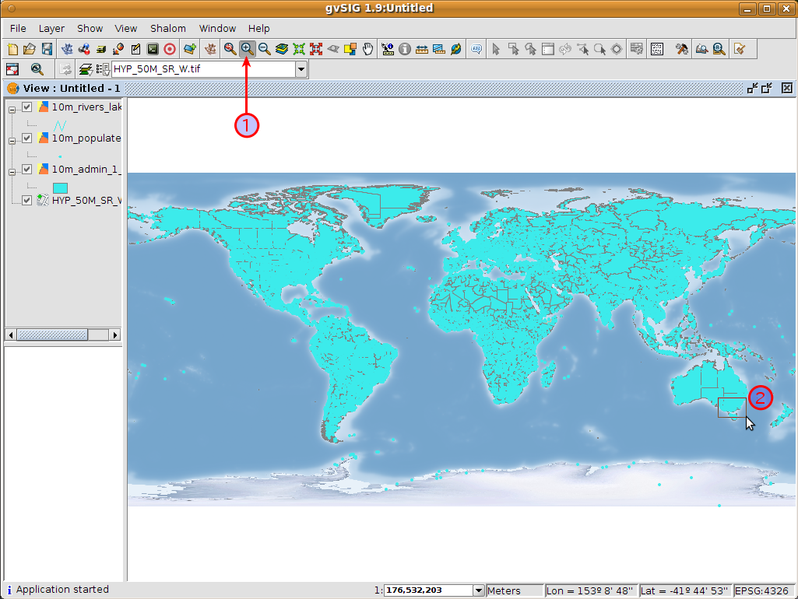

Fine-scale navigation
--------------------------------------------------------------------------------
   
The view will automatically change to show the area within the selected bounding box. 

#. The size of the Table-of-Contents column can be adjusted using the mouse to 
   help see long file names.
#. Adjust what is shown in the view by using the highlighted tools, so that 
   Victoria is central. 

.. image:: ../../images/screenshots/1024x768/gvsig_qs_010.png
   :scale: 55 

The View - changing how layers look
================================================================================

Making a polygon transparent
--------------------------------------------------------------------------------
   
#. Select the ``10m_admin_1_states_provinces.shp`` layer using the 
   left-mouse-button and click again with the right-mouse-button.
#. Select the *Properties* submenu.
#. The **Layer properties** dialog box will appear.

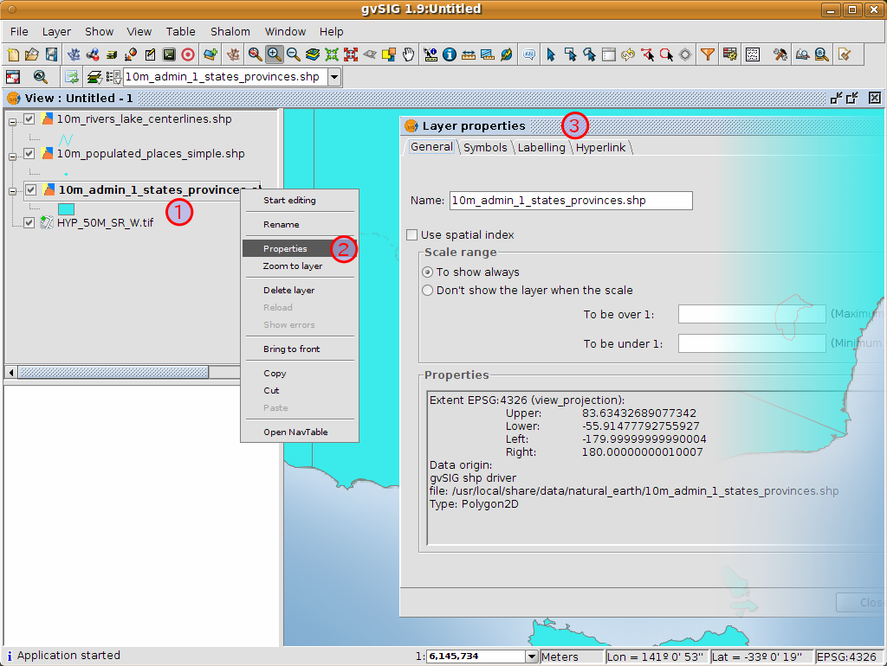

Changing the symbology of a vector layer
--------------------------------------------------------------------------------
   
#. Select the *Symbols* tab at the top of the **Layers properties** dialog.
#. Select [Choose symbol] button so the **Symbol selector** dialog appears.
#. Uncheck the *Fill color* box so the polygons are transparent.
#. Click on the [OK] button to return to the **Layers properties** dialog.

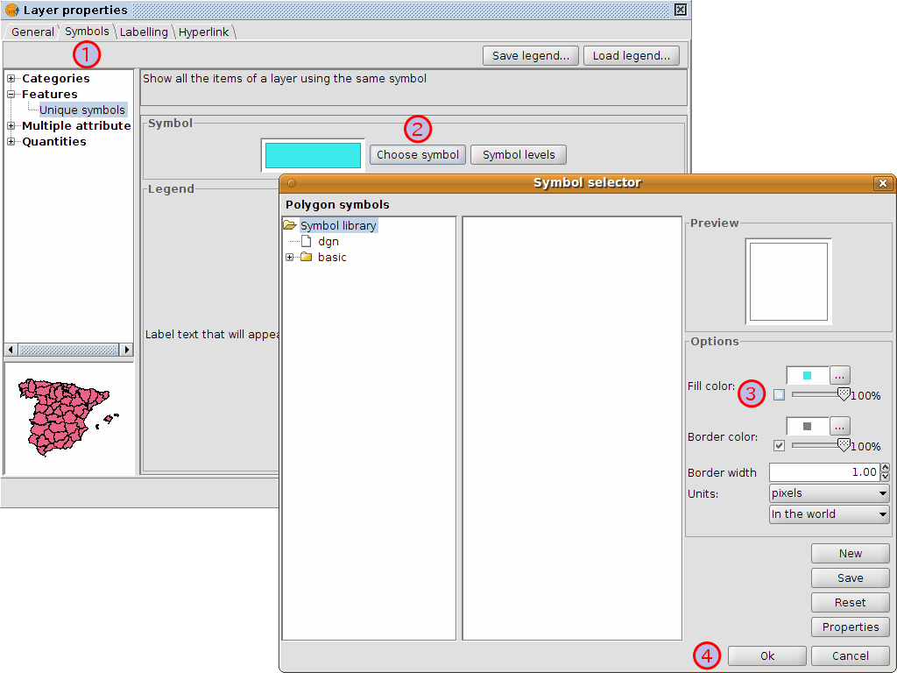

Changing the labelling of a vector layer
--------------------------------------------------------------------------------
   
#. Select the *Labelling* tab at the top of the **Layers properties** dialog.
#. Change the text attributes to those shown on the image, then click on the 
   [Accept] button.

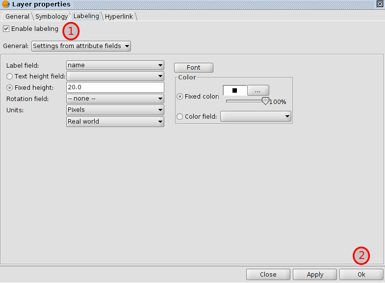

The result
--------------------------------------------------------------------------------
   
Note that this is a very basic view showing a point, a line and a polygon vector 
file superimposed over a raster file. It is just as easy to have an aerial 
photograph or Digital Terrain Model as a backdrop to your vector data, or
to show other vector data stored in different formats.

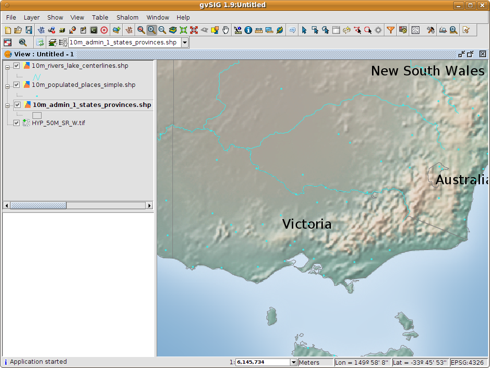

A user exercise - change the symbology and labelling of the point and line layers
---------------------------------------------------------------------------------
   
Following the previous few steps change the symbols, colour and labelling 
of the rivers and towns to generally match the following screen shot.  

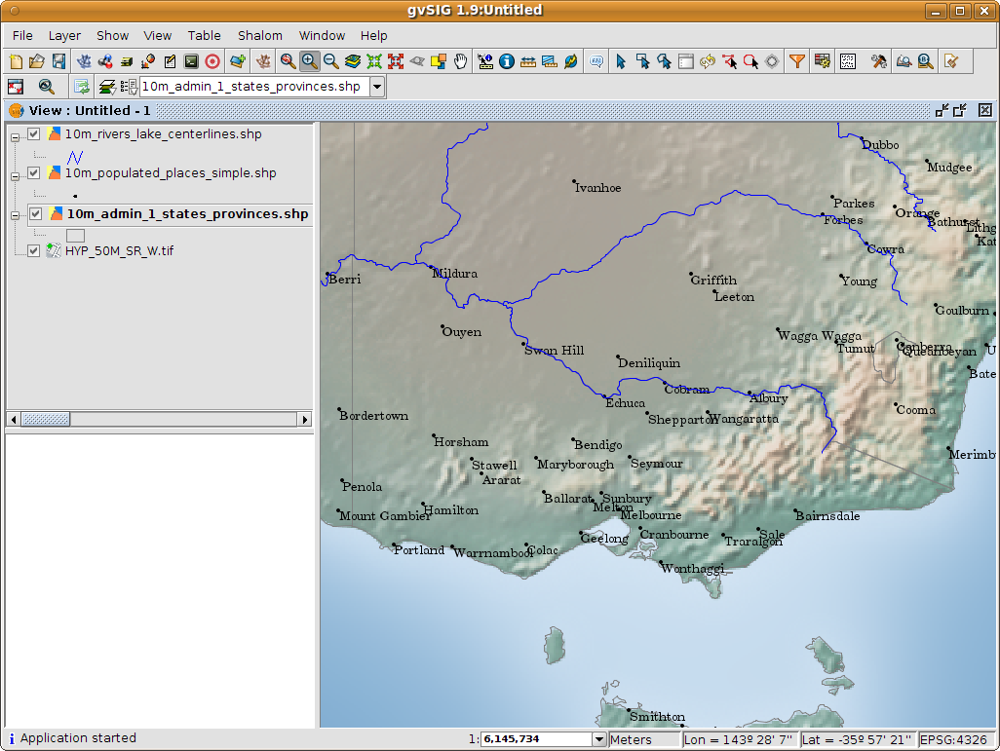

Simple analysis - select towns within a region
================================================================================

Selecting the region
--------------------------------------------------------------------------------
   
#. Select the ``10m_admin_1_states_provinces.shp`` layer using the 
   left-mouse-button.
#. Select the 'Select by point' icon in the main toolbar.
#. Click the polygon representing the State of Victoria. The polygon will 
   go yellow or some other colour depending on your user preferences.

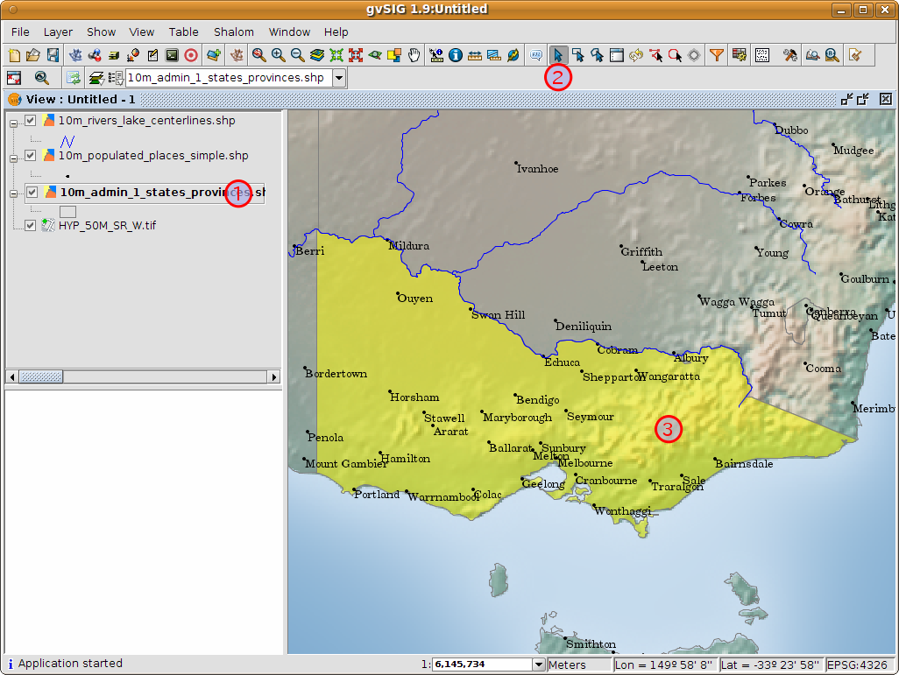

Selecting the towns contained within a region
--------------------------------------------------------------------------------
   
#. Select the ``10m_populated_places_simple.shp`` layer using the left-mouse-button.
#. Select ``View > Selection > Selection by layer`` to open the **Selection by Layer** dialog
#. Change the two selection criteria using the dropdown boxes on the left-hand 
   side of the **Selection by Layer** dialog. Click the [New set] button to 
   select towns within the selected polygon. 
#. Select the [Cancel] button in the **Selection by Layer** dialog to return 
   to the view. 

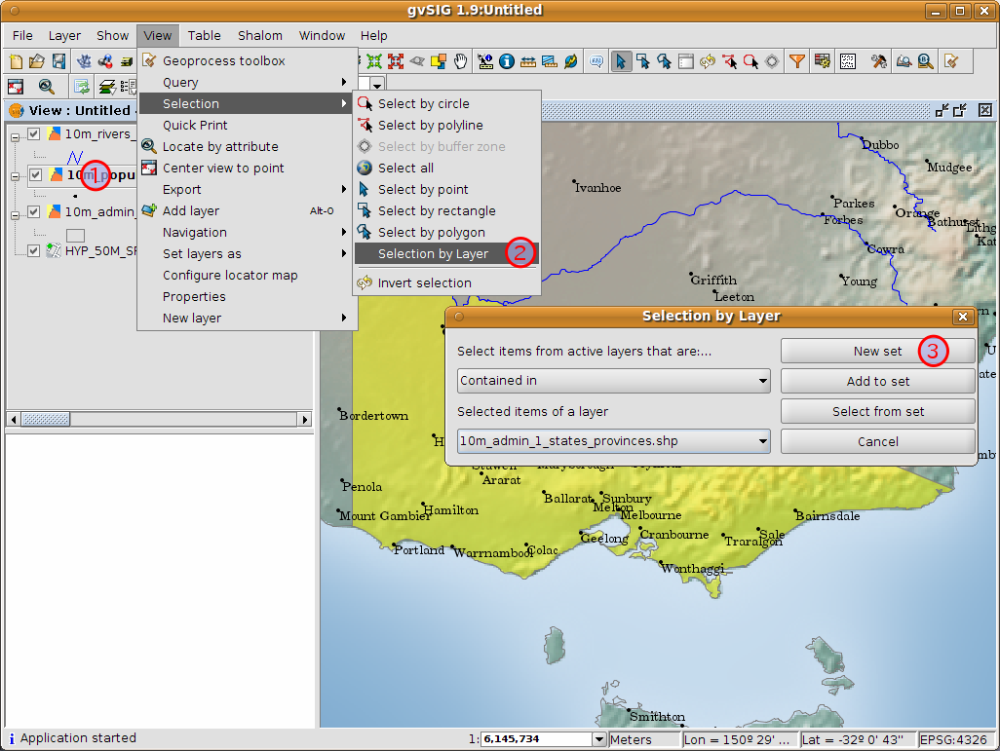

Unselect the polygon so you can see what has happened
--------------------------------------------------------------------------------
   
#. Select the ``10m_admin_1_states_provinces.shp`` layer using the left-mouse-button.
#. Select the 'Clear selection' icon in the main toolbar.
#. You can now see that the only those towns within Victoria are selected.

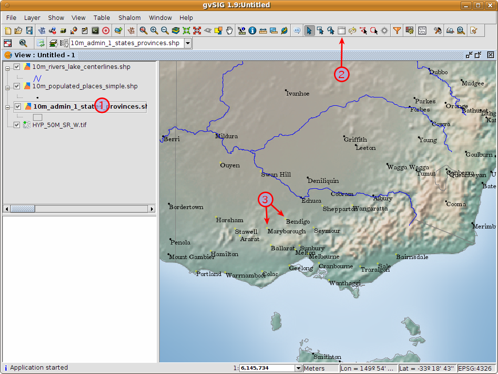

Export the selected towns to a new shapefile
--------------------------------------------------------------------------------
   
#. Select the ``10m_populated_places_simple.shp`` layer using the left-mouse-button.
#. Select ``Layer > Export to... > SHP`` to start the export.
#. The **Export to...** dialog appears. gvSIG recognises that only 26 features 
   are selected so warns you that only a subset of the shapefile will be 
   exported. Select the [Yes] button to continue.
#. The **Save** dialog appears. Give the file a name and save in a 
   directory of choice. Select the [Save] button to continue. 
   Note that if you already have a file by the name chosen a warning message 
   will be shown. 
#. The **Add layer** dialog appears. Select the [Yes] button to add the new 
   shapefile to the Table-of-Contents.

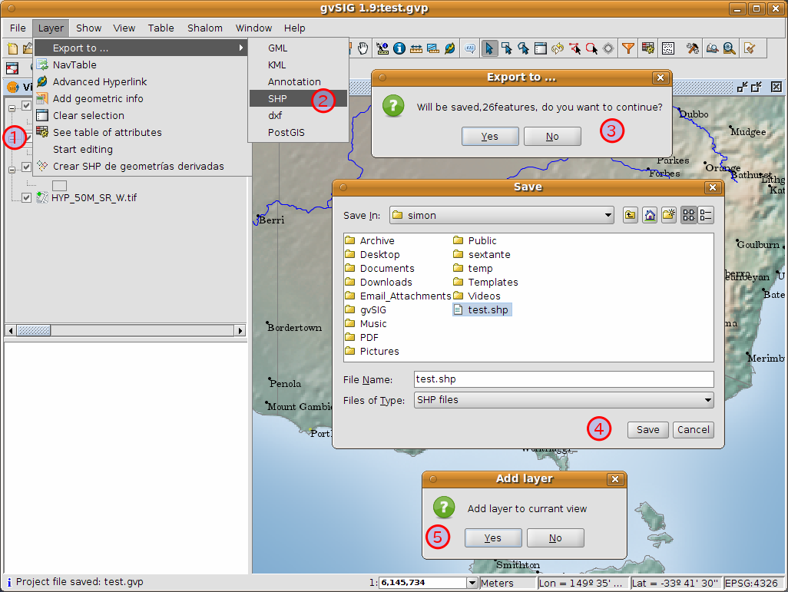

Showing only towns within a region
--------------------------------------------------------------------------------

#. Once you return to the view, uncheck ``10m_populated_places_simple.shp`` in 
   the Table-of-Contents.
#. Change the symbology and labelling of ``test.shp`` to match the screenshot 
   below. 
#. Now the view only includes towns and that occur within the State of Victoria.
#. Select the 'Close window' icon to return to the **Project manager** so we
   can create a map using this view.

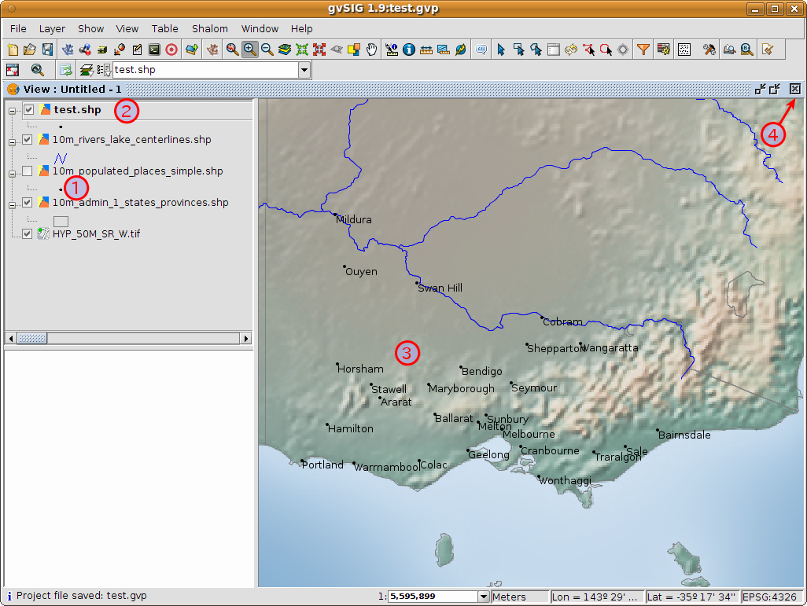
   
How to create a map
================================================================================

Create a new map and open it
--------------------------------------------------------------------------------

#. Select the *Map* document type in the **Project Manager**.
#. Click on the [New] button to create a map.
#. Select the newly created map. By default it is titled ``Untitled - 0``.
#. Click on the [Open] button.
#. An empty map will appear in its own window titled ``Map: Untitled - 0``.
   Note that a series of points are placed over the page. This is called a
   grid or guides and are used to snap elements to while formatting your
   map.
#. Select the 'Maximise window' icon to have the map occupy the entire 
   screen. 

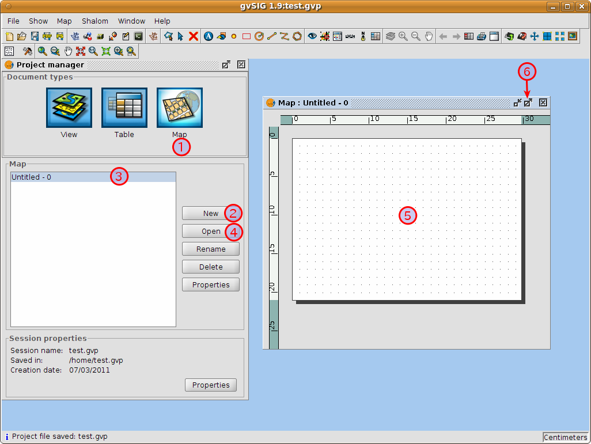

Insert a view with a grid/graticule
----------------------------------- 
   
#. Click on the 'Insert view' icon in the main menu
#. Create a bounding box representing the extent of the map on the page by 
   clicking on the empty map while holding down the left-mouse-button and 
   dragging out the box, only letting go once the the area to be used is 
   complete. This opens the **Properties of view framework** dialog.
#. Select the *view* created earlier.
#. Check the *Show Grid* option (this actually creates a graticule).
#. Click on the [Configure] grid button to open the **Grid settings** dialog.
#. In the **Grid settings** dialog change the grid interval to 1.0, that is 
   1 degree between lines representing latitude and longitude.
#. Select the grid format (use lines rather than points for ease of viewing).
#. Increase the font size to 14.
#. Select the [Ok] button to return to the **Properties of view framework** dialog then 
   select the [Accept] button to exit and return to your map.

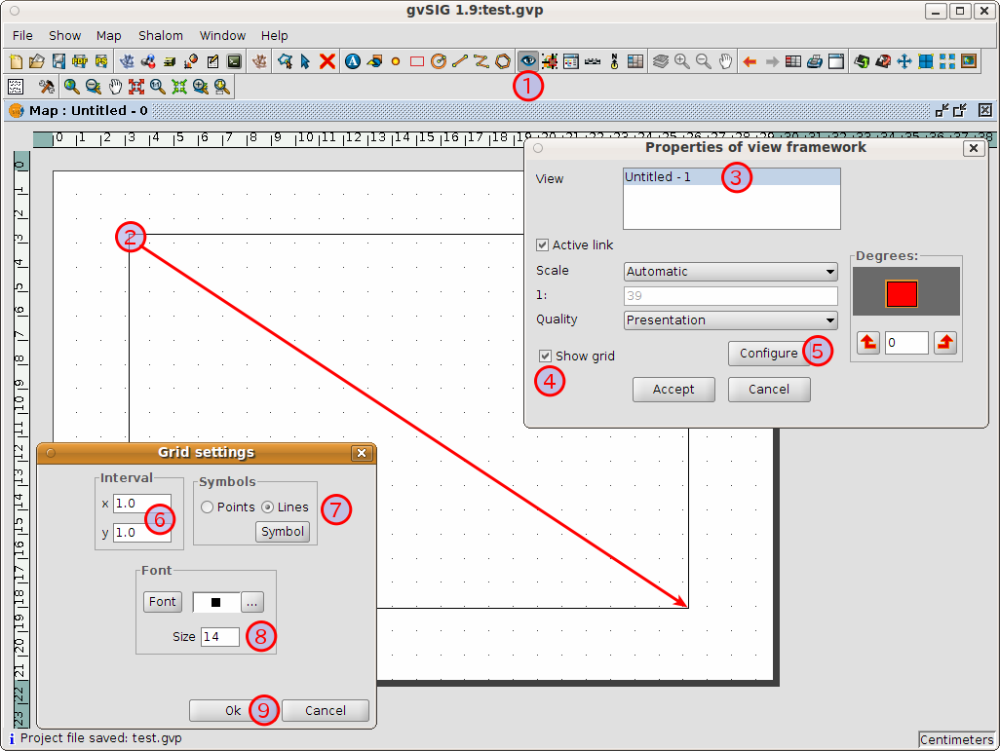

What else can you do to a map?
--------------------------------------------------------------------------------
   
#. Select ``Map > Properties`` from the main menu to open the 
   **Map Properties** dialog box. Unselect the *Visualise Grid* checkbox then 
   select the [OK] button. The 'snap-to' guides/grid used while formatting 
   should now be removed from the page and the image should match what is 
   shown below.  
#. Additional elements like a scale and north arrow can be added to the map 
   using the icons in the main toolbar or with the submenus in the ``Map`` menu.
#. The map can be printed or exported to PDF or Postscript for incorporation 
   into other works.
#. Select the 'Close window' icon to return to the **Project manager**

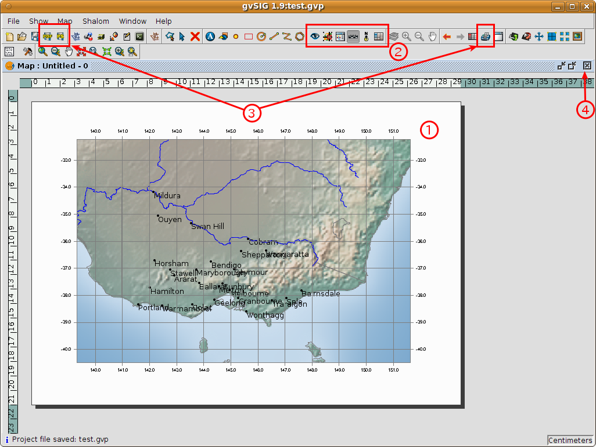

Saving your project or exiting gvSIG
================================================================================
   
#. Projects can be saved for use later by using the ``File > Save as...`` 
   menu option, or
#. Projects can be exited or closed by using the ``File > Exit`` menu option.

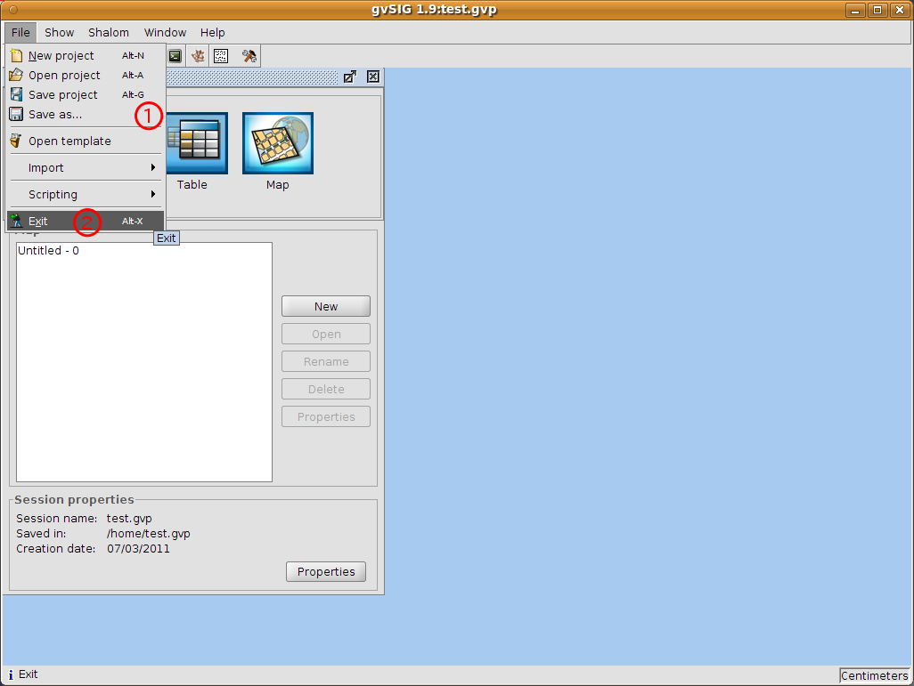

Where to from here...
================================================================================

Some English help and tutorials are available on the 
`gvSIG <http://www.gvsig.org/web/docusr/learning/>`__ website. 

