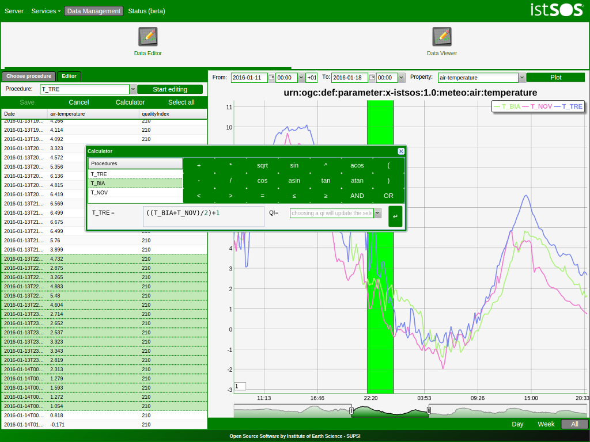

:Author: Massimiliano Cannata, Milan Antonovic - SUPSI
:Reviewer: Cameron Shorter, Jirotech
:Version: osgeo-live9.5
:License: Creative Commons Attribution 3.0 Unported (CC BY 3.0)

.. image:: ../../images/project_logos/logo-istsos.png
  :alt: project logo
  :align: right
  :target: http://istsos.org

********************************************************************************
istSOS Quickstart 
********************************************************************************

istSOS is sensor data management tool that allows collection, maintenance and publishing of monitoring observations using the Open Geospatial Consortium (OGC) :doc:`Sensor Observation Service (SOS) <../standards/sos_overview>` standard.

This QuickStart describes how to:

  * Add new observations using a python script and the RestFul API.
  * View and edit data with the administration interface.

Add new observations
================================================================================

#. First we will create a text file with sensor data, formatted according to "text/csv, subtype=istSOS". The file uses a Comma Separated Values (CSV) format. The first line contains header information, including URI names of the observed properties. The following lines contain the data.

    #. Open a text editor by selecting :menuselection:`Accessories --> Leafpad`.

    #. Copy and paste the follwing text into the text editor window:
    
    .. code-block:: rest
    
        urn:ogc:def:parameter:x-istsos:1.0:time:iso8601,urn:ogc:def:parameter:x-istsos:1.0:meteo:air:temperature
        2014-06-03T14:30:00.00Z,22.20
        2014-06-03T14:40:00.00Z,22.00
        2014-06-03T14:50:00.00Z,21.70
        2014-06-03T15:00:00.00Z,21.20
        2014-06-03T15:10:00.00Z,20.70
        2014-06-03T15:20:00.00Z,20.20
        2014-06-03T15:30:00.00Z,19.60
        2014-06-03T15:40:00.00Z,19.20
        2014-06-03T15:50:00.00Z,18.20
        2014-06-03T16:00:00.00Z,18.00
        2014-06-03T16:10:00.00Z,17.20

    #. Save the file as "T_LUGANO_20140603161000000.dat" on the Desktop. The filename convention being used is: PROCEDURENAME_YYYYMMDDhhmmssfff.dat
    
    #. Open a terminal by selecting :menuselection:`Accessories --> LXTerminal`.
    
    #. In the terminal, enter: "cd /usr/share/istsos/" and press ENTER
    
    #. Write "python scripts/csv2istsos.py -p T_LUGANO -u http://localhost/istsos -s demo -w ~/Desktop" and press ENTER
    
    #. You should see a message "Insert observation success: True"
    
    #. Click :menuselection:`Geospatial --> Webservices --> istSOS`.
    
    #. Click the ENTER button in the administration page
    
    #. Click :menuselection:`Data Management --> Data Viewer`.
    
    #. Select the following:
        - Service = demo
        - Offering = temporary
        - Procedure T_LUGANO
      
    #. Click the Add button
    
    #. Click the Plot button and check that the data have been added (watch out at your time zone!)

.. image:: ../../images/screenshots/1024x768/istsos_viewer.png
  :scale: 50 %

Edit data with the CALCULATOR
================================================================================

#. Click :menuselection:`Geospatial --> Webservices --> istSOS`.

#. Click :menuselection:`Data Management --> Data Viewer`.

#. Select the following: Service = demo, Offering = temporary

#. Select and add the following procedures: BELLINZONA​, LOCARNO​ and ​T_LUGANO

#. On the right panel choose the Property: ​air­temperature

#. Press “​Plot​”, the last week of measurements is loaded and displayed

#. On the left panel select the “​Editor​” tab

#. Select ​T_LUGANO​ from the combo list 

#. press “​Start editing​”, the grid is now displayed

#. At the bottom­right corner of the chart there are 3 buttons “Day”, “Week” and “All”:

    * Click on “​Day​”, the chart is zoomed to contain only one day of data 
    * Drag the timeline bar on the right where you will see that T_LUGANO has no data

#. Click on the chart to select the last observation before the “​nodata​” hole, a green line is displayed and in the ​Editing Grid​ the corresponding row is selected.

#. Now go to the ​"Editing Grid​" panel 

    * Click the first row where data are ​NaN​, 
    * Scroll to the last ​NaN​ record and holding the ​SHIFT​ Key click on it 
    * The press the “​Calculator​” button 

WIth the ​Calculator​ we are able to correct an interval of data in a single action. It is possible to set a numeric value or also use a function using data from the other loaded procedures.  
Let’s build a function that make the average of the data from BELLINZONA and LOCARNO and then removes two degrees: 

    .. code-block:: rest
    
       ((BELLINZONA+LOCARNO)/2)-2
       
#. Copy the formula in the calculator and select the quality index as QI 500 (manually adjusted).

#. Press the enter button and check your new data with gap filled (Press Save if yyou want to permanently save the updates in the database!)

What Next?
================================================================================

To learn more about istSOS, a starting point is the `istSOS Documentation`_
 and the `istSOS Tutorial`_.
 
.. _`istSOS Documentation`: http://istsos.org/en/trunk/doc/index.html
.. _`istSOS Tutorial`: http://istsos.org/tutorial/

