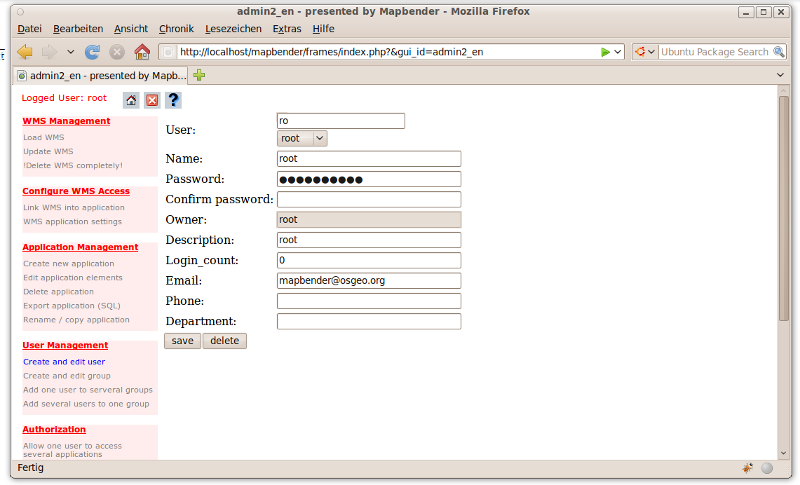
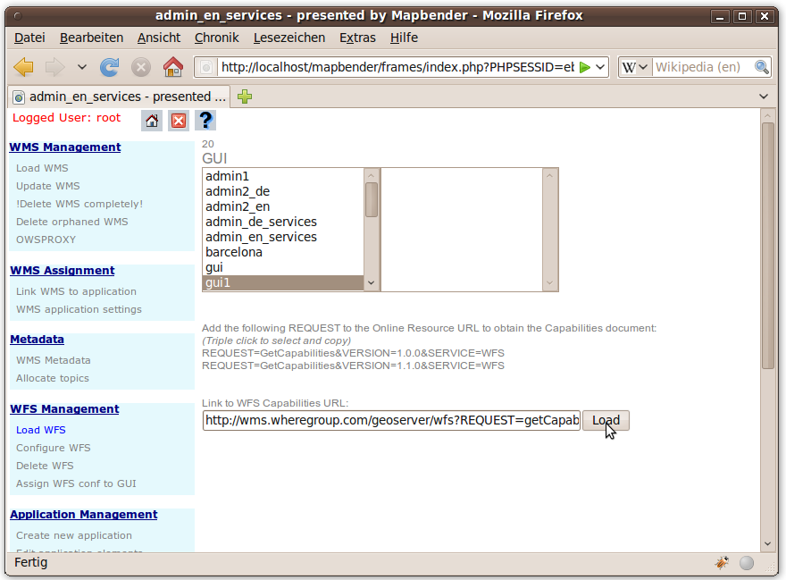
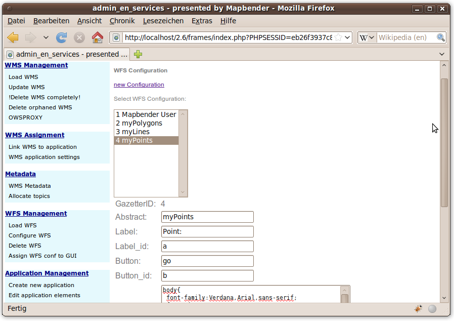
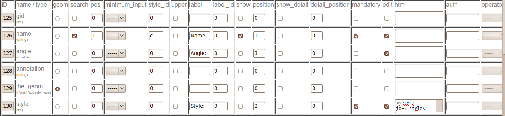
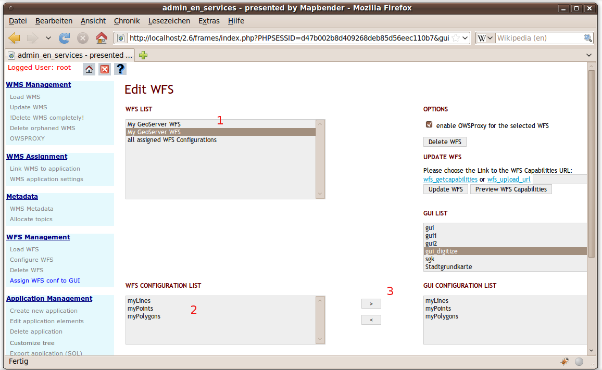
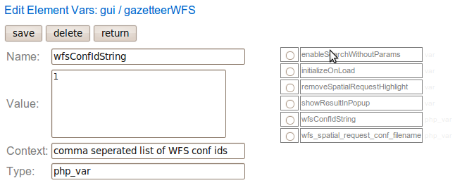
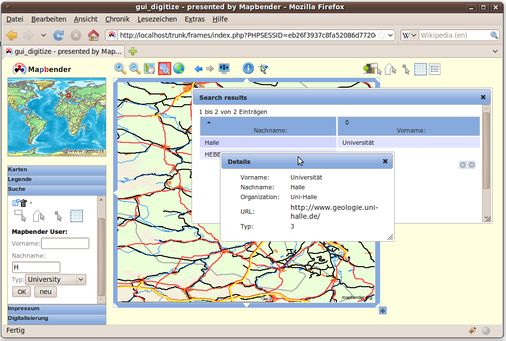
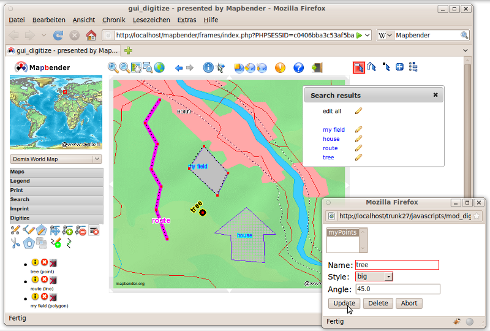

:Author: OSGeo-Live
:Author: Astrid Emde
:Author: Christoph Baudson
:Author: Arnulf Christl
:Version: osgeo-live5.0draft
:License: Creative Commons Attribution-ShareAlike 3.0 Unported  (CC BY-SA 3.0)
:Thanks: mapbender-user list

********************************************************************************
Mapbender Quickstart 
********************************************************************************

Mapbender is a web based geoportal framework to publish, register, view, navigate, monitor and grant secure access to spatial data infrastructure services. 

Management interfaces empower administrators who need to maintain and categorize map and feature services and grant access to individuals, groups and other services. 

You will need nothing but a standard web browser for this quickstart.

This Quick Start describes how to:

  * start Mapbender
  * create an application 
  * load a Web Map Service (OGC WMS)
  * configure WMS
  * create an individual application
  * create a user and a group and assign applications to them
  * load a WFS
  * configure feature type and create an application with WFS search and digitize functionality

Start Mapbender
================================================================================

.. TBD: Add menu graphic to this uDig Quickstart

#. Choose  :menuselection:`Mapbender` from the start menu

#. The application will take a few moments to start up

If you have any difficulties running Mapbender, please check whether your Apache web server and your PostgreSQL database are running.

Welcome page
================================================================================

#. Before you can work with Mapbender you have to login to get access to applications.

#. The welcome page provides links to the most important pages related to Mapbender. 

#. You can login with the user :guilabel:`root` and password :guilabel:`root` (This is the default user and password that you get after installation of Mapbender. Please change the root password if you want to run a productive environment. Please don't delete the user :guilabel:`root` as this user has access to the Mapbender template applications and is used on updates).
  
  .. image:: ../../images/screenshots/800x600/mapbender_welcome.png
     :scale: 80

After successful login you are directed to the :guilabel:`application overview`.

Application overview
================================================================================
After the login you are directed to the :guilabel:`application overview` with a list of applications you are allowed to access.
In Mapbender you have template applications, that you can use to set up your own applications.

  .. image:: ../../images/screenshots/800x600/mapbender_application_overview.png
     :scale: 80

Mapbender provides
   * administration applications
   * map applications
   * container applications

The applications are listed in :guilabel:`categories`. Later you can define your own category and add your applications to the category you want.

Administration applications
================================================================================

:guilabel:`Administration applications` allow you f. e. to load services, create user, to set up new applications. 

Each :guilabel:`administration application` provides different functionality. Later on your can set up your own :guilabel:`administration applications` with the functionality you would like to provide.

After installation user :guilabel:`root` has access to:
   * ADMINISTRATION, ADMINISTRATION_DE - WMS, WFS, application, user/group, handling (new in version 2.7)
   * admin2_en - WMS, application, user/group handling
   * admin_en_services - focus on WFS and metadata handling and owsproxy    
   * admin1 - template with all administration elements
   * admin_wms_metadata, admin_wfs_metadata, admin_wmc_metadata - metadata handling 

The following image shows admin2_en. At the left side you can see the menu with the possibilities which this application offers.

  .. image:: ../../images/screenshots/800x600/mapbender_admin2_en.png
     :scale: 80

.. tip:: You get back to the application overview with the |HOME| button.

  .. |HOME| image:: ../../images/screenshots/800x600/mapbender_home.png
     :scale: 100

Map applications
================================================================================
Map applications contain OGC WMS, one ore more maps, buttons, a geodata explorer, a legend element, your logo and more. 

#. Choose a map application :guilabel:`by click` from the :guilabel:`application overview`

#. Get to know Mapbender and try the functionality the applications provide.
   
   * choose for example gui, gui_digitize
     
  .. image:: ../../images/screenshots/800x600/mapbender_gui_digitize.png
     :scale: 80

.. tip:: If your browser supports tabs you can open the applications in tabs and easily switch between them.

WMS container applications
================================================================================
You can create a container application to store your WMS. WMS container are not for display. With containers you can create a sophisticated service repository.

  .. image:: ../../images/screenshots/800x600/mapbender_container.png
     :scale: 60

Create an individual application
================================================================================

#. go to the administration application :menuselection:`admin2_en` 

#. choose :menuselection:`Application Management --> Create new application`

#. define a name and description for your application and choose the button **new** to create the application

#. go to the link :menuselection:`Application Management --> Edit application elements` and select the new application

#. in the selectbox at the top choose an application that you would like to take as a template and hit the button **add all elements**. This process will take all elements from the application you selected to your new application.

#. you can also take a single element from another application to your new application. Choose the single element by activating the radiobutton at the element and hit the **save** Button to save this element in your new application.

#. your application is set up. Now you need a WMS to be displayed in your application. This will be described in the section **WMS Management**.

Copy or rename an application
================================================================================
You also can create a new application by copying an existing application. Go to :menuselection:`Application Management --> Rename/copy application`, choose the application you want to copy and define a name for the new application. This functionality not only copies the application, it also copies the services of the application and the user/groups (optional). That means that the new application already has map services and the user and groups which have access to the copied application will have access to the new application too.

Delete an application
================================================================================
You can delete an application with :menuselection:`Application Management --> Delete application`. Only the application is deleted, not the services which were part of the application. 
You are not allowed to delete applications which also belong to other users.

Export an application
================================================================================
You can export an application as SQL with :menuselection:`Application Management --> Export application (SQL)`. The SQL contains all the definitions of the application elements and can be imported in another Mapbender installation. 

.. tip:: The export of an application does not contain the service information and the informations about user and group access.

********************************************************************************
WMS Management
********************************************************************************

Loading Web Map Services
================================================================================
You can load OGC Web Map Services (WMS) to your application.

A WMS returns an XML-file when the getCapabilities document is requested. This information is parsed by Mapbender and Mapbender gets all the necessary information about the service from this XML

.. tip:: You should first check the Capabilities document in your browser before you try to load it with Mapbender

#. Go to :guilabel:`admin2_en` and choose :menuselection:`WMS Management --> Load WMS`. Choose the application which shall contain the WMS. Link to the WMS getCapabilities URL in the text field and hit **Load**.

#. Here are some example WMS which you can load to your application:

Cadastre of spain

http://ovc.catastro.meh.es/Cartografia/WMS/ServidorWMS.aspx?VERSION=1.1.1&REQUEST=GetCapabilities&SERVICE=WMS

Geoportal Barcelona (Geoportalbcn - link refers to a service repository)

http://www.bcn.cat/geoportal/es/geoserveis.html

Demis World Map 

http://www2.demis.nl/wms/wms.asp?wms=WorldMap&VERSION=1.1.1&REQUEST=GetCapabilities&SERVICE=WMS

Bird Studies Canada 

http://www.bsc-eoc.org/cgi-bin/bsc_ows.asp?VERSION=1.1.1&REQUEST=GetCapabilities&SERVICE=WMS

Germany demo 

http://wms.wheregroup.com/cgi-bin/mapserv?map=/data/umn/germany/germany.map&VERSION=1.1.1&REQUEST=GetCapabilities&SERVICE=WMS 

WhereGroup OSM WMS 

http://osm.wheregroup.com/cgi-bin/osm_basic.xml?REQUEST=GetCapabilities&SERVICE=WMS&VERSION=1.1.1
 
.. image::../../images/screenshots/800x600/mapbender_admin2_en.png
  :scale: 80

You can load more than one WMS in an application. Choose *WMS application settings* to change the order of the WMS or remove a WMS from your application.

The WMS with index 0 defines the default coordinate reference system and the extent of the map.

.. tip:: Create a container application and upload every WMS just once to this container application. You can transfer the WMS from this container to other aplications. When you update the WMS the possible changes will appear in all applications that contain this WMS. You easily can copy a WMS from one to another application with the menu entry *Link WMS to application*.
	

Configure WMS
================================================================================
After upload of a WMS you can configure the WMS for your specific application. Maybe you don't want to provide all layers or you want to change the order or titles of the layer or disable the feature info or change the maxscale for a layer.

.. image:: ../../images/screenshots/800x600/mapbender_wms_application_settings.png
  :scale: 80

* on/off - enable/disable a layer for this individual application
* sel - selectable in geodata explorer
* sel_default - layer is active when the application starts
* info / info default - layer provides feature info requests, info default activates the feature info functionality
* minscale / maxscale - the scale range in which the layer should be displayed, 0 means no scale limitation
* style - if a WMS provides more than one style you can choose a different style than the default style
* prio - defines the order in which the layer are drawn
* setWFS - connects a WMS layer with a WFS feature type configuration (you will learn more about this later)

********************************************************************************
Configure your application
********************************************************************************
Now you should get an idea how easy it is to change a Mapbender application without changes in the code. 

When you select an element for example **mapframe1** by click on the radiobutton you see that the element has a lot of attributes. These attributes are HTML attributes. By defining a Mapbender element you define an HTML element. On start of your application Mapbender will create an HTML page from all defined elements.

	* id - unique name for the element
	* on/off - enable/disable an element
	* title - name which will be displayed as tooltip or tab
	* HTML-TAG/CLOSE-TAG - type of HTML element to create for example div, img
	* top, left - define the position of the element (for fixed layouts)
	* width/height - define the size of the element

Some elements have element variables which allows the user to set parameters for an element. The element variables can be JavaScript variables, PHP variables, references to CSS files or CSS text definitions. 

Examples for element variables:

* the copyright element has an element variable to set the copyright text
* the overview element (overview map) has an element variable to define which WMS is used for the overview map
* treeGDE (geodata explorer) has element variables to define the style of the geodata explorer

Try it yourself
================================================================================
* change the size of the mapframe (element mapframe1)
* change the logo image - choose foss4g-logo as image (element logo)
* set the background-color (element body element-variable css_class_bg)
* move your buttons (change left and top of your element to another pixel position)
* change the copyright text

********************************************************************************
User and group management
********************************************************************************
An access to Mapbender always requires authentication. This user has permissions to access one or a set of applications and the services (WMS, WFS) which are assigned to these applications.

There is no inherent difference between roles like :guilabel:`guest`, :guilabel:`operator` or :guilabel:`administrator`. The :guilabel:`role` of a user depends on the functionality and services the user has access through his applications.

Create a user
================================================================================

#. To create a user go to :guilabel:`admin2_en` and select :menuselection:`User Management --> Create and edit user`

#. Choose a name and a password for your user. 

Create a group
================================================================================
#. Create a group by :menuselection:`User Management --> Create and edit group`. Define a name and a description for your group.

Assign applications to user/group
================================================================================

#. Assign a user to a group by :menuselection:`User Management --> Add one user to several groups` or by the link :menuselection:`User Management --> Add several users to one group`

#. Assign an application to a user by :menuselection:`User Management --> Allow one user to access several applications`

#. Assign an application to a group by :menuselection:`User Management --> Allow one group to access several applications`

.. tip:: If you want to grant a user write access to an application you have to use :menuselection:`User Management --> Assign to edit an application to a user`.

#. Logout from Mapbender with the |LOGOUT| button.

#. Login as the new user

#. What happens when the user has access to one or more than one application?

  .. |LOGOUT| image:: ../../images/screenshots/800x600/mapbender_logout.png
     :scale: 100

********************************************************************************
WFS management
********************************************************************************
Mapbender supports OGC Web Feature Service WFS 1.0.0 and 1.1.0. A WFS can be used in Mapbender applications for different functionalities:

* search
* spatial search
* digitizing
* list informations
* generation of tooltips
* download of data

To use a WFS you have to load a WFS in Mapbender and generate feature type configurations.

Afterwards you have to grant access to your new feature type configuration to an application before you can use it.

If you want to set up an application with WFS digitizing you need a WFS which supports transactions (WFS-T). You can for example use the software :doc:`GeoServer <../overview/geoserver_overview>` or deegree to set up a WFS-T.

Loading Web Feature Services
================================================================================
The modules to configure WFS are integrated in the administration application **admin_en_services**.

#. Go to *admin_en_services* and choose *WFS Management --> Load WFS*. Choose an application in the application list. Link to the WFS getCapabilities URL in the text field and hit **Load**.

.. tip:: You should first check the WFS getCapabilities document in your browser before you try to load it in Mapbender.

Demo WFS

http://wms.wheregroup.com/geoserver/wfs?REQUEST=getCapabilities&VERSION=1.0.0&SERVICE=WFS

Create a WFS feature type configuration
================================================================================
The next step is to set up a configuration for a feature type. After the configuration and authorization of an application, the configuration can be used in your applications.

**Configuration**

#. first you have to choose a WFS from the selectbox *Select WFS*. All feature types of this WFS will be listed
#. choose the feature type that you want to configure
#. after selection of the feature type a couple of fields appear (configuration fields, attribute fields)
#. define an abstract and label for your search. 
#. define the text on the search button (f. e. ok or search)
#. in the style and result-style block you can define css-text
#. define a buffer which will be used when zoomed on a result object
#. choose the geometry column
#. search / pos - define the columns to offer in your search and the order (pos for position) in which they shall be listed
#. minimum_input (**Search**) - define the minimum input for the field
#. label - define a label for the search column  
#. show - define the columns which you want to show in the result list and define the position
#. show_detail - define the columns which shall be displayed in the detail information window which provides informations about a single object
#. mandatory (**digitizing**) - the column has to be set and can't be left empty
#. edit (**digitizing**) - define which columns you want to offer for digitizing
#. html - offer selectbox, datepicker, checkbox, textarea or file upload instead of a simple inputfield
#. auth - here you can define authorization to get user dependent access to feature objects.  
#. operator - (**Search**) - define which operator to use for the search.
#. helptext - define a help text for every field.
#. category - you can define categories. The attribut will be assigned to this category and will be displayed in a tab with the name of the category.
#. **save** your settings
#. your configuration will get a configuration id

Assign a feature type configuration to an application
================================================================================
Your new configuration has to be assigned to one or more applications. This is done in *WFS configuration -> Assign WFS conf to application*.

#. Choose your WFS
#. Choose the application
#. Move your configuration to the *GUI configuration list* on the right

Set up WFS search
================================================================================
To enable your feature type configuration in an application go to *admin_en_services -> Edit application elements* choose your application and go to the element *gazetteerWFS*. The elements has an element variable *wfsConfIdString*. Here you can list you WFS configuraton ids (comma separated). In the order of the list the searches will be displayed in the application.

Have a look how the search could appear in an application. In this example there is a search frame at the left where you can search for Mapbender User. You can run a spatial search and define a region to search or you can do an alphanumeric search. The search results are displayed in a result table. On click on a result entry Mapbender zooms to the location and detail information is displayed.

Set up a WFS digitize functionality
================================================================================
The easiest way to get an application that supports WFS digitizing is to copy gui_digitize. Now you only have to connect a WMS layer with your feature type configuration. This is done in *WMS application settings* with the button *set WFS* in the layer-list. Hit the button and select your configuration id.

.. tip::Make sure that the WMS layer which is connected with the WFS configuration id supports feature info. This is how Mapbender decides whether to send a WFS getFeature request or not.

Now you can search with the spatial search at the right for existing objects which are displayed in a seach result frame. The objects can be updated (move object, add basepoint, edit attributes, split line, continue line, merge polygons...). You also can create new objects.

Things to try
================================================================================

Here are some additional challenges for you to try:

#. Try to load some WMS in your application. Try to configure your WMS with :menuselection:`Configure WMS access --> WMS application settings`.

#. Try to create an individual application - change the background-color, move the buttons, change the size of the map (element mapframe1). :menuselection:`Application Management --> Edit application elements`.

What Next?
================================================================================

This is only the first step on the road to using Mapbender. There is a lot more functionality you can try.

Mapbender Project home

  http://www.mapbender.org/

You find tutorials at

  http://www.mapbender.org/Tutorials

Try the tutorial in english language

  http://www.mapbender.org/Mapbender_Tutorial_en

Get to know Mapbender on 
	
	http://projects.mapbender.osgeo.org

Get involved in the project

	http://www.mapbender.org/Community
