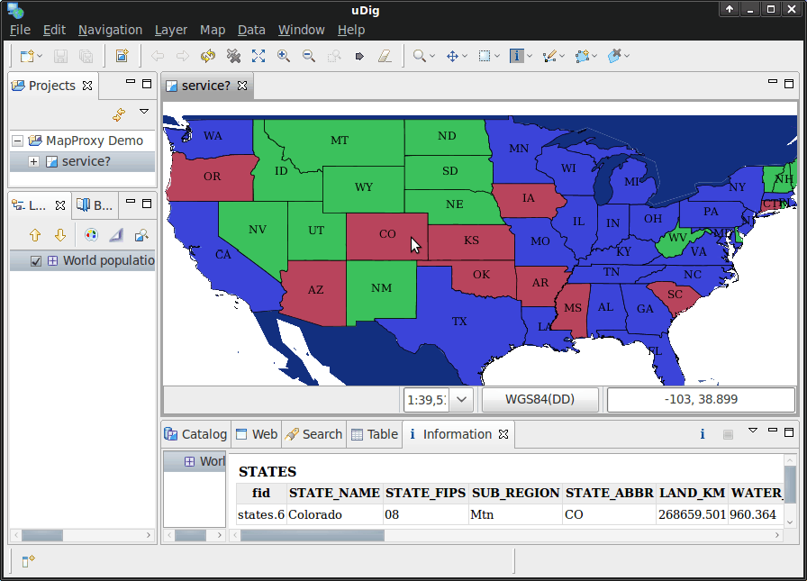

:Author: Oliver Tonnhofer
:Version: osgeo-live5.0
:License: Creative Commons Attribution-ShareAlike 3.0 Unported  (CC BY-SA 3.0)

.. image:: ../../images/project_logos/logo-mapproxy.png
  :alt: project logo
  :align: right
  :target: http://mapproxy.org/

MapProxy Quickstart
~~~~~~~~~~~~~~~~~~~~~~~~~~~~~~~~~~~~~~~~~~~~~~~~~~~~~~~~~~~~~~~~~~~~~~~~~~~~~~~~

MapProxy is *the* swiss army knife for all WMS and tile services.
It caches, accelerates and transforms data from existing map services and serves any desktop or web GIS client.

.. image:: ../../images/screenshots/800x600/mapproxy.png
  :alt: MapProxy diagram
  :align: center

MapProxy is not only a tile cache solution, but also offers many new and innovative features like full support for WMS clients.

Start demo service
--------------------------------------------------------------------------------

MapProxy has flexible deployment options and you can integrate it in Apache for example. But you can also start MapProxy as a standalone service, which is the best option to get started.

To start MapProxy as a standalone service click on :menuselection:`Geospatial --> Web Services --> MapProxy --> Start MapProxy`.

View MapProxy Demo
--------------------------------------------------------------------------------

The MapProxy demo page contains a rudimentary WMS and tile client for each configured layer. You can't select the projection for WMS layers for example, but it is enough to quickly verify that your installation works.

You can open the demo in Firefox: `<http://localhost:8011/demo>`_

View in Desktop GIS
--------------------------------------------------------------------------------

You can add MapProxy in any WMS Desktop GIS like uDig, QGIS or gvSIG. The service URL is: `<http://localhost:8011/service?>`_

The MapProxy example configuration contains a few layers that use different map engines and map data. See below for more details about each layer. 

  
  Single WMS layer with data from two cascaded sources and `FeatureInformation` from one source.

Available layers
--------------------------------------------------------------------------------

**mapnik**:
  The world population rendered by Mapnik. You don't need to start the Mapnik service, because this layer makes use of the integrated Mapnik support in MapProxy.

**tilelite**:
  TileLite is a simple server that delivers tiles from the Mapnik world population service. This layer demonstrates the ability to include existing tile services in MapProxy and to make them available as WMS.
  You need to start TileLite with *Start Mapnik & TileLite* before accessing this layer.

**geoserver**:
  The US population rendered by the :doc:`GeoServer <../overview/geoserver_overview>` WMS. This layer also supports ``GetFeatureInfo`` requests which are cascaded to the source WMS.
  You need to start GeoServer with |osgeolive-appmenupath-geoserver| before accessing this layer.

**mapnik_geoserver**:
  This layer demonstrates the ability to combine multiple sources into one layer. It combines the world population from Mapnik with the US population from GeoServer. The ``GetFeatureInfo`` support for the US population is still available.
  You need to start GeoServer with |osgeolive-appmenupath-geoserver| before accessing this layer.

**mapserver**:
  This layer uses Mapserver Itasca demo dataset. It is a local dataset and it uses the *coverage* feature to limit the BBOX to Itasca, IL.

Create you own configuration
--------------------------------------------------------------------------------

You can use ``mapproxy-util`` to create new configuration templates and to start a test server.

To create a new configuration::

  mapproxy-util create -t base-config ~/mapproxy

To start the test server on port 8011 with the created configuration::

  mapproxy-util serve-develop ~/mapproxy/mapproxy.yaml -b 0.0.0.0:8011

You can now visit the demo page at http://127.0.0.1:8011/demo/.
MapProxy will automatically reload if you change your configuration file.

What Next?
--------------------------------------------------------------------------------

* Read the `documentation of MapProxy <../../mapproxy/index.html>`_

* Read the example configuration (``/usr/local/share/mapproxy/mapproxy.yaml``)

