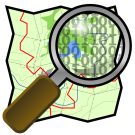

:Author: Hamish Bowman
:Version: osgeo-live6.0
:License: Creative Commons Attribution-ShareAlike 3.0 Unported  (CC BY-SA 3.0)
:Copyright: 2011 by The OSGeo Foundation

********************************************************************************
OpenStreetMap Quickstart 
********************************************************************************

Programs
================================================================================

JOSM
~~~~~~~~~~~~~~~~~~~~~~~~~~~~~~~~~~~~~~~~~~~~~~~~~~~~~~~~~~~~~~~~~~~~~~~~~~~~~~~~

**JOSM** (Java OpenStreetMap Editor) is an editor for OpenStreetMap (OSM)
written in Java. The current version supports stand alone GPX tracks,
GPX track data from OSM database and existing nodes, line segments and
metadata tags from the OSM database.

* Homepage: http://josm.openstreetmap.de

The JOSM plugin collection contains the following plugins:

* colorscheme	     - Allows to create different color schemes.
* livegps	     - Supports live GPS input together with gpsd.
* measurement	     - Adds a dialog and a layer to measure length and angle of segments and create measurement paths.
* openvisible	     - Allows opening gpx and osm files that intersect the currently visible screen area.
* surveyor	     - Allows adding markers/nodes on current gps positions.
* cadastre-fr        - A special handler for the French land registry WMS server.
* DirectUpload       - Directly uploads GPS Traces from current active layer in JOSM to openstreetmap.org.
* editgpx            - Anonymizes timestamps and deletes parts of huge GPX tracks very fast.
* lakewalker         - Helps vectorizing WMS images.
* routing            - Provides routing capabilities.

Further reading
--------------------------------------------------------------------------------

* User guide: http://wiki.openstreetmap.org/wiki/JOSM/Guide
* `Video tutorial <http://showmedo.com/videotutorials/video?name=1800050&amp;fromSeriesID=180>`_
* Online tutorial: http://www.use-it.be/europe/docs/OSMmanual/
* Open the sample data with :menuselection:`File --> Open... --> /usr/local/share/data/osm/feature_city.osm.bz2`
* Further instructions are given when you launch the application.

Merkaartor
~~~~~~~~~~~~~~~~~~~~~~~~~~~~~~~~~~~~~~~~~~~~~~~~~~~~~~~~~~~~~~~~~~~~~~~~~~~~~~~~

**Merkaartor** is a map editor for OpenStreetMap which uses the Qt toolkit.
It's a bit more user friendly than JOSM, but has a few less features.

* Homepage: http://merkaartor.be
* Online help: http://merkaartor.be/wiki/merkaartor/Documentation

Gosmore
~~~~~~~~~~~~~~~~~~~~~~~~~~~~~~~~~~~~~~~~~~~~~~~~~~~~~~~~~~~~~~~~~~~~~~~~~~~~~~~~

**Gosmore** is an in-development OpenStreetMap viewer, wayfinder, and search client
with support for speech synthesis and fetching the current user's
current GPS location using `gpsd <http://savannah.nongnu.org/projects/gpsd>`_.

* Homepage: http://wiki.openstreetmap.org/index.php/Gosmore
* Online wiki help: http://wiki.openstreetmap.org/wiki/Gosmore#User_Interface
* Before running Gosmore you will need to convert a `planet-*.osm` data file. Some data is provided in the `/usr/local/share/osm/` directory.

Upon launching Gosmore from the Geospatial menu or Desktop folders, you will
be given the chance to create the required data file if needed. You can also
manually import it with:

::

  bzip2 -dc /usr/local/share/data/osm/Nottingham_CBD.osm.bz2 | gosmore rebuild

This will create gosmore.pak and only needs to be run once. You can then
search for locations within the OSM dataset, for example "Jubilee Campus".
Use the middle and right mouse buttons to set the origin and
destination for shortest path routing. Use the "O" button to access the
program options, and the "3D" button to get a perspective view useful
for in-car GPS navigation.

Osmarender
~~~~~~~~~~~~~~~~~~~~~~~~~~~~~~~~~~~~~~~~~~~~~~~~~~~~~~~~~~~~~~~~~~~~~~~~~~~~~~~~

**Osmarender** is a rule-based rendering tool for generating SVG images of
OSM data. It takes as its input an OpenStreetMap dataset and a rules file.
It outputs an SVG image that is marked up in accordance with the styles
defined in the rule file. In future it may be replaced with software
like `TileMill <http://wiki.openstreetmap.org/wiki/Tilemill>`_.

* Homepage: http://wiki.openstreetmap.org/wiki/Osmarender

Example:

.. note:: This requires approx. 1 GB free RAM and takes a few days to process
   the full city. A single village or suburb extract should be much more manageable.
   See `Xapi <http://wiki.openstreetmap.org/wiki/Xapi>`_ in the OSM Wiki for
   details on how to download smaller chunks into an ``.osm`` file, or use
   *JOSM* or *Merkaartor* to download a smaller chunk.
   A smaller subset file called `Nottingham_CBD.osm` has been included for your
   convenience, but even that still make take a rather long time to process.

::

  cp /usr/local/share/data/osm/feature_city_CBD.osm.bz2 .
  bzip2 -d feature_city_CBD.osm.bz2
  osmarender feature_city_CBD.osm

You can view the results in a SVG viewer like `Inkscape` or `Firefox`:

::

  firefox feature_city.svg

osm2pgsql
~~~~~~~~~~~~~~~~~~~~~~~~~~~~~~~~~~~~~~~~~~~~~~~~~~~~~~~~~~~~~~~~~~~~~~~~~~~~~~~~

**osm2pgsql** is a utility program that converts OpenStreetMap (.osm) data
into a format that can be loaded into PostgreSQL (PostGIS). It is often
used to render OSM data visually using Mapnik, as Mapnik can query
PostgreSQL for map data, but does not work directly with OSM files.

* Homepage: http://wiki.openstreetmap.org/wiki/Osm2pgsql

osm2poidb
~~~~~~~~~~~~~~~~~~~~~~~~~~~~~~~~~~~~~~~~~~~~~~~~~~~~~~~~~~~~~~~~~~~~~~~~~~~~~~~~

**osm2poidb** is a utility program that extracts Point of Interest (POI) data
from a OpenStreetMap (.osm) data extract. The results are saved into a SQLite
database file. A processed version of the OSM feature city extract provided with
this disc can be found in the `/usr/local/share/data/osm` directory, and explored
with the `SQLite database browser` program in the Databases menu. On this disc
it is used by the :doc:`GpsDrive <../overview/gpsdrive_overview>` software to
provide a searchable list of local amenities. To run it manually, do:

::

  bzcat /usr/local/share/data/osm/feature_city.osm.bz2 | osm2poidb -o feature_city_poi.db STDIN

