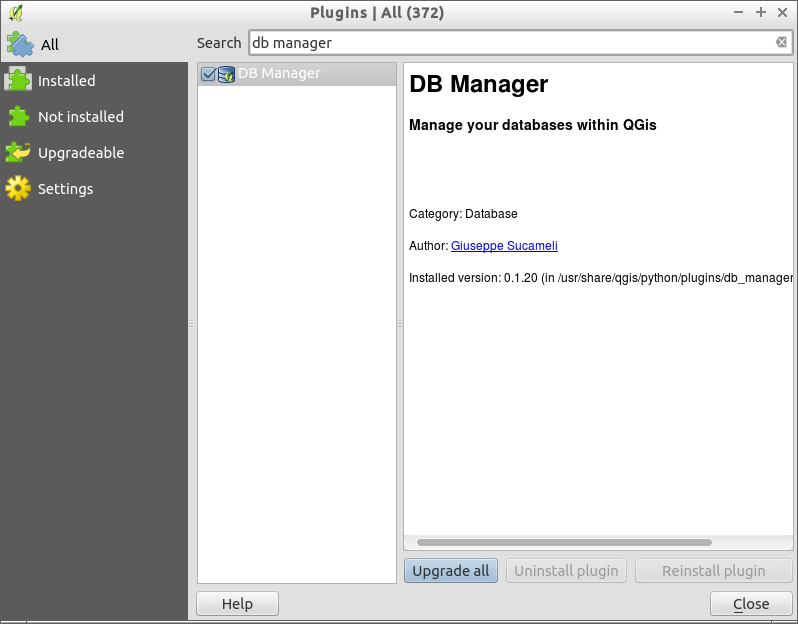

:Author: Barry Rowlingson
:Author: Astrid Emde
:Author: Cameron Shorter
:Version: osgeo-live5.0
:License: Creative Commons Attribution-ShareAlike 3.0 Unported  (CC BY-SA 3.0)

.. image:: ../../images/project_logos/logo-PostGIS.png
  :scale: 30 %
  :alt: project logo
  :align: right
  :target: http://postgis.org/

********************************************************************************
PostGIS Quickstart
********************************************************************************

PostGIS adds spatial capabilities to the PostgreSQL relational database. It extends
PostgreSQL so it can store, query, and manipulate spatial data. In this Quickstart we will
use 'PostgreSQL' when describing general database functions, and 'PostGIS' when
describing the additional spatial functionality provided by PostGIS.

Client-server Architecture
================================================================================

PostgreSQL, like many databases, works as a server in a client-server system.
The client makes a request to the server and gets back a response. This is the
same way that the internet works - your browser is a client and a web server sends
back the web page. With PostgreSQL the requests are in the SQL language and the
response is usually a table of data from the database.

There is nothing to stop the server being on the same computer as the client, and this
enables you to use PostgreSQL on a single machine. Your client connects to the server
via the internal 'loopback' network connection, and is not visible to other computers
unless you configure it to be so.

Three clients will be illustrated here: the command-line client,
:doc:`Quantum GIS <../overview/qgis_overview>`, and the ``pgAdmin`` graphical database client.

Creating A Spatially-Enabled database
================================================================================

.. review comment: Suggest providing a screen grab (or 2) which shows how to select
   and open an xterm. Cameron

Command-line clients run from within a Terminal Emulator window. Start a Terminal
Emulator from the Applications menu in the Accessories section. This gives you a
Unix shell command prompt. Type::

   psql -V

and hit enter to see the PostgreSQL version number.

A single PostgreSQL server lets you organise work by arranging it into separate
databases. Each database is an independent regime, with its own tables, views, users 
and so on. When you connect to a PostgreSQL server you have to specify a
database.

You can get a list of databases on the server with the::

   psql -l

command. You should see several databases used by some of the projects on the system. 
We will create a new one for this quickstart.

.. tip:: 
   The list uses a standard unix pager - hit space for next page, :kbd:`b` to go back, :kbd:`q` 
   to quit, h for help.

PostgreSQL gives us a utility program for creating databases, ``createdb``. We need to
create a database with the PostGIS extensions, so we need to tell it what template
to start from. We'll call our database ``demo``. The command is then:

.. review comment: createdb is a utility programm not a unix command

::

   createdb -T template_postgis demo

.. tip:: 
   You can usually get help for command line tools by using a ``--help`` option.

If you now run ``psql -l`` you should see your ``demo`` database in the listing.

You can also create PostGIS databases using the SQL language. First we'll delete the 
database we just created using the ``dropdb`` command, then use the ``psql`` command
to get an SQL command interpreter:

:: 

  dropdb demo
  psql -d postgres
 
This connects to the database called ``postgres``, which is a system database that
all servers should have. Now enter the SQL to create a new database:

:: 

 postgres=# CREATE DATABASE demo TEMPLATE=template_postgis;

Now switch your connection from the ``postgres`` database to the new ``demo`` database. 
In the future you can connect to it directly with ``psql -d demo``, but here's a neat
way of switching within the ``psql`` command line:

::

 postgres=# \c demo

.. tip:: 
   Hit :kbd:`CTRL` + :kbd:`C` if the psql prompt keeps appearing after pressing return. It will clear your 
   input and start again. It is probably waiting for a closing quote mark, semicolon, or something.

You should see an informational message, and the prompt will change to show that you are now
connected to the ``demo`` database. To check this has worked, type ``\dt`` to list the
tables in the database. You should see something like this:

::

  demo=# \dt
               List of relations
   Schema |       Name       | Type  | Owner 
  --------+------------------+-------+-------
   public | geometry_columns | table | user
   public | spatial_ref_sys  | table | user
  (2 rows)

Those two tables are used by PostGIS. The ``spatial_ref_sys`` table stores information
on valid spatial reference systems, and we can use some SQL to have a quick look:

::

  demo=# SELECT srid,auth_name,proj4text FROM spatial_ref_sys LIMIT 10;

   srid | auth_name |          proj4text                                            
  ------+-----------+--------------------------------------
   3819 | EPSG      | +proj=longlat +ellps=bessel +towgs...
   3821 | EPSG      | +proj=longlat +ellps=aust_SA +no_d...
   3824 | EPSG      | +proj=longlat +ellps=GRS80 +towgs8...
   3889 | EPSG      | +proj=longlat +ellps=GRS80 +towgs8...
   3906 | EPSG      | +proj=longlat +ellps=bessel +no_de...
   4001 | EPSG      | +proj=longlat +ellps=airy +no_defs...
   4002 | EPSG      | +proj=longlat +a=6377340.189 +b=63...
   4003 | EPSG      | +proj=longlat +ellps=aust_SA +no_d...
   4004 | EPSG      | +proj=longlat +ellps=bessel +no_de...
   4005 | EPSG      | +proj=longlat +a=6377492.018 +b=63...
  (10 rows)

This confirms we have a spatially-enabled database. The ``geometry_columns`` table has the 
job of telling PostGIS which tables are spatially-enabled. This is the next step.

Creating A Spatial Table The Hard Way
================================================================================

Now we have a spatial database we can make some spatial tables.

First we create an ordinary database table to store some city data.
This table has two fields - one for a numeric ID and one for the city
name:

::

  demo=# CREATE TABLE cities ( id int4, name varchar(50) );

Next we add a geometry column to store the city locations.
Conventionally this is called
``the_geom``. This tells PostGIS what kind of geometry
each feature has (points, lines, polygons etc), how many dimensions
(in this case two), and the spatial reference
system. We'll be using EPSG:4326 coordinates for our cities.

::

  demo=# SELECT AddGeometryColumn ( 'cities', 'the_geom', 4326, 'POINT', 2);

Now if you check the cities table you should see the new column, and be informed
that the table currently contains no rows.

::

  demo=# SELECT * from cities;
   id | name | the_geom 
  ----+------+----------
  (0 rows)

To add rows to the table we use some SQL statements. To get the geometry into
the geometry column we use the PostGIS ``ST_GeomFromText`` function to convert
from a text format that gives the coordinates and a spatial reference system id:

::

  demo=# INSERT INTO cities (id, the_geom, name) VALUES (1,ST_GeomFromText('POINT(-0.1257 51.508)',4326),'London, England');
  demo=# INSERT INTO cities (id, the_geom, name) VALUES (2,ST_GeomFromText('POINT(-81.233 42.983)',4326),'London, Ontario');
  demo=# INSERT INTO cities (id, the_geom, name) VALUES (3,ST_GeomFromText('POINT(27.91162491 -33.01529)',4326),'East London,SA');

.. tip:: 
   Use the arrow keys to recall and edit command lines.

As you can see this gets increasingly tedious very quickly. Luckily there are other ways of getting
data into PostGIS tables that are much easier. But now we have three cities in our database, and we 
can work with that.

Simple Queries
================================================================================

All the usual SQL operations can be applied to select data from a PostGIS table:

::

 demo=# SELECT * FROM cities;
  id |      name       |                      the_geom                      
 ----+-----------------+----------------------------------------------------
   1 | London, England | 0101000020E6100000BBB88D06F016C0BF1B2FDD2406C14940
   2 | London, Ontario | 0101000020E6100000F4FDD478E94E54C0E7FBA9F1D27D4540
   3 | East London,SA  | 0101000020E610000040AB064060E93B4059FAD005F58140C0
 (3 rows)

This gives us a meaningless hexadecimal version of the coordianates.

If you want to have a look at your geometry in WKT format again, you
can use the functions ST_AsText(the_geom) or ST_AsEwkt(the_geom). You can also
use ST_X(the_geom), ST_Y(the_geom) to get the numeric value of the coordinates:

::

 demo=# SELECT id, ST_AsText(the_geom), ST_AsEwkt(the_geom), ST_X(the_geom), ST_Y(the_geom) FROM cities;
  id |          st_astext           |               st_asewkt                |    st_x     |   st_y    
 ----+------------------------------+----------------------------------------+-------------+-----------
   1 | POINT(-0.1257 51.508)        | SRID=4326;POINT(-0.1257 51.508)        |     -0.1257 |    51.508
   2 | POINT(-81.233 42.983)        | SRID=4326;POINT(-81.233 42.983)        |     -81.233 |    42.983
   3 | POINT(27.91162491 -33.01529) | SRID=4326;POINT(27.91162491 -33.01529) | 27.91162491 | -33.01529
 (3 rows)

Spatial Queries
================================================================================

PostGIS adds many functions with spatial functionality to
PostgreSQL. We've already seen ST_GeomFromText which converts WKT to
geometry. Most of them start with ST (for spatial type) and are listed in a section of
the PostGIS documentation. We'll now use one to answer a practical
question - how far are these three Londons away from each other, in metres,
assuming a spherical earth? 

::

 demo=# SELECT p1.name,p2.name,ST_Distance_Sphere(p1.the_geom,p2.the_geom) FROM cities AS p1, cities AS p2 WHERE p1.id > p2.id;
       name       |      name       | st_distance_sphere 
 -----------------+-----------------+--------------------
  London, Ontario | London, England |   5875766.85191657
  East London,SA  | London, England |   9789646.96784908
  East London,SA  | London, Ontario |   13892160.9525778
  (3 rows)

This gives us the distance, in metres, between each pair of
cities. Notice how the 'WHERE' part of the line stops us getting back
distances of a city to itself (which will all be zero) or the reverse
distances to the ones in the table above (London, England to London, Ontario is the
same distance as London, Ontario to London, England). Try it without the 'WHERE' part
and see what happens.

We can also compute the distance using a spheroid by using a different function and specifying the
spheroid name, semi-major axis and inverse flattening parameters:

::

  demo=# SELECT p1.name,p2.name,ST_Distance_Spheroid(
          p1.the_geom,p2.the_geom, 'SPHEROID["GRS_1980",6378137,298.257222]'
          ) 
         FROM cities AS p1, cities AS p2 WHERE p1.id > p2.id;
        name       |      name       | st_distance_spheroid 
  -----------------+-----------------+----------------------
   London, Ontario | London, England |     5892413.63776489
   East London,SA  | London, England |     9756842.65711931
   East London,SA  | London, Ontario |     13884149.4140698
  (3 rows)

Mapping
================================================================================

To produce a map from PostGIS data, you need a client that can get at the data. Most 
of the open source desktop GIS programs can do this - Quantum GIS, gvSIG, uDig for example. Now we'll
show you how to make a map from Quantum GIS.

Start Quantum GIS from the Desktop GIS menu and choose ``Add PostGIS layers`` from the layer menu. The
parameters for connecting to the Natural Earth data in PostGIS is already defined in the Connections
drop-down menu. You can define new server connections here, and store the settings for easy
recall. Hit ``Edit`` if you want to see what those parameters are for Natural Earth, or just
hit ``Connect`` to continue:

.. image:: ../../images/screenshots/1024x768/postgis_addlayers.png
  :scale: 50 %
  :alt: Connect to Natural Earth
  :align: center

You will now get a list of the spatial tables in the database:

.. image:: ../../images/screenshots/1024x768/postgis_listtables.png
  :scale: 50 %
  :alt: Natural Earth Layers
  :align: center

Choose the lakes and hit ``Add`` at the bottom (not ``Load`` at the
top - that loads database connection parameters), and it should be
loaded into QGIS:

.. image:: ../../images/screenshots/1024x768/postgis_lakesmap.png
  :scale: 50 %
  :alt: My First PostGIS layer
  :align: center

You should now see a map of the lakes. QGIS doesn't know they are lakes, so might not colour
them blue for you - use the QGIS documentation to work out how to change this. Zoom in to
a famous group of lakes in Canada.

Creating A Spatial Table The Easy Way
================================================================================

Most of the OSGeo desktop tools have functions for importing spatial data in files, such as shapefiles,
into PostGIS databases. Again we'll use QGIS to show this.

Importing shapefiles to QGIS can be done via a handy PostGIS Manager plugin. To set it up, go to the 
Plugins menu, select ``Fetch Plugins``. QGIS will then get the latest list of plugins from the 
repository (you will need a working internet connection for this). Then find the ``PostGIS Manager`` and
hit the ``Install plugin`` button.

Now on the Plugin menu you should have a PostGIS Manager entry which gives you an option
to start the manager. You can also click the PostGIS logo button (the elephant with the globe) on the toolbar.

It will then  connect to the Natural Earth database. Leave
the password blank if it asks. You'll see the main manager window. On the left you can select 
tables from the database and use the tabs on the right find out about them. The Preview tab
will show you a little map. Here I've selected the populated places layer
and zoomed in on a little island I know:

.. image:: ../../images/screenshots/1024x768/postgis_managerpreview.png
  :scale: 50 %
  :alt: PostGIS Manager Preview
  :align: center

We will now use the PostGIS Manager to import a shapefile into the database. We'll use
the North Carolina sudden infant death syndrome (SIDS) data that is included with one
of the R statistics package add-ons.

From the ``Data`` menu choose the ``Load data from shapefile`` option. 
Hit the ``...`` button and browse to the ``sids.shp`` shapefile in the R ``maptools`` package:

.. image:: ../../images/screenshots/1024x768/postgis_browsedata.png
  :scale: 50 %
  :alt: Find the shapefile
  :align: center

Leave everything else as it is and hit ``Load``

.. image:: ../../images/screenshots/1024x768/postgis_importsids.png
  :scale: 50 %
  :alt: Import a shapefile
  :align: center

The shapefile should be imported into PostGIS with no errors. Close the PostGIS manager and
get back to the main QGIS window.

Now load the SIDS data into the map using the 'Add PostGIS Layer'
option. With a bit of rearranging of the layers and some colouring, you should be able to produce
a choropleth map of the sudden infant death syndrome counts in North Carolina:

.. image:: ../../images/screenshots/1024x768/postgis_sidsmap.png
  :scale: 50 %
  :alt: SIDS data mapped
  :align: center

Get to know pgAdmin III
================================================================================

You can use the graphical database client ``pgAdmin III`` from the Databases menu to query and modify your database non-spatially. This
is the official client for PostgreSQL, and lets you use SQL to manipulate your data tables.

.. image:: ../../images/screenshots/1024x768/postgis_adminscreen1.png
  :scale: 50 %
  :alt: pgAdmin III
  :align: center

.. image:: ../../images/screenshots/1024x768/postgis_adminscreen2.png
  :scale: 50 %
  :alt: pgAdmin III
  :align: center

Things to try
================================================================================

Here are some additional challenges for you to try:

#. Try some more spatial functions like ``st_buffer(the_geom)``, ``st_transform(the_geom,25831)``, ``x(the_geom)`` - you will find full documentation at http://postgis.org/documentation/

#. Export your tables to shapefiles with ``pgsql2shp`` on the command line.

#. Try ``ogr2ogr`` on the command line to import/export data to your database.

What Next?
================================================================================

This is only the first step on the road to using PostGIS. There is a lot more functionality you can try.

PostGIS Project home

 http://postgis.org

PostGIS Documentation

 http://postgis.org/documentation/
