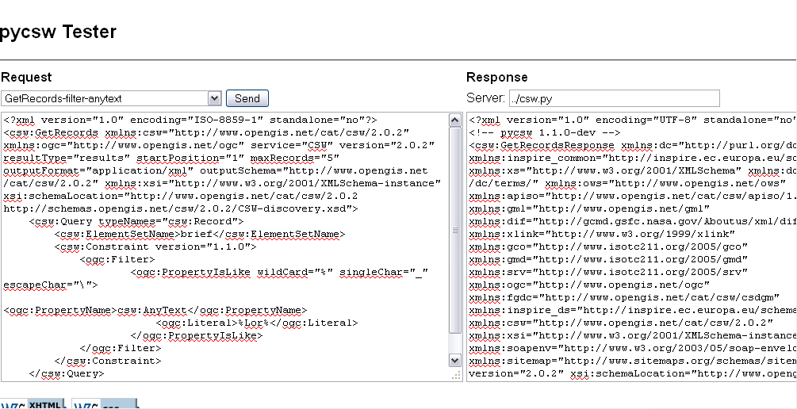

:Author: OSGeo-Live
:Author: Tom Kralidis, Angelos Tzotsos
:Reviewer: 
:Version: osgeo-live5.0
:License: Creative Commons

.. _pycsw-quickstart:

.. image:: ../../images/project_logos/logo-pycsw.png
  :scale: 80 %
  :alt: project logo
  :align: right
  :target: http://pycsw.org/

********************************************************************************
pycsw Quickstart
********************************************************************************

pycsw is an OGC CSW server implementation written in `Python`_.

pycsw implements clause 10 (HTTP protocol binding (Catalogue Services for the Web, CSW)) of the `OpenGIS Catalogue Service Implementation Specification`_, version 2.0.2.  Initial development started in 2010 (more formally announced in `2011`_).

pycsw allows for the publishing and discovery of geospatial metadata.  Existing repositories of geospatial metadata can be exposed via OGC:CSW 2.0.2.

pycsw is `Open Source`_, released under an MIT :ref:`license <license>`, and runs on all major platforms (Windows, Linux, Mac OS X).

pycsw is an optional install on the OSGeo LiveDVD.  This QuickStart will describe how to enable pycsw display the testing interface and access the pycsw endpoint.

.. Installation
.. ============
.. 
.. To install pycsw, TODO (how do we install?)

Testing
=======

To run the pycsw tester, open Firefox and navigate to http://localhost/pycsw/tester/index.html

The capabilities of the pycsw installation can be found at http://localhost/pycsw/csw.py?service=CSW&version=2.0.2&request=GetCapabilities.

.. image:: ../../images/screenshots/1024x768/pycsw_getcapabilities_response.png
  :scale: 75 %

For full functionality, configuration options, and adding metadata to the catalogue, please consult the `documentation`_ on the pycsw website.

.. _`Python`: http://www.python.org/
.. _`OpenGIS Catalogue Service Implementation Specification`: http://www.opengeospatial.org/standards/cat
.. _`2011`: http://www.kralidis.ca/blog/2011/02/04/help-wanted-baking-a-csw-server-in-python/
.. _`Open Source`: http://www.opensource.org/
.. _`documentation`: http://pycsw.org/documentation.html

