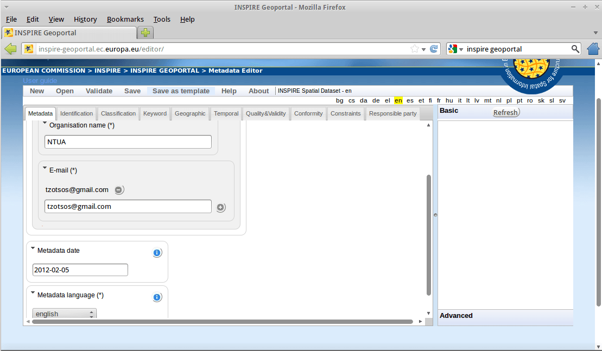

:Author: OSGeo-Live
:Author: Tom Kralidis, Angelos Tzotsos
:Version: osgeo-live7.0-draft
:License: Creative Commons Attribution-ShareAlike 3.0 Unported  (CC BY-SA 3.0)

.. image:: ../../images/project_logos/logo-pycsw.png
  :scale: 80 %
  :alt: project logo
  :align: right
  :target: http://pycsw.org/

.. image:: ../../images/logos/OSGeo_project.png
  :scale: 100
  :alt: OSGeo Project
  :align: right
  :target: http://www.osgeo.org

********************************************************************************
pycsw Quickstart
********************************************************************************

pycsw is an OGC CSW server implementation written in `Python <http://python.org>`_.

pycsw implements clause 10 (HTTP protocol binding (Catalogue Services for the Web, CSW)) of the `OpenGIS Catalogue Service Implementation Specification`_, version 2.0.2.  Initial development started in 2010 (more formally announced in `2011`_).The project is certified `OGC Compliant`_, and is an `OGC Reference Implementation`_.

pycsw allows for the publishing and discovery of geospatial metadata.  Existing repositories of geospatial metadata can be exposed via OGC:CSW 2.0.2.

pycsw is `Open Source`_, released under an MIT license, and runs on all major platforms (Windows, Linux, Mac OS X).

pycsw is installed by default on the OSGeo-Live DVD.  This QuickStart will describe how to:

* perform a fresh installation of pycsw
* test pycsw installation through the tester application
* edit pycsw's Capabilities document and display this information in a browser
* create ISO 19139 XML metadata records (through INSPIRE Metadata Editor or GIMED)
* load the created XML metadata files in pycsw database
* install QGIS CSW Client plugin
* perform discovery of data through the pycsw Catalogue Service within QGIS

Installation
============

System Requirements
-------------------

pycsw is written in `Python <http://python.org>`_, and works with (tested) version 2.6 and 2.7

pycsw requires the following supporting libraries:

- `lxml`_ (version >= 2.2.3) for XML support
- `SQLAlchemy`_ (version >= 0.0.5) for database bindings
- `Shapely`_ (version >= 1.2.8) for spatial query / geometry support
- `pyproj`_ (version >= 1.8.9) for coordinate transformations

Installing from Source
----------------------

`Download pycsw`_ the latest version or clone from `GitHub`_:

.. code-block:: bash

  $ git clone https://github.com/geopython/pycsw.git pycsw 

Ensure that CGI is enabled for your install directory.  For example, on Apache, if you setup pycsw in ``/srv/www/htdocs/pycsw`` (where your URL will be ``http://host/pycsw/csw.py``), add the following to ``httpd.conf``:

.. code-block:: none

  <Location /pycsw/>
   Options FollowSymLinks +ExecCGI
   Allow from all
   AddHandler cgi-script .py
  </Location>

Installing from the Python Package Index (PyPi)
-----------------------------------------------

.. code-block:: bash

  # easy_install or pip will do the trick
  $ easy_install pycsw
  # or
  $ pip install pycsw

Installing on Ubuntu based distributions
----------------------------------------

In order to install pycsw to an Ubuntu based distribution, one can run the following commands:

.. code-block:: bash

  # sudo add-apt-repository ppa:pycsw/stable
  # sudo apt-get update
  # sudo apt-get install python-pycsw pycsw-cgi

Installing on openSUSE
----------------------

In order to install the OBS package in openSUSE 12.3, one can run the following commands as user ``root``:

.. code-block:: bash

  $ zypper -ar http://download.opensuse.org/repositories/Application:/Geo/openSUSE_12.3/ GEO
  $ zypper -ar http://download.opensuse.org/repositories/devel:/languages:/python/openSUSE_12.3/ python
  $ zypper refresh
  $ zypper install python-pycsw pycsw-cgi

For earlier openSUSE versions change ``12.3`` with ``12.2``. For future openSUSE version use ``Factory``. Rolling version ``Tumbleweed`` is also supported.
pycsw is included in the official Application::Geo repository of OpenSUSE Build Service.

Tester Application
==================

To run the pycsw tester, use the pycsw launcher from the Web Services group, or open Firefox and navigate to ``http://localhost/pycsw/tester/index.html``:

.. image:: ../../images/screenshots/1024x768/pycsw_tester_startup.png
  :scale: 75 %

By selecting the left drop-down list, the user can see various predefined POST requests, encoded as XML, that can be sent to pycsw: 

.. image:: ../../images/screenshots/1024x768/pycsw_tester_selection.png
  :scale: 75 %

For example, by selecting "apiso/DescribeRecord", and pushing the "Send" button, a description of the ISO Application Profile record is presented on the right panel:

.. image:: ../../images/screenshots/1024x768/pycsw_tester_describe_apiso_record.png
  :scale: 75 %

By selecting "GetCapabilities-SOAP" and pushing the "Send" button, a SOAP request is sent to the server to advertise their web service capabilities:

.. image:: ../../images/screenshots/1024x768/pycsw_tester_soap_capabillities.png
  :scale: 75 %

Also, the user can search for data records, performing a spatial bounding box query, by selecting "GetRecords-filter-bbox" and editing the coordinates in the XML request:

.. image:: ../../images/screenshots/1024x768/pycsw_tester_getrecords_bbox_filter.png
  :scale: 75 %

The user can go through all the available requests and perform various requests from this testing application.

Capabilities Document and Configuration
=======================================

The capabilities of the pycsw installation can be found at ``http://localhost/pycsw/csw.py?service=CSW&version=2.0.2&request=GetCapabilities``.

To edit the web service metadata, included in the capabilities document, the user can modify the file ``/var/www/pycsw/default.cfg`` under the tag ``[metadata:main]``.

If the user wants to enable INSPIRE Discovery Service support, the metadata under the tag ``[metadata:inspire]`` has to be filled in and the ``enabled`` property has to be set to ``true``.

For full functionality and configuration options, please consult the `documentation`_ on the pycsw website.

Metadata Creation
=================

Using European Open Source Metadata Editor (EUOSME)
---------------------------------------------------

Metadata files for a spatial dataset or a spatial web service can be created through the open source implementation of inspire directive for metadata, European Open Source Metadata Editor (EUOSME). This application can be found at ``http://inspire-geoportal.ec.europa.eu/editor/``. Source code is available at ``https://joinup.ec.europa.eu/svn/euosme/trunk``

The user fills the mandatory metadata fields going through the application tabs, adding information like the name of the data owner, keywords, resource location on the web, geographic location (using a bounding box or the name of a country) etc. 

After the user has added all the information available, must push the validation button on top of the page, so that a check to be performed for consistency with the INSPIRE directive. 

.. image:: ../../images/screenshots/1024x768/pycsw_euosme_save_metadata.png
  :scale: 75 %

After a sucessful validation, the XML file can be saved to the local disk and viewed through a text editor or a browser.

Using GIMED
-----------

`GIMED`_ is a Free Software for creating and editing INSPIRE compliant metadata XML files.
To install the application, use the following commands from a terminal:

.. code-block:: bash

  $ wget http://downloads.sourceforge.net/project/gimed/GIMED_v1.3.0.tar.gz
  $ tar zxvf GIMED_v1.3.0.tar.gz
  $ mono ./GIMED_v1.3.0/bin/GIMED.exe

The user can follow the same workflow as in EUOSME to add and edit metadata, without the need for an internet connection.

.. image:: ../../images/screenshots/1024x768/pycsw_gimed.png
  :scale: 75 %

Loading Metadata
================

Metadata Repository Setup
-------------------------

pycsw supports the following databases:

- SQLite3
- PostgreSQL (PostGIS optional)
- MySQL

In OSGeo-Live, a simple SQLite setup has been implemented. The database can be found in ``/var/www/pycsw/tests/suites/cite/data/records.db``

Create new database
-------------------

In order to create a new SQLite database we need to:

1. Edit ``default.cfg``:

**[repository]**

- **database**: the full file path to the metadata database, in database URL format (see http://docs.sqlalchemy.org/en/latest/core/engines.html#database-urls)
- **table**: the table name for metadata records (default is ``records``)

2. Setup the database:

.. code-block:: bash

  $ cd /var/www/pycsw
  $ export PYTHONPATH=`pwd` 
  $ sudo python ./sbin/pycsw-admin.py -c setup_db -f default.cfg

This will create the necessary tables and values for the repository.

The database created is an `OGC SFSQL`_ compliant database, and can be used with any implementing software.  For example, to use with `OGR`_:

.. code-block:: bash

  $ ogrinfo /path/to/records.db
  INFO: Open of 'records.db'
  using driver 'SQLite' successful.
  1: records (Polygon)
  $ ogrinfo -al /path/to/records.db
  # lots of output

Importing Metadata
------------------

.. code-block:: bash

  $ cd /path/to/pycsw
  $ export PYTHONPATH=`pwd`
  $ sudo ./sbin/pycsw-admin.py -c load_records -f default.cfg -p /path/to/records -r

This will import all ``*.xml`` records from ``/path/to/records`` into the new database and configure the repository to expose queryables as per Table 53 of OGC:CSW.

QGIS CSW Client Installation
============================

The HTTP request/response mechanism is not friendly enough to the end user in order to perform queries to the Catalogue Service.
For this tutorial, we will use the :doc:`QGIS <../overview/qgis_overview>` `OGC Catalogue Service Client <https://sourceforge.net/apps/trac/qgiscommunitypl/wiki/qgcsw>`_ plugin.

To install the plugin in OSGeoLive:

.. code-block:: bash

  $ cd /usr/share/qgis/python/plugins
  $ sudo svn co https://qgiscommunitypl.svn.sourceforge.net/svnroot/qgiscommunitypl/python/plugins/qgcsw/trunk/ qgcsw

Data Discovery
==============

QGIS CSW Plugin
---------------

Start QGIS from the Desktop GIS group and go to "Manage Plugins"

.. image:: ../../images/screenshots/1024x768/pycsw_qgis_plugin.png
  :scale: 75 %

Enable the CSW plugin from the list

.. image:: ../../images/screenshots/1024x768/pycsw_qgis_plugin_enable.png
  :scale: 75 %

Then select the CSW button from the toolbar and launch CSW Client

.. image:: ../../images/screenshots/1024x768/pycsw_qgis_csw_plugin_open.png
  :scale: 75 %

Add the pycsw server by pressing the "New" button and type in ``http://localhost/pycsw/csw.py``

.. image:: ../../images/screenshots/1024x768/pycsw_qgis_csw_plugin_add_server.png
  :scale: 75 %

The user can add some default servers using the "Add default servers" button and also get the capabilities of the server using "Server info" button

.. image:: ../../images/screenshots/1024x768/pycsw_qgis_csw_plugin_server_info.png
  :scale: 75 %

Perform search using the catalogue, either by a string value or with a bounding box

.. image:: ../../images/screenshots/1024x768/pycsw_qgis_csw_plugin_search.png
  :scale: 75 %

Data Discovery through GeoExt
-----------------------------

Another way to use a pycsw server is through a web application, acting like a CSW client.
Such functionality is available through `OpenLayers <http://openlayers.org>`_ and `GeoExt <http://www.geoext.org/>`_ Javascript libraries.

For this tutorial we have hacked a small demonstration in GeoExt (thanks `Bart van den Eijnden <https://github.com/bartvde>`_) using a demo pycsw installation at http://demo.pycsw.org/services/csw: 

- Go to http://demo.pycsw.org/viewer/index2.html
- Click icon "find layers"
- Enter "airports" (without double quotes)
- Click "search" or hit Enter
- See results
- Click the "add to map" icon beside the last result on that result set ("1 Million Scale - Airports")
- See layer added to map panel

.. image:: ../../images/screenshots/1024x768/pycsw_client_gxp.png
  :scale: 60 %

Tester Application
------------------

Discovery of data can be also performed through the Tester application by setting the appropriate requests eg. any text search with the string "imagery" leads to discovering the xml data created previously by EUOSME

.. image:: ../../images/screenshots/1024x768/pycsw_tester_discovery.png
  :scale: 75 %

For more information on pycsw, please consult the `documentation`_ on the pycsw website.

.. _`OpenGIS Catalogue Service Implementation Specification`: http://www.opengeospatial.org/standards/cat
.. _`2011`: http://www.kralidis.ca/blog/2011/02/04/help-wanted-baking-a-csw-server-in-python/
.. _`Open Source`: http://www.opensource.org/
.. _`documentation`: http://pycsw.org/docs/documentation.html
.. _`lxml`: http://lxml.de/
.. _`SQLAlchemy`: http://www.sqlalchemy.org/
.. _`Shapely`: http://trac.gispython.org/lab/wiki/Shapely
.. _`pyproj`: http://code.google.com/p/pyproj/
.. _`Download pycsw`: http://pycsw.org/download.html
.. _`GIMED`: http://sourceforge.net/projects/gimed/
.. _`OGC Compliant`: http://www.opengeospatial.org/resource/products/details/?pid=1104
.. _`OGC Reference Implementation`: http://demo.pycsw.org/
.. _`GitHub`: https://github.com/geopython/pycsw
.. _`OGR`: http://www.gdal.org/ogr
.. _`OGC SFSQL`: http://www.opengeospatial.org/standards/sfs

