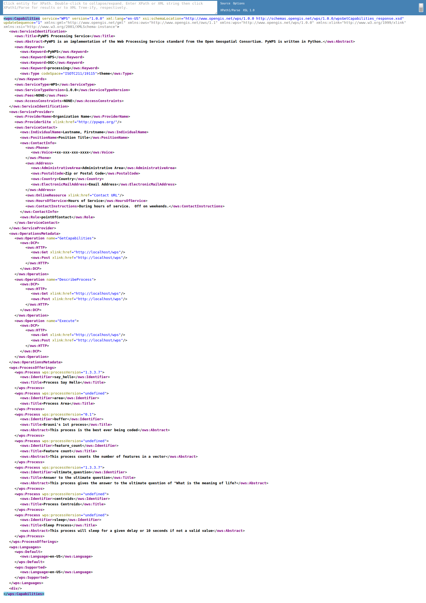
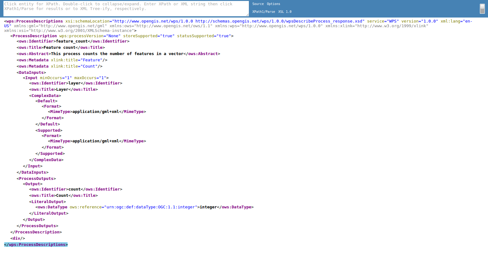
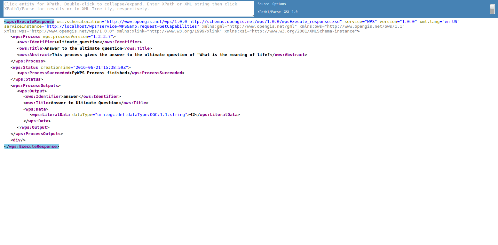
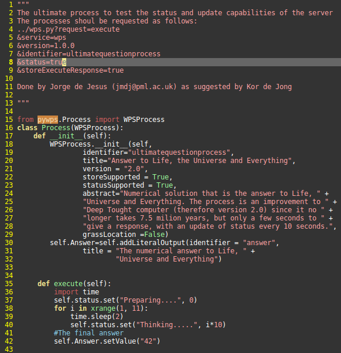
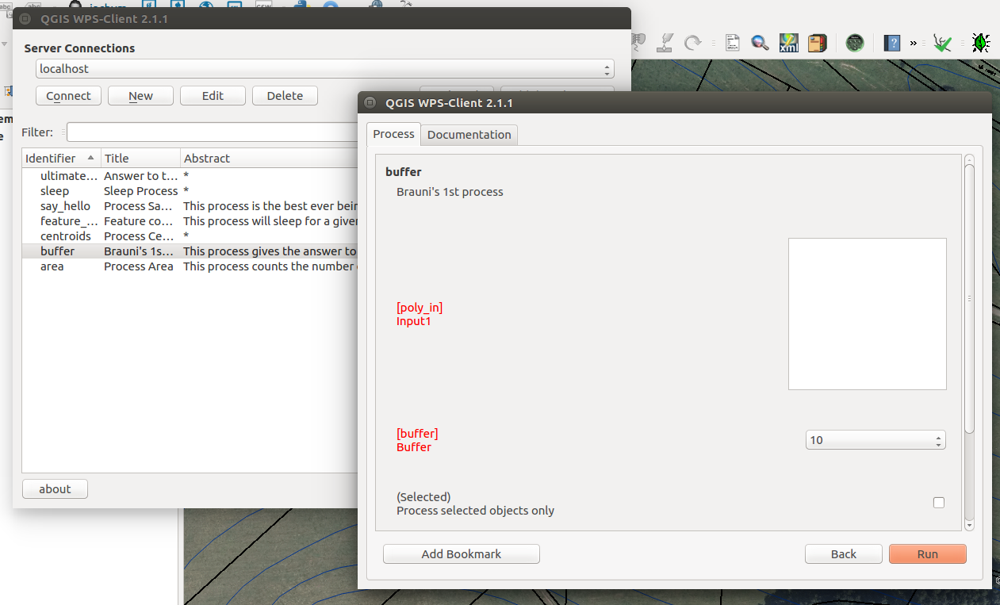

:Author: OSGeo-Live
:Author: Jachym Cepicky, Tom Kralidis
:Version: osgeo-live10.0-draft
:License: Creative Commons Attribution

.. image:: ../../images/logos/OSGeo_incubation.png
  :scale: 100
  :alt: OSGeo Project in Incubation
  :align: right
  :target: http://www.osgeo.org

****************
PyWPS Quickstart
****************

PyWPS is an OGC WPS (Web Processing Service 1.0.0) server implementation written
in `Python <http://python.org>`_.

PyWPS is installed by default on the OSGeo-Live DVD.  This Quickstart will describe how to:

* perform a fresh installation of PyWPS
* test PyWPS installation
* basic configuration of PyWPS instance
* create and deploy process in PyWPS
* perform `GetCapabilities`, `DescribeProcess` and `Execute` operations

Tester Application
==================

To run the PyWPS tester, use the PyWPS launcher from the Web Services group, or open Firefox and navigate to ``http://localhost/pywps/wps.py``:

From Application menu, start Terminal application and test `GetCapabilities`
operation::

    $ wget -O - "http://localhost/pywps/wps.py?service=WPS&version=1.0.0&request=GetCapabilities"

    <wps:Capabilities service="WPS"
    ...
    </wps:Capabilities>

You should see full WPS Capabilites response document. You can also see similar
response using `browser <http://localhost/pywps/wps.py?service=WPS&version=1.0.0&request=GetCapabilities>`_

Select some process from the list, for example `ultimatequestionprocess`, and
display it's description by calling `DescribeProcess` operation.::

    $ wget -O - "http://localhost/pywps/wps.py?service=wps&version=1.0.0&request=DescribeProcess&identifier=ultimatequestionprocess"

    <wps:ProcessDescriptions
    ...
    </wps:ProcessDescriptions>

Again, you should see WPS DescribeProcess response document. You can also see similar
response using `browser <http://localhost/pywps/wps.py?service=WPS&version=1.0.0&request=DescribeProcess&identifier=ultimatequestionprocess>`_

Now let us Execute `ultimatequestionprocess`, on the server. The process is,
according to it's description, able to *Answer to Life, the Universe and Everything*. No inputs are requied.::

    $ wget -O - "http://localhost/pywps/wps.py?service=WPS&version=1.0.0&request=Execute&identifier=ultimatequestionprocess"

    # wait about 10s

    <wps:ExecuteResponse
    ...
         <wps:Data>
                <wps:LiteralData dataType="integer">42</wps:LiteralData>
        </wps:Data>  
    ...
    </wps:ExecuteResponse>

As you might know, it takes a while, before the process is calculated. In our
case, it's about 10s. At the end, we can see the answer to life, universe and
everyting.

Configuration
=============

You can configure PyWPS instance in the `/etc/pywps/pywps.cfg`
configuration file. The values are self explaining, but you can always refer to
`standard documentation <http://geopython.github.io/pywps/doc/build/html/configuration/index.html#configuration-of-pywps-instance>`_

Processes
---------

You can find some example processes in the `/etc/pywps/processes`
directory. Every process is usually stored in separate file and is represented
by Python class, with constructor and `execute()` method::

    
    # Example of PyWPS process (shorten)
    from pywps.Process import WPSProcess                               
    class Process(WPSProcess):
     def __init__(self):
         WPSProcess.__init__(self,
                             identifier="ultimatequestionprocess", #the same as the file name
                             ....
                                           
     def execute(self):
         import time
         self.status.set("Preparing....", 0)
         for i in xrange(1, 11):
             time.sleep(2)
             self.status.set("Thinking.....", i*10) 
         #The final answer    
         self.Answer.setValue("42")

  Same address in the browser

Directory of your process deployment is configured within the
`PYWPS_PROCESSES` environment variable.

You can also try to install `WPS Plugin <https://plugins.qgis.org/plugins/wps/>`_ to
`QGIS project <en/quickstart/qgis_quickstart.rst>`_ 

For more information on PyWPS, please consult the `documentation`_ on the PyWPS website.

.. _`OpenGIS Web Processing Service`: http://www.opengeospatial.org/standards/wps
.. _`Open Source`: http://www.opensource.org/
.. _`documentation`: http://pywps.org/docs
.. _`lxml`: http://lxml.de/
.. _`Download`: http://pywps.org/download
.. _`GitHub`: https://github.com/geopython/PyWPS
