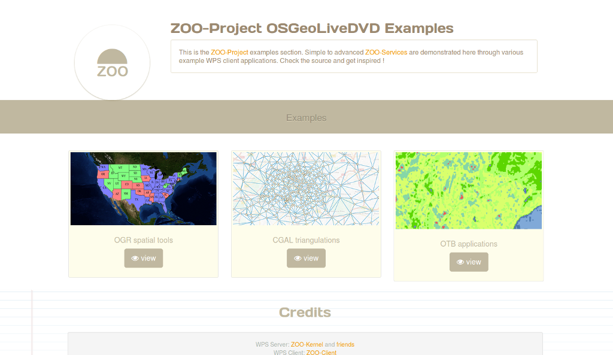

:Author: Gérald Fenoy
:Reviewer: Angelos Tzotsos
:Reviewer: Cameron Shorter, Jirotech
:Version: osgeo-live6.5
:License: Creative Commons Attribution-ShareAlike 3.0 Unported  (CC BY-SA 3.0)

.. image:: ../../images/project_logos/logo-ZOO-Project.png
  :scale: 100 %
  :alt: project logo
  :align: right

********************************************************************************
ZOO Project Quickstart 
********************************************************************************

The ZOO-Project provides a developer friendly Web Processing Service (WPS) framework for creating and chaining Web Processing Services.
A WPS provides web access to functions which run spatial algorithms.

This Quick Start describes how to:

  * Apply processes to a WFS from a web browser.

.. contents:: Contents
  

Running
================================================================================

*       To run the ZOO Project demo from the OSGeo-Live DVD, click on the "ZOO Project" link you will find it in the menu-items under "Geospatial" > "Web Services".

*       Firefox will open the ZOO Project demonstration landing page. From here, you can decide what is the demonstration you want to use.

  
*	Click on the map to select a feature from the :doc:`GeoServer <../overview/geoserver_overview>` WFS Server, the feature will be displayed in blue, then click on simple geometry process like Buffer, Centroid, ConvexHull or Boundary and the result will be displayed in yellow.

.. image:: ../../images/screenshots/1024x768/zoo-project-demo-2.png
  :scale: 50 %
  :alt: screenshot
  :align: center
  

*	Now select another feature near the first you've selected then click on multiple geometries process button Union, Intersection, Symmetric Difference or Difference to get the result displayed in red on the map.

.. image:: ../../images/screenshots/1024x768/zoo-project-demo-3.png
  :scale: 50 %
  :alt: screenshot
  :align: center

What Next?
================================================================================

*	You can build your own requests and send them to the ZOO Kernel from the following page:
		http://localhost/zoo-demo/test_services.html

*	You would need the capabilities of the ZOO WPS Server:
		http://localhost/zoo/?Request=GetCapabilities&Service=WPS
	
*	For further questions you can contact the ZOO Project mailing list:
	zoo-discuss@lists.osgeo.org
