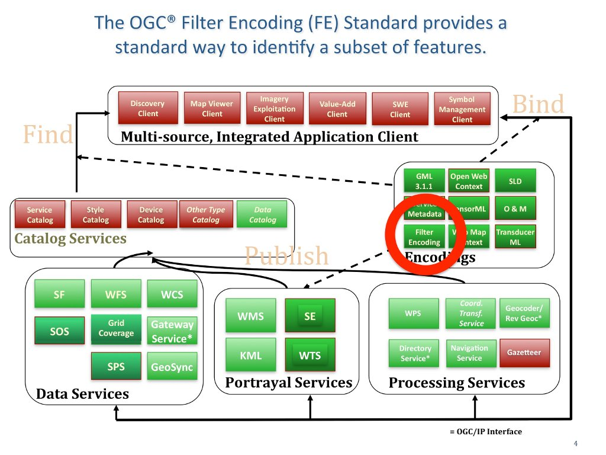

.. Writing Tip:
  Writing tips describe what content should be in the following section.

.. Writing Tip:
  Metadata about this document

:Author: OGC
:License: Creative Commons

.. Writing Tip: 
  Project logos are stored here:
    https://svn.osgeo.org/osgeo/livedvd/gisvm/trunk/doc/images/project_logos/
  and accessed here:
    ../../images/project_logos/<filename>
  A symbolic link to the images directory is created during the build process.

.. image:: ../../images/project_logos/logo-OGC-left.png
  :scale: 100 %
  :alt: OGC logo
  :align: right

.. image:: ../../images/project_logos/logo-OGC-right.png
  :scale: 100 %
  :alt: OGC logo
  :align: right

.. Writing Tip: Name of application

Filter Encoding (FE)
================================================================================

.. Writing Tip:
  1 paragraph or 2 defining what the standard is.

The OGC® Filter Encoding Standard (FE) defines an XML encoding for expressing filters for spatial queries in order to select a subset of features based upon specific attributes.
(http://www.opengeospatial.org/standards/filter)

A subset of features might be identified to render them in a particular color or convert them into a user-specified format. The neutral XML filter encoding allows easy parsing and validation by a server implementing the OGC WFS standard before the filter expression is transformed into the targeted language of the data store that is being queried. This standard is used by a number of OGC Web Services, including the Web Feature Service, the Catalogue Service and the Styled Layer Descriptor Standard.

Filter constraints can be specified on values of spatial, temporal and scalar properties. An example of a spatial filter is: “Find all the properties in Omstead County owned by Peter Vretanos.” An example of a temporal filter is: “Find all the dams in Massachusetts that were built before 1900.” An example of a scalar filter is: “Find all the temperature sensors in Paris that are reporting temperature between 20 degrees C. and 24 degrees C.” 

See Also
--------------------------------------------------------------------------------

.. Writing Tip:
  Describe Similar standard

* :doc:`sld_overview`
* :doc:`csw_overview`
* :doc:`wfs_overview`
* :doc:`wms_overview`

