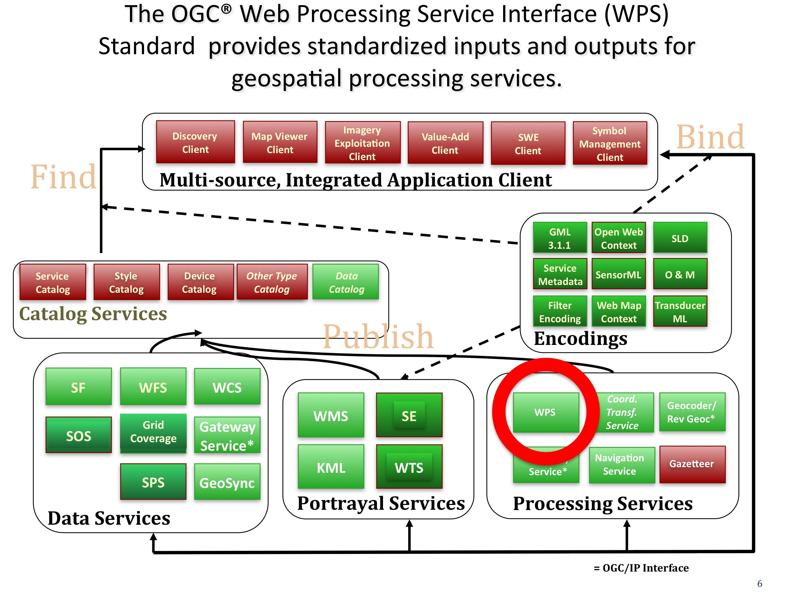

.. Writing Tip:
  Writing tips describe what content should be in the following section.

.. Writing Tip:
  Metadata about this document

:Author: OGC
:License: Creative Commons

.. Writing Tip: 
  Project logos are stored here:
    https://svn.osgeo.org/osgeo/livedvd/gisvm/trunk/doc/images/project_logos/
  and accessed here:
    ../../images/project_logos/<filename>
  A symbolic link to the images directory is created during the build process.

.. image:: ../../images/project_logos/logo-OGC-left.png
  :scale: 100 %
  :alt: OGC logo
  :align: right

.. image:: ../../images/project_logos/logo-OGC-right.png
  :scale: 100 %
  :alt: OGC logo
  :align: right

.. Writing Tip: Name of application

Web Processing Service (WPS)
================================================================================

.. Writing Tip:
  1 paragraph or 2 defining what the standard is.

The WPS standard provides rules for standardizing inputs and outputs (requests and responses) for geospatial processing services, such as polygon overlays and their inputs and outputs.

The OGC® Web Processing Service (WPS) Standard describes how to access geospatial processes from a web interface.
Processes include any algorithm, calculation or model that operates on spatially referenced vector or raster data. A WPS may offer calculations as simple as subtracting one set of spatially referenced numbers from another (e.g., determining the difference in influenza cases between two different seasons), or as complicated as a global climate change model.  (http://www.opengeospatial.org/standards/wps) 

A WPS is particularly useful for:

* Reducing complexity in data processing by providing plug & play algorithms.
* Enabling processes to be chained together.
* Enabling processing to be deployed once then used everywhere.
* Streamlined maintenance. Processes/models are maintained in a central place by the entities who created them.
* Taking advantage of high-speed computational capabilities on a central server.
* Easy and interoperable access to highly complex processes, such as climate change models.

See Also
--------------------------------------------------------------------------------

.. Writing Tip:
  Describe Similar standard

Other OGC data service standards: 

* Web Coverage Processing Service
* Sensor Planning Service
* :doc:`wcs_overview`
* :doc:`wms_overview`
* :doc:`wfs_overview`
* Grid Coverage Service
* :doc:`sos_overview`
