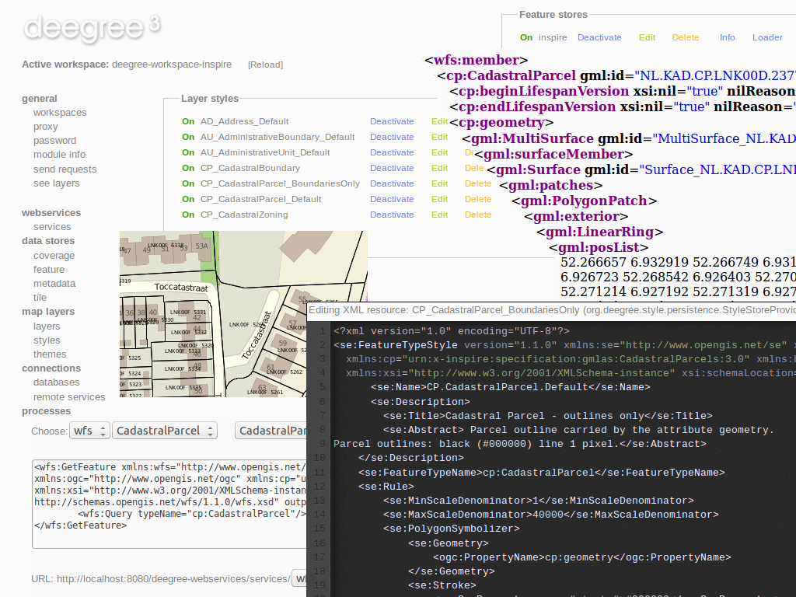

:Author: Johannes Wilden, Markus Schneider, Danilo Bretschneider
:Reviewer: Cameron Shorter, Jirotech
:Translator: Javier Sánchez
:Translator: David Mateos
:Version: osgeo-live7.0
:License: Creative Commons Attribution 3.0 Unported (CC BY 3.0)

.. image:: ../../images/project_logos/logo-deegree.png
  :alt: project logo
  :align: right
  :target: http://www.deegree.org

.. image:: ../../images/logos/OSGeo_project.png
  :scale: 100
  :alt: OSGeo Project
  :align: right
  :target: http://www.osgeo.org

deegree
================================================================================

Servicios Web
~~~~~~~~~~~~~~~~~~~~~~~~~~~~~~~~~~~~~~~~~~~~~~~~~~~~~~~~~~~~~~~~~~~~~~~~~~~~~~~~

deegree proporciona servicios web geoespaciales basados en las especificaciones `Open Geospatial Consortium (OGC) <http://www.opengeospatial.org>`_ e `INSPIRE Network Services <http://inspire.jrc.ec.europa.eu>`_ . En concreto soporta: 

* `Web Map Services (WMS) <http://www.opengeospatial.org/standards/wms>`_: Sirve mapas renderizados a partir de datos geoespaciales.
* `Web Map Tile Services (WMTS) <http://www.opengeospatial.org/standards/wmts>`_: Sirve teselas de mapas pre-renderizadas. 
* `Catalogue Services for the Web (CSW) <http://www.opengeospatial.org/standards/cat>`_: Desarrolla búsquedas de conjuntos de datos y servicios geoespaciales. 
* `Web Processing Services (WPS) <http://www.opengeospatial.org/standards/wps>`_: Ejecuta procesamientos geoespaciales.

Características principales
--------------------------------------------------------------------------------

** Web Feature Service (WFS) **

* Implementa estándares WFS 1.0.0, 1.1.0 y 2.0.0.
* Completamente transaccional.
* Soporta peticiones KVP, XML y SOAP.
* Entrada y salida GML 2/3.0/3.1/3.2.
* Supporte para peticiones GetGmlObject y XLink.
* Alto rendimiento y excelente escalabilidad.
* Transformación de coordenadas al vuelo.
* Designed for rich data models from the bottom up
* Los *Backends* soportan el mapeado fledxible de schemas de aplicación GML a modelos relacionales.
* Cumple con el modelo geométrico ISO 19107: Geometrías complejas (e.g. curvas no-lineales).
* Soporte de expresioens de filtrado avanzadas basadas en XPath 1.0.
* Soporta numerosos *backends*, como PostGIS, Oracle Spatial, MS SQL Server, Shapefiles o GML.

** Web Map Service **

* Implementa los estándares WMS 1.1.1 y 1.3.0.
* Soporta y utiliza definición de estilos (SLD/SE versiones 1.0.0 y 1.1.0).
* Alto rendimiento y excelente escalabilidad.
* Permite aplicar distintos estilos en función de la escala.
* El soporte para SE elimina la necesidad de un montón de extensiones propietarias.
* Configuración sencilla de HTML y otros formatos de salida para las respuestas a GetFeatureInfo.
* Uses stream-based data access, minimal memory footprint.
* Soporte casi completo para simbología raster tal y como está definida en SE (con algunas extensiones
.
* Soporte completo para TIEMPO/ELEVACIÖN y otras dimensiones tanto para entidades como para datos ráster. 
* Supporta numerosos *backends*, como PostGIS, Oracle Spatial, MS SQL Server, Shapefiles o GML.
* Puede renderizar modelos de datos complejos directamente.

**WMTS**

* Implementa el estándar Basic WMTS 1.0.0 (KVP).
* Alto rendimiento y excelente escalabilidad.
* Soporta diferentes *backends*, tales como GeoTIFF, WMS remoto o file system tile image hierarchies
* Soporta cacheado al vuelo (usando EHCache).
* Soporta GetFeatureInfo para *backends* WMS remotos.

**CSW**

* Implementa el estándar CSW 2.0.2.
* Completamente transaccional.
* Soporta peticiones KVP, XML y SOAP.
* Alto rendimiento y excelente escalabilidad.
* ISO Metadata Application Profile 1.0.0.
* Pluggable and modular dataaccess layer allows to add support for new APs and backends
* Modular inspector architecture allows to validate records to be inserted against various criteria
* Standard inspectors: validación de *schema*,  validity, identifier integrity, requerimientos INSPIRE.ents
* Handles all defined queryable properties (for Dublin Core as well as ISO profile) 
* Expresiones de filtrado complejas. 

**WPS**

* Implementa el estándar WPS 1.0.0.
* Soporta peticiones KVP, XML y SOAP.
* Pluggable process provider layer
* API fácil de usar para implementar procesos en Java. 
* Soporta todas las variantes para parámetros de entrada/salida: literales, bbox, complejos (binarios y xml)
* Streaming access for complex input/output parameters
* Procesado de grandes volúmenes de datos con un consumo de memoria mínimo. 
* Soporta storing of response documents/output parameters
* Soporta parámetros de entrada en línea y por referencia. 
* Soporta respuestas RawDataOutput/ResponseDocument.
* Soporta ejecución asíncrona (with polling of process status)

Estándardes implementados
--------------------------------------------------------------------------------

* OGC Web Feature Service (WFS) 1.0.0, 1.1.0 y 2.0.0.
* OGC Web Map Service (WMS) 1.1.1 y 1.3.0.
* OGC Web Map Tile Service (WMTS) 1.1.0.
* OGC Catalogue Service-Web (CSW) 2.0.2.
* OGC Web Processing Service (WPS) 1.0.0.
* OGC GML 2.12, 3.0.1, 3.1.1 y 3.2.1.

Detalles
--------------------------------------------------------------------------------

**Sitio web:** http://www.deegree.org

**Licencia:** LGPL

**Versión de software:** |version-deegree|

**Plataformas soportadas:** Windows, Linux

**API de Interfaces:** Java

**Soporte:** http://wiki.deegree.org/deegreeWiki/GettingSupport

Guía de inicio rápido
--------------------------------------------------------------------------------

* :doc:`Guía de inicio rápido <../quickstart/deegree_quickstart>`
