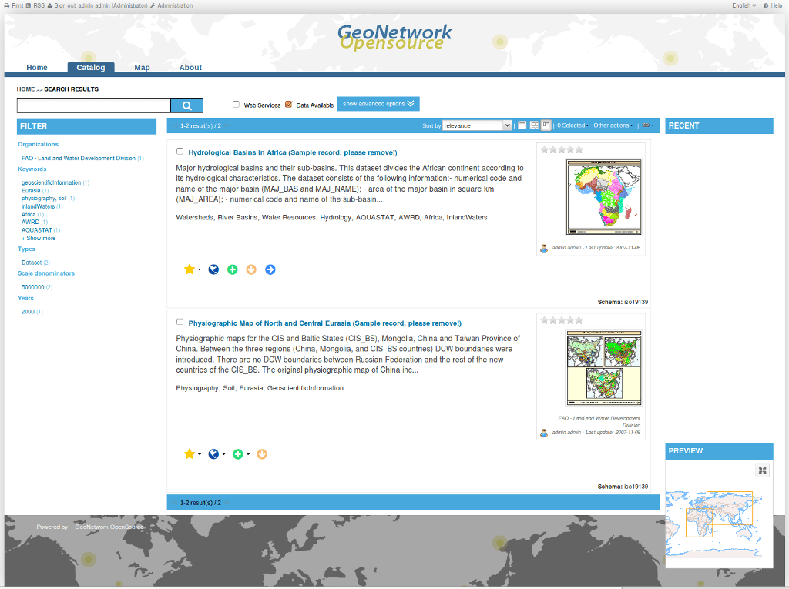

:Author: OSGeo-Live
:Version: osgeo-live4.0
:License: Creative Commons

.. _geonetwork-overview:

.. image:: ../../images/project_logos/logo-GeoNetwork.png
  :scale: 100 %
  :alt: logo del proyecto
  :align: right
  :target: http://geonetwork-opensource.org/

.. image:: ../../images/logos/OSGeo_project.png
  :scale: 100
  :alt: Proyecto OSGeo
  :align: right
  :target: http://www.osgeo.org

GeoNetwork
==========

Catálogo de metadatos
~~~~~~~~~~~~~~~~~~~~~

GeoNetwork opensource es una aplicación para gestionar catálogos de recursos georreferenciados. Proporciona funciones avanzadas de edición y búsqueda de metadatos, incorpora un visor web de mapas interctivo, y se basa en estándares abiertos.

Características Principales
---------------------------
* Acceso inmediato a la búsqueda de catálogos geoespaciales, tanto locales como distribuidos
* Carga y descarga de datos, gráficos, documentos, PDF y cualquier otro tipo de contenido
* Incorpora un visualizador interactivo de mapas en el que mostrar conjuntamente  servicios de mapas procedentes de cualquier lugar del mundo
* Acceso a canales de suscripción RSS y GeoRSS con los últimos cambios realizados en el catálogo de metadatos
* Edición en línea de metadatos, provista de un potente sistema de plantillas
* Soporte nativo de los formatos de metadatos ISO19115/ISO19119/ISO19139/ISO19110, FGDC y Dublin Core
* Operaciones programables de recolección (harvesting) y sincronización de metadatos en catálogos distribuidos. Capaz de comunicarse con: GeoNetwork, CSW, OGC WxS GetCapabilities, Z39.50, WebDav, ArcSDE, Thredds, OGC WFS Features y OAI-PMH
* Control de acceso pormenorizado
* Gestión de grupos y usuarios
* Interfaz de usuario multilingüe
* Muestra aleatoria de un mapa destacado en la pantalla principal

Estándares implementados
------------------------

* Servicio Web de Catálogo (CSW 2.0.2 ISO) de OGC
* Protocolo para la Recolección de Metadatos del Open Archives Initiative (OAI-PMH)
* Z39.50 
* OpenSearch-Geo
* Estándares de metadatos:

 * ISO19115/ISO19119/ISO19139/ISO19110 y perfiles ISO
 * Dublin Core
 * FGDC

Detalles
--------

**Sitio Web:** http://geonetwork-opensource.org

**Licencia:** GNU General Public License (GPL) versión 2

**Versión:** 2.6.4

**Plataformas soportadas:** Windows, Linux, Mac

**Interfaces API:** Java

**Soporte:** http://www.osgeo.org/search_profile

Guía de inicio rápido
---------------------
    
* `Guía de inicio rápido <../quickstart/geonetwork_quickstart.html>`_
