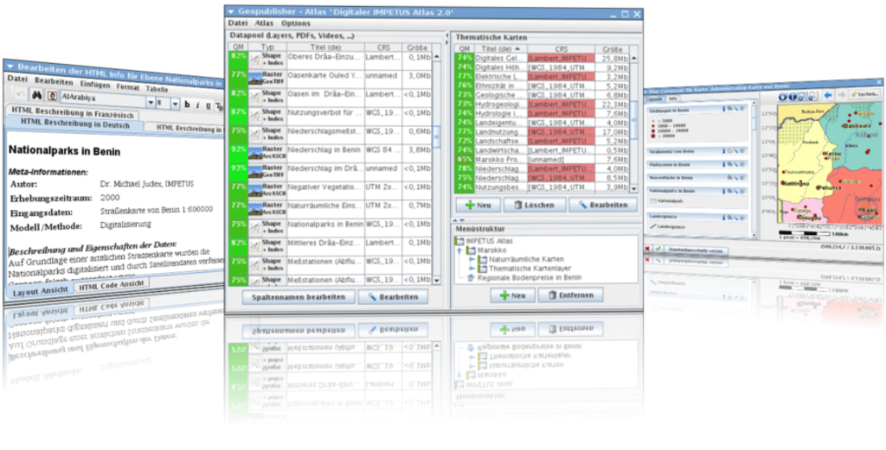

:Author: Stefan Tzeggai
:Version: osgeo-live4.0
:License: Creative Commons Attribution 3.0 Unported (CC BY 3.0)

.. _geopublisher-overview-es:

.. image:: ../../images/project_logos/logo-Geopublisher.png
  :scale: 100 %
  :alt: project logo
  :align: right
  :target: http://en.geopublishing.org/Geopublisher

Geopublisher
================================================================================

Gestor de Bibliotecas Electrónicas
~~~~~~~~~~~~~~~~~~~~~~~~~~~~~~~~~~~~~~~~~~~~~~~~~~~~~~~~~~~~~~~~~~~~~~~~~~~~~~~~

Geopublisher es un sistema de autoría de atlas que permite la publicación de manera sencilla de datos geográficos, documentos, imágenes, vídeos y estadísticas en forma de atlas multimedia digitales. Estos atlas resultan ser un mínimo pero efectivo SIG preconfigurado y orientado al usuario final en el que se pueden seleccionar unicamente las funcionalidades que doten de contenido a la información.

Geopublisher proporciona herramientas que permiten asegurar la calidad y la gestión de metadatos de manera multilingüe. No se requieren vastos conocimientos de HTML, SLD o XML para crear el atlas. Los atlas pueden ser publicados directamente en CD, DVD, tarjetas de memoría, discos duros externos o en Internet. La aplicación es independiente de la plataforma.

Las características únicas de Geopublisher lo hacen especialmente indicado para ser usado en los campos de la investigación a nivel internacional, SIG colaborativo, capacitación u desarrollos en cooperación.

Características Principales
--------------------------------------------------------------------------------

* Los atlas creados con Geopublisher son SIG mínimos pero efectivos, preconfigurados y orientados al usuario final en los que se pueden seleccionar unicamente las funcionalidades que doten de contenido a la información.
* Los atlas híbridos con datos online y offline hacen que sea posible acceder a la información en áreas con una gran brecha digital.
* La gestión multilingüe de los metadatos evita redundancias y permite la rápida publicación de atlas actualizados.
* Editores WYSIWYG (siglas en inglés de What You See Is What You Get, lo que ves es lo que obtienes) para SLD y HTML que permiten la publicación sin tener vastos conocimientos de SLD, XML o HTML.
* Todo el software es Free and Open-Source Software y cumple con los estándares OGC.
* La combinación de Geopublisher con QuantumGIS y OpenOffice proporcionan un paquete de publicación de datos geográficos de Código Abierto.
* El editor de SLD :doc:`AtlasStyler <atlasstyler_overview>` está integrado en Geopublisher.
* Se ejecuta en Mac OS, Windows y Linux.
* El estilo de las capas se basa en el estandar SLD de OGC.
* Los atlas offline pueden ejecutarse directamente sin necesidad de instalar Java.
* Soporta pirámides de imágenes para datos raster grandes.
* Traducido integramente al alemán, castellano, inglés, russo, turco, italiano y francés.

Estándares implementados
--------------------------------------------------------------------------------
* Style Layer Descriptor (SLD por sus siglas en inglés, Descriptor de estilo de capa) de OGC 

Detalles
--------------------------------------------------------------------------------

**Website:** http://en.geopublishing.org/Geopublisher

**Versión de Software:** 1.8

**Licencia:** GNU General Public License (GPL) versión 3.0; los atlas exportados son GNU Lesser General Public License (LGPL) versión 3.0

**Plataformas soportadas:** GNU/Linux, MS Windows, Mac OS - Cualquier SO donde Java 1.6 pueda ser instalado

**Interfaces API:** Java, Swing, Geotools

**Soporte:** http://www.wikisquare.de

Guía de inicio rápido
--------------------------------------------------------------------------------

* `Guía de inicio rápido <../quickstart/geopublisher_quickstart.html>`_
