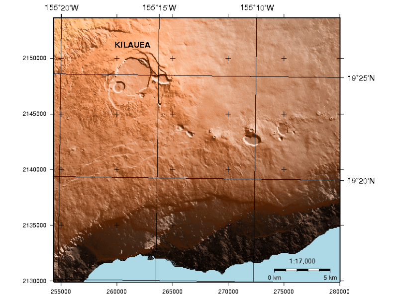

:Author: Hamish Bowman
:Author: Paul Wessel
:Translator: Andrés Herrera
:Version: osgeo-live4.0
:License: Creative Commons

.. _gmt-overview-es:

.. image:: ../../images/project_logos/logo-GMT.gif
  :scale: 100 %
  :alt: project logo
  :align: right
  :target: http://gmt.soest.hawaii.edu

GMT
================================================================================

Acrónimo del inglés `The Generic Mapping Tools`
~~~~~~~~~~~~~~~~~~~~~~~~~~~~~~~~~~~~~~~~~~~~~~~~~~~~~~~~~~~~~~~~~~~~~~~~~~~~~~~~

GMT es una colección de herramientas que permite a los usuarios manipular
conjunto de datos (x,y) y (x,y,z)  (incluyendo filtrado, ajuste de tendencias, 
interpolación, reproyección, etc.) y genera archivo PostScript encapsulado de 
ilustraciones desde simple gráficos x-y hasta mapas de contornos de superficies 
iluminadas y vistas de perspectivas 3-D en blanco y negro, tono de grises, 
patrones gráficos, y color de 24-bits.

GMT soporta varias de las proyecciones cartográficas más comunes, adicionalmente
de escalamiento lineal, logarítmica y exponencial, y soporta datos como líneas 
de costa, ríos y límites administrativos.

Caracterícticas principales
--------------------------------------------------------------------------------

* Cartografía de calidad.
* Funciones de interpolación y generación de contornos.

Detalles
--------------------------------------------------------------------------------

**Sitio web:** http://gmt.soest.hawaii.edu

**Licencia:** GNU General Public License (GPL) versión 2

**Versión de Software:** 4.5.1

**Plataformas soportadas:** GNU/Linux, Mac OSX, MS Windows

**Interfaces API:** Línea de comandos

**Soporte:** http://gmt.soest.hawaii.edu/gmt/gmt_maillist.html

Guía de inicio rápido
--------------------------------------------------------------------------------

* `Documentación de la Guía de inicio rápido <../quickstart/gmt_quickstart.html>`_

