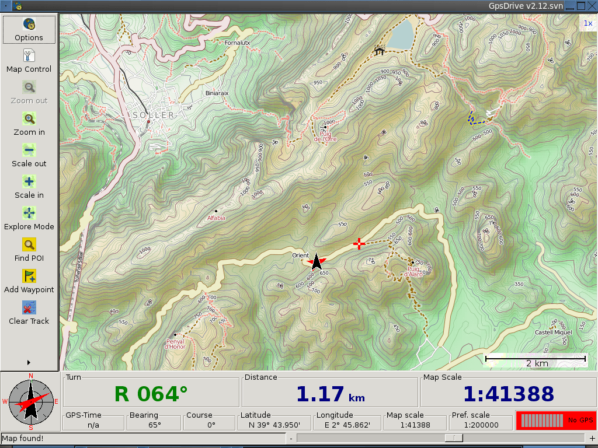

:Author: Hamish Bowman
:Translator: Andrés Herrera
:Version: osgeo-live4.0
:License: Creative Commons

.. _gpsdrive-overview-es:

.. image:: ../../images/project_logos/logo-gpsdrive.png
  :scale: 80 %
  :alt: project logo
  :align: right
  :target: http://www.gpsdrive.de

GpsDrive
================================================================================

Software de navegación GPS
~~~~~~~~~~~~~~~~~~~~~~~~~~~~~~~~~~~~~~~~~~~~~~~~~~~~~~~~~~~~~~~~~~~~~~~~~~~~~~~~

`GpsDrive <http://www.gpsdrive.de>`_ es un sistema de navegación para vehiculos(bicicletas,botes,aviones,personas). 
GpsDrive muestra la posición enviada por un dispositivo GPS en un mapa con capacidades de zoom. 
El archivo del mapa es auto-seleccionado en función de su posición y la escala preferida. 
Todos los receptores GPS que soporten el protocolo NMEA deberían funcionar, así como muchos 
recepores GPS USB mediante el uso de un protocolo binario conocido como `Gpsd <http://gpsd.berlios.de>`_ 
el cual actua como demonio y multiplexor de GPS.

Características principales
--------------------------------------------------------------------------------

* Descargue datos de la Web de LANDSAT u OpenStreetMap, o si prefiere, registre sus propias imágenes
* Representación en vivo de los datos almacenados en OpenStreetMap sobre una base de datos PostGIS usando Mapnik
* Representación en vivo del mosaico de alta resolución de la NASA (Blue Marble)
* Instrucciones verbales usando el sintetizador de voz eSpeak
* Entorno e interfaz gráfica de usuario (GUI) altamente personalizable
* Soporte de rutas en formato GPX, una serie de opciones de almacenamiento para sitios de referencia
  en formato SQLite y archivos planos de texto compatibles con GPSBabel   
* Busqueda de sitios de interes (POI) en un radio determinado
* Planificación de rutas
* Servidor incluido para realizar seguimiento de las posiciones de sus amigos.
* Integración con software Kismet Wifi

Detalles
--------------------------------------------------------------------------------

**Sitio web:** http://www.gpsdrive.de

**Licencia:** GNU General Public License (GPL) Versión 2

**Versión del software:** 2.11

**Plataformas compatibles:** GNU/Linux, Mac OSX

**Soporte:** http://gpsdrive.de/support.shtml

Guía de inicio rápido
--------------------------------------------------------------------------------

* `Documentación para un inicio rápido <../quickstart/gpsdrive_quickstart.html>`_

