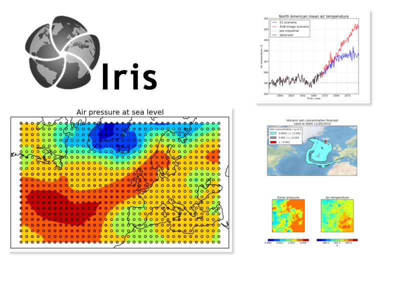

:Author: darkblueb
:Translator: David Mateos
:Reviewer: Cameron Shorter, Jirotech
:Version: osgeo-live7.0
:License: Creative Commons Attribution 3.0 Unported (CC BY 3.0)

.. image:: ../../images/project_logos/logo-iris.png
  :alt: Iris project logo
  :align: right
  :target: http://scitools.org.uk/iris/

Iris
================================================================================

Meteorología y Climatología 
~~~~~~~~~~~~~~~~~~~~~~~~~~~~~~~~~~~~~~~~~~~~~~~~~~~~~~~~~~~~~~~~~~~~~~~~~~~~~~~

Iris is una potente biblioteca de Python para analizar y visualizar datos meteorológicos y oceanográficos l. Incluye operaciones de manipulación de datos, como aritmética, interpolaciones y estadísticas; y ciertas opciones para hacer gráficos de forma integrada. Iris permite actualmente acceso de lectura/escritura para varios formatos, incluyendo (CF-)netCDF, GRIB,  y fichero PP.

  
Características principales
--------------------------------------------------------------------------------

* Usa una sencilla API para trabajar con los datos, independientemente de su formato original. 
* Lectura y escritura de archivos (CF-)netCDF, GRIB, y PP.
* Produce fácilmente gráficos y mapas, gracias a su integración con matplotlib y cartopy.

Detalles
--------------------------------------------------------------------------------
 
**Página web:** http://scitools.org.uk/iris/

**Licencia:** LGPLv3

**Versión del Software:** |version-iris|

**Plataformas soportadas:** Cross Platform Python-- Mac OS X, Windows, and Linux

**API Interfaces:** Python

**Apoyo:** http://www.scitools.org.uk/iris/community.html

Guía de inicio rápido
--------------------------------------------------------------------------------

* :doc:`Guía de inicio rápido <../quickstart/iris_quickstart>`

.. _`GitHub`: https://github.com/SciTools/iris

