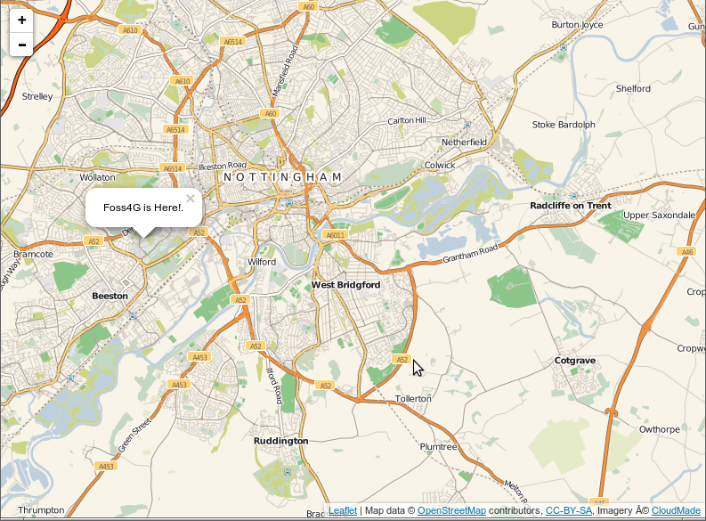

:Author: Johan Van de Wauw
:Author: Vladimir Agafonkin
:Translator: David Mateos
:Version: osgeo-live7.0
:License: Creative Commons Attribution 3.0 Unported  (CC BY 3.0)

.. image:: ../../images/project_logos/logo-leaflet.png 
  :scale: 100 %
  :alt: project logo
  :align: right
  :target: http://leafletjs.com

Leaflet
================================================================================

Biblioteca de Mapas para NAvegador/Móvil
~~~~~~~~~~~~~~~~~~~~~~~~~~~~~~~~~~~~~~~~~~~~~~~~~~~~~~~~~~~~~~~~~~~~~~~~~~~~~~~~

Leaflet es una bilblioteca JavaScript para realizar mapas interactivos, basados en navegador y   mobile-friendly.  Es ligero, aunque tiene todos los elementos que la mayoria de los desarrolladores pueden necesitar para los mapas online. 

Leaflet está diseñado, teniendo en mente la simplicidad, el rendimiento y la usabilidad.
Trabaja eficientementemente con la mayoria de las plataformas de escritorio y móviles, aprovechando las ventajas de HTML5 y CSS3  en los navegadores modernos al mismo tiempo que permanece accesible también desde los antiguos.  Se puede ampliar con muchos plugins, tiene una API bonita, fácil de usar y bien documentada y un código fuente simple y legible al que es un placer contribuir.  

Características principales
--------------------------------------------------------------------------------

* Capas de mapas

    * Teselas, Marcadores, Popups, Image overlays, WMS, GeoJSON, 
    * Vectores: polilíneas, polígonos, circulos, rectángulos, marcadores.
    * Grupos de capas

* Elementos de personalización

    * Controles y popups de CSS3 puro para easy restyling
    * Marcadores basados en imágen (y HTML).
    * Custom map layers, controls, projections
    * Powerful OOP facilities for extending existing classes

* Performance Features

    * Aceleración de Hardware.
    * Utilización de elementos CSS3 para que los 'paneos' y zoom sean realmente suaves. 
    * Renderizado inteligente de polilíneas/polígonos. 
    * Diseño modular que permite incluir sólo  required features
    * Tap delay elimination on mobile devices

* Controles del mapa

    * Botones de zoom, Atribución, Layer switcher, escala.

* Navegadores de escritorio soportados

    * Chrome
    * Firefox
    * Safari 5+
    * Opera 11.11+
    * IE 7–10
    * IE 6 (no perfecto, pero accesible)

* Navegadores móviles soportados

    * Safari para iOS 3/4/5/6+.
    * Navegador Android 2.2+, 3.1+, 4+.
    * Chrome para Android 4+ y iOS.
    * Firefox para Android.
    * Otros navegadores basados en webkit-based (webOS, Blackberry 7+, etc.)
    * IE10 para dispositivos basados en Win8.

* Varios

    * Extremadamente ligero — alrededor de 31 KB de código JS comprimido.
    * Sin dependencias externas.
    * Mantiene el entorno JS limpio - sin contaminación de prototipos globales o nativos. 

Detalles
--------------------------------------------------------------------------------

**Página web:** http://leafletjs.com

**Licencia:** BSD

**Version del Software :** 0.6.2

**Plataformas soportadas:** Windows, Mac, Linux, Android, iOS

**Interfaces API :** Javascript

**Support:** https://groups.google.com/forum/#!forum/leaflet-js

Guía de inicio rápido:
--------------------------------------------------------------------------------

* :doc:`Quickstart documentation <../quickstart/leaflet_quickstart>`

