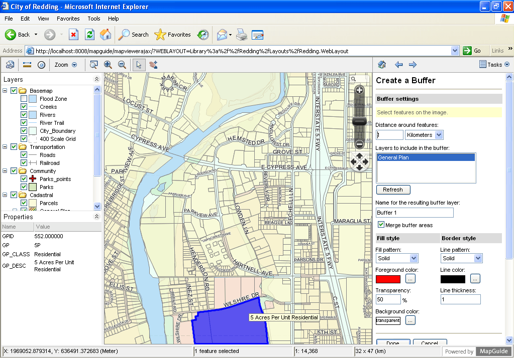

:Autor: Huawei Luo and Trevor Wekel
:Version: osgeo-live4.0
:Licencia: Creative Commons

.. _mapguide-overview:

.. image:: ../../images/project_logos/logo-MapGuideOS.png
  :scale: 100 %
  :alt: project logo
  :align: right
  :target: http://mapguide.osgeo.org/

.. image:: ../../images/logos/OSGeo_project.png
  :scale: 100 %
  :alt: OSGeo Project
  :align: right
  :target: http://www.osgeo.org

MapGuide Open Source
====================

Web Service
-----------

`MapGuide Open Source <http://mapguide.osgeo.org/>`_ es una plataforma web que proporciona a usuarios la posibilidad de publicar mapas y servicios web en internet. MapGuide es un visor web interactivo que incluye soporte para selección de objetos, análisis espacial, y otras operaciones como buffer, selecciones entre capas y mediciones.

MapGuide incluye soporte XML para manejar capas y contenidos. Se puede editar la base de datos XML y crear el visor sin tener que escribir una sola linea de código. MapGuide también soporta el acceso a la mayoria de los formatos GIS mas usuales, bases de datos y standards.

MapGuide puede ser instalado en Linux o Windows, tanto en Apache como en IIS web servers, y puede ser extensible con PHP, .NET, Java, y JavaScript APIs para desarrollar aplicaciones personalizadas. La licencia de MapGuide Open Source es LGPL.

Principales funcionalidades
---------------------------

** Map Viewing interactivo**

* Seleccion de objetos y propiedades
* Buffering, consultas
* Mapas e impresion

**Salidas gráficas de calidad**

* Representaciones detalladas segun el tipo de escala
* Reglas para la creación de estilos temáticos
* Soporte True color

**Gestion de base de datos**

* Almacenamiento jerarquico de recursos y documentos XML para definir mapas, capas y conexiones de datos
* Definicion de datos y capas para ser usados en mapas diferentes
* Gestion de permisos y accesos segun usuario

**Acceso a datos**

* Feature Data Objects (FDO) API para datos vectoriales y raster
* Acceso standard a diferente tipos de datos como SHP, SDF, Oracle, MySQL, y PostGIS.

**Flexible desarrollo de aplicaciones**

* Desarrollo de aplicaciones en PHP, .NET, o Java

**Potentes APIs en el servidor**

* Creación, consulta, lectura, y escritura
* Consulta y actualización de datos
* Reproyeccion
* Creación, manejo y analisis de geometrías
* Manejo de capas y mapas

**Rápido, escalable, Secure Server Platform**

* Completamente adaptado para servidores multi-core
* Reparto de carga entre servidores
* Conexiones a bases de datos
* Tile caching

**Soporte Multiplataforma**

* Instalable en Microsoft Windows y en Linux
* Puede ser utilizado con Apache o Microsoft IIS
* Trabaja con los siguientes navegadores: Microsoft Internet Explorer, Mozilla Firefox, Safari y Chrome

Standards implementados
-----------------------

* OGC Web Map Service 1.1.1 

Detalles
--------

**Website:** http://mapguide.osgeo.org/

**Licencia:** GNU Lesser General Public License (LGPL)

**Software Version:** 2.2.0

**Sistemas operativos:** Linux, Windows

**Support:** http://www.osgeo.org/search_profile

Quickstart
----------

* `Quickstart documentation <../quickstart/mapguide_quickstart.html>`_

