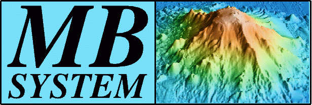

:Author: Hamish Bowman
:Reviewer: Cameron Shorter, LISAsoft
:Translator: Pedro Juan Ferrer
:Version: osgeo-live6.5
:License: Creative Commons

MB-System
================================================================================

Cartografiando el lecho marino
~~~~~~~~~~~~~~~~~~~~~~~~~~~~~~~~~~~~~~~~~~~~~~~~~~~~~~~~~~~~~~~~~~~~~~~~~~~~~~~~

MB-System es un paquete de software de código abierto para el procesamiento y representación de información batimétrica y procedente de sónares multi-haz, interferométricos y de barrido lateral. Hace un uso extensivo de la aplicación :doc:`GMT <gmt_overview>`.

MB-System lleva en continuo desarrollo desde 1993, y tiene el apoyo activo de diversas organizaciones de investigación y ciencia.

.. comment .. note:: Debido a problemas de espacio en el DVD, MB-Systems no está
.. comment actualmente instalada. Para instalarla, abra un terminal y ejecute el
.. comment comando ``cd gisvm/bin; sudo ./install_mb-system.sh``

Características Principales
--------------------------------------------------------------------------------

.. image:: ../../images/screenshots/1024x768/mb-system_screenshot.png
  :scale: 60 %
  :alt: screenshot
  :align: right

* Leer, listar y transformar diversos formatos de imágenes de rastreo.
* Proceso en bloque de grandes juegos de datos.
* Cálculo y compensación de perfiles de velocidad de sonido.
* Análisis y edición de datos de navegación e inerciales.
* Análisis de patrones de test.
* Limpieza automática o manual de datos batimétricos.
* Herramientas de limpieza y visualización interactivas para datos 3D.
* Obtención de rejillas, análisis estadísticos y extracción de datos batimétricos depurados.
* Reproyección de mapas.
* Reprocesado y teselado de datos de radar de barrido lateral y de datos de amplitud.
* Visualización de rejilla.
* Planificación de levantamientos.
* Gráficos PostScript .
* Exportación de datos a otros entornos SIG y de visualización.
* Procesado de datos de perfiles subacuáticos.
* Modelado y corrección de mareas.

Detalles
--------------------------------------------------------------------------------

**Sitio web:** http://www.ldeo.columbia.edu/res/pi/MB-System/

**Licencia:** GNU General Public License (GPL) version 3

**Versión del software:** |version-mb-system|

**Platformas soportadas:** GNU/Linux, Mac OSX, MS Windows (con Cygwin)

**Interfaces API:** Línea de comandos

Guía de inicio rápido
--------------------------------------------------------------------------------

* :doc:`Guía de inicio rápido <../quickstart/mb-system_quickstart>`
