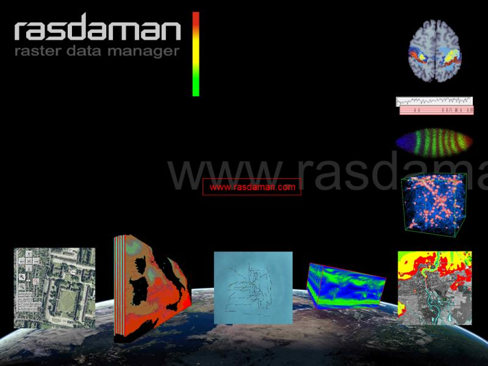

:Author: Peter Baumann , Michael Owonibi
:Version: osgeo-live4.5
:License: Creative Commons Attribution 3.0 Unported (CC BY 3.0)

.. _rasdaman-overview:

.. image:: ../../images/project_logos/logo-rasdaman.png
 :scale: 100 %
 :alt: project logo
  :align: right
  :target: http://rasdaman.org

********
Rasdaman
********

Base de datos raster multidimensional
=====================================

Rasdaman proporciona la posibilidad de almacenar datos raster multidimensionales (p.e.. arrays) en bases de datos relacionales sin limite de tamaño usando un lenguaje de consultas SQL con alta efectividad y poder de optimizacion desde el servidor.
Los datos estan almacenados en una base de datos PostgreSQL.
El driver rasdaman es una parte de la biblioteca GDAL (Geospatial Data Abstraction Library) para geodatos. Existe una version beta disponible que integra Mapserver.
El acceso a datos soporta OGC WCS, WCPS, y WPS, así como C++ y Java APIs junto con el lenguaje de consultas raster de rasdaman.
La version 8.2 integra IQL (Integrated Query Language), un aporte SQL que soporta tanto consultas vectoriales como raster.
Por consiguiente, rasdaman es una base de datos raster flexible y escalable que permite la navegacion, extracción, agregracion y el analisis temporal de sensores, imágenes y datos estadísticos.
La tecnología rasdaman es estable y madura, utilizandose en producción desde hace mas de 10 años. En el instituto geográfico nacional de Francia se utiliza rasdaman para servir mapas de mas de una docena de terrabits de datos raster.
En la conferencia ACM Principles of Database Systems del 2007, Rona Machlin caracterizó rasdaman como la implementación mas adecuada de este tipo de sistemas.

Principales funcionalidades
---------------------------

    * soporte de varias dimensiones: 1-D, 2-D, 3-D y 4-D
    * flexible y potente lenguaje de consultas para tareas de visualización, clasificación, adición y otras tantas funciones geoespaciales
    * indice espacial y tiling para el acceso rápido a los datos
    * tile streaming para escalabilidad y una utilizacion óptima de hardware
    * soporte multiusuario a traves de multiplexing server
    * completa integración de datos raster con cualquier otro tipo de geodatos almacenados en PostgreSQL

Standards implementados
-----------------------

    * OGC WCS 2.0, WCPS 1.0, WPS 1.0

Detalles
--------

**Website:** www.rasdaman.org

**Licencia:**

* clients y petascope: GNU Lesser General Public License (LGPL) version 3
* server engine: GNU General Public License (GPL) version 3

**Software Version:** 8.2

**Sistemas operativos soportados:** Linux, Mac, Solaris

**API Interfaces:** rasql, C++, Java; OGC-based WCS, WCPS, WCS-T, y WPS interfaces

**Support:**  www.rasdaman.com

