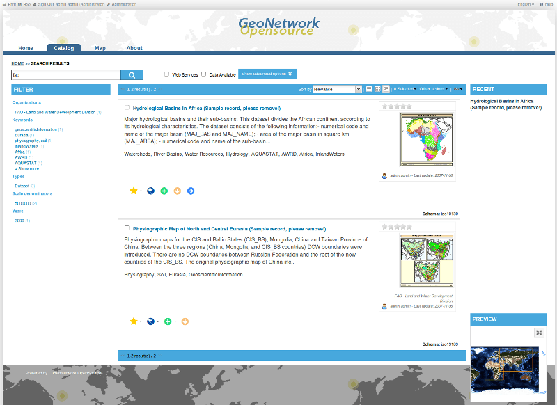

:Author: Comunidad de GeoNetwork
:Version: osgeo-live4.5draft
:License: Creative Commons
:Thanks: Comunidad de GeoNetwork 

.. |GN| replace:: GeoNetwork

.. _geonetwork-quickstart:
 
.. figure:: ../../images/project_logos/logo-GeoNetwork.png
  :alt: logo del proyecto
  :align: right

*****************************
Guía de inicio rápido de |GN|
*****************************

|GN| opensource es un sistema basado en estándares para la gestión distribuida de información espacial.
Está diseñado para facilitar el acceso a la información geoespacial procedente de diversos proveedores de datos, mediante el uso de sus metadatos descriptivos.

Además de cómo arrancar |GN|, esta guía de inicio rápido describe:

- Los principales métodos disponibles para la búsqueda de datos espaciales,
- Cómo descargar y visualizar los datos a partir de los resultados de búsqueda,
- El sistema de privilegios, roles y grupos de usuarios que utiliza |GN|.

La documentación detallada (en inglés) se encuentra en http://localhost:8880/geonetwork/docs/eng/users/, o haciendo clic el enlace 'Ayuda' de la página principal de |GN|.

Arranque de |GN|
----------------

- Seleccione el icono "Start GeoNetwork".
- La aplicación tardará unos momentos en arrancar.
- Vaya a la página principal de |GN| en http://localhost:8880/geonetwork. La primera vista de |GN| debería asemejarse a la siguiente captura de pantalla.

.. figure:: ../../images/screenshots/800x600/geonetwork-firstviews.png

- Para utilizar |GN| en español, seleccione 'Español' en el desplegable situado en la esquina superior derecha.
- Para aprender a manejar |GN| se va a agregar un conjunto de metadatos de ejemplo. Identifíquese en |GN| escribiendo el nombre de usuario *admin* y la contraseña *admin* en los campos de texto designados a tal efecto en la esquina superior derecha de la pantalla, y clique en el botón de 'Iniciar Sesión'.

.. figure:: ../../images/screenshots/800x600/geonetwork-login.png

- Debería haber aparecido un enlace *Administrador* en la cabecera. Clique en el enlace.

.. figure:: ../../images/screenshots/800x600/geonetwork-administration-banner.png

- Una vez en la página de *Administrador*, desplácese hasta el final de la página y cargue los datos de ejemplo clicando en el último botón, 'Añadir metadatos de ejemplo'.

.. figure:: ../../images/screenshots/800x600/geonetwork-addsampledatabutton.png

- Al cabo de unos instantes, se le notificará que los datos han sido cargados.
- Regrese entonces a la página principal (enlace 'Inicio' en la cabecera) para seguir los pasos de esta guía de inicio rápido. Al regresar a la página principal, la pantalla será similar a la mostrada a continuación.

.. figure:: ../../images/screenshots/800x600/geonetwork-returntohomepage.png

Búsquedas
---------

Se dispone de múltiples mecanismos para la búsqueda de mapas y otros datos geográficos dentro del catálogo. Esta guía le presentará los métodos principales: búsqueda simple, búsqueda experta, y búsqueda por categoría. Sea cual sea el método de búsqueda elegido, recuerde que los resultados mostrados dependerán de los privilegios asignados a su usuario y al grupo de trabajo al que pertenezca (más detalles al final de esta guía).

.. note:: 
	El término genérico *datos* se utiliza para referirse a todo tipo de conjuntos de datos, mapas, tablas, documentos, etc. Se refiere pues a todo aquello susceptible de ser descrito en un registro de metadatos y de estar ligado a él.

Búsqueda simple
---------------

La búsqueda simple permite buscar texto en cualquier campo del registro, como por ejemplo en las palabras clave, en los metadatos textuales o en la localización geográfica.

  **Búsquedas de texto libre.**

Teclee un término de búsqueda en el campo *¿QUÉ?*. Escriba aquí cualquier combinación de texto (texto libre). Utilice las comillas para delimitar un conjunto de palabras que deba hallarse exactamente en el mismo orden en que se indica.

El texto introducido y los operadores lógicos ('*and*', '*or*', '*not*') no distinguen entre mayúsculas y minúsculas.

.. figure:: ../../images/screenshots/800x600/geonetwork-what.png

  *Campo de texto libre*
	
  **Búsqueda geográfica.**

Existen dos alternativas para definir el área geográfica en la que realizar la búsqueda:

- Puede seleccionarse una **región** dentro de una lista predefinida;

.. figure:: ../../images/screenshots/800x600/geonetwork-where1.png
  
  *Selector de región*

- O bien puede definirse un *área de interés* de un modo más interactivo. En la sección *¿PAÍS/REGIÓN?* se muestra un pequeño mapa de situación global sobre el que se puede delimitar manualmente el encuadre de interés clicando y arrastrando. Para ello, debe seleccionarse la herramienta de la derecha situada en la barra superior del mapa.

.. figure:: ../../images/screenshots/800x600/geonetwork-where2.png
  
  *Selección interactiva del Área de Interés*

  **Realizar la búsqueda.**
  
Ambos tipos de búsqueda, de texto libre y por área geográfica, pueden combinarse para realizar búsquedas más restrictivas.

Clique el botón *Buscar* para mostrar los resultados.

.. figure:: ../../images/screenshots/800x600/geonetwork-search_button.png

  *El botón de búsqueda*

Búsqueda por categorías
-----------------------

Un método alternativo para realizar búsquedas en la base de datos de |GN| desde la página principal es la búsqueda por **Categoría**. Se mostrará al usuario una lista de las categorías generales en las que se clasifican los datos: **Aplicaciones**, **Audio/Vídeo**, **Casos de Uso y buenas prácticas**, **Conjuntos de datos**, **Directorios**, **Fotografías**, **Mapas & gráficos**, **Otros recursos de información**, **Recursos interactivos** y **Resúmenes de conferencias**.

Para mostrar sólo los mapas, seleccione **Mapas & gráficos**. Se mostrará la lista de mapas disponibles. Para consultar todos los detalles de un mapa, clique sobre **Página de Metadatos**.

.. figure:: ../../images/screenshots/800x600/geonetwork-Categories.png

  *Búsqueda por Categoría*
  
Búsqueda Experta
----------------

La opción de búsqueda experta funciona de forma similar a la búsqueda simple, pero permite ser más específico en los criterios de búsqueda, al proporcionar nuevos criterios de búsqueda: *¿QUÉ?, ¿PAÍS/REGIÓN?, ¿CUÁNDO?* 

.. figure:: ../../images/screenshots/800x600/geonetwork-advanced_search1.png

  *Opciones de búsqueda experta*

Para realizar una **búsqueda experta**, clique **Experta**, bajo el botón Buscar.

.. figure:: ../../images/screenshots/800x600/geonetwork-advanced_search_button.png

  *Mostrar las opciones de búsqueda experta*

En la sección **¿QUÉ?**, los criterios de búsqueda se refieren al contenido de los metadatos. En ellos, además de búsquedas de texto libre sobre todo el contenido, se puede buscar específicamente en los campos de *Título* o *Resumen*, así como establecer palabras clave para una búsqueda más restrictiva. Se puede indicar también el grado de similitud que se desea obtener entre los criterios de búsqueda indicados y el contenido en los resultados mostrados.

- Para buscar por **Título, Resumen, Texto Libre** o **Palabras clave**, escriba cada texto de búsqueda en el campo correspondiente. Pueden utilizarse varios criterios de búsqueda simultáneos. Si no se desea utilizar alguno de los criterios de búsqueda, debe dejarse en blanco;

- Puede buscar por el **Tipo de mapa**: **Digitales** o **Impresos**, **Interactivos** o **Descargables**. Para buscar unos u otros, active la casilla correspondiente. Si no se activa ninguna casilla, se buscarán todos los tipos de mapa.

- Puede indicarse la **Precisión** de la búsqueda, basada en una medida de similitud en el deletreo de las palabras, desde **Exacto** = 1 hasta **Impreciso** = 0.2, con tres pasos intermedios que se corresponden con valores de similitud 0.8, 0.6 y 0.4 respectivamente.

.. figure:: ../../images/screenshots/800x600/geonetwork-advanced_search_what.png

  *Sección "¿QUÉ?" en la búsqueda experta*

La sección **¿PAÍS/REGIÓN?** están relacionados con la extensión geográfica de los datos. En esta sección es posible dibujar el ámbito geográfico de interés o seleccionarlo de entre una lista de ámbitos predefinidos, del mismo modo que en la búsqueda simple. La sección de búsqueda experta añade la posibilidad de definir con más precisión una región que no esté disponible en la lista de ámbitos predefinidos, indicando las coordenadas geográficas exactas del rectángulo delimitador.

- Para dibujar un **área de interés personalizada** sobre el mapa, clique y arrastre el ratón seleccionando la herramienta de la derecha en la barra de herramientas del mapa de referencia;

- Para definir un ámbito en **coordenadas libres**, escriba las coordenadas geográficas del rectángulo demilitador (latitudes y longitudes mínima y máxima respectivamente) en los campos situados alrededor del mapa de referencia, usando tantos decimales como sea necesario;

- Para situar el ámbito geográfico en una **Región predefinida**, selecciónela en el desplegable.

.. figure:: ../../images/screenshots/800x600/geonetwork-advanced_search_where.png

  *Sección "¿PAÍS/REGIÓN?" en la Búsqueda experta*

Independientemente del método utilizado para definir el ámbito geográfico, puede seleccionarse una de las opciones del desplegable **Tipo**: **igual**, **incluye**, **contiene**, **está totalmente fuera de**. Si se utiliza este campo, debe prestarse especial cuidado al significado (y efecto) de cada una de las opciones:

- Seleccionando **Tipo** *igual* “Región”, sólo se mostrarán los mapas que abarquen exactamente la región indicada. Es decir, no se mostraría entre los resultados un mapa de una subregión aunque perteneciera al área indicada en la búsqueda.

- Seleccionando **Tipo** *contiene* “Región”, se mostrará en los resultados todos aquellos mapas cuyo rectángulo contenedor se solape, total o parcialmente, con el ámbito geográfico indicado. Por ejemplo, se incluirán los paises vecinos, o los mapas continentales o globales que incluyen la región indicada.

- Seleccionando **Tipo** *incluye* “Región” se obtendrán en primer lugar los mapas de la región indicada, y a continuación todos los mapas totalmente contenidos dentro de dicha región.

- Seleccionando **Tipo** *está totalmente fuera de* una región determinada, únicamente se mostrarán los resultados que cumplen este criterio.

La sección **¿CUÁNDO?** proporciona la posiblidad de restringir la búsqueda a un período temporal, donde el rango puede estar referido a la fecha de los propios datos o a la de la catalogación de los mismos.

- Para especificar un período de tiempo, haga clic en el selector de fecha junto a los campos **De** y **A**. Utilice los símbolos **>** y **>>** en la parte superior del calendario para cambiar el mes y el año, y finalmente seleccione el día exacto; la fecha completa se cargará en el campo de búsqueda en el formato AA-MM-DD (año, mes, día).

- Para borrar las restricciones temporales, clique en la X blanca a su derecha; la opción **Cualquier momento** se seleccionará automáticamente, y se realizará la búsqueda sin aplicar restricciones temporales.

.. figure:: ../../images/screenshots/800x600/geonetwork-advanced_search_when.png

  *Sección "¿CUÁNDO?" en la búsqueda experta*

Adicionalmente, la búsqueda experta permite **Limitar** los resultados a un catálogo de origen, una categoría, o un tipo de datos concreto.

- Seleccione el **Catálogo** sobre el que desea realizar la búsqueda, de entre los disponibles por tareas de harvesting. O bien deje seleccionado **Cualquiera** para buscar en todos los catálogos independientemente de su origen.

- Para buscar sólo en los datos de una **Categoría**, como Aplicaciones, Conjuntos de datos, etc., seleccione en el desplegable la categoría en la que desea buscar. Si desea buscar en cualquier categoría, deje la opción por defecto **Cualquiera**.

Por último, puede elegir en **Opciones** el número de elementos por página de resultados. Seleccione el número de registros a mostrar en **Resultados por página**, o deje el campo en su valor por defecto (10).

- Clique el botón **Search**.

.. figure:: ../../images/screenshots/800x600/geonetwork-advanced_search_morerest.png

  *Opciones adicionales de la búsqueda experta*

Resultados de la búsqueda
-------------------------

El resultado de una búsqueda consiste una lista de los registros de metadatos que cumplen las condiciones indicadas. Para cada registro, la página de resultados muestra el título, un resumen y la lista de palabras clave. Dependiendo de los privilegios que hayan sido otorgados, pueden consultarse hasta cuatro secciones de metadatos, tal como se muestra a continuación.

.. figure:: ../../images/screenshots/800x600/geonetwork-search_output2.png

    *Resultados de la búsqueda*

#. **Metadatos**: La sección de metadatos describe el conjunto de datos (p. ej.: citación, dueño de los datos, información temporal/espacial/metodológica) y puede contener enlaces a otras páginas web con información adicional sobre el conjunto de datos.

#. **Descarga**: Según los privilegios que se haya asignado al registro se mostrará un botón de descarga, que permite recuperar el conjunto de datos. El proceso para obtener los datos es rápido y simple, bien clicando el boton de descarga, o bien accediendo al enlace en la sección de "información de distribución" en la vista completa del registro de metadatos.

    
        *Un único resultado de búsqueda*
    
.. figure:: ../../images/screenshots/800x600/geonetwork-download.png
    
        *Servicios disponibles relativos al recurso*

#. **Mapa Interactivo**: La secció de servicio de mapa también es opcional. Cuando se muestre este botón, se puede acceder a un servicio de mapa interactivo para la capa, que se podrá cargar en un visualizador interactivo. Para ello, clique en el enlace de *Recurso en línea* y **Mostrar mapa** en la parte superior del panel de resultados.

.. figure:: ../../images/screenshots/800x600/geonetwork-interactive_map.png
    
        *El visualizador de mapas interactivo*

#. **Vistas previas**: Existen dos vistas previas, una pequeña y otra grande, que permiten realizar una primera evaluación visual de los datos. Estas vistas son especialmente útiles cuando no se dispone de un servicio de mapa interactivo. Clique sobre la vista pequeña en la lista de resultados para obtener la vista mayor.

.. figure:: ../../images/screenshots/800x600/geonetwork-thumbnail.png
    
        *Vista previa grande*

Privilegios, roles y grupos de usuarios
---------------------------------------

|GN| utiliza un sistema de *Privilegios*, *Roles* y *Grupos de usuarios*.

Cualquier usuario puede buscar y acceder sin restricciones a la **información pública** de un catálogo basado en |GN| opensource. Para tener acceso a la **información restringida** o a la funcionalidad avanzada, se necesita una cuenta de usuario con la que identificarse. El administrador de |GN| deberá proporcionarle esta cuenta de usuario.

Para identificarse, vaya a la página principal y escriba su nombre de usuario y su contraseña en los campos de la esquina superior derecha de la página. Clique el botón de *Iniciar Sesión*.

.. figure:: ../../images/screenshots/800x600/geonetwork-login.png

    *Iniciar Sesión*

**Privilegios**. Dependiendo de los privilegios asignados al registro de metadatos, y a su rol como usuario registrado, será o no posible acceder a los metadatos de un recurso, descargarlo, o visualizar de forma interactiva los datos asociados.

**Roles.** Los usuarios con rol de *Editor* pueden crear, importar y editar registros de metadatos. También pueden cargar datos en el servidor y configurar los enlaces hacia los servicios interactivos de mapa.

**Grupos de usuarios.** Cada usuario registrado pertenecerá a un grupo de trabajo concreto, y será capaz de ver los datos vinculados a ese grupo.

Más información
---------------

Clique en el enlace 'Ayuda' en la cabecera de la página principal de |GN|, o acceda directamente a la documentación siguiendo este enlace: http://localhost:8880/geonetwork/docs/eng/users/
