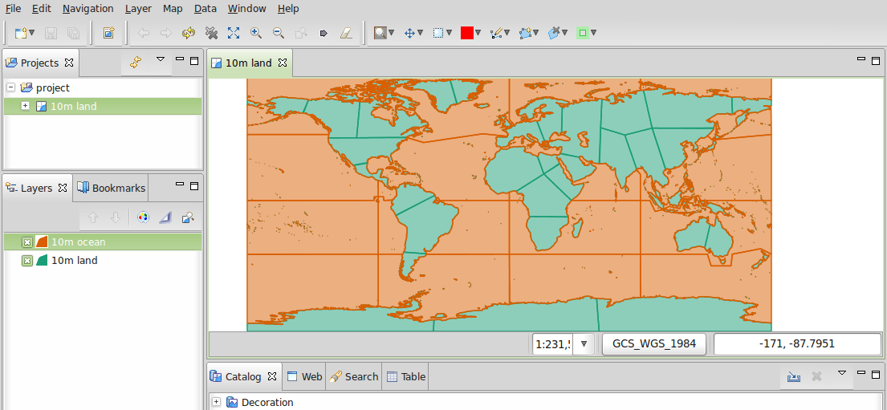
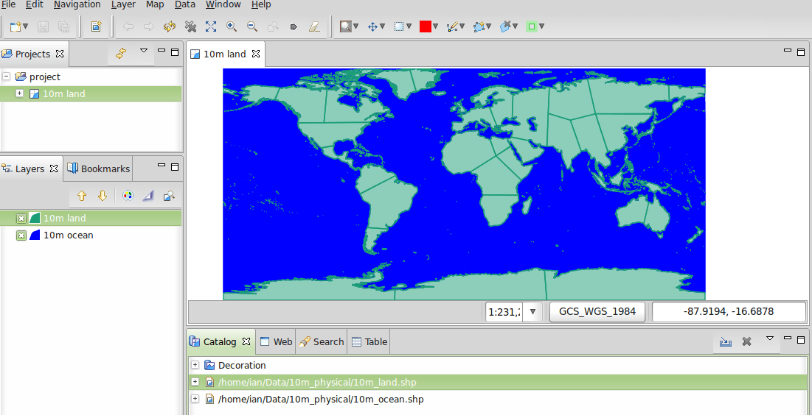

:Author: Ian Turton
:Version: osgeo-live4.0
:License: Creative Commons
:Thanks: geoserver-user list

.. |GS| replace:: GeoServer
.. |PG| replace:: PostGIS
.. |UG| replace:: uDig 
.. |OL| replace:: OpenLayers

.. _geoserver-quickstart:
 
.. image:: ../../images/project_logos/logo-GeoServer.png
  :alt: project logo
  :align: right

********************
GeoServer Quickstart 
********************

GeoServer es un servidor de mapas (y datos) para su utilización en aplicaciones 
cliente, escrito en java.

Esta guía de inicio rápido describe como:

  * agregar origenes de datos vectoriales y raster a GeoServer
  * aplicar color a las entidades gráficas usando estilos
  * testear las capas en un mapa web simple
  * aprender acerca de los clientes que pueden desplegar sus mapas

Iniciar |GS|
==========

#. Seleccione el ícono "Start GeoServer"
#. La aplicación tardará unos segundos en iniciar
#. Vaya a la pagina web de GeoServer en http://localhost:8082/geoserver/web 

.. image:: ../../images/screenshots/800x600/geoserver-login.png
    :width: 90 %
    :align: left


Primeras Vistas
===============

Cuando abra por primera vez la pagina de |GS| vera la pantalla de arriba, 
primero necesita loguearse usando el usuario admin y la password geoserver.
Entonces verá la *página de administración*


.. image:: ../../images/screenshots/800x600/geoserver-welcome.png
    :width: 90%
    :align: left

El enlace **Previsualización de Capas** en el menú de la izquierda le permite
previsualizar los layer que están cargados en el servidor.
  
.. image:: ../../images/screenshots/800x600/geoserver-layerpreview.png
    :width: 90%
    :align: left

Desplacese hasta el final de la página y haga click en el enlace **OpenLayers**
en la fila **tiger-ny**. Esto abrirá una nueva ventana con una previsualización
de algunos de los datos de ejemplo.

.. image:: ../../images/screenshots/800x600/geoserver-preview.png
    :width: 90%
    :align: left
    
Puede hacer zoom en el mapa de tres formas:

        * haciendo click en la barra de zoom de la izquiera, cuanto mas arriba mayor sera la ampliación.

        * usando la rueda de scroll del mouse (si tiene una), hacia arriba se acerca y hacia abajo se aleja.

        * definiendo un rectangulo sobre el mapa mientras presiona la :kbd:`tecla shift` - esto hara zoom al rectangulo seleccionado (o lo mas aproximado que entre en la pantalla).

#. Experimente con esta vista y vea tambien la previsualización de las otras capas. Cuando se sienta cómodo visualizando datos puede continuar agregando nuevos datos.

Cargando Datos
==============

.. note::
    No podrá realizar los siguientes pasos si esta ejecutando
    desde un sistema de archivos de **solo lectura** (como el DVD).
    Necesita instalar GeoServer desde el DVD en su disco rígido o crear 
    un sistema basado en un pen drive USB.


En este ejemplo vamos a usar el conjunto de datos `Natural Earth
<http://naturalearthdata.com>`_ que está incluido en el Live-DVD
(:file:`/usr/local/share/data/natural_earth/`).

Primero necesitamos copiar los datos al directorio de datos de GeoServer
(:file:`/usr/lib/geotools-2.0.2/data_dir/data`). Hemos creado un directorio
llamado :file:`naturalearth` utilizando la linea de comandos, pero se puede 
hacer lo mismo desde el administrador de archivos si lo prefiere.  ::

        cd /usr/lib/geotools-2.0.2/data_dir/data
        mkdir naturalearth
        cp /usr/local/share/data/natural_earth/* naturalearth
     

Ahora necesitamos crear un Almacén de datos para nuestros datos. En la página de
administración de |GS| vaya a  :guilabel:`Almacenes de datos` y haga click en 
:guilabel:`Agregar nuevo almacén`. Verá la siguiente página:

.. figure:: ../../images/screenshots/800x600/geoserver-newstore.png
    :align: center
    :width: 90%
    
    *La página Nuevo origen de datos*

Seleccione :guilabel:`Directory of spatial files`, y verá lo siguiente: 

.. figure:: ../../images/screenshots/800x600/geoserver-new-vector.png
    :align: center
    
    *Completando la página Nuevo origen de datos vectoriales*

Escriba un nombre para el almacén de datos - Usamos *Natural Earth* y completamos
la URL al conjunto de datos - en este caso :file:`data/naturaleath`. La URL es 
relativa al directorio de datos de |GS|. Presione :guilabel:`Guardar`.

.. figure:: ../../images/screenshots/800x600/geoserver-naturalearth.png
    :align: center 
    :width: 100%

    *El almacén de datos Natural Earth*

Presione :guilabel:`publicar` en la fila de uno de las capas para finalizar la
incorporación de datos. Esto lo llevará a la página *Capas*:

.. figure:: ../../images/screenshots/800x600/geoserver-publish.png
    :align: center
    :width: 90%

    *La página de publicación de capas*

A medida que baje por la pagina verá que |GS| ha llenado varios campos por usted.
Cuando llegue a :guilabel:`Coordinate Reference System`
podrá ver que en el campo *Native SRS* dice UNKNOWN [#esri]_
Necesitará completar el siguiente campo (*declared SRS*) para asegurarse que |GS|
sabe donde se localizan los datos. Por el momento confíe en nosotros y escriba 
epsg:4326 en ese campo, y si no confía vaya a `http://prj2epsg.org/search` y copie
el texto que ve cuando hace click junto a "UNKNOWN".
Haga click en :guilabel:`Calcular desde los datos` y :guilabel:`Calcular a 
partir de los límites nativos` para completar los Bounding Boxes. Finalmente 
presione :guilabel:`Guardar` y habrá publicado su primera capa.

.. note::
    Si visualiza esta capa en la previsualización de capas, no se verá muy 
    atractivo, pero es solo el estilo predeterminado. En la siguiente sección
    veremos como producir un estilo mejorado.
    
Styling
-------

To style a data set into a map layer |GS| uses an OGC standard called
Styled Layer Descriptors (SLD). These are represented as XML files
which describe the rules that are used to apply various symbolizers to
the data.

To get started I styled the Land and Ocean datasets. 
You can create SLD files using a simple text editor, but
sometimes a graphical editor is better. There are several options here
but I like to use |UG| (http://udig.refractions.net/) as it allows me
to open the shapefiles directly and apply simple styles using a
GUI, but also provides a simple editor to modify the XML if I need to. 

Using |UG| to create simple styles
``````````````````````````````````

.. note::

   For more details on how to use |UG| see the :ref:`uDig quickstart <udig-quickstart>`

Once I opened |UG| up and added the shapefiles (using the
add data button in the top left hand corner). I dragged the 10m_land
and 10m_ocean tables into the map window. |UG| automatically applies
a style (so you can see the data).



   *Default Styling in UDig*

Now obviously an orange ocean will not work (even if I could live
with the green land). So in the :ref:`Layer list <Layer_list>` select the style
button (it looks like an artist's palette). 

.. _Layer_list:
.. figure:: ../../images/screenshots/800x600/geoserver-layer-chooser.png
   :align: center

   *The Layer list window*


This will open the :ref:`Style Pane <Style_Pane>` - in the simple window I can easily
select a nice blue for the oceans by clicking on the colored box by
the fill label and choosing from the color picker it produces. I also
increased the opacity of the fill to 100% to make the color look
better. 

.. _Style_Pane:
.. figure:: ../../images/screenshots/800x600/geoserver-style-pane.png
   :align: center

   *The Style Pane*


Once I was done I clicked ``OK`` and |UG| showed me the
changes. 




   *Blue Oceans*

Finally I prefer a more understated land color than green [#fn1]_ so
I repeated the steps above to change the color of the land layer.
None of the default colors seemed right to me so I went into the
``define custom colors`` section to create one I liked.

.. figure:: ../../images/screenshots/800x600/geoserver-custom-colour.png
   :align: center

   *Defining a nicer land color*

This gives me a nice looking basic world map

.. figure:: ../../images/screenshots/800x600/geoserver-basic-world.png
   :align: center
   :width: 90%

   *A basic word map*

Adding the Style to |GS|
````````````````````````

Now I need to transfer these styles to |GS| - on the style window
there is an export button which allows me to save the SLD file that
defines my style. Once I've saved the two styles I can go to the |GS|
admin page again and select ``Styles`` (at the bottom of the ``Data``
section). Then I select the ``Add New Style`` link, at the bottom of
that page is a file upload box and a browse button. Clicking this
allows me to hunt around on my hard drive to find the files I just
saved. Once I've found one I want, I click the upload link (next to the browse
button) and a copy of my file appears in the editor. 

.. figure:: ../../images/screenshots/800x600/geoserver-add-style.png
   :align: center
   :width: 90%

   *Adding a Style to GeoServer*


Adding the Style to the Layer
------------------------------

Click on the :guilabel:`Layers` link in the Menu on the left of the
|GS| window. Click on the layer (e.g. *10m_land*), then select the 
:guilabel:`Publishing` tab and change the :guilabel:`Default Style`
box to the name of the style you uploaded in the previous section.
Now go to the Layer Preview page to check that it looks good.

.. TBD check where app-data ends up

There are example style files for all of the example Natural Earth
layers in :file:`/usr/local/share/geoserver`. 

.. TBD (needs more memory)
    Adding a Raster
    ===============

    In the Natural Earth folder is a folder :file:`HYP_50M_SR_W` which
    contains a raster image. You can serve this up in |GS| directly by
    going to the stores page and selecting :guilabel:`New Stores->World
    Image` and type
    *file:/home/user/data/natural_earth/HYP_50M_SR_W/HYP_50M_SR_W.tif*
    into the :guilabel:`URL` box.

    .. figure:: ../../images/screenshots/800x600/geoserver-raster.png
        :align: center
        :width: 90%

        *Adding a Raster*

    The click :guilabel:`Save` this will take you to the *New Layers
    Chooser* then click publish and :guilabel:`Save` to finish adding the
    raster. If you go to the Layers Preview page you
    can see the new image. 


Clients for WMS layers
======================

A large variety of clients exist to make use of the WMS layers you are serving
from |GS|. This is a list of just some of them 

    * :ref:`uDig <udig-quickstart>`

    * :ref:`OpenLayers <openlayers-quickstart>`

    * :ref:`Atlas Styler <atlasstyler-quickstart>` 

    * :ref:`MapBender <mapbender-quickstart>`


.. Rubric:: Footnotes
.. [#fn1] If you lived in central Pennsylvania in the summer you
   wouldn't expect green either.
.. [#esri] there is a perfectly good well known text (WKT) for
    projections but ESRI don't use it.
