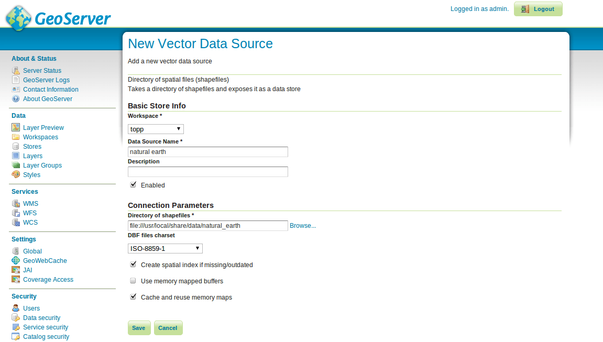

:Author: Ian Turton
:Version: osgeo-live4.0
:License: Creative Commons
:Thanks: geoserver-user list

.. |GS| replace:: GeoServer
.. |PG| replace:: PostGIS
.. |UG| replace:: uDig 
.. |OL| replace:: OpenLayers

.. _geoserver-quickstart:
 
.. image:: ../../images/project_logos/logo-GeoServer.png
  :alt: project logo
  :align: right

********************
GeoServer Quickstart 
********************

GeoServer es un servidor de mapas (y datos) para su utilización en aplicaciones 
cliente, escrito en java.

Esta guía de inicio rápido describe como:

  * agregar origenes de datos vectoriales y raster a GeoServer
  * aplicar color a las entidades gráficas usando estilos
  * testear las capas en un mapa web simple
  * aprender acerca de los clientes que pueden desplegar sus mapas

Iniciar |GS|
============

#. Seleccione el ícono "Start GeoServer"
#. La aplicación tardará unos segundos en iniciar
#. Vaya a la pagina web de GeoServer en http://localhost:8082/geoserver/web 

.. image:: ../../images/screenshots/800x600/geoserver-login.png
    :width: 90 %
    :align: left


Primeras Vistas
===============

Cuando abra por primera vez la pagina de |GS| vera la pantalla de arriba, 
primero necesita loguearse usando el usuario admin y la password geoserver.
Entonces verá la *página de administración*


.. image:: ../../images/screenshots/800x600/geoserver-welcome.png
    :width: 90%
    :align: left

El enlace **Previsualización de Capas** en el menú de la izquierda le permite
previsualizar los layer que están cargados en el servidor.
  
.. image:: ../../images/screenshots/800x600/geoserver-layerpreview.png
    :width: 90%
    :align: left

Desplacese hasta el final de la página y haga click en el enlace **OpenLayers**
en la fila **tiger-ny**. Esto abrirá una nueva ventana con una previsualización
de algunos de los datos de ejemplo.

.. image:: ../../images/screenshots/800x600/geoserver-preview.png
    :width: 90%
    :align: left
    
Puede hacer zoom en el mapa de tres formas:

        * haciendo click en la barra de zoom de la izquiera, cuanto mas arriba mayor sera la ampliación.

        * usando la rueda de scroll del mouse (si tiene una), hacia arriba se acerca y hacia abajo se aleja.

        * definiendo un rectangulo sobre el mapa mientras presiona la :kbd:`tecla shift` - esto hara zoom al rectangulo seleccionado (o lo mas aproximado que entre en la pantalla).

#. Experimente con esta vista y vea tambien la previsualización de las otras capas. Cuando se sienta cómodo visualizando datos puede continuar agregando nuevos datos.

Cargando Datos
==============

.. note::
    No podrá realizar los siguientes pasos si esta ejecutando
    desde un sistema de archivos de **solo lectura** (como el DVD).
    Necesita instalar GeoServer desde el DVD en su disco rígido o crear 
    un sistema basado en un pen drive USB.


En este ejemplo vamos a usar el conjunto de datos :doc:`Natural Earth <../overview/naturalearth_overview>` 
que está incluido en el Live-DVD (:file:`/usr/local/share/data/natural_earth/`).

Primero necesitamos copiar los datos al directorio de datos de GeoServer
(:file:`/usr/lib/geotools-2.0.2/data_dir/data`). Hemos creado un directorio
llamado :file:`naturalearth` utilizando la linea de comandos, pero se puede 
hacer lo mismo desde el administrador de archivos si lo prefiere.  ::

        cd /usr/lib/geotools-2.0.2/data_dir/data
        mkdir naturalearth
        cp /usr/local/share/data/natural_earth/* naturalearth
     

Ahora necesitamos crear un Almacén de datos para nuestros datos. En la página de
administración de |GS| vaya a  :guilabel:`Almacenes de datos` y haga click en 
:guilabel:`Agregar nuevo almacén`. Verá la siguiente página:

.. figure:: ../../images/screenshots/800x600/geoserver-newstore.png
    :align: center
    :width: 90%
    
    *La página Nuevo origen de datos*

Seleccione :guilabel:`Directory of spatial files`, y verá lo siguiente: 


    
    *Completando la página Nuevo origen de datos vectoriales*

Escriba un nombre para el almacén de datos - Usamos *Natural Earth* y completamos
la URL al conjunto de datos - en este caso :file:`data/naturaleath`. La URL es 
relativa al directorio de datos de |GS|. Presione :guilabel:`Guardar`.

.. figure:: ../../images/screenshots/800x600/geoserver-naturalearth.png
    :align: center 
    :width: 100%

    *El almacén de datos Natural Earth*

Presione :guilabel:`publicar` en la fila de uno de las capas para finalizar la
incorporación de datos. Esto lo llevará a la página *Capas*:

.. figure:: ../../images/screenshots/800x600/geoserver-publish.png
    :align: center
    :width: 90%

    *La página de publicación de capas*

A medida que baje por la pagina verá que |GS| ha llenado varios campos por usted.
Cuando llegue a :guilabel:`Coordinate Reference System`
podrá ver que en el campo *Native SRS* dice UNKNOWN 
Necesitará completar el siguiente campo (*declared SRS*) para asegurarse que |GS|
sabe donde se localizan los datos. Por el momento confíe en nosotros y escriba 
epsg:4326 en ese campo, y si no confía vaya a `http://prj2epsg.org/search` y copie
el texto que ve cuando hace click junto a "UNKNOWN".
Haga click en :guilabel:`Calcular desde los datos` y :guilabel:`Calcular a 
partir de los límites nativos` para completar los Bounding Boxes. Finalmente 
presione :guilabel:`Guardar` y habrá publicado su primera capa.

.. note::
    Si visualiza esta capa en la previsualización de capas, no se verá muy 
    atractiva, pero es solo el estilo predeterminado. En la siguiente sección
    veremos como producir un estilo mejorado.
    
Aplicando estilos
-----------------

Para aplicar un estilo a un conjunto de datos de una capa, |GS| usa un estándar 
OGC llamado Descriptores de capas estilizadas - Styled Layer Descriptors (SLD). 
Estos descriptores se representan como archivos XML que describen las reglas que
se utilizan para aplicar varios simbolizadores a los datos.

Para empezar, estilizamos los conjuntos de datos Land y Ocean. Se puede crear un
archivo SLD utilizando un sencillo editor de textos, pero es mejor usar un editor 
gráfico. Hay varias opciones para ello, pero nos gusta usar |UG| (http://udig.refractions.net/) 
ya que permite abrir los archivos shape directamente y aplicarles estilos simples
utilizando una interfase gráfica, y también tiene un editor simple para modificar 
el XML si es necesario.

Usando |UG| para crear estilos simples
``````````````````````````````````````

.. note::
   Para mas detalles sobre como usar |UG| ver :doc:`Guía de inicio raṕido uDig <../quickstart/udig_quickstart>`

Una vez abierto |UG| y agregados los archivos shape (usando el botón add data 
que está arriba a la izquierda). Arrastrar las tablas 10m_land y 10m_ocean 
en la ventana de mapas. |UG| aplica automáticamente un estilo (para que se puedan visualizar los datos).

.. figure:: ../../images/screenshots/800x600/geoserver-udig_startup.png
   :align: center
   :width: 90%

   *Estilos predeterminados en UDig*

Obviamente un océano anaranjado no se ve bien (aunque la tierra verde es aceptable). Asi que  en :ref:`Layer list <Layer_list_es>` seleccione el botón de estilos (se ve
como la paleta de un artista). 

.. _Layer_list_es:
.. figure:: ../../images/screenshots/800x600/geoserver-layer-chooser.png
   :align: center

   *La ventana de lista de capas (Layer List)*


Esto abrirá el panel de estilos :ref:`Style Pane <Style_Pane_es>` - en la ventana se
puede seleccionar fácilmente un buen azul para los oceanos haciendo click sobre
el rectángulo de color junto a la etiqueta relleno (fill) y eligiendo de la paleta
de colores que ofrece. También se puede incrementar la opacidad hasta el 100%
para que el color se vea mejor.

.. _Style_Pane_es:
.. figure:: ../../images/screenshots/800x600/geoserver-style-pane.png
   :align: center

   *El panel de estilos (Style Pane)*


Una vez listo, hacer click en ``OK`` y |UG| mostrará los cambios.


.. figure:: ../../images/screenshots/800x600/geoserver-blue-ocean.png
   :align: center
   :width: 90%

   *Océanos Azules*

Finalmente preferimos un color mas significativo para la tierra que el verde  
de manera que repetimos los pasos explicados para cambiar el color de la capa land.
Ninguno de los colores predeterminados nos parece adecuado, asi que vamos a la sección
``define custom colors`` para crear uno que nos guste.

.. figure:: ../../images/screenshots/800x600/geoserver-custom-colour.png
   :align: center

   *Definiendo un color mas agradable para la tierra*

Esto da como resultado un mapa básico del mundo que se ve bien

.. figure:: ../../images/screenshots/800x600/geoserver-basic-world.png
   :align: center
   :width: 90%

   *Un mapa básico del mundo*

Agregando el estilo a |GS|
``````````````````````````

Ahora necesitamos transferir estos estilos a |GS| - en la ventana de estilos hay
un botón de exportacion que permite guardar el archivo SLD que define nuestro 
estilo. Una vez que hemos guardado los dos estilos, podemos ir a la página de 
administración de |GS| otra vez y seleccionar ``Estilos`` (al final de la sección
``Datos``). Entonces seleccionamos el enlace ``Agregar nuevo estilo``. Al final 
de la página hay un campo para ingresar el archivo y un botón para explorar. 
Haciendo click en esto nos permite buscar en el disco rígido los archivos que
acabamos de guardar. Una vez que encontramos lo que queremos, hacemos click en el 
link para subir el archivo (junto al boton de explorar) y una copia de esos archivos aparece en el editor.

.. figure:: ../../images/screenshots/800x600/geoserver-add-style.png
   :align: center
   :width: 90%

   *Agregando un estilo a GeoServer*


Agregando el estilo a la capa
-----------------------------

Haga click en el enlace :guilabel:`Capas` en el menu de la izquierda de la ventana
de |GS|. Haga click en la capa (por ejemplo: *10m_land*), seleccione la pestaña
:guilabel:`Publicar` y cambie el campo :guilabel:`Estilo Predeterminado`
al nombre del estilo subido en la seccion anterior. Ahora puede ir a la pagina de 
previsualizacion para ver como se ve.

.. TBD verifique donde terminan los datos de la aplicación

Hay archivos de estilo de ejemplo para todas las capas del ejemplo Natural Earth
en :file:`/usr/local/share/geoserver`. 

.. TBD (esto necesita más memoria)

    Agregando un Raster
    ===================

    En la carpeta Natural Earth hay otra carpeta :file:`HYP_50M_SR_W` que contiene
    una imagen raster. Puede servir esta imagen en |GS| directamente yendo a la
    pagina de Almacén de datos y seleccionando :guilabel:`Nuevo Almacén->World
    Image` y escriba
    *file:/home/user/data/natural_earth/HYP_50M_SR_W/HYP_50M_SR_W.tif*
    en el campo :guilabel:`URL`.

    .. figure:: ../../images/screenshots/800x600/geoserver-raster.png
        :align: center
        :width: 90%

        *Agregando un Raster*

    Haga click en :guilabel:`Guardar` esto le llevará al *Selector de nuevas capas*.
    Ahora haga click en publicar y :guilabel:`Guardar` para terminar de agregar 
    el raster. Si va a la pagina de previsualizacion podra ver la nueva imagen.


Clientes para capas WMS
=======================

Existe una gran variedad de clientes que pueden utilizar las capas WMS que está
sirviendo desde |GS|. Esta es una lista de algunos de ellos:

    * :doc:`uDig <../overview/udig_overview>`

    * :doc:`OpenLayers <../overview/openlayers_overview>`

    * :doc:`Atlas Styler <../overview/atlasstyler_overview>`

    * :doc:`MapBender <../overview/mapbender_overview>`
