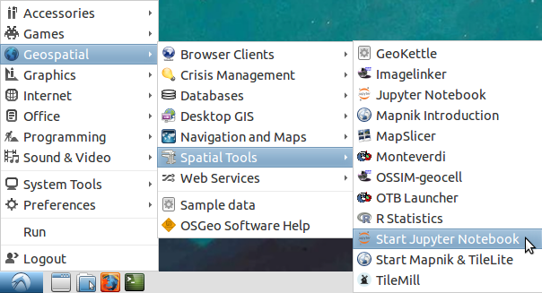
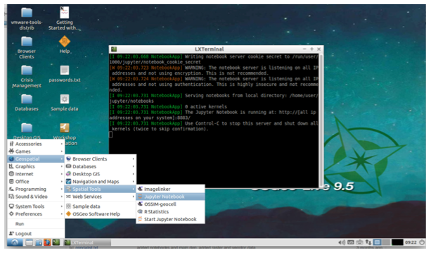
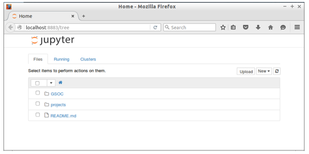
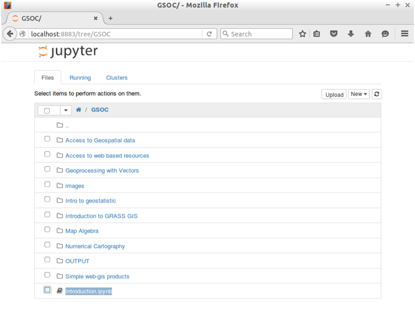
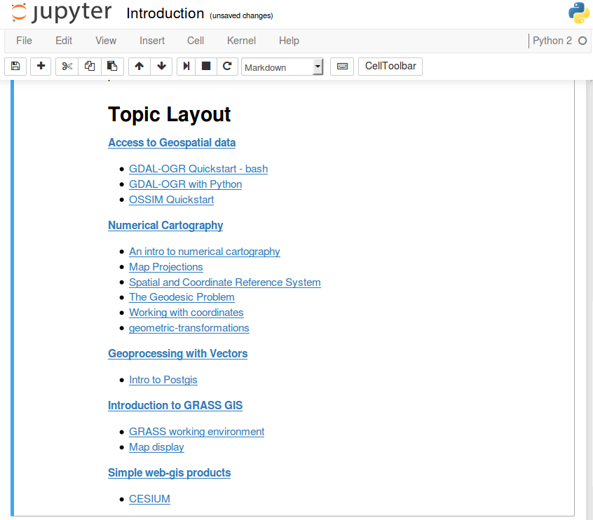
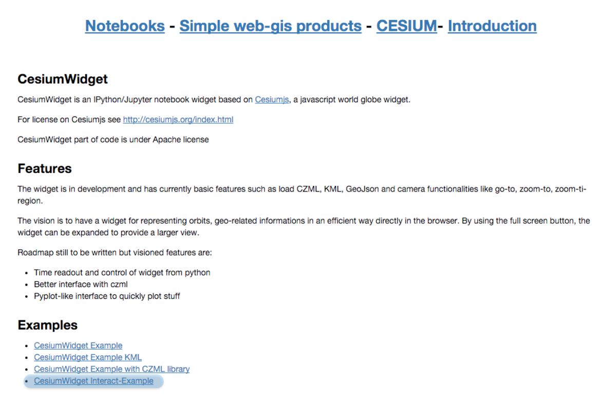
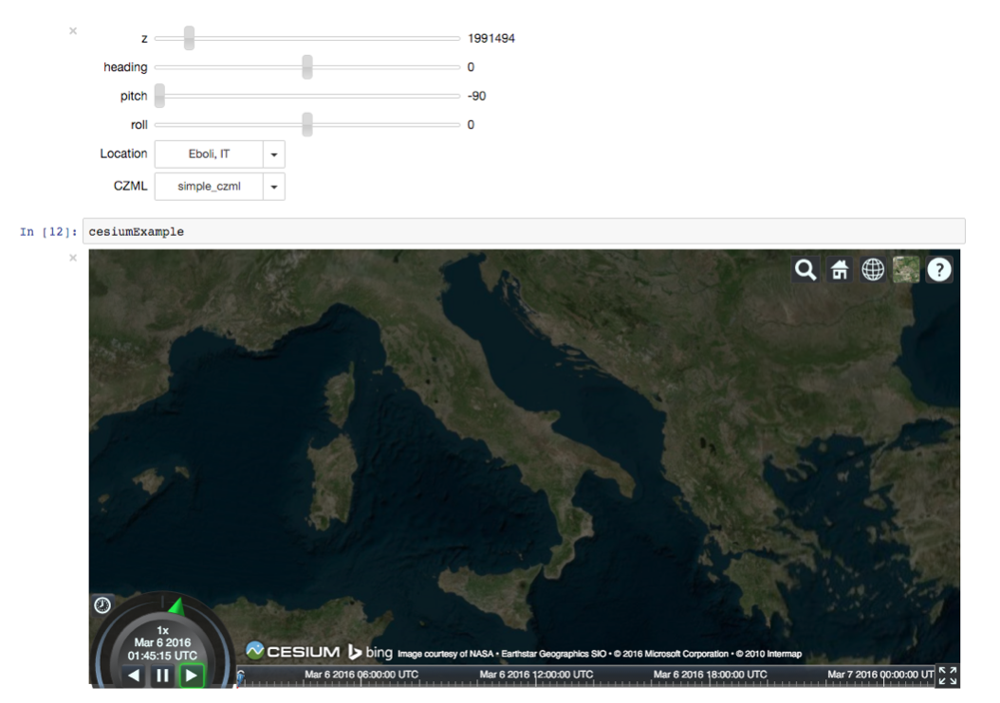

:Author: Massimo Di Stefano
:Translator: David Mateos
:Contact: epiesasha at me dot com
:Version: osgeo-live9.5
:License: Creative Commons Attribution-ShareAlike 3.0 Unported  (CC BY-SA 3.0)
:Reviewer: Cameron Shorter, Jirotech

.. image:: ../../images/project_logos/logo-jupyter.png
  :alt: project logo
  :align: right
  :target: http://jupyter.org/

********************************************************************************
Guía de inicio rápido de Jupyter Notebook
********************************************************************************

Jupyter Notebook es una aplicación web que permite crear y compartir documentos que contienen código fuente, ecuaciones, visualizaciones y texto explicativo. Entre sus usos está la limpieza y transformación de datos, la simulación numérica, el modelado estadístico, el aprendizaje automático y mucho más.

Esta guía de inicio rápido describe cómo:

  * Arrancar un servidor  jupyter notebook.
  * Cargar un jupyter notebook.
  * Interactuar con código python y complementos javascript.

.. contents:: Contenidos

Arrancar el servidor jupyter
================================================================================

Desde el menú de inicio, en la esquina inferior izquierda. 
 
* Elegir  *Geospatial* -> *Spatial Tools* -> *Start Jupyter Notebook*

  
Se abrirá una ventana de terminal y empezará a bajar un log de inicio.

* Elegir   *Geospatial* -> *Spatial Tools* -> *Jupyter Notebook* 

Se abre un navegador web mostrando el panel del cuaderno (*notebook*).

Desde aquí se puede navegar el árbol de directorios, empezar nuevos cuadernos, crear ficheros y directorio, así como renombrarlos, borrarlos yo cargarlos. 

.. Cameron Comment. I suggest the first step should be to create a simple
  "Hello World" notebook from scratch. 
  Probably then extend to simple calculations. Like "print 10 + 5 = 15".

Abrir y ejecutar un cuaderno ya existente
================================================================================

Desde la página principal clic en el directorio GSOC.

.. Cameron Comment: We are going through too many steps here to find the
  Cesium example. We should be able to select Cesium from the first TOC.

Elegir el cuaderno Introduction. 
 

Este es un cuaderno simple, que contiene textos y enlaces, como una página web HTML.

Entonces, bajo "Simple-web-gis-products" seleccionar "CESIUM".

.. Cameron Comments:
  * Suggest rename Interact to Interactive

Aquí hay una serie de ejemplos usando la biblioteca javascript cesium. 
Hacer clic en "CesiumWidget Interact-Example", que usa la extensión de widget, algunas bibliotecas python y scesium-js.

Desde la barra de herramientas en la parte superior del cuaderno, seleccionar : cell->run all. Si todo funciona como se espera, se deberían poder ver los resultados al final de la página.

Cambiar código
================================================================================

Vamos a cambiar algo del código:

En la celda de código ``in [8]`` se generó un diccionario python basado en algunas palabras clave (nombres de localizaciones) con valores vacíos:  

.. code-block:: python

    in [8]:  myplace = {'Eboli, IT':'', 'Woods Hole, MA':'', 'Durham, NH':''}

y en la celda de entrada de código ``in [9]``, se hace un bucle entre las claves del diccionario y usando la biblioteca de geocodificación w ``geocoder``, se añade la información de la localización dentro del diccionaro python previamente creado ``my place``:

.. code-block:: python

    in [9]: import geocoder
            import time
            for i in myplace.keys():
                g = geocoder.google(i)
                print(g.latlng)
                myplace[i]=g.latlng

Intentar añadir o reemplazar nuevas claves como se hizo en ``In [8]``

.. code-block:: python

    in []:  mynewplace = {'Cairns, AU':'', 'Cooktown, AU':'', 'Darvin, AU':''}

y al volver a ejecutar``In [9] [10] [11]`` se podrá ver que el recién creado diccionario ahora está disponible en el menú desplegable para seleccionar la nueva localización y hacerle zoom dentro del globo de Cesium.

¿Y qué más?
================================================================================

Para más información sobre jupyter notebook, por favor, visitar la `jupyter official documentation`_.
Hay disponibles más ejemplos de cuadernos en el directorio raiz.
Para una introducción rápida sobre cómo usar la interfaz de jupyter-notebook, desde la página de inicio, consultar el cuaderno: "Introduction to jupyter notebook"

.. _jupyter official documentation: http://jupyter.readthedocs.org/en/latest/index.html
