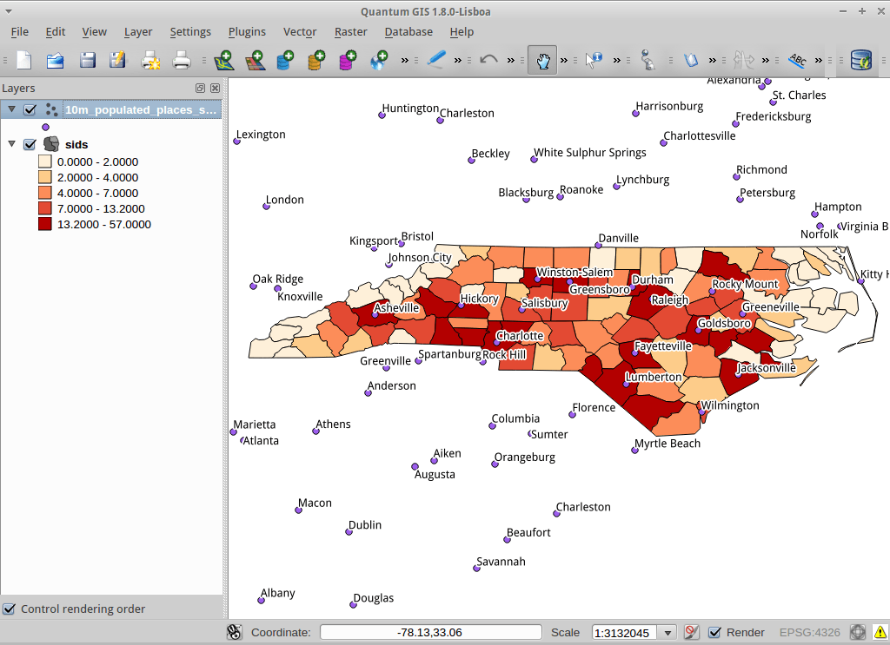
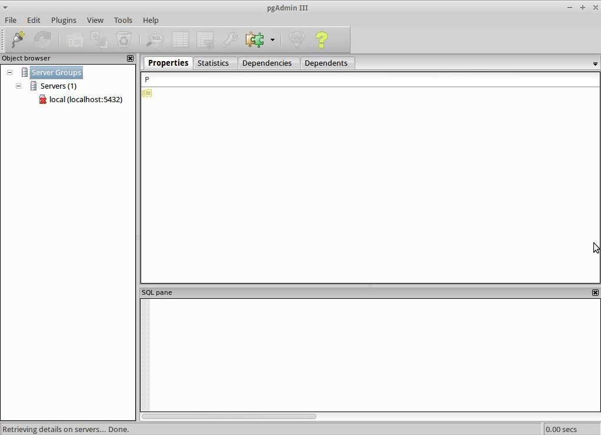
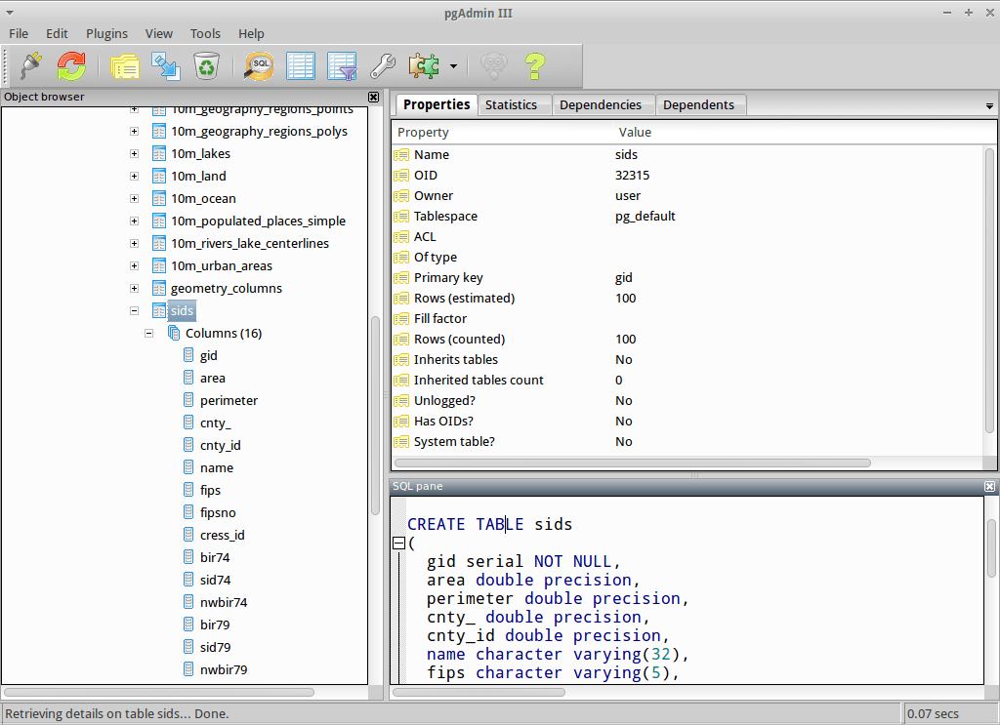

:Author: Barry Rowlingson
:Author: Astrid Emde
:Author: Regina Obe
:Translator: Lucía Sanjaime
:Translator: David Mateos
:Reviewer: Argyros Argyridis
:Reviewer: Cameron Shorter, LISAsoft
:Reviewer: Nicolas Roelandt
:Version: osgeo-live9.5
:License: Creative Commons Attribution-ShareAlike 3.0 Unported  (CC BY-SA 3.0)

.. _postgis_quickstart-es:
 
.. image:: ../../images/project_logos/logo-PostGIS.png
  :scale: 30 %
  :alt: project logo
  :align: right
  :target: http://postgis.net

********************************************************************************
Guía de inicio rápido de PostGIS
********************************************************************************

PostGIS añade soporte espacial a la base de datos relacional PostgreSQL. 
Le da a PostgreSQL la capacidad de almacenar, consultar y manipular datos espaciales. En este documento
se usa 'PostgreSQL' para referirse a las funciones generales de la base de datos, y 'PostGIS' para
hablar sobre las funcionalidades espaciales adicionales que le proporciona.

Esta Guía de inicio rápido describe cómo:

  * Crear y consultar una base de datos espacial desde la linea de comandos y desde el cliente gráfico :doc:`QGIS <../overview/qgis_overview>` 
  * Gestionar datos desde el cliente``pgAdmin``.

.. contents:: Contents

Arquitectura Cliente-servidor
================================================================================

PostgreSQL, al igual que muchas otras bases de datos, trabaja como servidor en un sistema 
cliente-servidor.
El cliente hace una petición al servidor y obtiene una respuesta. Trabaja de la misma forma que internet 
- el navegador Web del usuario es el cliente y el servidor Web le envía la página Web que ha solicitado.
En el caso de PostgreSQL las peticiones se realizan en lenguaje SQL y la respuesta es generalmente
una tabla de datos procedente de la base de datos.

No hay nada que impida que el servidor esté en el mismo ordenador que el cliente, con lo cual, el usuario 
puede usar PostgreSQL en la misma máquina. El cliente del usuario conecta con el servidor a través de
la conexión de red 'loopback' interna, y no es visible a otros ordenadores a menos que el usuario lo 
configure para que lo sea.

Crear una base de datos espacial 
================================================================================

Los clientes de línea de comandos se ejecutan desde un Emulador de Terminal. Este Terminal (actualmente LXTerminal) se arranca desde el menú  de aplicaciones, en la sección de Accessorios. Escribir::

   psql -V

y presionar enter para ver el número de versión de PostgreSQL.

Un único servidor PostgreSQL le permite organizar el trabajo en bases de datos separadas. Cada base de datos actúa como una entidad 
independiente, con sus propias tablas, vistas, usuarios, etc. Cuando conecte a un servidor PostgreSQL debe indicar a qué base 
de datos quiere acceder.

Puede obtener un listado de las bases de datos que hay disponibles en el servidor con el comando::

``psql -l`` 

Por defecto debería poder ver varias bases de datos creadas en la instalación. Creará una nueva base de datos al seguir esta guía.

.. tip:: La lista usa un pager de unix estándar - pulse espacio para ir a la página siguiente, b para volver a la anterior, q para salir, h para acceder a la ayuda.

PostgreSQL le da un comando unix para crear bases de datos, ``createdb``. Necesita crear una base de datos con las extensiones PostGIS, 
por eso debe indicarle cuál es la plantilla para crear la base de datos. Llamaremos a la nueva base de datos ``demo``. El comando es el siguiente:

::

   createdb demo

.. tip:: 
Generalmente puede acceder a la ayuda de las herramientas de línea de comandos tecleando --help 

Si ejecuta en este momento ``psql -l`` , su base de datos ``demo`` debería aparecer en el listado.
No hemos añadido todavía la extensión PostGIS, pero en la siguiente sección aprenderá cómo hacerlo.

También puede crear bases de datos PostGIS usando el lenguaje SQL. En primer lugar deberá borrar la base de datos
que acaba de crear usando el comando ``dropdb`` . A continuación use el comando ``psql`` para obtener un intérprete
de comandos SQL:

:: 

  dropdb demo
  psql -d postgres

De esta forma conectará con la base de datos ``postgres`` , que es una base de datos del sistema que todos los servidores deberían tener. 
A continuación introduzca la instrucción SQL para crear una nueva 
base de datos:

:: 

 postgres=# CREATE DATABASE demo;

Ahora cambie la conexión de la base de datos ``postgres`` a la nueva base de datos ``demo`` . 
En el futuro puede conectarse directamente con el comando ``psql -d demo``, pero hay una forma ingeniosa de conectarse dentro de la línea de comandos ``psql`` :

::

 postgres=# \c demo

.. tip:: 
	Pulse Ctrl-C si el prompt de psql continúa apareciendo después de pulsar la tecla return. De esa forma limpiará su entrada y empezará otra vez. Es probable que el sistema esté esperando que introduzca un signo de cerrar comillas, punto y coma o algún otro signo.

Debería poder ver un mensaje informativo, y el prompt cambiará para mostrarle que ya está conectado a la base de
datos ``demo``. 

Lo siguiente, añada la extensión PostGIS:

::

 demo=# create extension postgis;

Para comprobar que el proceso se ha realizado correctamente, teclee ``\dt`` para poder ver un listado de
las tablas que tiene la base de datos. Debería ver algo cómo esto:

::

  demo=# \dt
               List of relations
   Schema |       Name       | Type  | Owner 
  --------+------------------+-------+-------
   public | spatial_ref_sys  | table | user
  (1 rows)

PostGIS usa esa tabla. La tabla ``spatial_ref_sys`` almacena información de sistemas de referencia espaciales 
válidos, y puede usar algunas órdenes de SQL para poder ver su contenido:

::

  demo=# SELECT srid,auth_name,proj4text FROM spatial_ref_sys LIMIT 10;

   srid | auth_name |          proj4text                                            
  ------+-----------+--------------------------------------
   3819 | EPSG      | +proj=longlat +ellps=bessel +towgs...
   3821 | EPSG      | +proj=longlat +ellps=aust_SA +no_d...
   3824 | EPSG      | +proj=longlat +ellps=GRS80 +towgs8...
   3889 | EPSG      | +proj=longlat +ellps=GRS80 +towgs8...
   3906 | EPSG      | +proj=longlat +ellps=bessel +no_de...
   4001 | EPSG      | +proj=longlat +ellps=airy +no_defs...
   4002 | EPSG      | +proj=longlat +a=6377340.189 +b=63...
   4003 | EPSG      | +proj=longlat +ellps=aust_SA +no_d...
   4004 | EPSG      | +proj=longlat +ellps=bessel +no_de...
   4005 | EPSG      | +proj=longlat +a=6377492.018 +b=63...
  (10 rows)

Esta tabla confirma que tiene una base de datos con capacidad espacial. La función de la tabla ``geometry_columns`` es 
decirle a PostGIS qué tablas tienen carácter espacial. Este es el siguiente paso.

Crear una tabla espacial (para usuarios avanzados)
================================================================================

Ahora que tiene una base de datos espacial puede crear tablas espaciales. 

Primero cree una tabla de base de datos ordinaria para almacenar algunos datos de ciudades. Esta tabla debe
tener 2 campos - uno para el ID numérico y otro para el nombre de la ciudad:

::

  demo=# CREATE TABLE cities ( id int4  primary key, name varchar(50), geom geometry(POINT,4326) );

Por convención la columna de geometría se suele llamar ``geom`` (la convención en versiones previas de PostGIS era ``the_geom``). Esto le dice a PostGIS que tipo de geometría tiene cada registro (puntos, líneas, polígonos,etc.), cuántas dimensiones (en este caso dos, si tuviera 3 o y dimensiones, usaríamos POINTZ, POINTM, o POINTZM), y el sistema de referencia espacial. En este caso la localización de las ciudades se marcará usando coordenadas del sistema de referencia EPSG:4326.

Si comprueba en este momento la tabla cities debería ver la nueva columna y que la tabla no tiene actualmente ninguna fila.

::

  demo=# SELECT * from cities;
   id | name | geom 
  ----+------+----------
  (0 rows)

Para añadir filas a la tabla se usan algunas sentencias SQL. Para introducir la geometría dentro de la columna de 
geometrías use la función de PostGIS ``ST_GeomFromText`` , que convierte las coordenadas y el id del 
sistema de referencia espacial, introducidas en formato texto:

::

  demo=# INSERT INTO cities (id, geom, name) VALUES (1,ST_GeomFromText('POINT(-0.1257 51.508)',4326),'London, England');
  demo=# INSERT INTO cities (id, geom, name) VALUES (2,ST_GeomFromText('POINT(-81.233 42.983)',4326),'London, Ontario');
  demo=# INSERT INTO cities (id, geom, name) VALUES (3,ST_GeomFromText('POINT(27.91162491 -33.01529)',4326),'East London,SA');

.. tip:: 
	Use las flechas del teclado para reutilizar y editar sentencias en la línea de comandos.

Como puede ver, este paso llega a ser tedioso rápidamente. Afortunadamente hay formas mucho más fáciles de 
introducir datos dentro de las tablas PostGIS. Pero ahora hay tres ciudades en su base de datos y ya puede trabajar con 
esos datos.

Consultas simples
================================================================================

Para seleccionar datos de una tabla PostGIS se pueden aplicar todas las operaciones SQL comunes.

::

 demo=# SELECT * FROM cities;
  id |      name       |                      geom                      
 ----+-----------------+----------------------------------------------------
   1 | London, England | 0101000020E6100000BBB88D06F016C0BF1B2FDD2406C14940
   2 | London, Ontario | 0101000020E6100000F4FDD478E94E54C0E7FBA9F1D27D4540
   3 | East London,SA  | 0101000020E610000040AB064060E93B4059FAD005F58140C0
 (3 rows)

De esta forma obtiene una versión hexadecimal del campo geometría difícil de interpretar.

Si desea volver a echar un vistazo a su geometría en formato WKT, puede usar las funciones ST_AsText(geom) o ST_AsEwkt(geom). 
También puede usar ST_X(geom), ST_Y(geom) para obtener el valor numérico de las coordenadas:

::

 demo=# SELECT id, ST_AsText(geom), ST_AsEwkt(geom), ST_X(geom), ST_Y(geom) FROM cities;
  id |          st_astext           |               st_asewkt                |    st_x     |   st_y    
 ----+------------------------------+----------------------------------------+-------------+-----------
   1 | POINT(-0.1257 51.508)        | SRID=4326;POINT(-0.1257 51.508)        |     -0.1257 |    51.508
   2 | POINT(-81.233 42.983)        | SRID=4326;POINT(-81.233 42.983)        |     -81.233 |    42.983
   3 | POINT(27.91162491 -33.01529) | SRID=4326;POINT(27.91162491 -33.01529) | 27.91162491 | -33.01529
 (3 rows)

Consultas espaciales
================================================================================

PostGIS añade a PostgreSQL muchas funciones con funcionalidad espacial.
Una de ellas, y que ya ha visto, es ST_GeomFromText que convierte WKT a geometría.
La mayor parte de las funciones empiezan con ST (para tipo espacial). Hay un listado 
de ellas en una sección de la documentación de PostGIS.  A continuación, 
usará una para responder una cuestión práctica - ¿Qué distancia en metros hay entre estas tres ciudades llamadas Londres, unas de otras, si asumimos que
la tierra es esférica? 

::

 demo=# SELECT p1.name,p2.name,ST_Distance_Sphere(p1.geom,p2.geom) FROM cities AS p1, cities as p2 WHERE p1.id > p2.id;
       name       |      name       | st_distance_sphere 
 -----------------+-----------------+--------------------
  London, Ontario | London, England |   5875766.85191657
  East London,SA  | London, England |   9789646.96784908
  East London,SA  | London, Ontario |   13892160.9525778
  (3 rows)

Con lo cual obtiene la distancia, en metros, entre cada par 
de ciudades. Tenga en cuenta que la parte 'WHERE' de la consulta es 
lo que evita que obtenga la distancia entre una ciudad y sí misma
(que en todos los casos será cero) o las distancias inversas entre las 
ciudades que aparecen en la tabla de arriba (la distancia entre Londres de Inglaterra y Londres de Ontario es la misma que de Londres de Ontario a Londres de Inglaterra). Intente hacer la misma consulta sin incluir la parte del 'WHERE' y mire el resultado que obtiene.

También puede medir la distancia empleando un elipsoide mediante una función diferente, 
especificando el nombre del elipsoide, el semieje mayor y el parámetro del inverso del aplanamiento:

::

  demo=# SELECT p1.name,p2.name,ST_Distance_Spheroid(
          p1.geom,p2.geom, 'SPHEROID["GRS_1980",6378137,298.257222]'
          ) 
          FROM cities AS p1, cities AS p2 WHERE p1.id > p2.id;
        name       |      name       | st_distance_spheroid 
  -----------------+-----------------+----------------------
   London, Ontario | London, England |     5892413.63776489
   East London,SA  | London, England |     9756842.65711931
   East London,SA  | London, Ontario |     13884149.4140698
  (3 rows)

Para cerrar la línea de comandos de PostgreSQL, teclee:

::

\q

Ahora estará de vuelta en la consola del sistema:

::

user@osgeolive:~$

Generar un mapa
================================================================================

Para producir un mapa a partir de datos PostGIS, necesita un cliente que pueda obtener los datos. La mayoría 
de los programas SIG de escritorio de código abierto pueden hacerlo - por ejemplo, Quantum GIS, gvSIG o uDig. 
A continuación verá cómo generar un mapa con Quantum GIS.

Inicie QGIS y elija ``Añadir capa PostGIS`` del menú Capa. Los parámetros para conectar con los datos OpenStreetMap en PostGis ya están definidos en el menú desplegable de Conexiones. Puede definir nuevas conexiones a servidores y guardar la configuración para recuperarla fácilmente. Clic en el menú desplegable de Conexiones y elija Natural Earth, o sólo presione ``Conectar`` para continuar: 

.. image:: ../../images/screenshots/1024x768/postgis_addlayers.png
  :scale: 50 %
  :alt: Connect to Natural Earth
  :align: center

Obtendrá una lista de las tablas espaciales de la base de datos.

.. image:: ../../images/screenshots/1024x768/postgis_listtables.png
  :scale: 50 %
  :alt: Natural Earth Layers
  :align: center

Elija la tabla lagos y pinche ``Añadir`` (no ``Cargar`` - que guarda las consultas). Esta capa se debería cargar en QGIS:

.. image:: ../../images/screenshots/1024x768/postgis_lakesmap.png
  :scale: 50 %
  :alt: My First PostGIS layer
  :align: center

Debería poder ver un mapa de los lagos. Como QGIS no sabe que son lagos, es posible que no los pinte
con color azul. Use la documentación de QGIS para averiguar cómo cambiarlo. A continuación, haga zoom 
a un famoso grupo de lagos de Canadá.

Crear una tabla espacial de forma fácil
================================================================================

La mayor parte de las herramientas de escritorio de OSgeo tienen funciones para importar datos espaciales desde archivos, 
como por ejemplo shapefiles, dentro de bases de datos PostGIS. También usaremos QGIS para mostrar cómo se hace.

Se pueden importar shapefiles a QGIS a través del práctico Administrador de BBDD de QGIS. El administrador se encuentra en el menú ``Bases de datos -> Administrador de BBDD -> Administrador de BBDD``.

Entonces el gestor usará las preferencias que usted ha definido previamente para conectar a la base de datos Natural Earth. 
Si le pide la contraseña déjela en blanco. Verá la ventana principal del gestor. A la izquierda se pueden seleccionar tablas de la base de datos y usar las pestañas de la derecha para ver información sobre las mismas. La pestaña de Vista Preliminr mostrará un pequeño mapa.

.. image:: ../../images/screenshots/1024x768/postgis_managerpreview.png
  :scale: 50 %
  :alt: QGIS Manager Preview
  :align: center

Ahora use el PostGIS manager para importar un shapefile dentro de la base de datos. Usará los datos del 
síndrome de muerte súbita infantil (SIDS, por sus siglas en inglés) de Carolina del Norte  que están 
incluidos en uno de los complementos del paquete estadístico R.

Dentro del menú ``Tabla`` elija la opción ``Importar capa/archivo``. Pinche el botón ``...`` y busque el shapefile ``sids.shp`` en el paquete ``maptools`` de R (que se encuentra en /usr/lib/R/site-library/maptools/shapes/):

. image:: ../../images/screenshots/1024x768/postgis_browsedata.png
  :scale: 50 %
  :alt: Find the shapefile
  :align: center

No cambie nada más y pulse ``Aceptar``.

.. image:: ../../images/screenshots/1024x768/postgis_importsids.png
  :scale: 50 %
  :alt: Import a shapefile
  :align: center

Deje el Sistema de referencia de coordenadas por defecto (WGS 84 EPSG:4326) y presione ``Aceptar``. El shapefile se debería importar a PostGIS sin errores. Cierre el PostGIS Manager y vuelva a la ventana principal de QGIS.

A continuación cargue los datos de SIDS en el mapa usando la opción 'Añadir capas PostGIS'. 
Cambiando de orden algunas capas y coloreando un poco debería ser capaz de obtener un mapa de coropletas del recuento
de síndromes de muerte súbita infantil en Carolina del Norte:

Conozca pgAdmin III
================================================================================

Puede usar el cliente gráfico de bases de datos ``pgAdmin III`` para consultar y modificar sus bases 
de datos no espaciales. Este es el cliente oficial de PostgreSQL, y permite que use el lenguaje SQL para manipular sus tablas de datos. Se puede encontrar y ejecutar pgAdmin III desde la carpeta de Databases en el escritorio del OSGeo Live.

Aquí, tiene a opción de crear una nueva conexión a un servidor PostgreSQL o conectar a un servidor existente. En este caso, vamos a conectar al servidor ``local`` predefinido.

Tras establecerse la conexión, podrá ver el listado de bases de datos ya existentes en el sistema.

.. image:: ../../images/screenshots/1024x768/postgis_adminscreen0.png
  :scale: 50 %
  :alt: pgAdmin III
  :align: center

La cruz roja en la imagen de la mayoría de las bases de datos, indica que no se ha conectado todavía a ninguna de ellas (en este momento está conectado sólo a la base de datos por defecto ``postgres``).
En este momento, sólo puede visualizar las bases de datos disponibles en el sistema. Se puede conectar, haciendo doble clic sobre el nombre de  una base de datos. Haremos esto con la base de datos natural_earth2.

Se puede ver como la cruz roja desaparece y aparece un signo "+" a la izquierda. Presionandola se desplegará un arbol mostrando el contenido de la base de datos. Navegar hasta el elemento ``schemas`` y expandirlo y tras él, el esquema ``public``. Ahora, expandiendo el elemento ``Tables``, puede ver todas las tablas contenidas en este esquema.

  

Ejecución de consultas SQL desde pgAdmin III
================================================================================
pgAdmin III ofrece la capacidad de realizar consulata a una base de datos relacional.

Para desarrollar una consulta en la base de datos, hay que presionar el botón `SQL`` en la barra de herramientas principal (el que tiene una lupa amarilla).

Vamos a averiguar la tasa de SIDS respecto a los nacimientos para el año  1974 en cada ciudad.
Además, vamos a ordenar el resultado en función de la tasa calculada. Para hacerlo, tenemos que ejecutar la siguiente consulta (copiela en el editr de texto de la ventana de SQL):

::

 select name, 1000*sid74/bir74 as rate from sids order by rate;

Después, debe presionar el botón con una flecha verde apuntando a la derecha (*Execute query*, ejecutar consulta).

.. image:: ../../images/screenshots/1024x768/postgis_adminscreen2.png
  :scale: 50 %
  :alt: pgAdmin III
  :align: center

Inténtelo
================================================================================

A continuación se presentan algunos desafíos adicionales para que los intente llevar a cabo:

#. Pruebe más funciones espaciales como ``st_buffer(geom)``, ``st_transform(geom,25831)``, ``x(geom)`` .
Puede consultar documentación completa en http://postgis.net/documentation/

#. Exporte sus tablas a shapefiles con ``pgsql2shp`` desde la línea de comandos.

#. Intente usar ``ogr2ogr`` desde línea de comandos para importar/exportar datos a su base de datos.

Lo próximo
================================================================================

Éste es solamente el primer paso en el proceso de usar PostGIS. Hay muchas más funcionalidades que puede probar.

Página Web del Proyecto PostGIS 

http://postgis.net

Documentación de PostGIS 

http://postgis.net/documentation/
